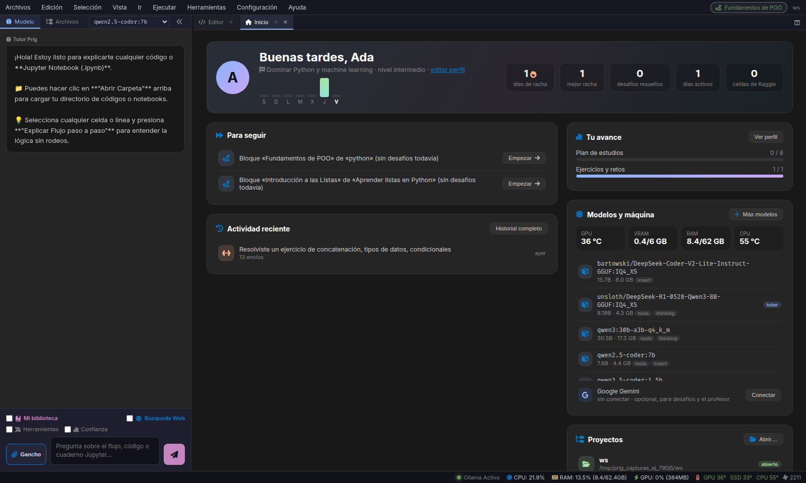
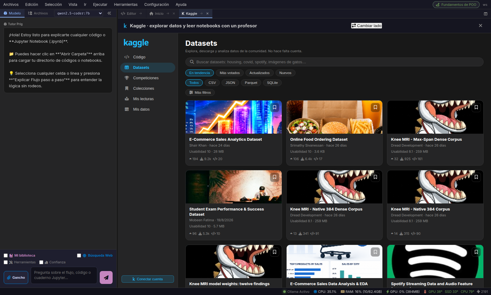
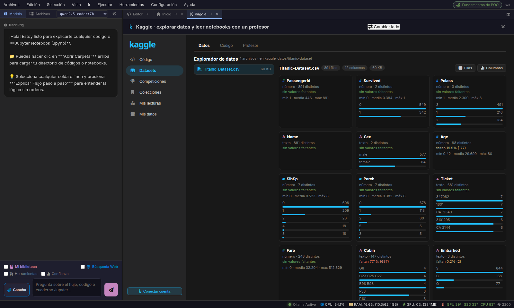
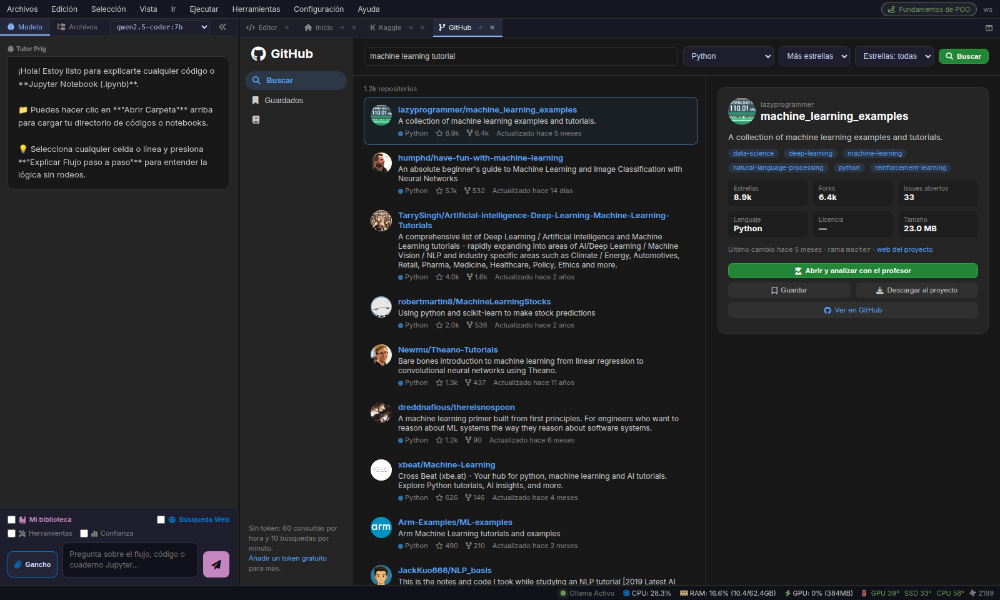
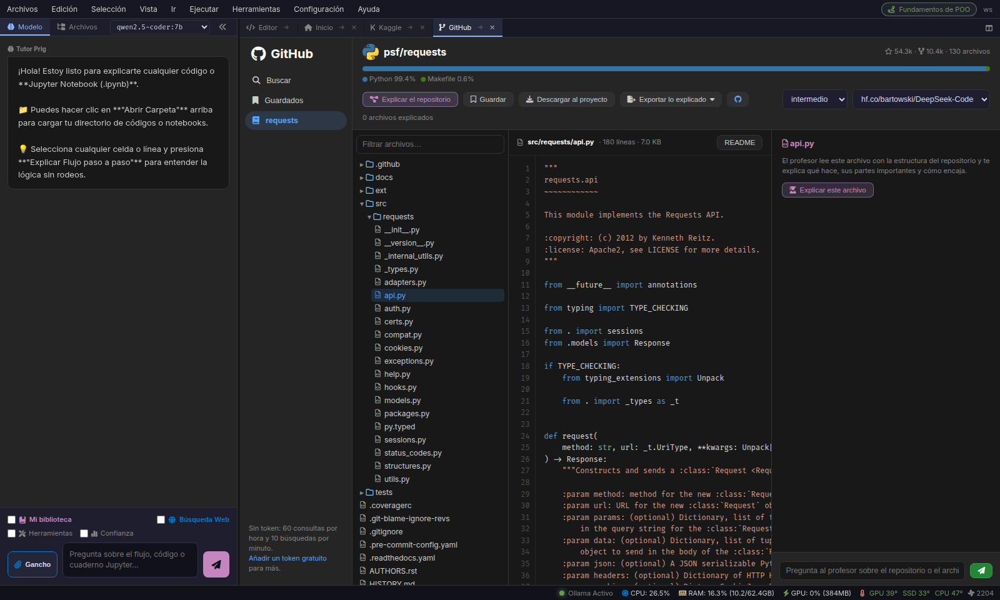
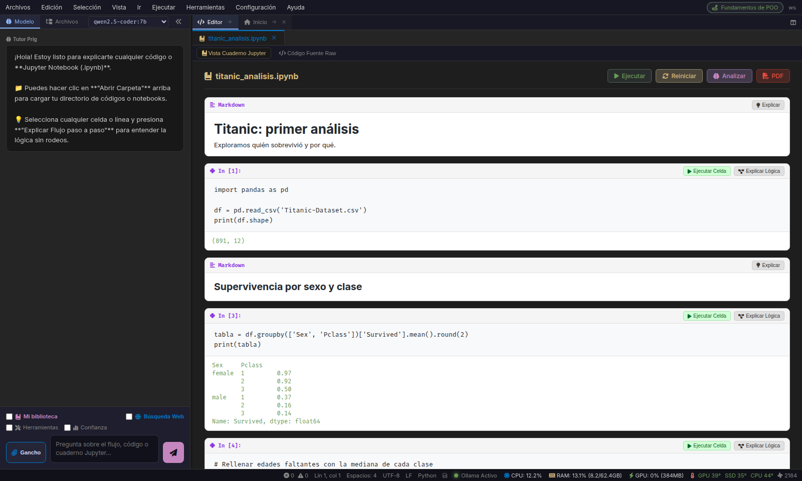
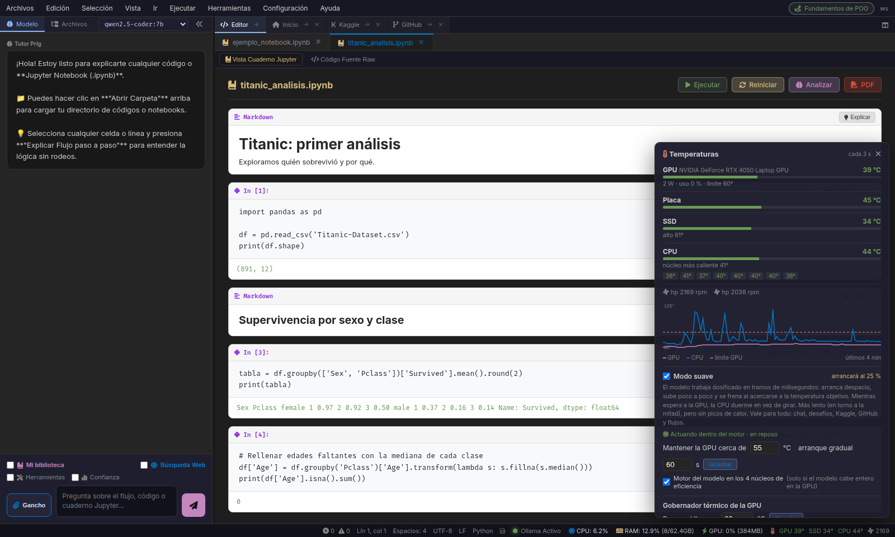

<div align="center">

# Prig IDE

**Un entorno local para aprender a programar, con un tutor de IA que corre en tu propia máquina.**

*El IDE que sabe qué **no** sabes.*




</div>

Prig no es un editor con un chat pegado al lado. Los ejercicios se verifican
**ejecutándolos**, el tutor responde **citando tus propios libros**, y el perfil mide
competencia real en lugar de casillas marcadas. Además, Prig te ayuda a leer código
ajeno (notebooks de Kaggle y repositorios de GitHub) celda a celda y archivo a archivo,
con un modelo que hace de profesor.

Todo funciona sin cuentas ni servicios de pago. Los modelos corren en local con
[Ollama](https://ollama.com).

---

## Contenido

- [Funcionalidades](#funcionalidades)
- [Capturas](#capturas)
- [Requisitos](#requisitos)
- [Instalación](#instalación)
- [Primeros pasos](#primeros-pasos)
- [Modo suave: modelos sin picos de calor](#modo-suave-modelos-sin-picos-de-calor)
- [Privacidad: qué sale de tu equipo](#privacidad-qué-sale-de-tu-equipo)
- [Arquitectura](#arquitectura)
- [Dónde se guardan tus datos](#dónde-se-guardan-tus-datos)
- [Desarrollo](#desarrollo)
- [Limitaciones conocidas](#limitaciones-conocidas)
- [Licencia](#licencia)

---

## Funcionalidades

### Aprender

| Sección | Qué hace |
|---|---|
| **Inicio** | Tu perfil, racha, actividad reciente, qué te conviene seguir, modelos instalados y estado de la máquina. Es lo primero que se abre. |
| **Tutor** | Chat con el modelo sobre el código abierto. Explica flujos paso a paso, una celda o la línea seleccionada. |
| **Desafíos** (`Ctrl+3`) | Enunciado, caja de razonamiento (pensar antes de programar), plan opcional y páginas de código `.py` que se importan entre sí. Se corrigen con tests ocultos. Incluye desafíos con licencia libre de Exercism, TheAlgorithms y Project Euler. |
| **Aprendizaje guiado** (`Ctrl+2`) | Rutas y planes de estudio versionados, generados a partir de un objetivo. |
| **Biblioteca** (`Ctrl+1`) | Importa PDFs, apuntes y cuadernos. Con **Mi biblioteca** activado, el tutor responde apoyándose en ese material, cita **libro y página**, y dice «no está en tus libros» antes que inventar. |
| **Perfil** (`Ctrl+4`) | Acierto al primer intento sin pistas, intentos hasta acertar, tiempo hasta el primer test en verde, tipos de error y conceptos que se resisten. Cada debilidad tiene un botón para practicar justo eso. |

**Ejercicios verificados por ejecución.** Antes de mostrarte un ejercicio que generó el
modelo, Prig ejecuta la solución de referencia contra sus tests y ejecuta esos mismos
tests contra el código vacío. Si la solución falla, o si los tests pasan sin
implementar nada, el ejercicio se descarta y se reintenta. Tu entrega también se
corrige ejecutándola, no preguntándole al modelo. Las pistas son graduadas
(concepto → estructura → línea) y se cuentan.

### Leer código de otros

| Sección | Qué hace |
|---|---|
| **Kaggle** (`Ctrl+5`) | Interfaz al estilo de Kaggle con Código, Datasets, Competiciones, Colecciones, Mis lecturas y Mis datos. Lee cualquier notebook celda a celda con un profesor. Descarga datasets y los explora columna a columna (tipos, faltantes, distribución). Adapta las rutas del notebook para **ejecutarlo en Prig**. Exporta el notebook explicado a **PDF**. Tiene filtros por licencia, tamaño, autor y notebook de origen. |
| **GitHub** (`Ctrl+Shift+G`) | Busca repositorios o pega la URL de uno. Recorre el árbol, pide que el modelo explique **el repositorio entero** o **un archivo**, y guarda la explicación (`.md`), el código explicado (PDF) o el proyecto completo para trabajar en local. |

### Compartir: Prig Hub (`Ctrl+Shift+J`)

Tus cursos, videos, canales, perfiles de Kaggle, repositorios, rutas y desafíos viven en
**un repositorio git en texto plano**. Puedes leerlo y editarlo sin Prig. Los packs de
otras personas se siguen por GitHub, sin cuentas nuevas ni servidores.

- **Un solo campo «Agregar»**: pegas cualquier enlace y Prig reconoce la plataforma y el
  tipo (video, curso, notebook, repositorio…) y busca el título. Si pegas un usuario de
  GitHub, sigues su perfil.
- **Todo junto**: tus listas y las de quienes sigues, con filtros por plataforma, tipo,
  origen y estado. Un mismo video en dos packs aparece una vez, y tu progreso vale para
  los dos.
- **Rutas** paso a paso y **desafíos compartidos**. Antes de importar un desafío ves su
  código, y Prig lo verifica ejecutándolo.
- **Novedades revisables**: nada de lo que sigues se actualiza solo. Ves qué se agrega,
  qué se quita y si hay código nuevo, y aplicas si quieres.
- **Publicar**: tu perfil (`usuario/prig`) y tus packs (`usuario/prig-<tema>`) se
  publican en GitHub con un clic. Tu progreso **no se publica**, y los commits van
  firmados con el correo «noreply» de GitHub.

Formato de los archivos: [docs/prig-hub.md](docs/prig-hub.md).

### Programar

- Editor con pestañas, vista dividida, minimapa, paleta de comandos (`Ctrl+Shift+P`) y
  modo concentración.
- **Ventanas como en VS Code**: el editor, Kaggle, GitHub y demás herramientas se
  arrastran de pestaña en pestaña o a la mitad derecha para ponerlas lado a lado.
  También se mueven con el teclado:

  | Atajo | Acción |
  |---|---|
  | `Ctrl+K Ctrl+→` / `Ctrl+K Ctrl+←` | Mover la ventana al panel derecho / izquierdo |
  | `Ctrl+K Ctrl+1` / `Ctrl+K Ctrl+2` | Ir al panel izquierdo / derecho |
  | `Ctrl+Alt+AvPág` / `Ctrl+Alt+RePág` | Ventana siguiente / anterior |
  | `Ctrl+Shift+AvPág` / `Ctrl+Shift+RePág` | Correr la pestaña un lugar |
- **Cuadernos Jupyter** con kernel persistente: las celdas comparten espacio de nombres,
  `Ctrl+Enter` ejecuta y un botón reinicia el intérprete. Exportación a PDF.
- Consola integrada, bloc de notas, flujo de agentes y analizador de flujos de ML.

### Modelos y máquina

- **Modelos por tarea** (Configuración global): uno para **escribir código** (`Prig//:`,
  arreglar errores, crear desafíos), otro para **explicar** (Kaggle, GitHub,
  explicaciones del editor) y otro para **rellenar código** mientras escribes. Cada uno
  se carga solo cuando se usa.
- **Buscador de modelos** en Ollama, Hugging Face y ModelScope, con descarga y una
  estimación de si caben en tu máquina.
- **Temperaturas** en vivo de GPU, CPU, placa y SSD, con un gobernador térmico que pausa
  la generación antes del límite que elijas.
- **Modo suave**: dosifica al modelo desde dentro del motor para que la máquina trabaje
  continua y sin picos de calor. Ver [más abajo](#modo-suave-modelos-sin-picos-de-calor).
- **Google Gemini** opcional para los desafíos, **apagado por defecto**. Ver
  [Privacidad](#privacidad-qué-sale-de-tu-equipo).

---

## Capturas

| | |
|---|---|
|  **Kaggle.** Datasets reales, con filtros. |  **Explorador de datos.** Columnas, faltantes y distribución. |
|  **GitHub.** Búsqueda con ficha descriptiva. |  **Lectura de un repositorio**, archivo a archivo. |
|  **Cuadernos** con kernel persistente. |  **Temperaturas y modo suave.** |

---

## Requisitos

| Requisito | Detalle |
|---|---|
| **Sistema** | Linux. Probado en Ubuntu 24.04 con X11. |
| **Python** | 3.10 o superior, con `venv` (`sudo apt install python3-venv`). |
| **Ollama** | El del sistema o el propio de Prig (ver [Instalación](#instalación)). |
| **GPU** | Opcional. Con 6 GB de VRAM funciona bien `qwen2.5-coder:7b`. |
| **gcc** | Solo para el modo suave dentro del motor (`sudo apt install build-essential`). |

Las dependencias de Python ([requirements.txt](requirements.txt)) se instalan solas:
FastAPI, Uvicorn, pywebview con Qt6, pypdf, reportlab, psutil y algunas más.

## Instalación

```bash
git clone https://github.com/guillermopetcho/Prig-IDE.git Prig
cd Prig
./run.sh
```

`run.sh` hace esto:

1. Crea el entorno virtual `.venv` y lo recrea si cambió la versión de Python del sistema.
2. Instala las dependencias. Si no hay conexión pero ya estaban instaladas, arranca igual.
3. Levanta Ollama si no está en marcha.
4. Registra los comandos `prig`, `Prig` y `prig-ide` en `~/.local/bin`.
5. Abre la ventana.

Si el puerto 8000 está ocupado, Prig busca otro. Si ya hay un Prig abierto, reutiliza
esa instancia. Sin ventana nativa disponible, se abre en el navegador
(`http://127.0.0.1:8000`).

### Un modelo para empezar

```bash
ollama pull qwen2.5-coder:7b
```

También puedes descargarlo desde **Herramientas → Buscar y descargar modelos**.

### Ollama propio de Prig (opcional)

Prig usa el Ollama que tengas instalado y **nunca lo modifica**. Si quieres una versión
propia, **Configuración → Actualizar Ollama** descarga la release oficial dentro de
`Prig/bin` y `Prig/lib`, sin tocar la del sistema. Es necesaria para el modo suave
dentro del motor.

## Primeros pasos

1. **Inicio** se abre al arrancar. Completa tu perfil (nombre, objetivo y nivel).
2. Abre una carpeta de trabajo desde **Archivos** o el botón *Abrir…* de Inicio.
3. Elige el modelo en el selector del panel **Modelo**.
4. Prueba un **Desafío** (`Ctrl+3`), abre un notebook de **Kaggle** (`Ctrl+5`) o un
   repositorio de **GitHub** (`Ctrl+Shift+G`).

Todas las acciones están en la paleta de comandos (`Ctrl+Shift+P`).

---

## Modo suave: modelos sin picos de calor

En un portátil, un modelo a plena potencia calienta la CPU y la GPU en segundos y los
ventiladores van a saltos. El modo suave cambia velocidad por estabilidad: la máquina
trabaja **continua y templada**.

Funciona a tres niveles:

- **Dentro del motor.** Una pequeña biblioteca en C
  ([prig_suave.c](backend/recursos/nativo/prig_suave.c)) se carga en el servidor de
  Ollama. Hace dos cosas:
  - Mientras la GPU trabaja, la CPU **duerme** en lugar de girar esperando, mediante
    eventos CUDA con espera bloqueante.
  - Intercala pausas de milisegundos entre tramos de cálculo.
- **Controlador térmico.** Lee la temperatura por NVML sin lanzar procesos, la suaviza y
  ajusta la proporción de trabajo con cambios limitados por paso. Así no hay oscilación.
  Arranca despacio y sube poco a poco hasta la temperatura objetivo.
- **CPU.** Si el modelo cabe entero en la GPU, el motor se fija a los núcleos de
  eficiencia.

Medido con `qwen2.5-coder:7b` durante 80 s de generación continua (RTX 4050 Laptop,
Core i5-13420H):

| | Sin modo suave | Con modo suave |
|---|---|---|
| CPU máxima | 100 °C | 58–62 °C |
| CPU media | 87 °C | 53–56 °C |
| GPU máxima | 66 °C | 56 °C |
| Consumo GPU | 40 W | 17 → 28 W, en rampa |
| Velocidad | 36 tokens/s | 16 tokens/s |

Se configura en **Herramientas → Temperaturas**: temperatura objetivo, duración del
arranque gradual y núcleos de eficiencia. Con el Ollama del sistema, el modo suave
dosifica a nivel de petición: es menos fino, pero también evita los picos.

---

## Privacidad: qué sale de tu equipo

Los modelos, tu código, tu biblioteca y tu progreso **se quedan en tu máquina**. Solo
hay conexión en estos casos, y siempre porque tú lo pides:

| Qué | Cuándo | Cuenta |
|---|---|---|
| Kaggle | Al buscar o abrir notebooks, datasets y competiciones | Opcional. Los datasets funcionan sin cuenta; los notebooks y las competiciones la piden. |
| GitHub | Al buscar o abrir repositorios | Opcional. Sin token: 60 consultas por hora; con un token gratuito, más. |
| Búsqueda web | Solo con la casilla **Búsqueda web** marcada en el chat | No |
| Descarga de modelos | Al descargar desde Ollama, Hugging Face o ModelScope | No |
| Google Gemini | Solo si pegas tu clave y aceptas el aviso | Clave de API propia |
| Prig Hub | Al seguir o actualizar un pack (git por HTTPS), al buscar títulos de enlaces y al publicar | Token de GitHub solo para publicar |

Sobre **Gemini**: en su nivel gratuito, Google puede usar lo que se le envía para
mejorar sus productos. Por eso está apagado por defecto y la opción recomendada es
«Solo lo gratis», es decir, local. Prig **no** reutiliza la sesión de Gemini CLI,
porque sus condiciones lo prohíben.

Las credenciales de Kaggle, GitHub y Gemini se guardan con permisos `600`. La clave de
Gemini, además, nunca se devuelve a la interfaz y se borra de cualquier mensaje de error.

---

## Arquitectura

La ventana es [pywebview](https://pywebview.flowrl.com/) (Qt6) sobre un servidor
FastAPI local. La interfaz está hecha en HTML y JavaScript sin framework. Las respuestas
del modelo llegan en streaming NDJSON.

```
main.py                    Ventana nativa, elección de puerto, instancia única
run.sh                     Arranque: entorno, dependencias, Ollama
backend/
  app.py                   API FastAPI
  ai_engine/               Cliente de Ollama: chat, streaming, pausas térmicas
  desafios/                Desafíos: almacén, ejecución con tests ocultos, fuentes, tutor
  exercise_engine.py       Generación de ejercicios verificados por ejecución
  kernel_session.py        Intérpretes persistentes para cuadernos
  knowledge/               Biblioteca: ingestión, recuperación y citas
  study_plan_engine.py     Planes de estudio versionados
  guided_learning.py       Aprendizaje guiado
  learning_telemetry.py    Métricas de aprendizaje
  inicio.py                Resumen de la pantalla de Inicio
  kaggle_*.py              Kaggle: lector, explorador, colecciones, PDF
  github_lector.py         GitHub: búsqueda, árbol, lectura y descarga
  buscador_modelos.py      Búsqueda de modelos (Ollama, Hugging Face, ModelScope)
  gemini_motor.py          Gemini opcional
  recursos/                Temperaturas, gobernador térmico, NVML, modo suave
    nativo/prig_suave.c    Dosificación dentro del motor
  evals/                   Banco de evaluación de modelos
  tests/                   Tests
frontend/                  Interfaz (index.html, js/, css/)
kaggle_worker/             Extracción de conocimiento de libros en una GPU de Kaggle (opcional)
```

## Dónde se guardan tus datos

| Ruta | Contenido |
|---|---|
| `~/.prig_config.json` | Última carpeta de trabajo |
| `~/.prig_ai_config.json` | Modelos y parámetros de inferencia |
| `~/.prig_inicio.json` | Perfil de Inicio |
| `~/.prig_books/` | Biblioteca y su catálogo |
| `~/.prig_desafios/` | Desafíos y tu progreso |
| `~/.prig_kaggle/`, `~/.prig_kaggle.json` | Lecturas, colecciones y datos de Kaggle; credenciales |
| `~/.prig_github/`, `~/.prig_github.json` | Caché y repositorios guardados; token |
| `~/.prig_hub/` | Prig Hub: tus repositorios (`propios/`), lo que sigues (`siguiendo/`) y tu progreso (`progreso.jsonl`, nunca se publica) |
| `~/.prig_gemini.json` | Clave de Gemini, si la configuras |
| `~/.prig_recursos.json` | Límites térmicos y ajustes del modo suave |
| `~/.prig_flags.json` | Banderas de funcionalidad |
| `<carpeta>/.prig_dataset/` | Ejercicios, telemetría y dataset |
| `<carpeta>/.prig_plans/` | Planes de estudio |

Para empezar de cero, borra esos archivos con Prig cerrado.

---

## Desarrollo

```bash
# Tests (usar el intérprete del entorno virtual)
.venv/bin/python -m unittest discover -s backend/tests -t .
.venv/bin/python -m unittest discover -s backend/knowledge/tests -t . -p 'test_*.py'

# Banco de evaluación: mide si un modelo sirve para generar ejercicios
.venv/bin/python backend/evals/run_eval.py --model qwen2.5-coder:7b --attempts 3

# Datos de demostración, para no generar un plan real en cada prueba
.venv/bin/python backend/seed_demo.py --workspace /ruta/al/proyecto
```

Los tests no necesitan red ni modelos. Kaggle, GitHub y Gemini se prueban contra
servidores falsos locales, y la biblioteca nativa del modo suave contra un `libcudart`
simulado. Los tests no descargan modelos ni tocan tu configuración.

### Banderas de funcionalidad

```bash
PRIG_FLAG_KAGGLE_WINDOW=1 ./run.sh     # activar algo puntualmente
curl localhost:8000/api/flags          # ver el estado
```

### Referencia de calidad

`qwen2.5-coder:7b` genera ejercicios válidos el **65 %** de las veces al primer intento
y el **90 %** con hasta tres, en unos 14 s por ejercicio. Si cambias un prompt o el
modelo, vuelve a pasar el banco de evaluación antes de darlo por bueno.

---

## Limitaciones conocidas

- **Solo Linux.** La ventana, el lector de temperaturas y el modo suave dependen de Linux.
- **El modo suave dentro del motor** necesita una GPU NVIDIA, el Ollama propio de Prig y
  `gcc`. Sin ellos, Prig dosifica a nivel de petición.
- **Kaggle no entrega por su API las salidas de los notebooks**, así que se ven el
  código y el texto, pero no los gráficos. Para ver resultados, ejecuta el notebook en
  Prig.
- **GitHub sin token** limita las consultas (60 por hora, 10 búsquedas por minuto). Prig
  guarda en caché cada repositorio abierto durante un día.
- **El recuperador de la biblioteca es léxico** (BM25 + TF-IDF). Se compensa
  reformulando la consulta con el modelo antes de buscar.
- **Aprendizaje guiado** y los **planes de estudio** son dos sistemas que se solapan.
  Está pendiente fusionarlos.
- **La interfaz está solo en español** y no hay paquete instalable: se ejecuta desde el
  repositorio.

## Licencia

[MIT](LICENSE) © 2026 Guillermo Nicolás Petcho
