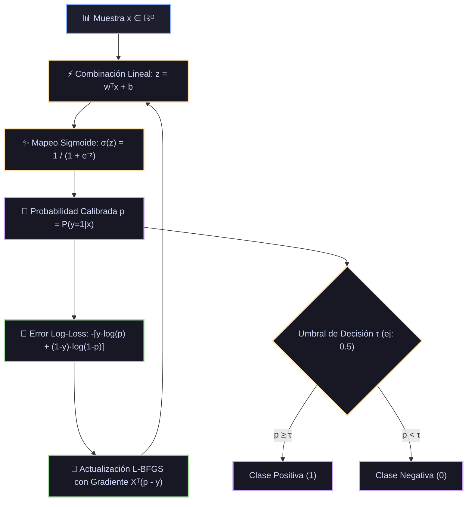

# Ficha Técnica: Regresión Logística (Binaria y Multiclase)

## 1. Identificación y Referencias Seminales
- **Autor & Año**: David R. Cox (1958). *The Regression Analysis of Binary Sequences*. *Journal of the Royal Statistical Society: Series B*, 20(2), 215-242.
- **Optimizador de Referencia**: C. Zhu, R. H. Byrd, P. Lu, J. Nocedal (1997). *Algorithm 778: L-BFGS-B: Fortran subroutines for large-scale bound-constrained optimization*.

---

## 2. Formulación Matemática y Función de Pérdida

### 2.1. Modelo Probabilístico y Función de Enlace (Logit)
$$\log\left( \frac{p}{1 - p} \right) = w^T x + b \implies P(y=1|x) = \sigma(z) = \frac{1}{1 + e^{-(w^T x + b)}}$$

En el caso multiclase con $K$ clases (Softmax / Multinomial Logistic Regression):
$$P(y=c|x) = \frac{e^{w_c^T x + b_c}}{\sum_{k=1}^K e^{w_k^T x + b_k}}$$

### 2.2. Función de Pérdida (Entropía Cruzada Negativa / Log-Loss)
$$\mathcal{L}_{\text{BCE}}(w) = -\frac{1}{N} \sum_{i=1}^N \left[ y_i \log(\hat{p}_i) + (1 - y_i) \log(1 - \hat{p}_i) \right] + \frac{1}{2C} \|w\|_2^2$$
donde $C = 1/\lambda$ es el inverso de la fuerza de regularización.

### 2.3. Gradiente y Matriz Hessiana
$$\nabla_w \mathcal{L} = \frac{1}{N} X^T (\hat{p} - y) + \frac{1}{C} w$$
$$H = \nabla^2_w \mathcal{L} = \frac{1}{N} X^T W X + \frac{1}{C} I, \quad \text{donde } W_{ii} = \hat{p}_i (1 - \hat{p}_i)$$
Dado que $W_{ii} > 0$, la matriz Hessiana $H$ es estrictamente semi-definida positiva, lo que garantiza que la función de coste es **estrictamente convexa** con un único mínimo global.

---

## 3. Descomposición Modular en Bloques

1. **Bloque 1: Transformación Afín Lineal**
   - Entrada: Vector $x \in \mathbb{R}^D$.
   - Salida: Puntuación escalar $z = w^T x + b \in \mathbb{R}$.
2. **Bloque 2: Función de Activación No Lineal Sigmoide / Softmax**
   - Mapeo de $\mathbb{R} \to (0, 1)$ garantizando que $\sum_k p_k = 1$.
3. **Bloque 3: Motor Cuasi-Newton (L-BFGS / Newton-CG)**
   - Aproximación de la inversa de la Hessiana $H^{-1}$ en espacio de memoria reducido para saltos rápidos hacia el óptimo global.
4. **Bloque 4: Umbralización de Decisión**
   - Regla de Bayes con umbral $\tau$ (por defecto 0.5): $\hat{y} = \mathbb{I}(\hat{p} \ge \tau)$.

---

## 4. Diagrama de Flujo Modular (Mermaid)



---

## 5. Hiperparámetros Críticos y Modos de Falla

| Hiperparámetro | Rol Matemático | Rango Típico | Modo de Falla / Efecto Extremo |
|---|---|---|---|
| `C` | Inverso de regularización ($C = 1/\lambda$) | $[10^{-3}, 10^3]$ | $C \to \infty$ causa pesos explosivos ante separación casi perfecta. |
| `solver` | Algoritmo numérico (`lbfgs`, `liblinear`, `saga`) | Categórico | `lbfgs` no admite penalización $L_1$ pura; para $L_1$ debe usarse `saga` o `liblinear`. |
| `class_weight` | Ponderación de pérdidas para desbalance | `balanced` o `None` | Si hay desbalance extremo (ej. 99% vs 1%), el modelo predecirá siempre la clase mayoritaria sin `class_weight='balanced'`. |

---

## 6. Snippet de Referencia en Python

```python
from sklearn.linear_model import LogisticRegression
from sklearn.preprocessing import StandardScaler
from sklearn.pipeline import make_pipeline

clf = make_pipeline(
    StandardScaler(),
    LogisticRegression(C=1.0, solver='lbfgs', max_iter=1000, random_state=42)
)
clf.fit(X_train, y_train)
probabilidades = clf.predict_proba(X_test)
```
