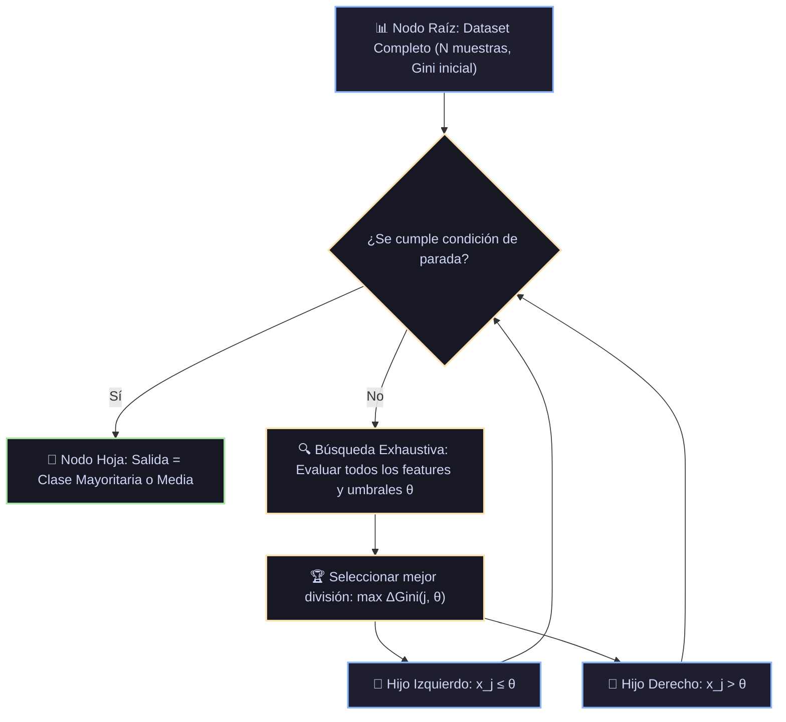

# Ficha Técnica: Árboles de Decisión (CART e ID3/C4.5)

## 1. Identificación y Referencias Seminales
- **CART**: Leo Breiman, Jerome Friedman, Richard Olshen, Charles Stone (1984). *Classification and Regression Trees*. Wadsworth.
- **ID3 & C4.5**: J. Ross Quinlan (1986). *Induction of Decision Trees*. *Machine Learning*, 1(1), 81-106. Quinlan (1993), *C4.5: Programs for Machine Learning*.

---

## 2. Formulación Matemática y Criterios de División

### 2.1. Impureza de Gini (CART Clasificación)
$$I_G(t) = 1 - \sum_{k=1}^K p_{k}^2$$
donde $p_k$ es la proporción de muestras de la clase $k$ en el nodo $t$.

### 2.2. Entropía de Shannon e Information Gain (ID3 / C4.5)
$$H(t) = -\sum_{k=1}^K p_k \log_2(p_k)$$
$$\Delta H(s, t) = H(t) - \sum_{v \in \{\text{izq}, \text{der}\}} \frac{N_v}{N_t} H(t_v)$$

### 2.3. Criterio de Reducción de Varianza (CART Regresión)
$$I_V(t) = \frac{1}{N_t} \sum_{i \in t} (y_i - \bar{y}_t)^2, \quad \Delta I_V(s, t) = I_V(t) - \frac{N_L}{N_t} I_V(t_L) - \frac{N_R}{N_t} I_V(t_R)$$

### 2.4. Poda de Complejidad de Coste (Cost-Complexity Pruning)
$$R_\alpha(T) = R(T) + \alpha |T|$$
donde $R(T)$ es el error empírico de entrenamiento, $|T|$ es el número de hojas y $\alpha \ge 0$ es el hiperparámetro de penalización por complejidad.

---

## 3. Descomposición Modular en Bloques

1. **Bloque 1: Escaneo de Umbrales por Variable**
   - Para cada feature $j \in \{1, \dots, D\}$ continuo, se ordenan los valores únicos y se evalúan los puntos medios como candidatos a umbral $\theta$.
2. **Bloque 2: Selector Greedy de Máxima Ganancia**
   - Selección del par óptimo $(j^*, \theta^*)$ que maximiza $\Delta I(s, t)$.
3. **Bloque 3: Bifurcador Recursivo (Branching)**
   - Partición de muestras en $\{x \mid x_{j^*} \le \theta^*\}$ y $\{x \mid x_{j^*} > \theta^*\}$.
4. **Bloque 4: Verificador de Condiciones de Parada**
   - Parada si: profundidad alcanzada $\ge \text{max\_depth}$, muestras $\le \text{min\_samples\_split}$, o impureza $= 0$ (nodo puro).
5. **Bloque 5: Asignación de Hojas**
   - Clasificación: Moda de clases en la hoja.
   - Regresión: Media muestral $\bar{y}$.

---

## 4. Diagrama de Flujo Modular (Mermaid)



---

## 5. Hiperparámetros Críticos y Modos de Falla

| Hiperparámetro | Rol Matemático | Rango Típico | Modo de Falla / Efecto Extremo |
|---|---|---|---|
| `max_depth` | Límite superior de profundidad | $[2, 30]$ o `None` | Si es `None`, el árbol memoriza ruido y causa *overfitting* catastrófico. |
| `min_samples_leaf` | Mínimo de muestras por hoja | $[1, 50]$ | Valores pequeños permiten aislar outliers individuales como hojas independientes. |
| `ccp_alpha` | Parámetro $\alpha$ de poda por coste | $[0.0, 0.05]$ | Podado excesivo si $\alpha$ es alto, colapsando el árbol a la raíz. |

---

## 6. Snippet de Referencia en Python

```python
from sklearn.tree import DecisionTreeClassifier

tree = DecisionTreeClassifier(
    criterion='gini',
    max_depth=5,
    min_samples_leaf=10,
    random_state=42
)
tree.fit(X_train, y_train)
```

