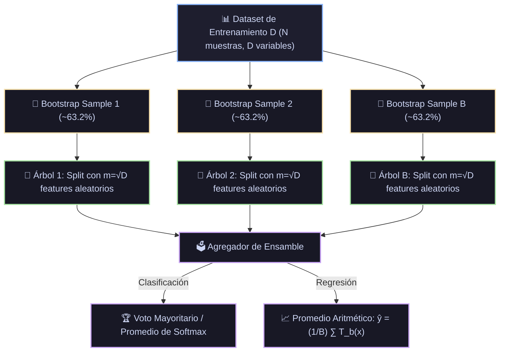

# Ficha Técnica: Random Forest (Bosques Aleatorios)

## 1. Identificación y Referencias Seminales
- **Autor & Año**: Leo Breiman (2001). *Random Forests*. *Machine Learning*, 45(1), 5-32.
- **Precursor (Random Subspace Method)**: Tin Kam Ho (1995). *Random Decision Forests*. *Proceedings of 3rd International Conference on Document Analysis and Recognition (ICDAR)*.

---

## 2. Formulación Matemática y Descomposición de Varianza

### 2.1. Teorema de Reducción de Varianza de Breiman
Dado un ensamble de $B$ árboles aleatorizados idénticamente distribuidos, cada uno con varianza $\sigma^2$ y correlación por pares $\rho$:
$$\text{Var}\left( \frac{1}{B} \sum_{b=1}^B T_b(x) \right) = \rho \sigma^2 + \frac{1 - \rho}{B} \sigma^2$$
- Cuando $B \to \infty$, el segundo término desaparece:
  $$\lim_{B \to \infty} \text{Var}(\bar{T}) = \rho \sigma^2$$
- Para minimizar la varianza del ensamble completo, Breiman introdujo el **submuestreo aleatorio de features** en cada nodo ($m = \lfloor\sqrt{D}\rfloor$), reduciendo drásticamente la correlación $\rho$ entre los árboles individuales.

### 2.2. Error Out-Of-Bag (OOB)
Para cada muestra $i$, la probabilidad de no ser seleccionada en una muestra bootstrap de tamaño $N$ con reemplazo es:
$$\lim_{N \to \infty} \left(1 - \frac{1}{N}\right)^N = e^{-1} \approx 0.368$$
El 36.8% de los datos queda fuera de cada árbol ("Out-Of-Bag") y sirve como conjunto de validación independiente y no sesgado sin necesidad de cross-validation explícito.

---

## 3. Descomposición Modular en Bloques

1. **Bloque 1: Generador de Bootstrap (Bagging)**
   - Extrae $B$ réplicas del dataset con reemplazo de tamaño $N$.
2. **Bloque 2: Inyector de Estocasticidad de Features (Random Subspace)**
   - En cada nodo de cada árbol, selecciona aleatoriamente $m \approx \sqrt{D}$ (clasificación) o $m \approx D/3$ (regresión) variables candidatas.
3. **Bloque 3: Construcción Paralela de Árboles Profundos**
   - Entrena $B$ árboles sin podar (alta varianza individual, bajo sesgo).
4. **Bloque 4: Ensamble y Agregación**
   - Clasificación: Voto mayoritario / promedio de probabilidades $\hat{p}(c|x) = \frac{1}{B} \sum_{b=1}^B p_b(c|x)$.
   - Regresión: Media $\hat{y} = \frac{1}{B} \sum_{b=1}^B T_b(x)$.
5. **Bloque 5: Evaluador OOB y MDI (Mean Decrease in Impurity)**
   - Calcula la importancia global de cada feature midiendo la reducción total de Gini aportada por ese feature a lo largo de los $B$ árboles.

---

## 4. Diagrama de Flujo Modular (Mermaid)



---

## 5. Hiperparámetros Críticos y Modos de Falla

| Hiperparámetro | Rol Matemático | Rango Típico | Modo de Falla / Efecto Extremo |
|---|---|---|---|
| `n_estimators` ($B$) | Número de árboles en el bosque | $[100, 1000]$ | No causa overfitting aumentar $B$; solo satura el rendimiento a costa de mayor tiempo de CPU. |
| `max_features` ($m$) | Número de variables evaluadas por split | $\sqrt{D}$ o $\log_2(D)$ | Si $m=D$, equivale a Bagging estándar (árboles altamente correlacionados entre sí). |
| `oob_score` | Uso del remanente del 36.8% para validación | `True` / `False` | Ahorra tiempo computacional evitando particionar un test set externo en datasets pequeños. |

---

## 6. Snippet de Referencia en Python

```python
from sklearn.ensemble import RandomForestClassifier

rf = RandomForestClassifier(
    n_estimators=300,
    max_features='sqrt',
    oob_score=True,
    n_jobs=-1,
    random_state=42
)
rf.fit(X_train, y_train)
print(f"OOB Score: {rf.oob_score_:.4f}")
```
