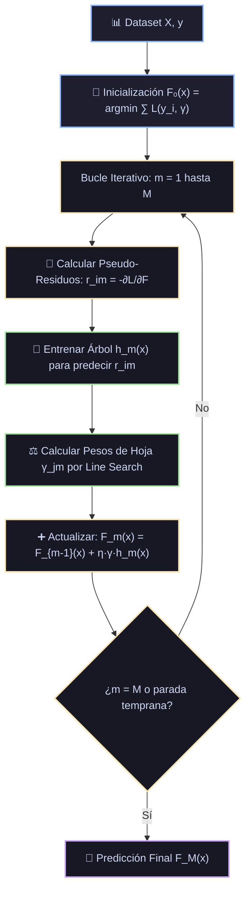

# Ficha Técnica: Gradient Boosting Machine (GBM Clásico)

## 1. Identificación y Referencias Seminales
- **Autor & Año**: Jerome H. Friedman (2001). *Greedy Function Approximation: A Gradient Boosting Machine*. *The Annals of Statistics*, 29(5), 1189-1232.
- **Precursor**: Leo Breiman (1998). *Arcing Classifiers*. (Interpretó boosting como descenso de gradiente sobre una función de coste).

---

## 2. Formulación Matemática: Descenso de Gradiente en Espacio de Funciones

### 2.1. Meta de Optimización
Dado un conjunto de datos $\{(x_i, y_i)\}_{i=1}^N$ y una función de pérdida diferenciable $L(y, F(x))$:
$$F^*(x) = \arg\min_F \mathbb{E}_{x, y}[L(y, F(x))]$$
El modelo se aproxima como una suma acumulativa ponderada de estimadores base débiles (árboles de regresión poco profundos $h(x)$):
$$F_M(x) = F_0(x) + \sum_{m=1}^M \eta \cdot h_m(x)$$

### 2.2. Pseudo-Residuos (Dirección del Gradiente Negativo)
En cada iteración $m$, el gradiente negativo de la función de pérdida evaluado en la predicción actual $F_{m-1}(x_i)$ representa la dirección de máximo descenso:
$$r_{im} = -\left[ \frac{\partial L(y_i, F(x_i))}{\partial F(x_i)} \right]_{F(x) = F_{m-1}(x)}$$

- Si $L(y, F) = \frac{1}{2}(y - F)^2$ (MSE): $r_{im} = y_i - F_{m-1}(x_i)$ (Residuo común).
- Si $L(y, F) = -[y \log p + (1-y)\log(1-p)]$ (Log-Loss): $r_{im} = y_i - p_{m-1}(x_i)$.

### 2.3. Multiplicador de Paso y Factor de Encogimiento (Shrinkage $\eta$)
Para cada hoja $j$ de la partición $R_{jm}$ generada por el árbol $m$:
$$\gamma_{jm} = \arg\min_\gamma \sum_{x_i \in R_{jm}} L(y_i, F_{m-1}(x_i) + \gamma)$$
Actualización regularizada con learning rate $\eta \in (0, 1]$:
$$F_m(x) = F_{m-1}(x) + \eta \sum_{j=1}^{J_m} \gamma_{jm} \mathbb{I}(x \in R_{jm})$$

---

## 3. Descomposición Modular en Bloques

1. **Bloque 1: Inicializador F0(x)**
   - Establece una predicción constante $F_0(x) = \arg\min_\gamma \sum_{i=1}^N L(y_i, \gamma)$ (la media para regresión MSE o el log-odds base para clasificación).
2. **Bloque 2: Generador de Pseudo-Residuos r_im**
   - Evalúa el gradiente negativo sample-by-sample contra la predicción actual.
3. **Bloque 3: Ajuste de Árbol Débil a los Residuos**
   - Entrena un árbol de decisión poco profundo (típicamente `max_depth` entre 3 y 6) cuyo objetivo es predecir $r_{im}$.
4. **Bloque 4: Estimación de Pesos de Hoja γ_jm**
   - Optimiza la salida de cada región terminal respecto a la función de pérdida original.
5. **Bloque 5: Actualizador Aditivo de Ensamble**
   - Acumula $F_m(x) \leftarrow F_{m-1}(x) + \eta \cdot \text{Árbol}_m(x)$.

---

## 4. Diagrama de Flujo Modular (Mermaid)



---

## 5. Hiperparámetros Críticos y Modos de Falla

| Hiperparámetro | Rol Matemático | Rango Típico | Modo de Falla / Efecto Extremo |
|---|---|---|---|
| `learning_rate` ($\eta$) | Tasa de contracción (shrinkage) | $[0.01, 0.2]$ | Si es muy alto ($\eta > 0.3$), el modelo oscila y sufre *overfitting* rápido. |
| `n_estimators` ($M$) | Número de etapas de boosting | $[100, 2000]$ | A diferencia de Random Forest, un $M$ excesivo causa sobreajuste; requiere *early stopping*. |
| `subsample` | Fracción para Stochastic Gradient Boosting | $[0.5, 0.8]$ | Si $< 1.0$, añade reducción de varianza emulando bagging. |

---

## 6. Snippet de Referencia en Python

```python
from sklearn.ensemble import GradientBoostingClassifier

gbm = GradientBoostingClassifier(
    n_estimators=200,
    learning_rate=0.05,
    max_depth=4,
    subsample=0.8,
    random_state=42
)
gbm.fit(X_train, y_train)
```

