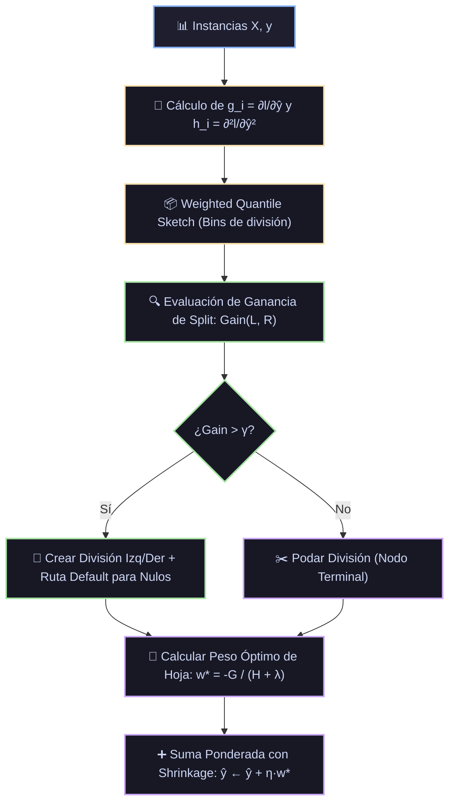

# Ficha Técnica: XGBoost (eXtreme Gradient Boosting)

## 1. Identificación y Referencias Seminales
- **Autores & Año**: Tianqi Chen y Carlos Guestrin (2016). *XGBoost: A Scalable Tree Boosting System*. *Proceedings of the 22nd ACM SIGKDD International Conference on Knowledge Discovery and Data Mining (KDD '16)*, 785-794. arXiv:1603.02754.
- **Impacto**: Dominador histórico en competiciones de Kaggle y benchmarks en datos tabulares.
- 🔬 **Análisis exhaustivo de papers y derivaciones:** [Ver Monografía Detallada de Papers](../analisis_papers/06_xgboost.md)

---

## 2. Formulación Matemática y Expansión de Taylor de 2º Orden

### 2.1. Función Objetivo Regularizada
En la iteración $t$, el objetivo global a minimizar es:
$$\mathcal{L}^{(t)} = \sum_{i=1}^n l\left(y_i, \hat{y}_i^{(t-1)} + f_t(x_i)\right) + \Omega(f_t)$$
donde el término de regularización estructural del árbol es:
$$\Omega(f_t) = \gamma T + \frac{1}{2} \lambda \sum_{j=1}^T w_j^2 + \alpha \sum_{j=1}^T |w_j|$$
con $T$ el número de hojas y $w_j$ el peso de predicción de la hoja $j$.

### 2.2. Expansión de Taylor de Segundo Orden
Aproximando la pérdida por Taylor de segundo orden alrededor de $\hat{y}_i^{(t-1)}$:
$$\mathcal{L}^{(t)} \approx \sum_{i=1}^n \left[ l(y_i, \hat{y}_i^{(t-1)}) + g_i f_t(x_i) + \frac{1}{2} h_i f_t^2(x_i) \right] + \Omega(f_t)$$
donde las derivadas de primer y segundo orden son:
$$g_i = \partial_{\hat{y}^{(t-1)}} l(y_i, \hat{y}^{(t-1)}), \quad h_i = \partial^2_{\hat{y}^{(t-1)}} l(y_i, \hat{y}^{(t-1)})$$

Eliminando términos constantes, el objetivo simplificado para una estructura de árbol fija es:
$$\tilde{\mathcal{L}}^{(t)} = \sum_{j=1}^T \left[ \left( \sum_{i \in I_j} g_i \right) w_j + \frac{1}{2} \left( \sum_{i \in I_j} h_i + \lambda \right) w_j^2 \right] + \gamma T$$

Definiendo $G_j = \sum_{i \in I_j} g_i$ y $H_j = \sum_{i \in I_j} h_i$, derivando respecto a $w_j$ se obtiene el peso analítico óptimo de cada hoja:
$$w_j^* = -\frac{G_j}{H_j + \lambda}$$
Sustituyendo $w_j^*$, la puntuación óptima de calidad del árbol es:
$$\mathcal{L}^* = -\frac{1}{2} \sum_{j=1}^T \frac{G_j^2}{H_j + \lambda} + \gamma T$$

### 2.3. Ganancia de División de Nodo (Split Score)
La ganancia al dividir un nodo en subconjuntos izquierdo ($L$) y derecho ($R$) es:
$$\text{Gain} = \frac{1}{2} \left[ \frac{G_L^2}{H_L + \lambda} + \frac{G_R^2}{H_R + \lambda} - \frac{(G_L + G_R)^2}{H_L + H_R + \lambda} \right] - \gamma$$
Si $\text{Gain} \le 0$, el parámetro $\gamma$ actúa como umbral de poda automática.

---

## 3. Descomposición Modular en Bloques

1. **Bloque 1: Motor Analítico de Gradiente y Hessiano (g y h)**
   - Computa simultáneamente la primera y segunda derivada para cualquier función de pérdida arbitraria.
2. **Bloque 2: Weighted Quantile Sketch**
   - Propone candidatos de división basados en percentiles de los pesos hessianos $h_i$ para manejar grandes volúmenes de datos.
3. **Bloque 3: Sparsity-Aware Split Finding**
   - Asigna una dirección por defecto para valores ausentes/nulos en tiempo de ejecución basada en la máxima ganancia.
4. **Bloque 4: Podador por Parámetro γ y Regularizador L2 λ**
   - Poda las hojas cuya ganancia sea menor a $\gamma$.
5. **Bloque 5: Optimizaciones de Memoria en Bloques (Column Block)**
   - Almacena los datos en formato comprimido por columnas (CSC) con pre-ordenamiento para ejecución paralela en CPU/GPU.

---

## 4. Diagrama de Flujo Modular (Mermaid)



---

## 5. Hiperparámetros Críticos y Modos de Falla

| Hiperparámetro | Rol Matemático | Rango Típico | Modo de Falla / Efecto Extremo |
|---|---|---|---|
| `gamma` ($\gamma$) | Reducción mínima de pérdida para dividir | $[0.0, 10.0]$ | Valores altos vuelven el modelo excesivamente conservador. |
| `reg_lambda` ($\lambda$) | Regularización cuadrática $L_2$ en pesos | $[1.0, 100.0]$ | Controla la magnitud de los pesos $w_j^*$. Previene pesos extremos cuando $H_j \approx 0$. |
| `max_depth` | Profundidad máxima del árbol | $[3, 10]$ | Profundidades mayores a 8 en datasets pequeños causan sobreajuste severo. |
| `subsample` & `colsample_bytree` | Ratios de submuestreo de filas y columnas | $[0.6, 0.9]$ | Aumentan la robustez frente al ruido y reducen la correlación entre árboles. |

---

## 6. Snippet de Referencia en Python

```python
import xgboost as xgb

modelo = xgb.XGBClassifier(
    n_estimators=300,
    learning_rate=0.03,
    max_depth=6,
    gamma=0.1,
    reg_lambda=1.5,
    subsample=0.8,
    colsample_bytree=0.8,
    tree_method='hist',
    random_state=42
)
modelo.fit(X_train, y_train, eval_set=[(X_val, y_val)], verbose=False)
```

