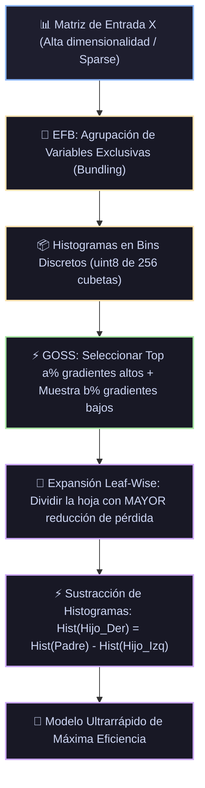

# Ficha Técnica: LightGBM (Light Gradient Boosting Machine)

## 1. Identificación y Referencias Seminales
- **Autores & Año**: Guolin Ke, Qi Meng, Thomas Finley, Taifeng Wang, Wei Chen, Weidong Ma, Qiwei Ye, Tie-Yan Liu (2017). *LightGBM: A Highly Efficient Gradient Boosting Decision Tree*. *Advances in Neural Information Processing Systems (NeurIPS 30)*, 3146-3154.
- **Innovaciones Clave**: GOSS (Gradient-based One-Side Sampling), EFB (Exclusive Feature Bundling), Histogram-based splits y Leaf-wise tree growth.

---

## 2. Formulación Matemática y Principios de Diseño

### 2.1. GOSS (Gradient-based One-Side Sampling)
Las instancias con gradientes pequeños tienen un error de entrenamiento ya reducido y aportan poca ganancia de información. GOSS conserva las instancias de alto gradiente y submuestrea aleatoriamente las de bajo gradiente:
1. Ordenar instancias por el valor absoluto de su gradiente $|g_i|$.
2. Seleccionar el top $a \times 100\%$ de instancias ($A$).
3. Del resto de instancias ($A^c$), muestrear aleatoriamente un subconjunto $B$ de tamaño $b \times |A^c|$.
4. Para evitar alterar la distribución de la pérdida, las instancias de $B$ se multiplican por el factor de amplificación $\frac{1-a}{b}$ al calcular la ganancia:
$$\tilde{V}_j(d) = \frac{1}{n} \left[ \frac{\left( \sum_{x_i \in A_l} g_i + \frac{1-a}{b} \sum_{x_i \in B_l} g_i \right)^2}{n_l^j(d)} + \frac{\left( \sum_{x_i \in A_r} g_i + \frac{1-a}{b} \sum_{x_i \in B_r} g_i \right)^2}{n_r^j(d)} \right]$$

### 2.2. EFB (Exclusive Feature Bundling)
En datos de alta dimensionalidad (como texto o matrices sparse), muchas variables casi nunca toman valores no nulos simultáneamente. EFB reduce esto al problema de **Coloración de Grafos**:
- Las variables que rara vez colisionan se agrupan en un único *bundle*.
- Se agrega un desplazamiento (offset) a los bins de una variable para que no colisionen en el espacio de valores compartidos.

### 2.3. Crecimiento Leaf-wise (Best-first) vs Depth-wise (Level-wise)
A diferencia de los árboles tradicionales que se expanden nivel por nivel, LightGBM busca en cada iteración la hoja con la **mayor reducción potencial de pérdida** en todo el árbol y la divide, minimizando la pérdida mucho más rápido con el mismo número de hojas.

---

## 3. Descomposición Modular en Bloques

1. **Bloque 1: Discretización en Histogramas de Bins (K=256)**
   - Convierte valores de coma flotante continuos en enteros de 8 bits `uint8`, reduciendo drásticamente el consumo de memoria en 4x y el coste de división de $\mathcal{O}(N)$ a $\mathcal{O}(K)$.
2. **Bloque 2: Agrupador EFB**
   - Fusiona columnas poco densas en bundles densos compactos.
3. **Bloque 3: Muestreador GOSS**
   - Filtra y re-pondera instancias según la magnitud de su gradiente.
4. **Bloque 4: Expansor Leaf-Wise con Restricción de max_depth**
   - Expande prioritariamente la hoja con mayor ganancia.
5. **Bloque 5: Sustracción de Histogramas entre Nodos Hermanos**
   - Para calcular el histograma del nodo hermano derecho: $\text{Hist}(R) = \text{Hist}(\text{Padre}) - \text{Hist}(L)$ en tiempo $\mathcal{O}(K)$, sin reescanear datos.

---

## 4. Diagrama de Flujo Modular (Mermaid)



---

## 5. Hiperparámetros Críticos y Modos de Falla

| Hiperparámetro | Rol Matemático | Rango Típico | Modo de Falla / Efecto Extremo |
|---|---|---|---|
| `num_leaves` | Número máximo de hojas por árbol | $[15, 255]$ | Parámetro principal de control de complejidad; debe satisfacer $\text{num\_leaves} \le 2^{\text{max\_depth}}$. |
| `min_data_in_leaf` | Mínimo de muestras por hoja | $[20, 1000]$ | Si es muy bajo, la estrategia leaf-wise causa sobreajuste rápido en árboles profundos y asimétricos. |
| `max_bin` | Número máximo de cubetas de histograma | $[63, 255]$ | Reducir acelera el entrenamiento; valores altos conservan precisión fina. |

---

## 6. Snippet de Referencia en Python

```python
import lightgbm as lgb

modelo = lgb.LGBMClassifier(
    n_estimators=500,
    learning_rate=0.03,
    num_leaves=31,
    min_data_in_leaf=20,
    subsample=0.8,
    colsample_bytree=0.8,
    random_state=42
)
modelo.fit(X_train, y_train)
```
