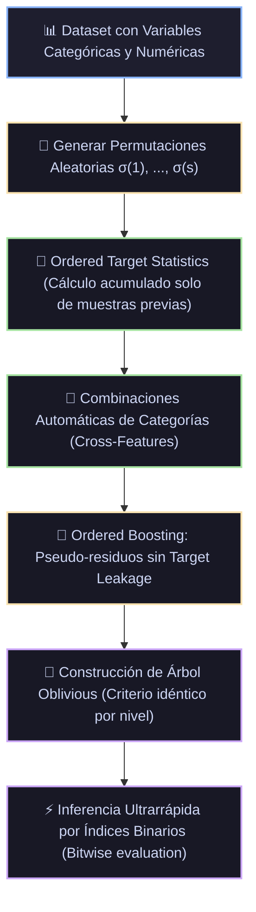

# Ficha Técnica: CatBoost (Categorical Boosting)

## 1. Identificación y Referencias Seminales
- **Autores & Año**: Liudmila Prokhorenkova, Gleb Gusev, Aleksandr Vorobev, Anna Veronika Dorogush, Andrey Gulin (2018). *CatBoost: unbiased boosting with categorical features*. *Advances in Neural Information Processing Systems (NeurIPS 31)*, 6638-6648. arXiv:1706.09516.
- **Innovaciones Clave**: Ordered Boosting, Ordered Target Statistics (TS) y Árboles Simétricos Oblivious.
- 🔬 **Análisis exhaustivo de papers y derivaciones:** [Ver Monografía Detallada de Papers](../analisis_papers/08_catboost.md)

---

## 2. Formulación Matemática y Mitigación del Prediction Shift

### 2.1. El Problema del Prediction Shift (Fuga de Objetivo)
En el Gradient Boosting convencional, el cálculo de los pseudo-residuos de una muestra $x_i$ utiliza un modelo $F$ que ya fue entrenado utilizando la etiqueta real $y_i$. Este sesgo condicional acumulativo degrada la capacidad de generalización del modelo.

### 2.2. Ordered Boosting
CatBoost mitiga esto mediante **permutaciones aleatorias** de los datos de entrenamiento $\sigma = (\sigma_1, \dots, \sigma_n)$. Para predecir el residuo de la muestra $\sigma_p$, se utiliza un modelo auxiliar entrenado **exclusivamente con las muestras previas en la permutación** $\{\sigma_1, \dots, \sigma_{p-1}\}$:
$$r(\sigma_p) = y_{\sigma_p} - M_{p-1}(\sigma_p)$$

### 2.3. Ordered Target Statistics (TS) para Variables Categóricas
Para una variable categórica $x_k$ con categoría $v$, su representación numérica no sesgada para la instancia $p$-ésima en la permutación $\sigma$ es:
$$\hat{x}_{\sigma_p, k} = \frac{\sum_{j=1}^{p-1} \mathbb{I}(x_{\sigma_j, k} = x_{\sigma_p, k}) y_{\sigma_j} + a \cdot P}{\sum_{j=1}^{p-1} \mathbb{I}(x_{\sigma_j, k} = x_{\sigma_p, k}) + a}$$
donde $P$ es el prior global de la etiqueta y $a > 0$ es el peso del prior de suavizado.

### 2.4. Árboles Oblivious (Simétricos)
Todos los nodos de un mismo nivel del árbol comparten exactamente el mismo criterio de división (mismo feature y mismo umbral). Una predicción equivale a indexar una tabla bidimensional mediante una máscara binaria de $d$ bits, permitiendo una velocidad de inferencia extrema en CPU y GPU.

---

## 3. Descomposición Modular en Bloques

1. **Bloque 1: Motor de Permutaciones Aleatorias**
   - Genera múltiples permutaciones $\sigma^{(1)}, \dots, \sigma^{(s)}$ de los datos.
2. **Bloque 2: Codificador Categórico Dinámico (Ordered TS)**
   - Transforma variables categóricas de alta cardinalidad al vuelo sin leakage.
3. **Bloque 3: Extractor de Combinaciones de Features**
   - Genera combinaciones automáticas de features categóricos (ej. `Categoría_A + Categoría_B`).
4. **Bloque 4: Construcción de Árboles Oblivious Simétricos**
   - Genera árboles de profundidad fija balanceada ($d \le 6$).
5. **Bloque 5: Inferencia por Indexación Bitwise**
   - La evaluación de la muestra $x$ calcula $b = \sum_{k=0}^{d-1} \mathbb{I}(x_{j_k} > \theta_k) 2^k$, accediendo directamente a la hoja $w[b]$ en tiempo constante $\mathcal{O}(d)$.

---

## 4. Diagrama de Flujo Modular (Mermaid)



---

## 5. Hiperparámetros Críticos y Modos de Falla

| Hiperparámetro | Rol Matemático | Rango Típico | Modo de Falla / Efecto Extremo |
|---|---|---|---|
| `iterations` | Número de árboles en el ensamble | $[500, 3000]$ | CatBoost suele requerir más iteraciones con learning rates pequeños. |
| `depth` | Profundidad del árbol oblivious | $[4, 8]$ (típico 6) | Cada incremento en 1 duplica exactamente el número de hojas ($2^d$ hojas). |
| `l2_leaf_reg` | Regularización $L_2$ en las hojas | $[1.0, 20.0]$ | Evita pesos extremos en hojas con pocas muestras. |
| `cat_features` | Índices o nombres de columnas categóricas | Lista de columnas | No codificar con One-Hot previo; CatBoost rinde mejor con variables categóricas nativas. |

---

## 6. Snippet de Referencia en Python

```python
from catboost import CatBoostClassifier

modelo = CatBoostClassifier(
    iterations=800,
    learning_rate=0.04,
    depth=6,
    cat_features=['ciudad', 'categoria_producto'],
    eval_metric='AUC',
    random_seed=42,
    verbose=False
)
modelo.fit(X_train, y_train, eval_set=(X_val, y_val), early_stopping_rounds=50)
```

