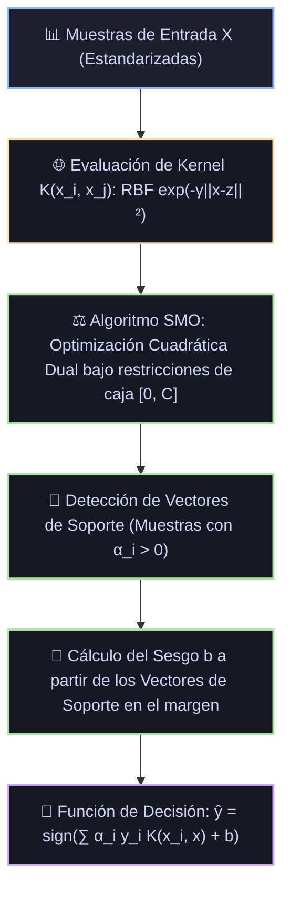

# Ficha Técnica: Máquinas de Vectores de Soporte (SVM y SVR)

## 1. Identificación y Referencias Seminales
- **Clasificador de Margen Óptimo**: Bernardo Boser, Isabelle Guyon, Vladimir Vapnik (1992). *A training algorithm for optimal margin classifiers*. *COLT '92*, 144-152.
- **Redes de Vectores de Soporte (Kernel Trick & Soft Margin)**: Corinna Cortes y Vladimir Vapnik (1995). *Support-Vector Networks*. *Machine Learning*, 20(3), 273-297.
- **Regresión por Vectores de Soporte (SVR)**: Harris Drucker, Christopher J. C. Burges, Linda Kaufman, Alex Smola, Vladimir Vapnik (1997). *Support Vector Regression Machines*. *NeurIPS 9*.

---

## 2. Formulación Matemática

### 2.1. Problema Primal de Margen Suave (Soft-Margin SVM)
Para puntos linealmente no separables con variables de holgura $\xi_i \ge 0$:
$$\min_{w, b, \xi} \frac{1}{2} \|w\|^2 + C \sum_{i=1}^N \xi_i \quad \text{sujeto a} \quad y_i(w^T \phi(x_i) + b) \ge 1 - \xi_i, \quad \xi_i \ge 0$$
- Margen geométrico: $\gamma = \frac{2}{\|w\|}$. Maximizar el margen equivale a minimizar $\frac{1}{2}\|w\|^2$.
- Parámetro $C$: Controla el compromiso entre el ancho del margen y la penalización de violaciones de margen.

### 2.2. Formulación Dual de Lagrange y Condiciones KKT
Construyendo el Lagrangiano con multiplicadores $\alpha_i \ge 0$ y $\mu_i \ge 0$, y derivando respecto a $w$ y $b$:
$$w = \sum_{i=1}^N \alpha_i y_i \phi(x_i), \quad \sum_{i=1}^N \alpha_i y_i = 0$$
Dual de Wolfe:
$$\max_{\alpha} \sum_{i=1}^N \alpha_i - \frac{1}{2} \sum_{i=1}^N \sum_{j=1}^N \alpha_i \alpha_j y_i y_j K(x_i, x_j) \quad \text{s.t.} \quad 0 \le \alpha_i \le C, \quad \sum_{i=1}^N \alpha_i y_i = 0$$

Condiciones de Complementariedad KKT:
$$\alpha_i \left[ y_i (w^T \phi(x_i) + b) - 1 + \xi_i \right] = 0$$
- Si $\alpha_i = 0$: Muestra fuera del margen (clasificada correctamente, no influye en el modelo).
- Si $0 < \alpha_i < C$: Vector de soporte en el margen exacto ($\xi_i = 0$).
- Si $\alpha_i = C$: Vector de soporte violando el margen ($\xi_i > 0$).

### 2.3. Funciones de Kernel Canónicas
- **Lineal**: $K(x, z) = x^T z$
- **RBF / Gaussiano**: $K(x, z) = \exp(-\gamma \|x - z\|^2)$ (mapea a espacio de Hilbert de dimensión infinita).
- **Polinómico**: $K(x, z) = (\gamma x^T z + r)^d$

### 2.4. SVR (Tubo $\varepsilon$-insensible)
$$\min_{w, b, \xi, \xi^*} \frac{1}{2} \|w\|^2 + C \sum_{i=1}^N (\xi_i + \xi_i^*) \quad \text{s.t.} \quad \begin{cases} y_i - (w^T \phi(x_i) + b) \le \varepsilon + \xi_i \\ (w^T \phi(x_i) + b) - y_i \le \varepsilon + \xi_i^* \\ \xi_i, \xi_i^* \ge 0 \end{cases}$$

---

## 3. Descomposición Modular en Bloques

1. **Bloque 1: Estandarización de Entrada**
   - Crítica: SVM es sensible a la escala de las distancias euclidianas; requiere media 0 y varianza unitaria.
2. **Bloque 2: Evaluador del Kernel Gram Matrix K(x, z)**
   - Computa la similitud geométrica en el espacio de características transformado $\phi$.
3. **Bloque 3: Optimizador Cuadrático SMO (Sequential Minimal Optimization)**
   - Resuelve el problema dual analíticamente seleccionando pares de multiplicadores $(\alpha_1, \alpha_2)$ que satisfacen la restricción de igualdad lineal.
4. **Bloque 4: Filtro Esparso de Vectores de Soporte**
   - Descarta el 80%-95% de las muestras que tienen $\alpha_i = 0$.
5. **Bloque 5: Función de Decisión / Inferencia**
   - $f(x) = \text{sign}\left( \sum_{i \in \text{SV}} \alpha_i y_i K(x_i, x) + b \right)$.

---

## 4. Diagrama de Flujo Modular (Mermaid)



---

## 5. Hiperparámetros Críticos y Modos de Falla

| Hiperparámetro | Rol Matemático | Rango Típico | Modo de Falla / Efecto Extremo |
|---|---|---|---|
| `C` | Penalización de violaciones de margen | $[0.1, 1000]$ | Si $C \to \infty$, margen rígido (*overfitting*); si $C$ es muy pequeño, margen excesivamente ancho (*underfitting*). |
| `gamma` ($\gamma$) | Curvatura del Kernel RBF ($1 / (2\sigma^2)$) | $[10^{-3}, 10]$ o `scale` | $\gamma$ muy alto crea "islas" alrededor de cada vector de soporte (memorización total de puntos). |
| `epsilon` ($\varepsilon$) | Tolerancia del tubo en SVR | $[0.01, 1.0]$ | $\varepsilon$ alto ignora gran parte de la señal; $\varepsilon \to 0$ fuerza mínimos cuadrados estándar. |

---

## 6. Snippet de Referencia en Python

```python
from sklearn.svm import SVC
from sklearn.preprocessing import StandardScaler
from sklearn.pipeline import make_pipeline

svm = make_pipeline(
    StandardScaler(),
    SVC(C=10.0, kernel='rbf', gamma='scale', probability=True, random_state=42)
)
svm.fit(X_train, y_train)
```
