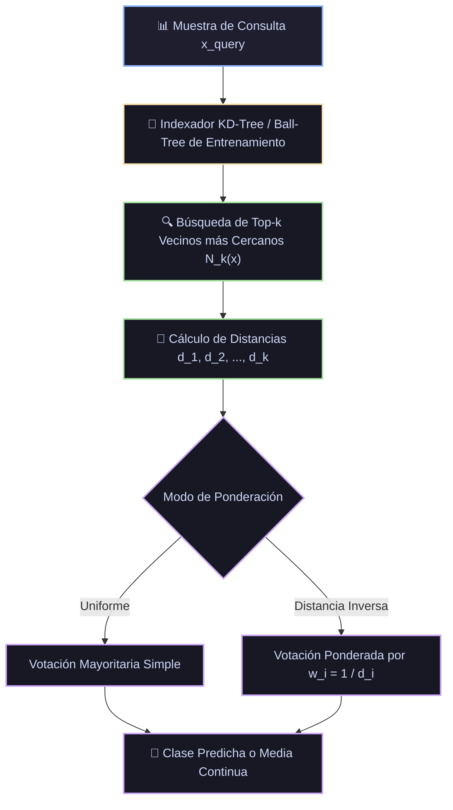

# Ficha Técnica: k-Nearest Neighbors (k-NN)

## 1. Identificación y Referencias Seminales
- **Autores & Año**: Thomas Cover y Peter Hart (1967). *Nearest Neighbor Pattern Classification*. *IEEE Transactions on Information Theory*, 13(1), 21-27.
- **Precursores**: Evelyn Fix y Joseph L. Hodges Jr. (1951). *Discriminatory Analysis: Nonparametric Discrimination: Consistency Properties*. Report Number 4, Project Number 21-49-004, USAF School of Aviation Medicine.
- 🔬 **Análisis exhaustivo de papers y derivaciones:** [Ver Monografía Detallada de Papers](../analisis_papers/10_knn_vecinos_cercanos.md)

---

## 2. Formulación Matemática y Garantías Teóricas

### 2.1. Métricas de Distancia
Dadas dos muestras $x, z \in \mathbb{R}^D$:
- **Distancia de Minkowski (General)**:
  $$d_p(x, z) = \left( \sum_{j=1}^D |x_j - z_j|^p \right)^{1/p}$$
  - $p=2$: Euclidiana ($L_2$)
  - $p=1$: Manhattan / Taxicab ($L_1$)
- **Distancia Coseno (Texto y Embeddings)**:
  $$d_{\cos}(x, z) = 1 - \frac{x^T z}{\|x\|_2 \|z\|_2}$$

### 2.2. Teorema de Cota del Error Asintótico (Cover & Hart)
Sea $R^*$ el error de Bayes (el error mínimo teórico alcanzable por cualquier clasificador). Para el clasificador 1-NN ($k=1$), cuando el tamaño de muestra $N \to \infty$:
$$R^* \le R_{1\text{-NN}} \le 2 R^* \left(1 - \frac{R^*}{C-1}\right)$$
El error asintótico del 1-Nearest Neighbor está acotado por **menos del doble del error óptimo de Bayes**, sin asumir ninguna distribución paramétrica.

### 2.3. Votación Ponderada
$$\hat{y}(x) = \arg\max_{c} \sum_{i \in \mathcal{N}_k(x)} w_i \mathbb{I}(y_i = c), \quad \text{donde } w_i = \frac{1}{d(x, x_i)^\alpha + \epsilon}$$

---

## 3. Descomposición Modular en Bloques

1. **Bloque 1: Normalizador de Escala Métrico**
   - Estandarización o MinMax scaling obligatorio para evitar que atributos de escala grande distorsionen las distancias.
2. **Bloque 2: Estructura de Partición Espacial (Indexador)**
   - **KD-Tree**: Divide el espacio con hiperplanos ortogonales a los ejes (eficiente para $D \le 20$).
   - **Ball-Tree**: Agrupa puntos en hiper-esferas métricas anidadas (mejor para espacios de mayor dimensión).
3. **Bloque 3: Algoritmo de Búsqueda de Vecindario k-NN**
   - Rastreo con poda mediante cola de prioridad que evita visitar nodos del árbol cuya distancia al hiperplano supere la del $k$-ésimo vecino actual.
4. **Bloque 4: Agregador de Salida**
   - Clasificación: Moda o votación ponderada por inversa de distancia.
   - Regresión: Media ponderada $\hat{y} = \frac{\sum w_i y_i}{\sum w_i}$.

---

## 4. Diagrama de Flujo Modular (Mermaid)



---

## 5. Hiperparámetros Críticos y Modos de Falla

| Hiperparámetro | Rol Matemático | Rango Típico | Modo de Falla / Efecto Extremo |
|---|---|---|---|
| `n_neighbors` ($k$) | Número de vecinos en la consulta | $[3, 25]$ | $k=1$ es extremadamente sensible a ruido y outliers; $k$ muy grande aplana las fronteras hacia la clase mayoritaria. |
| `weights` | Esquema de votación (`uniform`, `distance`) | Categórico | En clases con densidad desigual, `distance` mitiga la influencia de vecinos lejanos. |
| `metric` | Definición métrica del espacio | `euclidean`, `manhattan`, `cosine` | La maldición de la dimensionalidad ($D > 50$) causa que todas las distancias euclidianas converjan al mismo valor. |

---

## 6. Snippet de Referencia en Python

```python
from sklearn.neighbors import KNeighborsClassifier
from sklearn.preprocessing import StandardScaler
from sklearn.pipeline import make_pipeline

knn = make_pipeline(
    StandardScaler(),
    KNeighborsClassifier(n_neighbors=7, weights='distance', algorithm='auto')
)
knn.fit(X_train, y_train)
```

