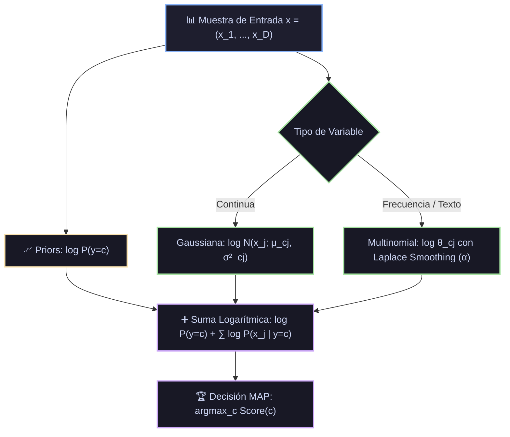

# Ficha Técnica: Naive Bayes (Gaussiano, Multinomial y Bernoulli)

## 1. Identificación y Referencias Seminales
- **Autores & Año**: Richard O. Duda y Peter E. Hart (1973). *Pattern Classification and Scene Analysis*. John Wiley & Sons.
- **Teorema de Base**: Thomas Bayes (1763). *An Essay towards solving a Problem in the Doctrine of Chances*.

---

## 2. Formulación Matemática y Suposición de Independencia Condicional

### 2.1. Teorema de Bayes y Supuesto "Ingenuo"
$$P(y=c \mid x_1, \dots, x_D) = \frac{P(y=c) P(x_1, \dots, x_D \mid y=c)}{P(x_1, \dots, x_D)}$$
Asumiendo independencia condicional entre todas las variables dado el estado de la clase:
$$P(x_1, \dots, x_D \mid y=c) = \prod_{j=1}^D P(x_j \mid y=c)$$

Regla de Decisión MAP (Maximum A Posteriori) en escala logarítmica:
$$\hat{y} = \arg\max_{c} \left( \log P(y=c) + \sum_{j=1}^D \log P(x_j \mid y=c) \right)$$

### 2.2. Variantes Canónicas según la Distribución de las Variables

#### 2.2.1. Naive Bayes Gaussiano (Variables Continuas)
$$P(x_j \mid y=c) = \frac{1}{\sqrt{2\pi \sigma_{cj}^2}} \exp\left( -\frac{(x_j - \mu_{cj})^2}{2\sigma_{cj}^2} \right)$$
donde $\mu_{cj}$ y $\sigma_{cj}^2$ son la media y varianza muestrales de la variable $j$ calculadas sobre la clase $c$.

#### 2.2.2. Naive Bayes Multinomial con Suavizado de Laplace (Conteos / NLP)
Para variables que representan frecuencias o conteos de palabras:
$$\hat{\theta}_{cj} = \frac{N_{cj} + \alpha}{N_c + \alpha D}$$
donde $N_{cj}$ es el conteo de la palabra $j$ en documentos de la clase $c$, y $\alpha > 0$ es el hiperparámetro de **Laplace smoothing** que evita probabilidades nulas ($P = 0$) ante palabras nuevas.

---

## 3. Descomposición Modular en Bloques

1. **Bloque 1: Estimador de Priors P(y)**
   - Computa las frecuencias relativas $P(y=c) = \frac{N_c}{N}$.
2. **Bloque 2: Estimador de Parámetros de Verosimilitud por Clase**
   - Continuo: Matriz de medias $\mu \in \mathbb{R}^{C \times D}$ y varianzas $\sigma^2 \in \mathbb{R}^{C \times D}$.
   - Discreto: Matriz de proporciones normalizadas $\Theta \in \mathbb{R}^{C \times D}$.
3. **Bloque 3: Acumulador Logarítmico**
   - Transforma las multiplicaciones de probabilidades en sumas en espacio logarítmico para evitar *underflow* numérico de punto flotante en vectores largos.
4. **Bloque 4: Decisión Argmax y Calibración Softmax**
   - Retorna la clase ganadora y calcula probabilidades normalizadas:
     $$P(y=c|x) = \frac{\exp(L_c)}{\sum_k \exp(L_k)}$$

---

## 4. Diagrama de Flujo Modular (Mermaid)



---

## 5. Hiperparámetros Críticos y Modos de Falla

| Hiperparámetro | Rol Matemático | Rango Típico | Modo de Falla / Efecto Extremo |
|---|---|---|---|
| `alpha` ($\alpha$) | Constante de suavizado aditivo de Laplace | $[0.1, 1.0]$ | Si $\alpha=0$, cualquier término no observado en entrenamiento produce probabilidad total 0. |
| `var_smoothing` | Épsilon añadido a la varianza en Gaussiano | $[10^{-9}, 10^{-5}]$ | Previene división por cero cuando una variable continua tiene varianza nula dentro de una clase. |
| Correlación entre features | Violación de la hipótesis de independencia | Supuesto teórico | Variables redundantes o idénticas duplican artificialmente su peso en el log-score. |

---

## 6. Snippet de Referencia en Python

```python
from sklearn.naive_bayes import MultinomialNB
from sklearn.feature_extraction.text import TfidfVectorizer
from sklearn.pipeline import make_pipeline

modelo = make_pipeline(
    TfidfVectorizer(max_features=5000),
    MultinomialNB(alpha=0.5)
)
modelo.fit(X_text_train, y_train)
```
