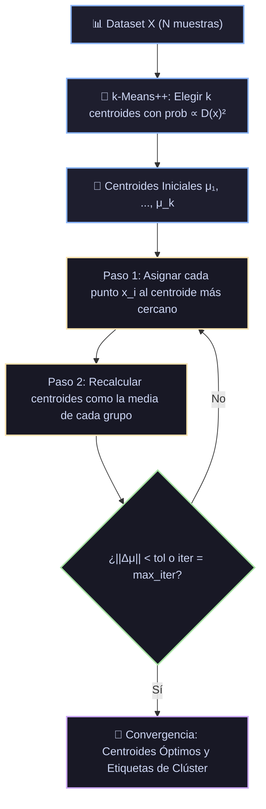

# Ficha Técnica: k-Means y k-Means++

## 1. Identificación y Referencias Seminales
- **k-Means (Algoritmo de Lloyd)**: Stuart P. Lloyd (1957 / 1982). *Least squares quantization in PCM*. *IEEE Transactions on Information Theory*, 28(2), 129-137. J. MacQueen (1967). *Some Methods for classification and Analysis of Multivariate Observations*.
- **k-Means++**: David Arthur y Sergei Vassilvitskii (2007). *k-means++: the advantages of careful seeding*. *Proceedings of the 18th Annual ACM-SIAM Symposium on Discrete Algorithms (SODA)*, 1027-1035.

---

## 2. Formulación Matemática y Algoritmo EM

### 2.1. Inercia / Suma de Cuadrados Intra-Cluster (WCSS)
Dado un conjunto de datos $\{x_1, \dots, x_N\} \subset \mathbb{R}^D$ y un número de clústeres $k$, se busca la partición $S = \{S_1, \dots, S_k\}$ que minimiza la inercia:
$$\mathcal{J}(S, \mu) = \sum_{j=1}^k \sum_{x_i \in S_j} \|x_i - \mu_j\|^2$$
donde $\mu_j$ es el centroide del clúster $j$:
$$\mu_j = \frac{1}{|S_j|} \sum_{x \in S_j} x$$

### 2.2. Inicialización Inteligente k-Means++
La inicialización puramente aleatoria suele quedar atrapada en mínimos locales subóptimos con un error de aproximación arbitrariamente malo. Arthur & Vassilvitskii demostraron que k-means++ garantiza una cota de aproximación de **$\mathcal{O}(\log k)$ respecto al óptimo**:
1. Elegir el primer centroide $\mu_1$ uniformemente al azar de entre los puntos de datos.
2. Para cada punto $x$, calcular la distancia mínima al centroide ya elegido más cercano: $D(x) = \min_{j} \|x - \mu_j\|$.
3. Elegir el siguiente centroide $\mu$ seleccionando un punto $x$ con probabilidad proporcional al cuadrado de la distancia:
   $$P(x) = \frac{D(x)^2}{\sum_{x'} D(x')^2}$$
4. Repetir los pasos 2 y 3 hasta seleccionar $k$ centroides.

### 2.3. Bucle Iterativo de Lloyd
- **Paso de Asignación (Expectation)**: Cada punto se asocia al clúster cuyo centroide esté más próximo:
  $$S_j^{(t)} = \left\{ x_i \mid \|x_i - \mu_j^{(t)}\|^2 \le \|x_i - \mu_{j'}^{(t)}\|^2 \quad \forall j' \ne j \right\}$$
- **Paso de Actualización (Maximization)**: Recalcular los centroides como el baricentro geométrico de los puntos asignados:
  $$\mu_j^{(t+1)} = \frac{1}{|S_j^{(t)}|} \sum_{x_i \in S_j^{(t)}} x_i$$

---

## 3. Descomposición Modular en Bloques

1. **Bloque 1: Escalado de Datos**
   - La distancia euclidiana no es invariante a escala; normalización $Z$-score requerida.
2. **Bloque 2: Inicializador Semilla k-Means++**
   - Selección probabilística de centros dispersos.
3. **Bloque 3: Bucle de Lloyd Asignación-Actualización**
   - Iteración hasta que el desplazamiento de centroides $\|\mu^{(t+1)} - \mu^{(t)}\| < \text{tol}$ o se alcance `max_iter`.
4. **Bloque 4: Evaluador de Calidad y Criterio del Codo (Elbow Method / Silueta)**
   - Monitoreo de inercia y Silhouette Score para determinar el $k$ óptimo:
     $$s(i) = \frac{b(i) - a(i)}{\max(a(i), b(i))}$$

---

## 4. Diagrama de Flujo Modular (Mermaid)



---

## 5. Hiperparámetros Críticos y Modos de Falla

| Hiperparámetro | Rol Matemático | Rango Típico | Modo de Falla / Efecto Extremo |
|---|---|---|---|
| `n_clusters` ($k$) | Número de agrupaciones fijas | $[2, 50]$ | Debe conocerse de antemano; asume clústeres esféricos de tamaño y varianza homogénea. |
| `n_init` | Veces que se ejecuta con semillas distintas | $[10, 50]$ | Ejecutar una sola vez corre el riesgo de converger a un óptimo local pobre. |
| Sensibilidad a Outliers | Media aritmética sensible a puntos extremos | Supuesto geométrico | Outliers severos arrastran fuertemente la posición de los centroides $\mu_j$. |

---

## 6. Snippet de Referencia en Python

```python
from sklearn.cluster import KMeans
from sklearn.preprocessing import StandardScaler
from sklearn.pipeline import make_pipeline

kmeans = make_pipeline(
    StandardScaler(),
    KMeans(n_clusters=4, init='k-means++', n_init=10, max_iter=300, random_state=42)
)
etiquetas = kmeans.fit_predict(X)
```

