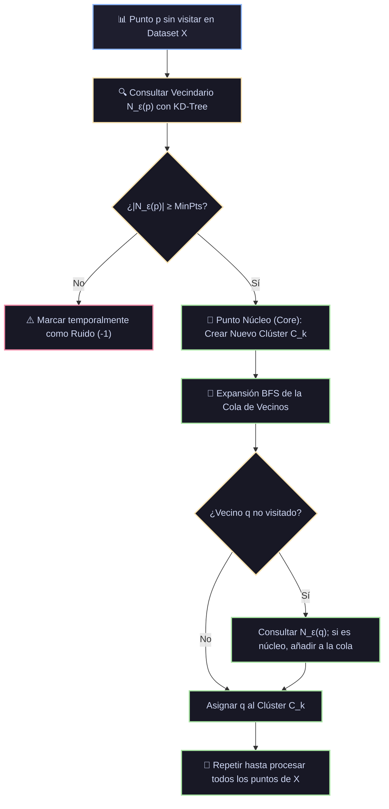

# Ficha Técnica: DBSCAN (Density-Based Spatial Clustering)

## 1. Identificación y Referencias Seminales
- **Autores & Año**: Martin Ester, Hans-Peter Kriegel, Jörg Sander, Xiaowei Xu (1996). *A Density-Based Algorithm for Discovering Clusters in Large Spatial Databases with Noise*. *Proceedings of the 2nd International Conference on Knowledge Discovery and Data Mining (KDD-96)*, 226-231.
- **Reconocimiento**: Premio SIGKDD Test of Time Award 2014.

---

## 2. Formulación Matemática y Conceptos Topológicos de Densidad

### 2.1. Definiciones Fundamentales
Dado un espacio métrico $(X, d)$ y dos parámetros: radio de vecindad $\varepsilon > 0$ y mínimo de puntos $\text{MinPts} \in \mathbb{N}$:

1. **$\varepsilon$-Vecindario de un punto $p$**:
   $$N_\varepsilon(p) = \{q \in X \mid d(p, q) \le \varepsilon\}$$
2. **Punto Núcleo (Core Point)**:
   Un punto $p$ es núcleo si contiene al menos $\text{MinPts}$ en su vecindario:
   $$|N_\varepsilon(p)| \ge \text{MinPts}$$
3. **Directamente Alcanzable por Densidad (Directly Density-Reachable)**:
   Un punto $q$ es directamente alcanzable por densidad desde $p$ si:
   $$q \in N_\varepsilon(p) \quad \text{y} \quad p \text{ es un punto núcleo}.$$
4. **Alcanzable por Densidad (Density-Reachable)**:
   Existe una cadena de puntos $p_1, p_2, \dots, p_n$ con $p_1 = p$ y $p_n = q$ tal que cada $p_{i+1}$ es directamente alcanzable por densidad desde $p_i$.
5. **Conectado por Densidad (Density-Connected)**:
   Dos puntos $p$ y $q$ están conectados por densidad si existe un punto intermedio $o$ tal que tanto $p$ como $q$ son alcanzables por densidad desde $o$.
6. **Definición de Clúster**:
   Un subconjunto no vacío $C \subseteq X$ que satisface:
   - *Maximalidad*: $\forall p, q$: si $p \in C$ y $q$ es alcanzable por densidad desde $p$, entonces $q \in C$.
   - *Conectividad*: $\forall p, q \in C$, $p$ está conectado por densidad con $q$.
7. **Ruido (Noise / Outliers)**:
   Cualquier punto que no pertenece a ningún clúster: $\text{Noise} = \{p \in X \mid \forall k: p \notin C_k\}$ (etiquetado convencionalmente como `-1`).

---

## 3. Descomposición Modular en Bloques

1. **Bloque 1: Indexador Espacial Métrico**
   - Construcción de KD-Tree o Ball-Tree para acelerar las consultas de vecindario $N_\varepsilon(p)$ de $\mathcal{O}(N^2)$ a $\mathcal{O}(N \log N)$.
2. **Bloque 2: Clasificador de Estados de Puntos**
   - Determina si cada punto es Núcleo (Core), Borde (Border) o Ruido (Noise).
3. **Bloque 3: Expansor de Componentes Conexas (BFS/DFS)**
   - Si un punto no visitado es Núcleo, inicializa un nuevo clúster $C_{id}$ y expande recursivamente todos los puntos alcanzables por densidad utilizando una cola.
4. **Bloque 4: Asignador de Puntos Borde y Aislador de Ruido**
   - Asigna puntos frontera al clúster del núcleo que los alcanzó; los no alcanzados quedan marcados como `-1`.

---

## 4. Diagrama de Flujo Modular (Mermaid)



---

## 5. Hiperparámetros Críticos y Modos de Falla

| Hiperparámetro | Rol Matemático | Rango Típico | Modo de Falla / Efecto Extremo |
|---|---|---|---|
| `eps` ($\varepsilon$) | Radio métrico de vecindad | Específico del dataset | Si $\varepsilon$ es muy pequeño, casi todo se clasifica como ruido; si es muy grande, todos los clústeres se fusionan en uno solo. |
| `min_samples` | Umbral mínimo de densidad | $[4, 2 \times D]$ | Regla heurística común: $\text{min\_samples} \ge 2 \times D$. |
| Densidades Variables | Limitación inherente de DBSCAN | Fenómeno estructural | No puede separar eficazmente clústeres contiguos que tengan densidades muy dispares (para eso se prefiere HDBSCAN). |

---

## 6. Snippet de Referencia en Python

```python
from sklearn.cluster import DBSCAN
from sklearn.preprocessing import StandardScaler

X_scaled = StandardScaler().fit_transform(X)
db = DBSCAN(eps=0.4, min_samples=5, metric='euclidean', n_jobs=-1)
etiquetas = db.fit_predict(X_scaled)
n_clusters = len(set(etiquetas)) - (1 if -1 in etiquetas else 0)
n_ruido = list(etiquetas).count(-1)
print(f"Clústeres descubiertos: {n_clusters}, Muestras de ruido: {n_ruido}")
```
