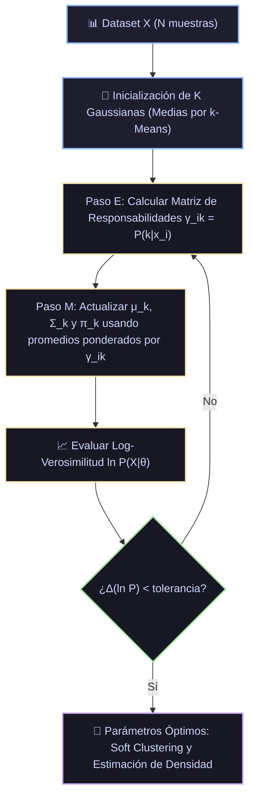

# Ficha Técnica: Modelos de Mezcla de Gaussianas (GMM) y Algoritmo EM

## 1. Identificación y Referencias Seminales
- **Algoritmo EM (Expectation-Maximization)**: Arthur P. Dempster, Nan M. Laird, Donald B. Rubin (1977). *Maximum Likelihood from Incomplete Data via the EM Algorithm*. *Journal of the Royal Statistical Society: Series B*, 39(1), 1-38.
- **Formulación Probabilística**: C. M. Bishop (2006). *Pattern Recognition and Machine Learning*. Springer (Capítulo 9: Mixture Models and EM).

---

## 2. Formulación Matemática y Algoritmo EM

### 2.1. Modelo Generativo de Densidad Mixta
La distribución de probabilidad de una muestra $x \in \mathbb{R}^D$ se modela como una combinación lineal de $K$ densidades gaussianas multivariantes:
$$p(x) = \sum_{k=1}^K \pi_k \mathcal{N}(x \mid \mu_k, \Sigma_k)$$
sujeto a las restricciones de probabilidad:
$$0 \le \pi_k \le 1, \quad \sum_{k=1}^K \pi_k = 1$$
donde cada componente gaussiana es:
$$\mathcal{N}(x \mid \mu_k, \Sigma_k) = \frac{1}{(2\pi)^{D/2} |\Sigma_k|^{1/2}} \exp\left( -\frac{1}{2} (x - \mu_k)^T \Sigma_k^{-1} (x - \mu_k) \right)$$

### 2.2. Log-Verosimilitud Incompleta
$$\ln p(X \mid \pi, \mu, \Sigma) = \sum_{i=1}^N \ln \left( \sum_{k=1}^K \pi_k \mathcal{N}(x_i \mid \mu_k, \Sigma_k) \right)$$
La presencia de la suma dentro del logaritmo impide una solución analítica cerrada y motiva el algoritmo EM con variables latentes de asignación $z_{ik} \in \{0, 1\}$.

### 2.3. Bucle Expectation-Maximization (EM)
- **Paso E (Expectation)**: Evaluar las **responsabilidades** condicionales $\gamma_{ik}$ (probabilidad a posteriori de que la muestra $x_i$ haya sido generada por el componente $k$):
  $$\gamma_{ik} = P(z_{ik} = 1 \mid x_i) = \frac{\pi_k \mathcal{N}(x_i \mid \mu_k, \Sigma_k)}{\sum_{j=1}^K \pi_j \mathcal{N}(x_i \mid \mu_j, \Sigma_j)}$$

- **Paso M (Maximization)**: Re-estimar analíticamente los parámetros utilizando las responsabilidades como pesos:
  $$N_k = \sum_{i=1}^N \gamma_{ik}$$
  $$\mu_k^{\text{new}} = \frac{1}{N_k} \sum_{i=1}^N \gamma_{ik} x_i$$
  $$\Sigma_k^{\text{new}} = \frac{1}{N_k} \sum_{i=1}^N \gamma_{ik} (x_i - \mu_k^{\text{new}})(x_i - \mu_k^{\text{new}})^T$$
  $$\pi_k^{\text{new}} = \frac{N_k}{N}$$

El algoritmo EM garantiza matemáticamente el **aumento monótono** de la función de verosimilitud en cada iteración hasta converger a un óptimo local.

---

## 3. Descomposición Modular en Bloques

1. **Bloque 1: Inicializador (k-Means Seeding)**
   - Inicializa las medias $\mu_k$ mediante centros de k-Means y matrices de covarianza empíricas.
2. **Bloque 2: Evaluador Gaussiano Vectorizado**
   - Calcula las densidades de probabilidad y distancias de Mahalanobis $(x - \mu)^T \Sigma^{-1} (x - \mu)$ mediante descomposición de Cholesky de $\Sigma_k$.
3. **Bloque 3: Paso E (Cálculo de Responsabilidades γ)**
   - Matriz suave (soft assignment) de tamaño $(N, K)$.
4. **Bloque 4: Paso M (Actualización de Momentos Ponderados)**
   - Recálculo de medias $\mu$, covarianzas $\Sigma$ y coeficientes de mezcla $\pi$.
5. **Bloque 5: Criterios de Selección de Modelo (BIC y AIC)**
   $$\text{BIC} = -2 \ln L + p \ln(N), \quad \text{AIC} = -2 \ln L + 2p$$
   donde $p$ es el número de parámetros libres, permitiendo elegir el $K$ óptimo objetivamente.

---

## 4. Diagrama de Flujo Modular (Mermaid)



---

## 5. Hiperparámetros Críticos y Modos de Falla

| Hiperparámetro | Rol Matemático | Opciones / Rango | Modo de Falla / Efecto Extremo |
|---|---|---|---|
| `covariance_type` | Restricción geométrica en $\Sigma_k$ | `full`, `tied`, `diag`, `spherical` | `full` tiene $\mathcal{O}(D^2)$ parámetros por componente; si $N$ es pequeño, la matriz se vuelve singular. |
| `reg_covar` | Regularización añadida a la diagonal de $\Sigma_k$ | $[10^{-6}, 10^{-2}]$ | Previene colapso de varianza a cero cuando una gaussiana colapsa sobre una única muestra aislada. |

---

## 6. Snippet de Referencia en Python

```python
from sklearn.mixture import GaussianMixture

gmm = GaussianMixture(
    n_components=3,
    covariance_type='full',
    max_iter=200,
    random_state=42
)
gmm.fit(X)
probabilidades = gmm.predict_proba(X)
```

