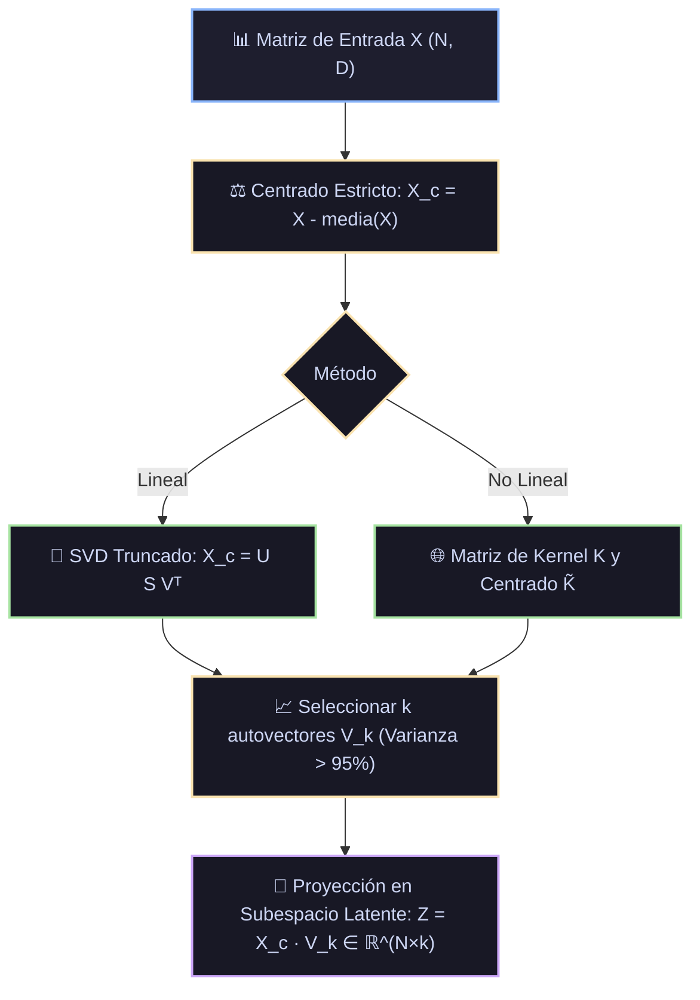

# Ficha Técnica: PCA (Principal Component Analysis) y Kernel PCA

## 1. Identificación y Referencias Seminales
- **PCA**: Karl Pearson (1901). *On lines and planes of closest fit to systems of points in space*. *Philosophical Magazine*, 2(11), 559-572. Harold Hotelling (1933). *Analysis of a complex of statistical variables into principal components*. *Journal of Educational Psychology*, 24(6), 417-441.
- **Kernel PCA**: Bernhard Schölkopf, Alexander Smola, Klaus-Robert Müller (1998). *Nonlinear Component Analysis as a Kernel Eigenvalue Problem*. *Neural Computation*, 10(5), 1299-1319.

---

## 2. Formulación Matemática

### 2.1. Maximización de Varianza y Descomposición Espectral
Dado un conjunto de datos centrado $X \in \mathbb{R}^{N \times D}$ ($\sum_{i=1}^N x_i = 0$):
Buscamos una dirección unitaria $v_1 \in \mathbb{R}^D$ ($\|v_1\|=1$) que maximice la varianza de la proyección $z_1 = X v_1$:
$$\max_{\|v_1\|=1} \text{Var}(X v_1) = \max_{\|v_1\|=1} \frac{1}{N-1} v_1^T X^T X v_1 = \max_{\|v_1\|=1} v_1^T \Sigma v_1$$
Formulando el Lagrangiano $\mathcal{L}(v_1, \lambda) = v_1^T \Sigma v_1 - \lambda (v_1^T v_1 - 1)$ y derivando:
$$\Sigma v_1 = \lambda_1 v_1$$
Los componentes principales son exactamente los **autovectores** de la matriz de covarianza muestral $\Sigma$, y los **autovalores** $\lambda_j$ cuantifican la cantidad exacta de varianza explicada por cada eje.

### 2.2. Equivalencia con SVD (Singular Value Decomposition)
En lugar de calcular explícitamente $X^T X$, los algoritmos modernos aplican SVD directo sobre la matriz centrada $X$:
$$X = U S V^T$$
- Las columnas de $V \in \mathbb{R}^{D \times D}$ son los autovectores (componentes principales).
- Los valores singulares $s_j$ se relacionan con los autovalores por $\lambda_j = \frac{s_j^2}{N-1}$.
- La proyección de baja dimensión $k$ es inmediata: $Z = X V_k = U_k S_k$.

### 2.3. Kernel PCA (No Lineal)
Mapea los datos a un espacio de Hilbert de alta dimensión $\Phi(x)$ y diagonaliza la matriz de Kernel centrada:
$$\tilde{K} = K - 1_N K - K 1_N + 1_N K 1_N, \quad \text{donde } (1_N)_{ij} = 1/N$$
Resolviendo el problema de autovalores: $\tilde{K} \alpha_k = \lambda_k \alpha_k$.

---

## 3. Descomposición Modular en Bloques

1. **Bloque 1: Centrador en Media Cero**
   - Resta $\mu = \frac{1}{N} \sum x_i$. Obligatorio: sin centrado, el primer componente apunta hacia la media y no hacia la máxima dispersión.
2. **Bloque 2: Motor SVD / Descomposición Espectral**
   - Truncado a $k$ componentes dominantes.
3. **Bloque 3: Analizador de Ratio de Varianza Explicada**
   $$\text{EVR}_j = \frac{\lambda_j}{\sum_{i=1}^D \lambda_i}$$
   Determina el número de componentes necesarios para retener el 95% o 99% de la información.
4. **Bloque 4: Proyector Ortogonal y Reconstructor Inverso**
   - Proyección: $Z = X V_k$.
   - Reconstrucción: $\hat{X} = Z V_k^T + \mu$. El residuo $\|X - \hat{X}\|_F^2$ cuantifica el error de compresión.

---

## 4. Diagrama de Flujo Modular (Mermaid)



---

## 5. Hiperparámetros Críticos y Modos de Falla

| Hiperparámetro | Rol Matemático | Rango Típico | Modo de Falla / Efecto Extremo |
|---|---|---|---|
| `n_components` | Dimensión del subespacio destino | $[2, D-1]$ o $[0.8, 0.99]$ (varianza) | Retener muy pocos componentes produce pérdida de señal predictiva. |
| `whiten` | Escala los componentes a varianza unitaria | Booleano | Si `whiten=True`, divide por $\sqrt{\lambda_j}$, útil antes de clasificadores sensibles a escala. |

---

## 6. Snippet de Referencia en Python

```python
from sklearn.decomposition import PCA
from sklearn.preprocessing import StandardScaler
from sklearn.pipeline import make_pipeline

pca_pipe = make_pipeline(
    StandardScaler(),
    PCA(n_components=0.95, random_state=42)
)
Z = pca_pipe.fit_transform(X)
print(f"Dimensiones reducidas: de {X.shape[1]} a {Z.shape[1]} componentes.")
```
