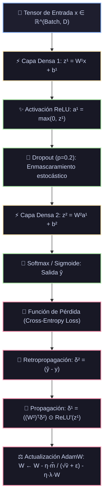

# Ficha Técnica: Perceptrón Multicapa (MLP) y Backpropagation

## 1. Identificación y Referencias Seminales
- **Retropropagación del Error (Backpropagation)**: David E. Rumelhart, Geoffrey E. Hinton, Ronald J. Williams (1986). *Learning representations by back-propagating errors*. *Nature*, 323, 533-536.
- **Teorema de Aproximación Universal**: George Cybenko (1989). *Approximation by superpositions of a sigmoidal function*. Kurt Hornik (1991). *Approximation capabilities of multilayer feedforward networks*.

---

## 2. Formulación Matemática y Propagación del Error

### 2.1. Propagación Hacia Adelante (Forward Pass)
Para una red de $L$ capas, la activación de la capa $l \in \{1, \dots, L\}$ es:
$$z^{[l]} = W^{[l]} a^{[l-1]} + b^{[l]}, \quad a^{[l]} = \phi^{[l]}(z^{[l]})$$
donde $a^{[0]} = x$ es la entrada, $W^{[l]} \in \mathbb{R}^{n_l \times n_{l-1}}$ es la matriz de pesos y $\phi^{[l]}$ es la función de activación no lineal.

### 2.2. Funciones de Activación Modernas
- **ReLU**: $\phi(z) = \max(0, z), \quad \phi'(z) = \mathbb{I}(z > 0)$
- **GELU (Gaussian Error Linear Unit)**: $\phi(z) = z \Phi(z) \approx 0.5z(1 + \tanh(\sqrt{2/\pi}(z + 0.044715 z^3)))$
- **Softmax (Capa Terminal $L$)**: $a_i^{[L]} = \frac{e^{z_i^{[L]}}}{\sum_k e^{z_k^{[L]}}}$

### 2.3. Propagación Hacia Atrás (Backward Pass / Regla de la Cadena)
Sea $\mathcal{L}$ la función de pérdida escalar. Definimos el término de error en la capa $l$:
$$\delta^{[l]} \equiv \frac{\partial \mathcal{L}}{\partial z^{[l]}} \in \mathbb{R}^{n_l}$$

1. **Error en la Capa de Salida $L$ (con Entropía Cruzada)**:
   $$\delta^{[L]} = a^{[L]} - y$$
2. **Propagación Retrógrada de Errores**:
   $$\delta^{[l]} = \left( (W^{[l+1]})^T \delta^{[l+1]} \right) \odot \phi'(z^{[l]})$$
3. **Gradientes de Pesos y Sesgos**:
   $$\frac{\partial \mathcal{L}}{\partial W^{[l]}} = \delta^{[l]} (a^{[l-1]})^T, \quad \frac{\partial \mathcal{L}}{\partial b^{[l]}} = \delta^{[l]}$$

---

## 3. Descomposición Modular en Bloques

1. **Bloque 1: Inicializador de Pesos (He / Xavier)**
   - He/Kaiming Normal ($W \sim \mathcal{N}(0, 2/n_{in})$) esencial para evitar explosión o desvanecimiento inicial de activaciones con ReLU.
2. **Bloque 2: Capa Lineal Completamente Conectada (Dense / Linear)**
   - Multiplicación matricial acelerada por BLAS / cuBLAS.
3. **Bloque 3: Módulo de Activación No Lineal**
   - Transforma representaciones afines en funciones no lineales aproximadoras.
4. **Bloque 4: Regularizadores Estocásticos (Dropout y BatchNorm)**
   - Dropout con tasa $p$: enmascaramiento bernoulli en entrenamiento escalado por $\frac{1}{1-p}$ (Inverted Dropout).
5. **Bloque 5: Optimizador Adaptativo (AdamW)**
   - Desacopla la regularización de pesos (Weight Decay) del momento adaptativo de primer y segundo orden.

---

## 4. Diagrama de Flujo Modular (Mermaid)



---

## 5. Hiperparámetros Críticos y Modos de Falla

| Hiperparámetro | Rol Matemático | Rango Típico | Modo de Falla / Efecto Extremo |
|---|---|---|---|
| `learning_rate` ($\eta$) | Tamaño de paso del gradiente | $[10^{-4}, 10^{-2}]$ | Si es muy alto $\to$ divergencia (`NaN`); si es muy bajo $\to$ estancamiento. |
| `weight_decay` ($\lambda$) | Regularización $L_2$ desacoplada | $[10^{-5}, 10^{-1}]$ | Previene sobreajuste penalizando la norma $\|\Theta\|_2^2$. |
| `Dying ReLU` | Neuronas con activación $z \le 0$ permanente | Fenómeno | Gradiente local se anula a 0; usar LeakyReLU o GELU si ocurre. |

---

## 6. Snippet de Referencia en Python (PyTorch)

```python
import torch
import torch.nn as nn

class MLP(nn.Module):
    def __init__(self, in_features, hidden_dim, num_classes):
        super().__init__()
        self.red = nn.Sequential(
            nn.Linear(in_features, hidden_dim),
            nn.BatchNorm1d(hidden_dim),
            nn.ReLU(),
            nn.Dropout(0.2),
            nn.Linear(hidden_dim, num_classes)
        )
    def forward(self, x):
        return self.red(x)
```

