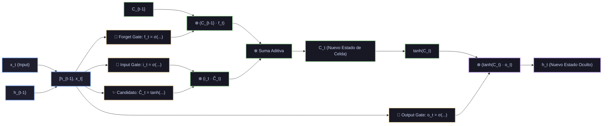

# Ficha Técnica: Redes Recurrentes (RNN, LSTM y GRU)

## 1. Identificación y Referencias Seminales
- **LSTM (Long Short-Term Memory)**: Sepp Hochreiter y Jürgen Schmidhuber (1997). *Long Short-Term Memory*. *Neural Computation*, 9(8), 1735-1780.
- **GRU (Gated Recurrent Unit)**: Kyunghyun Cho, Bart van Merriënboer, Caglar Gulcehre, Dzmitry Bahdanau, Fethi Bougares, Holger Schwenk, Yoshua Bengio (2014). *Learning Phrase Representations using RNN Encoder-Decoder for Statistical Machine Translation*. arXiv:1406.1078.

---

## 2. Formulación Matemática y Mecanismo de Compuertas

### 2.1. El Problema del Desvanecimiento del Gradiente en RNN Simples
En una RNN vainilla: $h_t = \tanh(W_h h_{t-1} + W_x x_t + b)$. Al aplicar BPTT (Backpropagation Through Time):
$$\frac{\partial \mathcal{L}}{\partial h_1} = \frac{\partial \mathcal{L}}{\partial h_T} \prod_{t=2}^T \frac{\partial h_t}{\partial h_{t-1}} = \frac{\partial \mathcal{L}}{\partial h_T} \prod_{t=2}^T \text{diag}(1 - h_t^2) W_h^T$$
El producto repetido de matrices causa que el gradiente crezca exponencialmente si el radio espectral de $W_h > 1$ (*exploding gradient*) o decaiga exponencialmente a cero si $< 1$ (*vanishing gradient*), impidiendo aprender dependencias a largo plazo.

### 2.2. Ecuaciones Canónicas de LSTM
LSTM desacopla la memoria a largo plazo (el estado de celda $C_t$) del estado oculto a corto plazo ($h_t$):

1. **Compuerta de Olvido ($f_t$)**: Determina qué información descartar del estado anterior:
   $$f_t = \sigma\left( W_f \cdot [h_{t-1}, x_t] + b_f \right)$$
2. **Compuerta de Entrada ($i_t$) y Candidato ($\tilde{C}_t$)**: Determina qué valores nuevos escribir:
   $$i_t = \sigma\left( W_i \cdot [h_{t-1}, x_t] + b_i \right)$$
   $$\tilde{C}_t = \tanh\left( W_c \cdot [h_{t-1}, x_t] + b_c \right)$$
3. **Actualización Aditiva del Estado de Celda ($C_t$)**:
   $$C_t = f_t \odot C_{t-1} + i_t \odot \tilde{C}_t$$
   La adición previene la anulación multiplicativa del gradiente a través del tiempo: $\frac{\partial C_t}{\partial C_{t-1}} \approx f_t$.
4. **Compuerta de Salida ($o_t$) y Estado Oculto ($h_t$)**:
   $$o_t = \sigma\left( W_o \cdot [h_{t-1}, x_t] + b_o \right)$$
   $$h_t = o_t \odot \tanh(C_t)$$

### 2.3. Ecuaciones Simplificadas de GRU
GRU fusiona $C_t$ y $h_t$ en un único estado, utilizando solo 2 compuertas:
- **Compuerta de Reseteo ($r_t$)**: $r_t = \sigma(W_r \cdot [h_{t-1}, x_t])$
- **Compuerta de Actualización ($z_t$)**: $z_t = \sigma(W_z \cdot [h_{t-1}, x_t])$
- **Estado Candidato**: $\tilde{h}_t = \tanh(W \cdot [r_t \odot h_{t-1}, x_t])$
- **Nuevo Estado Oculto**: $h_t = (1 - z_t) \odot h_{t-1} + z_t \odot \tilde{h}_t$

---

## 3. Descomposición Modular en Bloques

1. **Bloque 1: Concatenador de Entrada y Estado Oculto**
   - Combina $x_t \in \mathbb{R}^{d_{in}}$ y $h_{t-1} \in \mathbb{R}^{d_{hid}}$ en un vector conjunto.
2. **Bloque 2: Banco de Compuertas Sigmoides**
   - Transforma las señales en valores continuos de filtrado entre 0 (bloqueo total) y 1 (paso libre).
3. **Bloque 3: Autopista de Estado de Celda C_t**
   - Acumulador puramente aditivo donde la información viaja sin atenuación exponencial.
4. **Bloque 4: Generador de Salida Recurrente h_t**
   - Pasa el estado de celda por $\tanh$ modulado por la compuerta de salida $o_t$.

---

## 4. Diagrama de Flujo Modular (Mermaid)



---

## 5. Hiperparámetros Críticos y Modos de Falla

| Hiperparámetro | Rol Matemático | Rango Típico | Modo de Falla / Efecto Extremo |
|---|---|---|---|
| `hidden_size` | Dimensión del vector de memoria $h_t$ y $C_t$ | $[64, 512]$ | Tamaños muy grandes en secuencias largas saturan la memoria VRAM rápidamente. |
| `forget_bias` | Sesgo inicial $b_f$ de la compuerta de olvido | Inicializar en $1.0$ | Clave histórica (Jozefowicz 2015): fijar $b_f = 1$ fuerza $f_t \approx 1$ al inicio, recordando todo por defecto. |
| `clip_grad_norm` | Truncamiento de la norma del gradiente | $[0.5, 5.0]$ | Indispensable en BPTT para evitar la explosión numérica del gradiente. |

---

## 6. Snippet de Referencia en Python (PyTorch)

```python
import torch
import torch.nn as nn

class LSTMClassifier(nn.Module):
    def __init__(self, vocab_size, embed_dim, hidden_dim, num_classes):
        super().__init__()
        self.embedding = nn.Embedding(vocab_size, embed_dim)
        self.lstm = nn.LSTM(embed_dim, hidden_dim, batch_first=True, num_layers=2, dropout=0.2)
        self.fc = nn.Linear(hidden_dim, num_classes)

    def forward(self, x):
        emb = self.embedding(x)
        out, (hn, cn) = self.lstm(emb)
        return self.fc(hn[-1])
```
