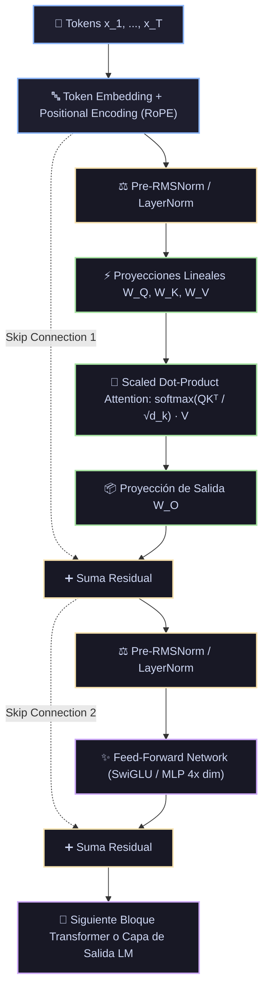

# Ficha Técnica: Transformers y Mecanismos de Autoatención

## 1. Identificación y Referencias Seminales
- **Paper Seminal**: Ashish Vaswani, Noam Shazeer, Niki Parmar, Jakob Uszkoreit, Llion Jones, Aidan N. Gomez, Łukasz Kaiser, Illia Polosukhin (2017). *Attention Is All You Need*. *Advances in Neural Information Processing Systems (NeurIPS 30)*, 5998-6008. arXiv:1706.03762.
- **Evolución**: BERT (Devlin et al. 2018), GPT (Radford et al. 2018/2019), LLaMA (Touvron et al. 2023), Vision Transformer (Dosovitskiy et al. 2020).

---

## 2. Formulación Matemática y Arquitectura de Autoatención

### 2.1. Scaled Dot-Product Attention (Atención de Producto Escalar Escalado)
Dadas matrices de consultas ($Q \in \mathbb{R}^{n \times d_k}$), claves ($K \in \mathbb{R}^{m \times d_k}$) y valores ($V \in \mathbb{R}^{m \times d_v}$):
$$\text{Attention}(Q, K, V) = \text{softmax}\left( \frac{Q K^T}{\sqrt{d_k}} + M \right) V$$
- **Factor de Escala $\frac{1}{\sqrt{d_k}}$**: Para dimensiones $d_k$ grandes, el producto escalar crece en magnitud, empujando la función softmax hacia regiones con gradientes extremadamente pequeños. El factor $\sqrt{d_k}$ estabiliza la varianza a 1.
- **Máscara Causal $M$**: En decodificadores autorregresivos, $M_{ij} = -\infty$ para $j > i$, impidiendo que la posición $i$ atienda a tokens futuros.

### 2.2. Multi-Head Attention (Atención Multicabezal)
Permite al modelo atender conjuntamente a información procedente de diferentes subespacios de representación en diferentes posiciones:
$$\text{MultiHead}(Q, K, V) = \text{Concat}(\text{head}_1, \dots, \text{head}_h) W^O$$
$$\text{head}_i = \text{Attention}(Q W_i^Q, K W_i^K, V W_i^V)$$
donde las matrices de proyección aprendibles son $W_i^Q \in \mathbb{R}^{d_{\text{model}} \times d_k}$, $W_i^K \in \mathbb{R}^{d_{\text{model}} \times d_k}$, $W_i^V \in \mathbb{R}^{d_{\text{model}} \times d_v}$ y $W^O \in \mathbb{R}^{h d_v \times d_{\text{model}}}$.

### 2.3. Codificación Posicional (Positional Encoding)
Dado que la autoatención es equivariante ante permutaciones de tokens, la información de orden debe inyectarse explícitamente:
- **Sinusoidal (Vaswani 2017)**:
  $$PE_{(pos, 2i)} = \sin\left(\frac{pos}{10000^{2i/d_{\text{model}}}}\right), \quad PE_{(pos, 2i+1)} = \cos\left(\frac{pos}{10000^{2i/d_{\text{model}}}}\right)$$
- **RoPE (Rotary Position Embedding - Su et al. 2021)**: Codifica la distancia relativa multiplicando por una matriz de rotación ortogonal bidimensional: $\langle R_{\Theta, m}^d q, R_{\Theta, n}^d k \rangle = g(q, k, m-n)$.

### 2.4. Red Feed-Forward Posicional (FFN / SwiGLU)
$$\text{FFN}(x) = \max(0, x W_1 + b_1) W_2 + b_2$$
En arquitecturas modernas (LLaMA, Mistral) se utiliza **SwiGLU**:
$$\text{SwiGLU}(x) = \left( \text{swish}(x W_{\text{gate}}) \odot x W_{\text{up}} \right) W_{\text{down}}$$

---

## 3. Descomposición Modular en Bloques

1. **Bloque 1: Tokenizer & Embedding con Positional Encoding**
   - Mapea IDs de vocabulario a vectores en $\mathbb{R}^{d_{\text{model}}}$ y suma/aplica codificación de posición (RoPE).
2. **Bloque 2: Proyecciones Lineales Q, K, V**
   - Transforma el tensor de entrada en consultas, claves y valores separados por cabezales.
3. **Bloque 3: Matriz de Atención Normalizada y Multi-Head Merge**
   - Computa $\text{softmax}(Q K^T / \sqrt{d_k}) V$ en paralelo para los $h$ cabezales y proyecta por $W^O$.
4. **Bloque 4: Pre-LayerNorm / RMSNorm y Conexión Residual**
   - Aplica $x \leftarrow x + \text{MHA}(\text{RMSNorm}(x))$ garantizando un flujo estable del gradiente en modelos de cientos de capas.
5. **Bloque 5: Bloque MLP / Feed-Forward con Conexión Residual**
   - Expansión de dimensiones intermedias (típicamente $4 \times d_{\text{model}}$ o $\frac{8}{3} d_{\text{model}}$ en SwiGLU) y contracción de nuevo a $d_{\text{model}}$.

---

## 4. Diagrama de Flujo Modular (Mermaid)



---

## 5. Hiperparámetros Críticos y Modos de Falla

| Hiperparámetro | Rol Matemático | Rango Típico | Modo de Falla / Efecto Extremo |
|---|---|---|---|
| `d_model` | Dimensión oculta del canal | $[512, 4096]$ | Determina la capacidad representacional del modelo. |
| `n_heads` ($h$) | Número de cabezales de atención | $[8, 64]$ | La dimensión por cabezal $d_k = d_{\text{model}} / h$ debe ser exacta (ej. 64 o 128). |
| Complejidad Cuadrática $\mathcal{O}(T^2)$ | Coste de computación de la matriz $Q K^T$ | Escala con longitud de contexto | Secuencias muy largas ($T > 8192$) agotan la memoria VRAM; requiere FlashAttention o GQA (Grouped-Query Attention). |

---

## 6. Snippet de Referencia en Python (PyTorch)

```python
import torch
import torch.nn as nn
import math

class SelfAttentionBlock(nn.Module):
    def __init__(self, d_model, n_heads):
        super().__init__()
        self.n_heads = n_heads
        self.d_k = d_model // n_heads
        self.qkv = nn.Linear(d_model, d_model * 3, bias=False)
        self.out_proj = nn.Linear(d_model, d_model, bias=False)

    def forward(self, x, mask=None):
        B, T, C = x.shape
        q, k, v = self.qkv(x).chunk(3, dim=-1)
        q = q.view(B, T, self.n_heads, self.d_k).transpose(1, 2)
        k = k.view(B, T, self.n_heads, self.d_k).transpose(1, 2)
        v = v.view(B, T, self.n_heads, self.d_k).transpose(1, 2)

        # PyTorch 2.0+ FlashAttention optimizado
        out = nn.functional.scaled_dot_product_attention(q, k, v, attn_mask=mask, is_causal=(mask is None))
        out = out.transpose(1, 2).contiguous().view(B, T, C)
        return self.out_proj(out)
```
