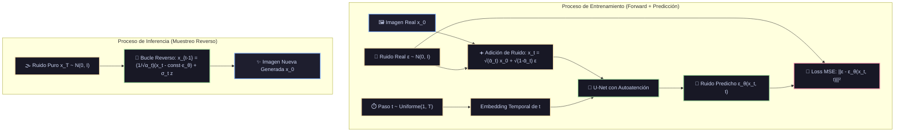

# Ficha Técnica: Modelos Probabilísticos de Difusión (DDPM)

## 1. Identificación y Referencias Seminales
- **Paper Seminal**: Jonathan Ho, Ajay Jain, Pieter Abbeel (2020). *Denoising Diffusion Probabilistic Models*. *Advances in Neural Information Processing Systems (NeurIPS 33)*, 6840-6851. arXiv:2006.11239.
- **Precursor en Física Estadística**: Jascha Sohl-Dickstein, Eric Weiss, Niru Maheswaranathan, Surya Ganguli (2015). *Deep Unsupervised Learning using Nonequilibrium Thermodynamics*. *ICML 2015*.
- **Avances Modernos**: Score-Based Generative Modeling (Song et al. 2020), Latent Diffusion / Stable Diffusion (Rombach et al. 2022).

🔬 **Análisis exhaustivo de papers y derivaciones:** [Ver Monografía Detallada de Papers](../analisis_papers/21_modelos_difusion_ddpm.md)

---

## 2. Formulación Matemática: Procesos Forward y Reverse

### 2.1. Proceso Forward (Adición de Ruido Gaussiano)
Se define una cadena de Markov que transforma progresivamente una imagen limpia $x_0 \sim q(x_0)$ en ruido blanco gaussiano puro $x_T \sim \mathcal{N}(0, I)$ en $T \approx 1000$ pasos:
$$q(x_t \mid x_{t-1}) = \mathcal{N}\left(x_t; \sqrt{1 - \beta_t} x_{t-1}, \beta_t I\right)$$
donde $\beta_1, \dots, \beta_T$ es un cronograma de varianzas predefinido ($10^{-4} \to 0.02$).

Definiendo $\alpha_t = 1 - \beta_t$ y $\bar{\alpha}_t = \prod_{s=1}^t \alpha_s$, el truco de integración de variables gaussianas permite muestrear $x_t$ **directamente en un solo paso** sin simular los pasos intermedios:
$$q(x_t \mid x_0) = \mathcal{N}\left(x_t; \sqrt{\bar{\alpha}_t} x_0, (1 - \bar{\alpha}_t) I\right)$$
$$x_t = \sqrt{\bar{\alpha}_t} x_0 + \sqrt{1 - \bar{\alpha}_t} \epsilon, \quad \text{donde } \epsilon \sim \mathcal{N}(0, I)$$

### 2.2. Proceso Reverse (Eliminación Iterativa de Ruido)
La distribución condicional inversa $q(x_{t-1} \mid x_t)$ es intratable directamente, pero se aproxima mediante una red neuronal parametrizada por $\theta$:
$$p_\theta(x_{t-1} \mid x_t) = \mathcal{N}\left(x_{t-1}; \mu_\theta(x_t, t), \sigma_t^2 I\right)$$

Ho et al. demostraron que predecir la media $\mu_\theta$ equivale exactamente a entrenar una red neuronal $\epsilon_\theta(x_t, t)$ para **predecir el ruido $\epsilon$ que fue inyectado**:
$$\mu_\theta(x_t, t) = \frac{1}{\sqrt{\alpha_t}} \left( x_t - \frac{\beta_t}{\sqrt{1 - \bar{\alpha}_t}} \epsilon_\theta(x_t, t) \right)$$

### 2.3. Función de Pérdida Simplificada (L_simple)
$$\mathcal{L}_{\text{simple}}(\theta) = \mathbb{E}_{t \sim [1, T], x_0, \epsilon \sim \mathcal{N}(0, I)} \left[ \| \epsilon - \epsilon_\theta\left(\sqrt{\bar{\alpha}_t} x_0 + \sqrt{1 - \bar{\alpha}_t} \epsilon, t\right) \|^2 \right]$$
Un simple error cuadrático medio (MSE) entre el ruido real $\epsilon$ y el ruido predicho por la red $\epsilon_\theta$.

---

## 3. Descomposición Modular en Bloques

1. **Bloque 1: Noise Scheduler (Planificador de Varianzas β_t)**
   - Cronograma lineal o cosenoidal que calcula $\alpha_t$ y $\bar{\alpha}_t$ acumulados.
2. **Bloque 2: Inyector Forward Jump**
   - Agrega ruido sintético ponderado por $\sqrt{\bar{\alpha}_t}$ a cualquier muestra $x_0$ para un instante $t \in [1, T]$.
3. **Bloque 3: Time-Step Positional Embedding**
   - Codificación sinusoidal del paso temporal $t$ inyectada en cada capa residual de la red.
4. **Bloque 4: Red Predictora de Ruido U-Net**
   - Arquitectura con codificador (downsampling con convoluciones y autoatención), cuello de botella (bottleneck) y decodificador (upsampling con skip connections).
5. **Bloque 5: Muestreador Generativo Inverso (Reverse Denoising Loop)**
   - Bucle iterativo desde $T$ hasta $1$ que resta gradualmente el ruido estimado y añade ruido estocástico $\sigma_t z$.

---

## 4. Diagrama de Flujo Modular (Mermaid)



---

## 5. Hiperparámetros Críticos y Modos de Falla

| Hiperparámetro | Rol Matemático | Rango Típico | Modo de Falla / Efecto Extremo |
|---|---|---|---|
| `T` (timesteps) | Pasos de difusión en la cadena de Markov | $[1000, 2000]$ (entrenamiento) | Si $T$ es bajo, la distribución final no es gaussiana pura; samplers acelerados (DDIM, DPMSolver) permiten inferencia en solo $20-50$ pasos. |
| `beta_schedule` | Cronograma de ruido | `linear` o `cosine` | El cronograma cosenoidal evita que la imagen se degrade demasiado rápido en los pasos iniciales. |
| Classifier-Free Guidance ($w$) | Fuerza de la condición textual | $[1.5, 7.5]$ | Guía la generación hacia el prompt condicional: $\tilde{\epsilon}_\theta = \epsilon_\theta(x_t) + w(\epsilon_\theta(x_t, c) - \epsilon_\theta(x_t))$. |

---

## 6. Snippet de Referencia en Python (PyTorch)

```python
import torch
import torch.nn.functional as F

def paso_entrenamiento_difusion(model, x_0, scheduler):
    batch_size = x_0.shape[0]
    t = torch.randint(0, scheduler.num_timesteps, (batch_size,), device=x_0.device)
    noise = torch.randn_like(x_0)
    
    # Forward jump en un solo paso
    x_t = scheduler.q_sample(x_0=x_0, t=t, noise=noise)
    
    # Predecir el ruido inyectado con la U-Net
    pred_noise = model(x_t, t)
    
    # Pérdida MSE simple
    loss = F.mse_loss(pred_noise, noise)
    return loss
```

