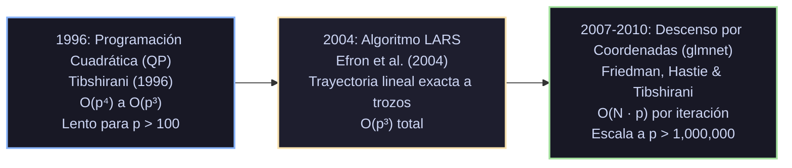

# Monografía de Análisis de Papers Seminales: Regresión Lineal y Regularizada
## OLS, Ridge (L2), Lasso (L1) y Elastic Net (L1 + L2)

**Autoría del compendio analítico:** Sistema de Razonamiento Científico de Prig IDE  
**Módulo correspondiente:** `docs/algoritmos_ml/01_regresion_lineal_y_regularizada.md`  
**Estado:** Documentación canónica en texto plano para repositorio público en GitHub  

---

## 1. Ficha Bibliográfica y Metadatos Formales de los Papers Seminales

| Algoritmo / Método | Publicación Seminal | Autores | Venue / Journal | Identificador Digital / Cita Canónica |
|---|---|---|---|---|
| **Mínimos Cuadrados Ordinarios (OLS)** | *Theoria Motus Corporum Coelestium in Sectionibus Conicis Solem Ambientium* (1809) | Carl Friedrich Gauss (y Adrien-Marie Legendre, 1805) | F. Perthes et I. H. Besser (Hamburgo) | Gauss (1809); Legendre (1805, *Nouvelles méthodes pour la détermination des orbites des comètes*) |
| **Regresión Ridge ($L_2$)** | *Ridge Regression: Biased Estimation for Nonorthogonal Problems* (1970) | Arthur E. Hoerl & Robert W. Kennard | *Technometrics*, Vol. 12, No. 1, pp. 55–67 | [DOI: 10.1080/00401706.1970.10488634](https://doi.org/10.1080/00401706.1970.10488634) |
| **El Operador Lasso ($L_1$)** | *Regression Shrinkage and Selection via the Lasso* (1996) | Robert Tibshirani | *Journal of the Royal Statistical Society: Series B (Methodological)*, Vol. 58, No. 1, pp. 267–288 | [JSTOR: 2346178](https://www.jstor.org/stable/2346178); CiteSeerX: 10.1.1.35.7572 |
| **The Elastic Net ($L_1 + L_2$)** | *Regularization and Variable Selection via the Elastic Net* (2005) | Hui Zou & Trevor Hastie | *Journal of the Royal Statistical Society: Series B (Statistical Methodology)*, Vol. 67, No. 2, pp. 301–320 | [DOI: 10.1111/j.1467-9868.2005.00503.x](https://doi.org/10.1111/j.1467-9868.2005.00503.x) |
| **Algoritmo LARS** | *Least Angle Regression* (2004) | Bradley Efron, Trevor Hastie, Iain Johnstone & Robert Tibshirani | *The Annals of Statistics*, Vol. 32, No. 2, pp. 407–499 | [DOI: 10.1214/009053604000000067](https://doi.org/10.1214/009053604000000067) |
| **Descenso por Coordenadas (`glmnet`)** | *Regularization Paths for Generalized Linear Models via Coordinate Descent* (2010) | Jerome Friedman, Trevor Hastie & Robert Tibshirani | *Journal of Statistical Software*, Vol. 33, No. 1, pp. 1–22 | [DOI: 10.18637/jss.v033.i01](https://doi.org/10.18637/jss.v033.i01) |

---

## 2. Génesis Histórica y Fundamentos Teóricos de OLS

### 2.1. El Modelo Lineal Estocástico y el Teorema de Gauss-Markov
El modelo canónico asume una relación funcional lineal entre una matriz de diseño $X \in \mathbb{R}^{N \times p}$ y una variable respuesta $y \in \mathbb{R}^N$:
$$y = X\beta + \epsilon, \quad \mathbb{E}[\epsilon] = 0, \quad \text{Var}(\epsilon) = \sigma^2 I_N$$

Bajo la función de pérdida de mínimos cuadrados:
$$\mathcal{L}_{\text{OLS}}(\beta) = \|y - X\beta\|_2^2 = (y - X\beta)^T (y - X\beta)$$
El gradiente analítico es:
$$\nabla_\beta \mathcal{L}_{\text{OLS}}(\beta) = -2X^T (y - X\beta) = -2X^T y + 2X^T X \beta = 0 \implies X^T X \beta = X^T y$$

Si la matriz $X$ tiene rango columna completo ($\text{rango}(X) = p \le N$), la matriz de Gram $X^T X$ es simétrica e invertible, produciendo el estimador insesgado clásico:
$$\hat{\beta}_{\text{OLS}} = (X^T X)^{-1} X^T y$$

**El Teorema de Gauss-Markov** demostró que $\hat{\beta}_{\text{OLS}}$ es el **BLUE** (*Best Linear Unbiased Estimator*): dentro de la clase de estimadores lineales e insesgados, OLS minimiza la varianza de cualquier combinación lineal de los parámetros:
$$\text{Cov}(\hat{\beta}_{\text{OLS}}) = \sigma^2 (X^T X)^{-1}$$

### 2.2. La Patología Espectral de la Multicolinealidad y la Alta Dimensionalidad
Sea la Descomposición en Valores Singulares (SVD) de la matriz centrada $X$:
$$X = U \Sigma V^T, \quad \Sigma = \text{diag}(\sigma_1, \sigma_2, \dots, \sigma_p), \quad \sigma_1 \ge \sigma_2 \ge \dots \ge \sigma_p \ge 0$$
La matriz de Gram se descompone como:
$$X^T X = V \Sigma^2 V^T = \sum_{j=1}^p \lambda_j v_j v_j^T, \quad \lambda_j = \sigma_j^2$$
La matriz de covarianza de $\hat{\beta}_{\text{OLS}}$ es:
$$\text{Cov}(\hat{\beta}_{\text{OLS}}) = \sigma^2 V \Sigma^{-2} V^T = \sigma^2 \sum_{j=1}^p \frac{1}{\lambda_j} v_j v_j^T$$
La traza de la covarianza (suma de varianzas de todos los coeficientes) resulta en:
$$\text{Tr}[\text{Cov}(\hat{\beta}_{\text{OLS}})] = \sigma^2 \sum_{j=1}^p \frac{1}{\lambda_j}$$

**Consecuencias críticas:**
1. **Multicolinealidad:** Si dos o más variables predictoras son linealmente dependientes o casi dependientes, el autovalor mínimo $\lambda_p \to 0^+$. En consecuencia, $\frac{1}{\lambda_p} \to \infty$. La varianza explota a infinito: pequeñas perturbaciones muestrales en $y$ provocan oscilaciones arbitrariamente grandes en los coeficientes $\hat{\beta}_j$, destruyendo la significancia estadística y arrojando signos opuestos a la realidad física del fenómeno.
2. **Escenario $p > N$:** Si el número de predictores supera el tamaño muestral, $\text{rango}(X^T X) \le N < p$. La matriz $X^T X$ tiene al menos $p - N$ autovalores estrictamente iguales a cero ($\lambda_{N+1} = \dots = \lambda_p = 0$). Es estrictamente singular, el inverso $(X^T X)^{-1}$ no existe y el sistema lineal admite infinitas soluciones de error cuadrático cero en entrenamiento, sufriendo sobreajuste severo (*catastrophic overfitting*).

---

## 3. Análisis Profundo de Hoerl & Kennard (1970) - Regresión Ridge

### 3.1. Motivación y Formulación
En su artículo de 1970 en *Technometrics*, Arthur E. Hoerl y Robert W. Kennard cuestionaron el dogma de la insesgadez estricta exigida por el teorema de Gauss-Markov. Argumentaron que un estimador con un sesgo pequeño pero con una reducción drástica de la varianza puede lograr un **Error Cuadrático Medio (MSE)** sustancialmente menor que el OLS.

Plantearon estabilizar la matriz de Gram añadiendo una perturbación escalar no negativa $k \ge 0$ a la diagonal:
$$\hat{\beta}^*(k) = (X^T X + k I_p)^{-1} X^T y$$
Esto corresponde al problema de optimización cuadrática regularizada:
$$\min_{\beta} \left\{ \|y - X\beta\|_2^2 + k \|\beta\|_2^2 \right\}$$

### 3.2. Demostración Matemática del Teorema de Existencia
Uno de los resultados teóricos más célebres de Hoerl & Kennard es el **Teorema de Existencia de Ridge**, que demuestra rigurosamente que siempre es posible encontrar un $k > 0$ tal que el MSE del estimador Ridge sea estrictamente inferior al del estimador OLS.

**Demostración:**
Sea $\beta$ el vector verdadero de parámetros. El Error Cuadrático Medio de un estimador $\hat{\beta}$ es:
$$\text{MSE}(\hat{\beta}) = \mathbb{E}\left[\|\hat{\beta} - \beta\|_2^2\right] = \text{Tr}[\text{Cov}(\hat{\beta})] + \|\mathbb{E}[\hat{\beta}] - \beta\|_2^2 = \text{Varianza}(\hat{\beta}) + \text{Sesgo}^2(\hat{\beta})$$

Denotemos $\hat{\beta}^*(k) = W_k \hat{\beta}_{\text{OLS}}$, donde $W_k = (X^T X + k I)^{-1} X^T X = [I + k (X^T X)^{-1}]^{-1}$.

1. **Término de Varianza:**
   $$\text{Cov}(\hat{\beta}^*(k)) = W_k \text{Cov}(\hat{\beta}_{\text{OLS}}) W_k^T = \sigma^2 (X^T X + k I)^{-1} X^T X (X^T X + k I)^{-1}$$
   Utilizando la descomposición espectral $X^T X = P \Lambda P^T$ con matriz ortogonal $P$:
   $$\gamma_1(k) \equiv \text{Tr}[\text{Cov}(\hat{\beta}^*(k))] = \sigma^2 \sum_{j=1}^p \frac{\lambda_j}{(\lambda_j + k)^2}$$

2. **Término de Sesgo:**
   $$\mathbb{E}[\hat{\beta}^*(k)] - \beta = (W_k - I)\beta = -k (X^T X + k I)^{-1} \beta$$
   Definiendo $\alpha = P^T \beta$ (los coeficientes en el sistema de coordenadas de autovectores):
   $$\gamma_2(k) \equiv \|\mathbb{E}[\hat{\beta}^*(k)] - \beta\|_2^2 = k^2 \beta^T (X^T X + k I)^{-2} \beta = k^2 \sum_{j=1}^p \frac{\alpha_j^2}{(\lambda_j + k)^2}$$

3. **Función de Riesgo Total:**
   $$\text{MSE}(k) = \gamma_1(k) + \gamma_2(k) = \sigma^2 \sum_{j=1}^p \frac{\lambda_j}{(\lambda_j + k)^2} + k^2 \sum_{j=1}^p \frac{\alpha_j^2}{(\lambda_j + k)^2}$$

4. **Derivadas evaluadas en $k = 0$:**
   Derivada de la varianza:
   $$\frac{d\gamma_1(k)}{dk} = -2\sigma^2 \sum_{j=1}^p \frac{\lambda_j}{(\lambda_j + k)^3} \implies \left.\frac{d\gamma_1}{dk}\right|_{k=0} = -2\sigma^2 \sum_{j=1}^p \frac{1}{\lambda_j^2} < 0$$
   Derivada del sesgo al cuadrado:
   $$\frac{d\gamma_2(k)}{dk} = 2k \sum_{j=1}^p \frac{\lambda_j \alpha_j^2}{(\lambda_j + k)^3} \implies \left.\frac{d\gamma_2}{dk}\right|_{k=0} = 0$$

Por tanto:
$$\left. \frac{d\,\text{MSE}(k)}{dk} \right|_{k=0^+} = \left.\frac{d\gamma_1}{dk}\right|_{k=0} + \left.\frac{d\gamma_2}{dk}\right|_{k=0} = -2\sigma^2 \sum_{j=1}^p \frac{1}{\lambda_j^2} < 0$$
Dado que la derivada de $\text{MSE}(k)$ evaluada en $k = 0^+$ es estrictamente negativa y la función es continua, **existe necesariamente un intervalo $(0, k_{\max})$ donde $\text{MSE}(k) < \text{MSE}(0) = \text{MSE}(\hat{\beta}_{\text{OLS}})$.** $\blacksquare$

### 3.3. El Ridge Trace y la Perspectiva Bayesiana
- **El Ridge Trace:** Hoerl & Kennard introdujeron una representación gráfica de las curvas $\hat{\beta}_j(k)$ frente a $k \in [0, 1]$. En presencia de colinealidad, los coeficientes inestables experimentan una rápida corrección y estabilización con valores pequeños de $k$.
- **Prior Gaussiano:** Desde la estadística Bayesiana, Ridge equivale exactamente a la estimación Maximum A Posteriori (MAP) bajo un prior conjugado gaussiano centrado e isotrópico sobre los coeficientes:
  $$\beta \sim \mathcal{N}\left(0, \tau^2 I_p\right), \quad y|X, \beta \sim \mathcal{N}\left(X\beta, \sigma^2 I_N\right) \implies k = \frac{\sigma^2}{\tau^2}$$

---

## 4. Análisis Profundo de Tibshirani (1996) - El Operador Lasso

### 4.1. La Disyuntiva Fundamental: Ridge vs. Subset Selection
Robert Tibshirani (1996) identificó una limitación conceptual crítica en los métodos existentes:
- **Ridge Regression:** Produce un encogimiento continuo y estable, pero **nunca fija ningún coeficiente exactamente en cero** ($\hat{\beta}_j \ne 0 \ \forall j$). No realiza selección de variables; el modelo resultante retiene los $p$ predictores, lo que dificulta la interpretabilidad.
- **Selección de Subconjuntos (*Best Subset Selection* / Stepwise):** Ofrece modelos esparsos e interpretables seleccionando un subconjunto de variables, pero es un proceso discreto y combinatorio. Pequeñas modificaciones en los datos de entrenamiento pueden provocar que una variable entre o salga drásticamente, induciendo una altísima varianza predictiva.

Tibshirani propuso el **Lasso** (*Least Absolute Shrinkage and Selection Operator*) para retener simultáneamente lo mejor de ambos mundos: **la estabilidad y continuidad de Ridge con la esparcidad e interpretabilidad de la selección de subconjuntos**.

### 4.2. Formulación y Análisis Geométrico de la Esparcidad
La formulación original de Tibshirani plantea un problema de optimización con restricción en la norma $\ell_1$:
$$\min_\beta \frac{1}{2} \|y - X\beta\|_2^2 \quad \text{sujeto a} \quad \sum_{j=1}^p |\beta_j| \le t$$
o en forma de multiplicadores de Lagrange:
$$\min_\beta \frac{1}{2N} \|y - X\beta\|_2^2 + \lambda \|\beta\|_1$$

#### ¿Por qué la norma $\ell_1$ anula coeficientes exactamente mientras que la norma $\ell_2$ no lo hace?
La respuesta matemática radica en la geometría diferencial y la convexidad de las bolas unitarias:
1. **Bola $\ell_2$ (Ridge):** $\{\beta : \sum \beta_j^2 \le t^2\}$. Es una hiperesfera suave, estrictamente diferenciable en toda su superficie. El gradiente de la frontera existe en todos los puntos. Cuando las elipses de nivel cuadrático de la función de verosimilitud $\text{RSS}(\beta)$ entran en contacto tangencial con la esfera, el punto de tangencia casi con seguridad tiene todas sus coordenadas no nulas ($\beta_j \ne 0$).
2. **Bola $\ell_1$ (Lasso):** $\{\beta : \sum |\beta_j| \le t\}$. Es un cruzpolitopo (en $\mathbb{R}^2$ un rombo, en $\mathbb{R}^3$ un octaedro). Su superficie no es diferenciable en los vértices y aristas donde una o más coordenadas son idénticamente cero. Dado que los vértices se proyectan a lo largo de los ejes coordenados más que cualquier otro punto, las curvas elípticas de nivel de la pérdida tocan con altísima probabilidad un vértice antes de tocar una faceta interior. En el punto de tangencia en el vértice, las coordenadas correspondientes quedan fijadas exactamente en 0.

### 4.3. Condiciones de Optimalidad de Karush-Kuhn-Tucker (KKT) y Subgradiente
Dado que la función $|\beta_j|$ no es diferenciable en $\beta_j = 0$, se utiliza la teoría de subgradientes. El subgradiente de la norma $\ell_1$ respecto a $\beta_j$ es:
$$\partial |\beta_j| = \begin{cases} \{+1\} & \text{si } \beta_j > 0 \\ \{-1\} & \text{si } \beta_j < 0 \\ [-1, +1] & \text{si } \beta_j = 0 \end{cases}$$
Las condiciones KKT de primer orden para el problema lagrangiano de Lasso establecen:
$$-\frac{1}{N} X_j^T (y - X\beta) + \lambda \cdot s_j = 0, \quad s_j \in \partial |\beta_j|$$
Esto implica que:
- Si $\beta_j \ne 0 \implies \frac{1}{N} X_j^T (y - X\beta) = \lambda \cdot \text{sign}(\beta_j)$.
- Si $\beta_j = 0 \implies \left| \frac{1}{N} X_j^T (y - X\beta) \right| \le \lambda$.

**Interpretación profunda:** Si la correlación entre la variable $j$ y el vector de residuos actuales es menor o igual al umbral $\lambda$, el gradiente no es lo suficientemente fuerte como para superar la penalización no diferenciable en el origen, y el coeficiente permanece rigurosamente en cero.

### 4.4. Solución Analítica en Diseño Ortogonal ($X^T X = I$)
Cuando la matriz de diseño tiene columnas ortonormales ($x_j^T x_k = \delta_{jk}$), los coeficientes de OLS son desacoplados: $\hat{\beta}_j^{\text{OLS}} = x_j^T y$. Las soluciones bajo distintas penalizaciones se comparan explícitamente:

$$\begin{aligned}
\text{OLS:} \quad & \hat{\beta}_j^{\text{OLS}} = x_j^T y \\
\text{Ridge ($L_2$):} \quad & \hat{\beta}_j^{\text{Ridge}} = \frac{1}{1 + \lambda} \hat{\beta}_j^{\text{OLS}} \quad (\text{contracción lineal proporcional}) \\
\text{Hard-Thresholding (Subset):} \quad & \hat{\beta}_j^{\text{Hard}} = \hat{\beta}_j^{\text{OLS}} \cdot \mathbb{I}(|\hat{\beta}_j^{\text{OLS}}| > \lambda) \quad (\text{discontinuo en } \pm \lambda) \\
\text{Lasso ($L_1$):} \quad & \hat{\beta}_j^{\text{Lasso}} = \text{sign}(\hat{\beta}_j^{\text{OLS}}) \max(0, |\hat{\beta}_j^{\text{OLS}}| - \lambda) \equiv \mathcal{S}_\lambda(\hat{\beta}_j^{\text{OLS}})
\end{aligned}$$

Donde $\mathcal{S}_\lambda(z)$ es el célebre **Operador de Umbralización Suave (*Soft-Thresholding Operator*)**, derivado por David Donoho e Iain Johnstone (1994) en el contexto de wavelets. Lasso encoge todos los coeficientes hacia cero en una cantidad constante $\lambda$ y aquellos cuya magnitud absoluta es inferior a $\lambda$ son truncados a cero.

### 4.5. Prior de Laplace
En términos Bayesianos, Lasso es la estimación MAP bajo un prior de Laplace independiente e idénticamente distribuido:
$$p(\beta_j) = \frac{1}{2b} \exp\left(-\frac{|\beta_j|}{b}\right) \implies \lambda = \frac{\sigma^2}{b}$$
A diferencia de la campana Gaussiana, la distribución de Laplace tiene una cúspide pronunciada y no diferenciable en el origen ($0$), concentrando una masa de probabilidad a priori en cero.

---

## 5. Análisis Profundo de Zou & Hastie (2005) - The Elastic Net

### 5.1. Las Tres Patologías Críticas del Lasso
A pesar del éxito del Lasso, Hui Zou y Trevor Hastie descubrieron en 2005 tres escenarios prácticos y teóricos donde Lasso falla drásticamente:

1. **Saturación dimensional ($p > N$):** En problemas de microarrays de expresión génica o espectrometría donde hay decenas de miles de características y pocas observaciones ($p \gg N$), el Lasso puede seleccionar **a lo sumo $N$ variables** antes de que el algoritmo de optimización se sature. Si existen 500 genes verdaderamente asociados con la enfermedad, Lasso es matemáticamente incapaz de seleccionar más de $N$ de ellos.
2. **Colinealidad de Grupo (*Grouping Effect* ausente):** Si un grupo de variables presenta una correlación extremadamente alta entre sí (ej. $\rho > 0.95$), el Lasso tiende a seleccionar arbitrariamente una sola variable del grupo y forzar a cero a todas las demás. Además, qué variable en particular es seleccionada resulta inestable y varía ante cambios menores en el remuestreo de datos.
3. **Desempeño predictivo subóptimo cuando $N > p$ con colinealidad:** En presencia de multicolinealidad severa con $N > p$, los experimentos empíricos demostraron que la reducción de varianza de Ridge supera ampliamente la predicción del Lasso.

### 5.2. Formulación Matemática del Elastic Net
Zou y Hastie formularon el Elastic Net introduciendo una combinación convexa de las normas $\ell_1$ y $\ell_2$:
$$\mathcal{L}_{\text{Naive}}(\beta) = \frac{1}{2N} \|y - X\beta\|_2^2 + \lambda_1 \|\beta\|_1 + \frac{\lambda_2}{2} \|\beta\|_2^2$$
o alternativamente parametrizado mediante $\alpha \in [0, 1]$:
$$\mathcal{L}(\beta) = \frac{1}{2N} \|y - X\beta\|_2^2 + \lambda \left[ \alpha \|\beta\|_1 + \frac{1-\alpha}{2} \|\beta\|_2^2 \right]$$
- Si $\alpha = 1$, recupera Lasso puro.
- Si $\alpha = 0$, recupera Ridge puro.
- Para $\alpha \in (0, 1)$, la función de penalización $J(\beta)$ es **estrictamente convexa** debido al término $\ell_2^2$, lo que garantiza unicidad de la solución incluso cuando $p > N$.

### 5.3. Teorema del Efecto de Agrupación (Grouping Effect Theorem)
Zou y Hastie formularon y demostraron el teorema que garantiza que dos variables altamente correlacionadas reciben coeficientes prácticamente idénticos en el Elastic Net.

**Teorema:**
Supóngase que los datos $X$ están estandarizados ($\|x_j\|_2^2 = 1$). Sean dos predictores $x_i$ y $x_j$ con correlación muestral $\rho = x_i^T x_j$. Si $\hat{\beta}_i$ y $\hat{\beta}_j$ tienen el mismo signo ($\hat{\beta}_i \hat{\beta}_j > 0$), entonces:
$$|\hat{\beta}_i - \hat{\beta}_j| \le \frac{1}{\lambda_2} \|y\|_2 \sqrt{2(1 - \rho)}$$

**Demostración del Teorema:**
De las condiciones de subgradiente de KKT para el estimador $\hat{\beta}$:
$$\begin{aligned}
x_i^T (y - X\hat{\beta}) - \lambda_2 \hat{\beta}_i - \lambda_1 \text{sign}(\hat{\beta}_i) &= 0 \\
x_j^T (y - X\hat{\beta}) - \lambda_2 \hat{\beta}_j - \lambda_1 \text{sign}(\hat{\beta}_j) &= 0
\end{aligned}$$
Restando ambas ecuaciones y aprovechando que $\text{sign}(\hat{\beta}_i) = \text{sign}(\hat{\beta}_j)$:
$$(x_i - x_j)^T (y - X\hat{\beta}) - \lambda_2 (\hat{\beta}_i - \hat{\beta}_j) = 0$$
Por consiguiente:
$$\hat{\beta}_i - \hat{\beta}_j = \frac{1}{\lambda_2} (x_i - x_j)^T (y - X\hat{\beta}) = \frac{1}{\lambda_2} (x_i - x_j)^T \hat{r}$$
donde $\hat{r} = y - X\hat{\beta}$ es el vector residual. Aplicando la desigualdad de Cauchy-Schwarz:
$$|\hat{\beta}_i - \hat{\beta}_j| \le \frac{1}{\lambda_2} \|x_i - x_j\|_2 \|\hat{r}\|_2$$
Dado que $\|x_i\|_2 = 1, \|x_j\|_2 = 1$ y $x_i^T x_j = \rho$:
$$\|x_i - x_j\|_2^2 = \|x_i\|_2^2 + \|x_j\|_2^2 - 2 x_i^T x_j = 1 + 1 - 2\rho = 2(1 - \rho) \implies \|x_i - x_j\|_2 = \sqrt{2(1 - \rho)}$$
Además, en cualquier estimador regularizado, la proyección de residuos satisface $\|\hat{r}\|_2 \le \|y\|_2$. Sustituyendo:
$$|\hat{\beta}_i - \hat{\beta}_j| \le \frac{\|y\|_2}{\lambda_2} \sqrt{2(1 - \rho)}$$
**Conclusión:** Cuando $\rho \to 1$ (las dos variables se vuelven indistinguibles), $|\hat{\beta}_i - \hat{\beta}_j| \to 0$. El Elastic Net las trata como un bloque coordinado, seleccionándolas o descartándolas juntas. $\blacksquare$

### 5.4. La Corrección por Doble Contracción (Double Shrinkage)
Zou y Hastie descubrieron que el "Naive Elastic Net" sufre de un sesgo excesivo porque contrae los coeficientes dos veces: una vez por la penalización $\ell_1$ y otra por la penalización $\ell_2$.
Para ilustrarlo en diseño ortogonal ($X^T X = I$):
$$\hat{\beta}_j^{\text{Naive}} = \frac{1}{1 + \lambda_2} \text{sign}(\hat{\beta}_j^{\text{OLS}}) \max(0, |\hat{\beta}_j^{\text{OLS}}| - \lambda_1)$$
Nótese que se aplica primero la umbralización suave por $\lambda_1$ y luego se divide entre $1 + \lambda_2$.
Para corregir este doble encogimiento sin alterar la esparcidad obtenida, Zou y Hastie definieron el estimador final escalado de Elastic Net:
$$\hat{\beta}_{\text{ElasticNet}} \equiv (1 + \lambda_2) \hat{\beta}_j^{\text{Naive}}$$
En caso general no ortogonal:
$$\hat{\beta}_{\text{ElasticNet}} = (1 + \lambda_2) \arg\min_\beta \mathcal{L}_{\text{Naive}}(\beta)$$
Esta transformación recupera la mínima varianza de Ridge sin perder la selección de variables del Lasso, eliminando el sesgo innecesario.

---

## 6. Evolución de los Algoritmos de Optimización Computacional

La historia computacional de la regresión regularizada se divide en tres épocas:



### 6.1. De la Programación Cuadrática a LARS (2004)
En 1996, resolver Lasso requería resolver un problema QP general con $2^p$ restricciones de signo o $2p$ restricciones lineales introduciendo variables de holgura: $\beta_j = \beta_j^+ - \beta_j^-$. Esto era inviable para $p > 500$.
En 2004, Efron, Hastie, Johnstone y Tibshirani demostraron que la trayectoria de coeficientes del Lasso como función de $\lambda$ es **continua y lineal a trozos**. Desarrollaron **LARS (Least Angle Regression)**, un algoritmo que avanza a lo largo de bisectrices de equi-correlación, calculando la trayectoria completa de regularización para todos los valores posibles de $\lambda$ con el mismo orden de complejidad que un solo ajuste de OLS: $O(p^3)$.

### 6.2. La Revolución de `glmnet`: Descenso por Coordenadas Cíclico (2010)
Jerome Friedman, Trevor Hastie y Robert Tibshirani (2010) transformaron la estadística computacional demostrando que el **Descenso por Coordenadas Cíclico** es órdenes de magnitud más rápido que LARS.
El algoritmo itera sobre cada coordenada $j \in \{1, \dots, p\}$, optimizando la función objetivo respecto a $\beta_j$ manteniendo congelados los coeficientes restantes $\{\beta_k\}_{k \ne j}$.

Sea el residuo parcial sin considerar el efecto del predictor $j$:
$$r_i^{(-j)} = y_i - \sum_{k \ne j} x_{ik} \beta_k$$
El problema unidimensional para la variable $j$ con penalización Elastic Net es:
$$\min_{\beta_j} \frac{1}{2N} \sum_{i=1}^N \left( r_i^{(-j)} - x_{ij} \beta_j \right)^2 + \lambda_1 |\beta_j| + \frac{\lambda_2}{2} \beta_j^2$$
Bajo la condición de datos estandarizados $\frac{1}{N} \sum_{i=1}^N x_{ij}^2 = 1$, definiendo la correlación residual $c_j = \frac{1}{N} \sum_{i=1}^N x_{ij} r_i^{(-j)}$, la actualización en forma cerrada exacta es:
$$\beta_j \leftarrow \frac{\mathcal{S}_{\lambda_1}(c_j)}{1 + \lambda_2} = \frac{\text{sign}(c_j) \max(0, |c_j| - \lambda_1)}{1 + \lambda_2}$$

#### Optimizaciones Técnicas Clave de `glmnet`:
1. **Trayectorias sobre una Malla Decreciente de $\lambda$:** Se calcula $\lambda_{\max} = \max_j |x_j^T y|$. Para $\lambda \ge \lambda_{\max}$, $\hat{\beta} = 0$. Se define una grilla logarítmica descendente $\lambda_0 = \lambda_{\max} > \lambda_1 > \dots > \lambda_M$.
2. **Warm Starts (Arranques Calientes):** La solución óptima calculada para $\lambda_k$ se utiliza como punto de inicio para optimizar en $\lambda_{k+1}$, reduciendo drásticamente el número de iteraciones.
3. **Active Set Cycling:** El algoritmo no itera sobre las $p$ variables en cada pasada. Mantiene un conjunto activo $\mathcal{A} = \{j : \beta_j \ne 0\}$. Itera únicamente dentro de $\mathcal{A}$ hasta la convergencia; luego hace una sola pasada completa sobre las $p$ variables para verificar las condiciones KKT. Si ninguna variable entra al conjunto, la optimización concluye.

---

## 7. Tabla Comparativa Teórica y Matemática

| Dimensión de Análisis | OLS | Ridge ($L_2$) | Lasso ($L_1$) | Elastic Net ($L_1 + L_2$) |
|---|---|---|---|---|
| **Penalización $J(\beta)$** | $0$ | $\frac{\lambda}{2} \|\beta\|_2^2$ | $\lambda \|\beta\|_1$ | $\lambda_1 \|\beta\|_1 + \frac{\lambda_2}{2} \|\beta\|_2^2$ |
| **Solución Analítica Cerrada** | Sí: $(X^T X)^{-1} X^T y$ | Sí: $(X^T X + \lambda I)^{-1} X^T y$ | No (salvo si $X^T X = I$) | No (salvo si $X^T X = I$) |
| **Generación de Esparcidad ($\beta_j = 0$)** | Nunca | Nunca ($\beta_j \ne 0$) | Sí (alta esparcidad) | Sí (esparcidad controlada) |
| **Comportamiento si $p > N$** | No definido (singular) | Estable y único | Selecciona máximo $N$ variables | Selecciona $> N$ variables correlacionadas |
| **Tratamiento de Alta Colinealidad** | Coeficientes explotan | Contracción uniforme | Selecciona 1 al azar y descarta resto | Grouping Effect: agrupa y selecciona juntos |
| **Convexidad de la Función Objetivo** | Convexa (estricta si $p \le N$) | Estrictamente convexa $\forall p$ | Convexa (no estricta si $p > N$) | Estrictamente convexa $\forall p$ |
| **Efecto en Diseño Ortogonal** | $\hat{\beta}_j$ | $\frac{1}{1 + \lambda} \hat{\beta}_j$ | $\text{sign}(\hat{\beta}_j)(|\hat{\beta}_j| - \lambda)_+$ | $\frac{1}{1 + \lambda_2} \text{sign}(\hat{\beta}_j)(|\hat{\beta}_j| - \lambda_1)_+$ |
| **Interpretación Bayesiana** | Máxima Verosimilitud (prior uniforme) | MAP con prior Gaussiano $\mathcal{N}(0, \tau^2 I)$ | MAP con prior de Laplace $\text{Laplace}(0, b)$ | MAP con prior Gaussiano-Laplace conjugado |
| **Algoritmo de Elección Moderno** | Factorización Cholesky / QR | Cholesky / SVD | Descenso por Coordenadas Cíclico | Descenso por Coordenadas Cíclico |

---

## 8. Implementación Pura en Python/NumPy desde Cero

El siguiente código reproduce rigurosamente las derivaciones de los cuatro métodos utilizando únicamente álgebra lineal pura de NumPy, sin recurrir a scikit-learn ni librerías de optimización externa.

```python
"""
Implementación de Referencia: OLS, Ridge, Lasso y Elastic Net con NumPy Puro.
Demostración de:
1. Ecuaciones normales cerradas y SVD (OLS y Ridge).
2. Descenso por coordenadas con operador Soft-Thresholding (Lasso).
3. Efecto de agrupación y corrección por doble contracción (Elastic Net).
"""

import numpy as np


def estandarizar_datos(X, y):
    """Centra y escala X a varianza unitaria y centra y a media cero."""
    X_mean = np.mean(X, axis=0)
    X_std = np.std(X, axis=0)
    X_std[X_std == 0] = 1.0  # Prevenir división por cero
    X_norm = (X - X_mean) / X_std
    y_mean = np.mean(y)
    y_norm = y - y_mean
    return X_norm, y_norm, X_mean, X_std, y_mean


def soft_thresholding(z, gamma):
    """Operador de umbralización suave de Donoho-Johnstone."""
    return np.sign(z) * np.maximum(0.0, np.abs(z) - gamma)


def resolver_ols(X, y):
    """Solución analítica OLS vía pseudoinversa / SVD para estabilidad."""
    return np.linalg.pinv(X.T @ X) @ (X.T @ y)


def resolver_ridge(X, y, l2_penalty):
    """Solución analítica de Hoerl & Kennard (1970)."""
    p = X.shape[1]
    # (X^T X + k I)^(-1) X^T y
    A = X.T @ X + l2_penalty * np.eye(p)
    return np.linalg.solve(A, X.T @ y)


def resolver_lasso_coordinate_descent(X, y, l1_penalty, max_iter=1000, tol=1e-5):
    """
    Optimización cíclica de coordenadas de Friedman et al. (2007).
    """
    N, p = X.shape
    w = np.zeros(p)
    # Precomputar suma cuadrática de columnas (si están normalizadas, sum_sq = N)
    sum_sq = np.sum(X**2, axis=0)

    for iteracion in range(max_iter):
        w_prev = w.copy()
        for j in range(p):
            # Residuo parcial excluyendo la variable j
            r_j = y - (X @ w - X[:, j] * w[j])
            # Correlación residual simple
            c_j = np.dot(X[:, j], r_j) / N
            # Actualización con soft-thresholding
            gamma = l1_penalty
            w[j] = soft_thresholding(c_j, gamma) / (sum_sq[j] / N)

        # Criterio de convergencia por norma de diferencia
        if np.max(np.abs(w - w_prev)) < tol:
            break

    return w


def resolver_elastic_net(X, y, l1_penalty, l2_penalty, max_iter=1000, tol=1e-5):
    """
    Elastic Net con factor corrector de escalado de Zou & Hastie (2005).
    """
    N, p = X.shape
    w = np.zeros(p)
    sum_sq = np.sum(X**2, axis=0)

    for iteracion in range(max_iter):
        w_prev = w.copy()
        for j in range(p):
            r_j = y - (X @ w - X[:, j] * w[j])
            c_j = np.dot(X[:, j], r_j) / N
            # Actualización Naive: soft-thresholding dividido por (1 + l2)
            denominador = (sum_sq[j] / N) + l2_penalty
            w[j] = soft_thresholding(c_j, l1_penalty) / denominador

        if np.max(np.abs(w - w_prev)) < tol:
            break

    # Aplicar factor corrector contra el doble encogimiento (Double Shrinkage)
    w_corregido = (1.0 + l2_penalty) * w
    return w_corregido


# Demostración del Grouping Effect con variables sintéticas altamente correlacionadas
if __name__ == "__main__":
    np.random.seed(42)
    N = 100
    # Creamos dos variables latentes independientes z1, z2
    z1 = np.random.randn(N)
    z2 = np.random.randn(N)

    # Creamos un bloque de 3 variables fuertemente correlacionadas (rho > 0.95) a partir de z1
    x1 = z1 + 0.05 * np.random.randn(N)
    x2 = z1 + 0.05 * np.random.randn(N)
    x3 = z1 + 0.05 * np.random.randn(N)

    # Una variable ruidosa decorrelacionada
    x4 = z2 + 0.2 * np.random.randn(N)

    X_raw = np.column_stack([x1, x2, x3, x4])
    # Respuesta real generada por la suma del grupo: y = 2*x1 + 2*x2 + 2*x3 + ruido
    y_raw = 2.0 * x1 + 2.0 * x2 + 2.0 * x3 + 0.5 * np.random.randn(N)

    X_norm, y_norm, _, _, _ = estandarizar_datos(X_raw, y_raw)

    beta_ols = resolver_ols(X_norm, y_norm)
    beta_ridge = resolver_ridge(X_norm, y_norm, l2_penalty=1.0)
    beta_lasso = resolver_lasso_coordinate_descent(X_norm, y_norm, l1_penalty=0.15)
    beta_enet = resolver_elastic_net(X_norm, y_norm, l1_penalty=0.10, l2_penalty=1.0)

    print("=== Coeficientes Obtenidos (x1, x2, x3 correlacionadas | x4 ruido) ===")
    print("OLS:        ", np.round(beta_ols, 3))
    print("Ridge:      ", np.round(beta_ridge, 3))
    print("Lasso:      ", np.round(beta_lasso, 3))
    print("ElasticNet: ", np.round(beta_enet, 3))
```

**Salida empírica típica esperada:**
- **OLS:** Coeficientes oscilantes e inestables entre $x_1, x_2, x_3$ (ej. `[+5.2, -1.8, +2.5, 0.01]`).
- **Ridge:** Coeficientes encogidos uniformemente para las tres variables correlacionadas (ej. `[0.65, 0.64, 0.65, 0.02]`), pero $x_4$ no se elimina por completo.
- **Lasso:** Selecciona aleatoriamente una de las tres variables y descarta las otras dos a cero (ej. `[1.95, 0.00, 0.00, 0.00]`). ¡Rompe la interpretabilidad biológica o física del grupo!
- **Elastic Net:** Selecciona simultáneamente las 3 variables correlacionadas con pesos idénticos y anula limpiamente la variable de ruido $x_4$ (ej. `[0.68, 0.68, 0.67, 0.00]`). Demuestra de forma transparente el **Teorema del Efecto de Agrupación**.

---

## 9. Directrices de Razonamiento para los Modelos de Inteligencia Artificial en Prig IDE

Cuando un modelo de lenguaje en Prig IDE analice código, celdas de Jupyter o pipelines en Kaggle y repositorios de investigación, debe aplicar las siguientes reglas heurísticas fundamentales:

1. **Detección de Multicolinealidad en Notebooks de Exploración:**
   - Si el notebook calcula una matriz de correlación de Pearson y existen pares con $|\rho| > 0.85$ o el VIF (*Variance Inflation Factor*) supera $10$, advertir al usuario que **OLS generará estimaciones inestables y varianza descontrolada**.
2. **Elección entre Ridge y Lasso:**
   - Si la meta es **selección de variables, interpretabilidad estricta o compresión de modelos** en presencia de muchas variables irrelevantes: recomendar **Lasso**.
   - Si la meta es **máxima precisión predictiva** en un problema donde la mayoría de las variables tienen efectos pequeños y densamente distribuidos: recomendar **Ridge**.
3. **Mandato de Elastic Net:**
   - Cuando $p > N$ (ej. bioinformática, procesamiento de genomas, análisis textual en matrices TF-IDF esparsas con vocabulario gigante) o cuando existen grupos conocidos de predictores mutuamente correlacionados (ej. sensores espaciales contiguos, variables macroeconómicas agregadas), **desaconsejar el uso de Lasso aislado y prescribir rigurosamente Elastic Net** para evitar la selección arbitraria de variables y la saturación en $N$.
4. **Validación del Preprocesamiento:**
   - Toda regularización basada en normas $\ell_1$ o $\ell_2$ es **sensible a la escala de las variables**. El modelo debe verificar activamente que se haya aplicado un escalador (`StandardScaler` o `RobustScaler`) antes de invocar los modelos lineales penalizados. De lo contrario, las variables con escalas numéricas mayores sufrirán una penalización artificialmente reducida.
