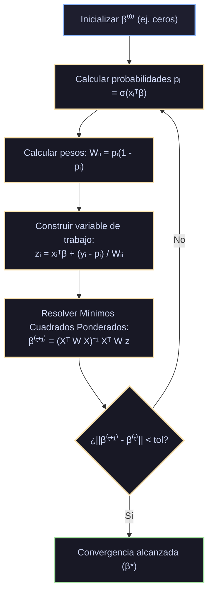

# Monografía de Análisis de Papers Seminales: Regresión Logística y Modelos Logit/Softmax
## Inferencia Binaria, Clasificación Multinomial, Optimización Cuasi-Newton y Regularización

**Autoría del compendio analítico:** Sistema de Razonamiento Científico de Prig IDE  
**Módulo correspondiente:** `docs/algoritmos_ml/02_regresion_logistica.md`  
**Estado:** Documentación canónica en texto plano para repositorio público en GitHub  

---

## 1. Ficha Bibliográfica y Metadatos Formales de los Papers Seminales

| Algoritmo / Modelo | Publicación Seminal | Autores | Venue / Journal | Identificador Digital / Cita Canónica |
|---|---|---|---|---|
| **La Curva Logística Original** | *Notice sur la loi que la population suit dans son accroissement* (1838) | Pierre François Verhulst | *Correspondance Mathématique et Physique*, 10, pp. 113–121 | Verhulst (1838); Verhulst (1845, *Recherches mathématiques sur la loi d'accroissement de la population*) |
| **Regresión Logística Binaria (Logit)** | *The Regression Analysis of Binary Sequences* (1958) | David R. Cox | *Journal of the Royal Statistical Society: Series B (Methodological)*, Vol. 20, No. 2, pp. 215–242 | [JSTOR: 2983890](https://www.jstor.org/stable/2983890) |
| **Modelos Lineales Generalizados (GLM) e IRLS** | *Generalized Linear Models* (1972, 1989) | John A. Nelder & Robert W. M. Wedderburn / Peter McCullagh | *Journal of the Royal Statistical Society: Series A*, 135(3), 370–384; Chapman & Hall (1989) | [DOI: 10.2307/2344614](https://doi.org/10.2307/2344614); ISBN: 978-0412317606 |
| **Logit Multinomial y Elección Discreta (Softmax)** | *Conditional Logit Analysis of Qualitative Choice Behavior* (1973) | Daniel McFadden (Premio Nobel de Economía 2000) | *Frontiers in Econometrics*, Academic Press, pp. 105–142 | McFadden (1973); Luce (1959, *Individual Choice Behavior: A Theoretical Analysis*) |
| **Separabilidad Perfecta y Cuasi-Separación** | *On the existence of maximum likelihood estimates in logistic regression models* (1984) | Adelin Albert & J. A. Anderson | *Biometrika*, Vol. 71, No. 1, pp. 1–10 | [DOI: 10.1093/biomet/71.1.1](https://doi.org/10.1093/biomet/71.1.1) |
| **Optimizador Cuasi-Newton L-BFGS** | *On the limited memory BFGS method for large scale optimization* (1989) | Dong C. Liu & Jorge Nocedal | *Mathematical Programming*, Vol. 45, Issue 1–3, pp. 503–528 | [DOI: 10.1007/BF01589116](https://doi.org/10.1007/BF01589116) |

---

## 2. Génesis Histórica y Fundamentos Teóricos de la Clasificación Probabilística

### 2.1. Por qué la Regresión Lineal de Mínimos Cuadrados (OLS) Fracasa en Clasificación
Históricamente, los primeros intentos de clasificación consistieron en ajustar un modelo lineal por mínimos cuadrados a una variable indicadora $y_i \in \{0, 1\}$. Este enfoque presenta tres fallas matemáticas insalvables:

1. **Violación del Soporte Probabilístico:**
   El modelo lineal $\hat{y} = X\beta$ genera salidas en la recta real completa $\hat{y} \in (-\infty, +\infty)$. Para valores extremos de $x$, la predicción produce probabilidades espurias $\hat{y} < 0$ o $\hat{y} > 1$, las cuales carecen de significado axiomático en la teoría de probabilidad de Kolmogorov.
2. **Heterocedasticidad Intrínseca (Violación de Gauss-Markov):**
   Si la variable respuesta es binaria $y_i \sim \text{Bernoulli}(p_i)$, la varianza condicional es intrínsecamente una función de la media:
   $$\text{Var}(y_i | x_i) = p_i (1 - p_i) = (x_i^T \beta)(1 - x_i^T \beta)$$
   Dado que la varianza no es constante entre observaciones, se destruye el supuesto de homocedasticidad del teorema de Gauss-Markov. OLS resulta ineficiente y los errores estándar e intervalos de confianza analíticos quedan invalidados.
3. **Sensibilidad Catastrófica ante Outliers Bien Clasificados:**
   La función de pérdida cuadrática penaliza $(\hat{y}_i - y_i)^2$. Si una observación pertenece a la clase $1$ y tiene un valor de $x$ tan positivo que el modelo predice $\hat{y}_i = 3.0$, OLS le asigna un error cuadrático de $(3.0 - 1.0)^2 = 4.0$. El modelo rota y desplaza la frontera de decisión para acomodar este punto a pesar de que ya estaba perfectamente clasificado, degradando la clasificación de los puntos cercanos a la frontera real.

### 2.2. El Principio del Odds Ratio y la Transformación Logit
Para resolver estas patologías, David R. Cox (1958) planteó mapear la probabilidad $p \in (0, 1)$ a la recta real $(-\infty, +\infty)$ en dos etapas:

1. **La Razón de Momios (*Odds*):**
   $$\text{Odds} = \frac{p}{1 - p} \in (0, +\infty)$$
   Representa la razón entre la probabilidad de que ocurra el evento y la probabilidad de que no ocurra.
2. **El Logaritmo del Odds (Función Logit):**
   $$\eta = \text{logit}(p) = \ln\left( \frac{p}{1 - p} \right) \in (-\infty, +\infty)$$
   Al asumir una relación lineal entre el logit y las características $\eta = x^T \beta$, se obtiene la función de probabilidad inversa:
   $$\ln\left( \frac{p}{1 - p} \right) = x^T \beta \implies \frac{p}{1 - p} = e^{x^T \beta} \implies p(x) = \frac{e^{x^T \beta}}{1 + e^{x^T \beta}} = \frac{1}{1 + e^{-x^T \beta}} \equiv \sigma(x^T \beta)$$
   donde $\sigma(z)$ es la célebre **función logística sigmoide** de Verhulst.

#### Propiedades Matemáticas de la Función Sigmoide $\sigma(z)$:
- **Rango acotado:** $\sigma(z) \in (0, 1)$ para todo $z \in \mathbb{R}$, con $\lim_{z \to -\infty} \sigma(z) = 0$, $\lim_{z \to +\infty} \sigma(z) = 1$, y $\sigma(0) = 0.5$.
- **Simetría:** $\sigma(-z) = 1 - \sigma(z)$.
- **Derivada analítica elegante:**
  $$\frac{d\sigma(z)}{dz} = \frac{d}{dz}\left( (1 + e^{-z})^{-1} \right) = -(1 + e^{-z})^{-2} (-e^{-z}) = \frac{1}{1 + e^{-z}} \cdot \frac{e^{-z}}{1 + e^{-z}} = \sigma(z)(1 - \sigma(z))$$
  Esta propiedad convierte el cálculo de gradientes en una operación lineal sin costo trascendente adicional.

---

## 3. Análisis Profundo de Cox (1958) - The Regression Analysis of Binary Sequences

### 3.1. Formulación de Máxima Verosimilitud (MLE)
Cox modeló cada observación binaria $y_i \in \{0, 1\}$ condicionada a sus covariables $x_i \in \mathbb{R}^p$ como una variable aleatoria de Bernoulli independiente:
$$P(Y_i = y_i | x_i, \beta) = p_i^{y_i} (1 - p_i)^{1 - y_i}, \quad p_i = \sigma(x_i^T \beta)$$

La función de verosimilitud conjunta sobre las $N$ observaciones independientes es:
$$L(\beta) = \prod_{i=1}^N \sigma(x_i^T \beta)^{y_i} \left[ 1 - \sigma(x_i^T \beta) \right]^{1 - y_i}$$

Tomando el logaritmo natural, obtenemos la **log-verosimilitud**:
$$\ell(\beta) = \sum_{i=1}^N \left[ y_i \ln \sigma(x_i^T \beta) + (1 - y_i) \ln(1 - \sigma(x_i^T \beta)) \right]$$

Aprovechando que $1 - \sigma(z) = \sigma(-z) = \frac{1}{1 + e^z}$ y $\ln \sigma(z) - \ln(1 - \sigma(z)) = z$, la log-verosimilitud se puede reescribir algebraicamente como:
$$\ell(\beta) = \sum_{i=1}^N \left[ y_i (x_i^T \beta) - \ln(1 + e^{x_i^T \beta}) \right]$$

En el marco moderno del Machine Learning, se define la función de pérdida como el negativo de la log-verosimilitud promedio, conocida universalmente como **Entropía Cruzada Binaria (*Binary Cross-Entropy / Log Loss*)**:
$$\mathcal{L}(\beta) = -\frac{1}{N} \ell(\beta) = -\frac{1}{N} \sum_{i=1}^N \left[ y_i \ln p_i + (1 - y_i) \ln(1 - p_i) \right]$$

### 3.2. Derivación Analítica del Vector Gradiente
Derivamos $\mathcal{L}(\beta)$ respecto al vector de parámetros $\beta$:
$$\nabla_\beta \mathcal{L}(\beta) = -\frac{1}{N} \sum_{i=1}^N \left[ y_i \frac{1}{p_i} \nabla_\beta p_i - (1 - y_i) \frac{1}{1 - p_i} \nabla_\beta p_i \right]$$
Dado que $\nabla_\beta p_i = \sigma'(x_i^T \beta) x_i = p_i (1 - p_i) x_i$:
$$\nabla_\beta \mathcal{L}(\beta) = -\frac{1}{N} \sum_{i=1}^N \left[ y_i (1 - p_i) x_i - (1 - y_i) p_i x_i \right] = -\frac{1}{N} \sum_{i=1}^N (y_i - p_i) x_i = \frac{1}{N} \sum_{i=1}^N (p_i - y_i) x_i$$
En notación matricial compacta:
$$\nabla_\beta \mathcal{L}(\beta) = \frac{1}{N} X^T (\hat{p} - y)$$
donde $\hat{p} = [\sigma(x_1^T \beta), \dots, \sigma(x_N^T \beta)]^T \in (0, 1)^N$.

> **Conexión Fundamental con OLS:** El gradiente de la regresión logística tiene **exactamente la misma estructura algebraica** que el gradiente de OLS ($\frac{1}{N} X^T (\hat{y} - y)$). La diferencia fundamental reside en que el vector de predicciones $\hat{p} = \sigma(X\beta)$ es ahora una función no lineal de los parámetros, lo que impide despejar $\beta$ en forma cerrada analítica mediante inversión matricial.

### 3.3. Derivación de la Matriz Hessiana y Demostración de Convexidad Estricta
Diferenciando el gradiente respecto a $\beta^T$:
$$\mathcal{H}(\beta) = \nabla_\beta^2 \mathcal{L}(\beta) = \frac{1}{N} \sum_{i=1}^N x_i \nabla_\beta p_i^T = \frac{1}{N} \sum_{i=1}^N p_i (1 - p_i) x_i x_i^T$$
En forma matricial:
$$\mathcal{H}(\beta) = \frac{1}{N} X^T W X$$
donde $W = \text{diag}(w_1, w_2, \dots, w_N)$ es una matriz diagonal cuyos elementos son:
$$w_i = p_i (1 - p_i) \in (0, 0.25]$$

#### Demostración del Teorema de Convexidad Estricta:
**Teorema:** Si la matriz de diseño $X \in \mathbb{R}^{N \times p}$ tiene rango columna completo ($\text{rango}(X) = p$), entonces la función de pérdida $\mathcal{L}(\beta)$ es **estrictamente convexa** en todo $\mathbb{R}^p$.

**Demostración:**
Sea cualquier vector no nulo $v \in \mathbb{R}^p, v \ne 0$. Evaluamos la forma cuadrática de la Hessiana:
$$v^T \mathcal{H}(\beta) v = \frac{1}{N} v^T X^T W X v = \frac{1}{N} (Xv)^T W (Xv)$$
Definiendo $u = Xv \in \mathbb{R}^N$:
$$v^T \mathcal{H}(\beta) v = \frac{1}{N} \sum_{i=1}^N w_i u_i^2 = \frac{1}{N} \sum_{i=1}^N p_i (1 - p_i) (x_i^T v)^2$$
Dado que $p_i = \sigma(x_i^T \beta) \in (0, 1)$ para cualquier $\beta \in \mathbb{R}^p$ finito, el producto $w_i = p_i (1 - p_i) > 0$ es estrictamente positivo para todo $i$.
Dado que $X$ tiene rango columna completo y $v \ne 0$, el vector $u = Xv$ no puede ser el vector nulo ($u \ne 0$), lo que significa que al menos un componente $u_k^2 = (x_k^T v)^2 > 0$.
Por lo tanto:
$$v^T \mathcal{H}(\beta) v > 0 \quad \forall v \ne 0$$
La matriz Hessiana $\mathcal{H}(\beta)$ es **estrictamente definida positiva** en todo el espacio $\mathbb{R}^p$.  
**Corolario:** La función de costo no posee ningún mínimo local espurio ni puntos de silla no globales; existe un **único mínimo global**, garantizando que cualquier algoritmo de optimización convergente alcanzará la solución óptima sin quedar atrapado en óptimos locales. $\blacksquare$

---

## 4. El Problema de Separabilidad Perfecta y Cuasi-Separación (Albert & Anderson, 1984)

A pesar de la convexidad estricta de la pérdida logística, existe un escenario patológico de primer orden descubierto formalmente por Adelin Albert y J. A. Anderson (1984): **la separabilidad lineal perfecta**.

### 4.1. Mecánica Matemática de la Divergencia
Supongamos que los datos de entrenamiento son linealmente separables, es decir, existe un vector $\beta^*$ tal que:
$$x_i^T \beta^* > 0 \quad \text{si } y_i = 1, \qquad x_i^T \beta^* < 0 \quad \text{si } y_i = 0$$
Si multiplicamos este vector por un escalar positivo arbitrariamente grande $\gamma > 0$ ($\beta = \gamma \beta^*$):
- Para $y_i = 1$: $x_i^T \beta = \gamma (x_i^T \beta^*) \to +\infty \implies p_i = \sigma(\gamma x_i^T \beta^*) \to 1 \implies \ln p_i \to 0$.
- Para $y_i = 0$: $x_i^T \beta = \gamma (x_i^T \beta^*) \to -\infty \implies 1 - p_i = 1 - \sigma(\gamma x_i^T \beta^*) \to 1 \implies \ln(1 - p_i) \to 0$.

Por lo tanto:
$$\lim_{\gamma \to \infty} \mathcal{L}(\gamma \beta^*) = 0$$
La pérdida ínfima de cero solo se alcanza en el límite cuando la norma $\|\beta\| \to \infty$.  
**Consecuencias empíricas en algoritmos:**
1. Los coeficientes estimados divergen numéricamente hacia $\pm \infty$.
2. Los pesos $w_i = p_i(1-p_i) \to 0$, por lo que la matriz Hessiana colapsa a singular ($\det(\mathcal{H}) \to 0$).
3. Los errores estándar de los coeficientes explotan ($\text{SE}(\hat{\beta}_j) \to \infty$), y los algoritmos iterativos (Newton-Raphson / L-BFGS) arrojan advertencias de falta de convergencia (*failure to converge / overflow*).

### 4.2. La Solución Obligatoria: Regularización $L_2$ y $L_1$
Para asegurar la existencia de un estimador finito y bien condicionado en presencia de separabilidad (o casi-separabilidad), se agrega un término de regularización a la función objetivo:

$$\mathcal{L}_{\text{Reg}}(\beta) = -\frac{1}{N} \sum_{i=1}^N \left[ y_i \ln p_i + (1 - y_i) \ln(1 - p_i) \right] + \frac{\lambda}{2} \|\beta\|_2^2$$
o bajo la parametrización de scikit-learn ($C = 1/\lambda$):
$$\mathcal{L}_C(\beta) = C \cdot \text{Loss}(\beta) + \frac{1}{2} \|\beta\|_2^2$$
El gradiente y la Hessiana regularizados se convierten en:
$$\nabla_\beta \mathcal{L}_{\text{Reg}}(\beta) = \frac{1}{N} X^T (\hat{p} - y) + \lambda \beta$$
$$\mathcal{H}_{\text{Reg}}(\beta) = \frac{1}{N} X^T W X + \lambda I_p$$
Dado que los autovalores de $\mathcal{H}_{\text{Reg}}$ están acotados inferiormente por $\lambda > 0$, la Hessiana es invertible en todo momento con número de condición finito, **garantizando matemáticamente la existencia, unicidad y finitud de la solución incluso cuando las clases son perfectamente separables.**

---

## 5. Análisis Profundo de McCullagh & Nelder (1989) - El Algoritmo IRLS

Nelder y Wedderburn (1972) y McCullagh y Nelder (1989) encuadraron la regresión logística dentro de la teoría unificada de los **Modelos Lineales Generalizados (GLM)**, derivando el método canónico de estimación de Fisher / Newton-Raphson: **IRLS (*Iteratively Reweighted Least Squares*)**.

### 5.1. Derivación del Paso de Newton-Raphson
La actualización clásica de segundo orden para optimizar una función $f(\beta)$ es:
$$\beta^{(t+1)} = \beta^{(t)} - \left[ \mathcal{H}(\beta^{(t)}) \right]^{-1} \nabla f(\beta^{(t)})$$
Sustituyendo el gradiente $\nabla \mathcal{L} = \frac{1}{N} X^T (\hat{p} - y)$ y la Hessiana $\mathcal{H} = \frac{1}{N} X^T W X$:
$$\beta^{(t+1)} = \beta^{(t)} - (X^T W X)^{-1} X^T (\hat{p}^{(t)} - y) = \beta^{(t)} + (X^T W X)^{-1} X^T (y - \hat{p}^{(t)})$$

### 5.2. Reformulación como Mínimos Cuadrados Ponderados (WLS)
McCullagh y Nelder reescribieron esta actualización multiplicando $\beta^{(t)}$ por la identidad $(X^T W X)^{-1} (X^T W X)$:
$$\begin{aligned}
\beta^{(t+1)} &= (X^T W X)^{-1} (X^T W X) \beta^{(t)} + (X^T W X)^{-1} X^T (y - \hat{p}^{(t)}) \\
&= (X^T W X)^{-1} X^T W \left[ X\beta^{(t)} + W^{-1} (y - \hat{p}^{(t)}) \right]
\end{aligned}$$
Definiendo la variable dependiente de trabajo (*working response*) $z^{(t)} \in \mathbb{R}^N$:
$$z_i^{(t)} = x_i^T \beta^{(t)} + \frac{y_i - \hat{p}_i^{(t)}}{w_i^{(t)}} = x_i^T \beta^{(t)} + \frac{y_i - \hat{p}_i^{(t)}}{\hat{p}_i^{(t)}(1 - \hat{p}_i^{(t)})}$$
La ecuación de actualización adquiere la forma exacta de una regresión por mínimos cuadrados ponderados:
$$\beta^{(t+1)} = (X^T W^{(t)} X)^{-1} X^T W^{(t)} z^{(t)}$$



### 5.3. Interpretación Intuitiva de los Pesos $W$
La matriz de pesos $W$ mide la incertidumbre informativa de cada punto en el hiperplano:
- **Puntos cercanos a la frontera de decisión ($x_i^T \beta \approx 0 \implies p_i \approx 0.5$):**
  $w_i = 0.5 \times 0.5 = 0.25$ (**peso máximo**). Los puntos donde el modelo tiene máxima incertidumbre son los que ejercen mayor fuerza en la actualización de los coeficientes.
- **Puntos lejanos y certeros ($x_i^T \beta \gg 0 \implies p_i \approx 0.99$ o $p_i \approx 0.01$):**
  $w_i = 0.01 \times 0.99 \approx 0.0099$ (**peso prácticamente nulo**). Los puntos clasificados con altísima seguridad apenas influyen en el ajuste del modelo, eliminando la vulnerabilidad a outliers que padecía OLS.

---

## 6. Análisis Profundo de McFadden (1973) - Regresión Logística Multinomial (Softmax)

Para problemas con $K > 2$ clases mutuamente excluyentes, Daniel McFadden (1973) fundamentó la extensión multinomial a partir de la **Teoría de la Utilidad Aleatoria (*Random Utility Theory*)**, trabajo que le valió el Premio Nobel de Ciencias Económicas en el año 2000.

### 6.1. De la Utilidad Aleatoria a la Función Softmax
Supongamos que un individuo o sistema debe seleccionar entre $K$ alternativas. La utilidad no observable de la alternativa $k \in \{1, \dots, K\}$ para la observación $i$ se descompone en un componente determinista observable $V_{ik} = x_i^T \beta_k$ y un componente estocástico de perturbación $\epsilon_{ik}$:
$$U_{ik} = x_i^T \beta_k + \epsilon_{ik}$$
El individuo elige la clase $k$ si y solo si proporciona la máxima utilidad:
$$P(Y_i = k) = P\left( U_{ik} > \max_{j \ne k} U_{ij} \right)$$

**Teorema de McFadden:** Si los términos de error $\epsilon_{ik}$ son variables aleatorias independientes e idénticamente distribuidas que siguen una **distribución de valor extremo tipo I (Gumbel)** con función de distribución acumulada $F(\epsilon) = \exp(-\exp(-\epsilon))$, entonces la probabilidad condicional de elección adopta la forma de la **función Softmax**:
$$P(Y_i = k | x_i) = \frac{\exp(x_i^T \beta_k)}{\sum_{c=1}^K \exp(x_i^T \beta_c)}$$

### 6.2. Indeterminación Paramétrica y Fijación de Clase Base
Nótese que si se suma un vector arbitrario $\delta \in \mathbb{R}^p$ a todos los parámetros ($\beta_k' = \beta_k + \delta$), las probabilidades permanecen inalteradas:
$$\frac{\exp(x_i^T (\beta_k + \delta))}{\sum_{c} \exp(x_i^T (\beta_c + \delta))} = \frac{\exp(x_i^T \beta_k) \cdot e^{x_i^T \delta}}{\sum_{c} \exp(x_i^T \beta_c) \cdot e^{x_i^T \delta}} = \frac{\exp(x_i^T \beta_k)}{\sum_{c=1}^K \exp(x_i^T \beta_c)}$$
Para eliminar esta redundancia en estadística clásica se fija una clase de referencia (ej. $\beta_K = 0$).  
En Machine Learning moderno, no se fija ninguna clase a cero; en su lugar, se impone **regularización $L_2$ estricta sobre todos los vectores** ($\frac{\lambda}{2} \sum_{k=1}^K \|\beta_k\|_2^2$), lo que rompe la ambigüedad y selecciona la parametrización de norma mínima de forma simétrica.

### 6.3. Pérdida de Entropía Cruzada Categórica y Gradiente
Representando la etiqueta de la clase mediante codificación *one-hot* $y_{ik} \in \{0, 1\}$ con $\sum_k y_{ik} = 1$:
$$\mathcal{L}(\{\beta_k\}) = -\frac{1}{N} \sum_{i=1}^N \sum_{k=1}^K y_{ik} \ln \left( \frac{\exp(x_i^T \beta_k)}{\sum_{c=1}^K \exp(x_i^T \beta_c)} \right) + \frac{\lambda}{2} \sum_{k=1}^K \|\beta_k\|_2^2$$

El gradiente con respecto a los pesos de la clase $k$ es:
$$\nabla_{\beta_k} \mathcal{L} = \frac{1}{N} \sum_{i=1}^N (p_{ik} - y_{ik}) x_i + \lambda \beta_k = \frac{1}{N} X^T (\hat{p}_k - y_k) + \lambda \beta_k$$
Nuevamente, emerge la concordancia estructural: **el error de predicción $(p_{ik} - y_{ik})$ multiplicado por la entrada $x_i$**.

---

## 7. Evolución Computacional de los Optimizadores Numéricos

| Optimizador | Familia Matemática | Complejidad por Iteración | Requisitos de Memoria | Adecuado para | Limitación Principal |
|---|---|---|---|---|---|
| **IRLS / Newton-Raphson** | Segundo orden exacto | $O(N p^2 + p^3)$ | $O(p^2)$ para $\mathcal{H}$ | $N$ moderado, $p < 2000$, penalización $L_2$ | No escala cuando $p > 5000$; inviable en matrices gigantes. |
| **Descenso de Gradiente (GD / SGD)** | Primer orden | $O(N p)$ (GD) / $O(p)$ (SGD) | $O(p)$ | Escenarios masivos en streaming | Convergencia lenta y oscilante cerca del óptimo (sensible a $\eta$). |
| **L-BFGS (Liu & Nocedal, 1989)** | Cuasi-Newton de memoria limitada | $O(m \cdot p + N p)$ | $O(m \cdot p)$ con $m \in [5, 20]$ | Estándar universal para $L_2$, $p$ de hasta $10^6$ | Solo admite funciones suaves; no optimiza normas $\ell_1$ directamente. |
| **LIBLINEAR (Fan et al., 2008)** | Descenso por coordenadas dual | $O(p)$ por coordenada | $O(N p)$ ralo | Modelos lineales de alta dimensionalidad con $L_1$ o $L_2$ | Computación secuencial no vectorizada fácilmente en GPU. |
| **SAGA (Defazio et al., 2014)** | Gradiente estocástico con reducción de varianza | $O(p)$ por muestra | $O(N)$ para tabla de gradientes | Grandes volúmenes de datos ($N \gg 10^5$) con soporte $L_1$ y $L_2$ | Consumo de memoria adicional por la tabla histórica de gradientes. |

### 7.1. El Algoritmo L-BFGS (Limited-memory BFGS)
El algoritmo BFGS tradicional mantiene una aproximación densa de la inversa de la Hessiana $B_k \approx \mathcal{H}^{-1}$ de tamaño $p \times p$, requiriendo $O(p^2)$ de memoria y $O(p^2)$ operaciones. Para $p = 100,000$, almacenar $B_k$ requeriría 80 GB de memoria RAM.
Dong C. Liu y Jorge Nocedal (1989) demostraron que no es necesario almacenar la matriz explícita. Basta con guardar en una cola circular los últimos $m$ vectores de desplazamiento y gradiente:
$$s_k = \beta_{k+1} - \beta_k, \qquad y_k = g_{k+1} - g_k$$
Mediante el **algoritmo de recursión de dos bucles (*Two-Loop Recursion*)**, L-BFGS calcula la dirección de búsqueda $d_k = -H_k g_k$ en únicamente $4mp$ operaciones aritméticas con consumo de memoria mínimo $O(mp)$ (típicamente $m \in [5, 20]$). Por esta razón, L-BFGS es el solver por defecto en `sklearn.linear_model.LogisticRegression`.

---

## 8. Implementación Pura en Python/NumPy desde Cero

El siguiente módulo implementa la regresión logística binaria y el optimizador IRLS / Newton-Raphson regularizado con $L_2$ y una función de activación numéricamente estable para evitar desbordamientos aritméticos (*overflow* y *underflow*).

```python
"""
Implementación de Referencia: Regresión Logística con IRLS y L2 en NumPy Puro.
Demostración de:
1. Sigmoide y Log-Loss numéricamente estables.
2. Optimización por Mínimos Cuadrados Ponderados Iterativos (IRLS / Newton-Raphson).
3. Supresión de divergencia ante clases linealmente separables mediante regularización L2.
"""

import numpy as np


def sigmoide_estable(z):
    """
    Función logística sigmoide numéricamente estable.
    Evita overflow en exp(-z) cuando z es muy negativo.
    """
    z = np.clip(z, -500.0, 500.0)
    return np.where(
        z >= 0,
        1.0 / (1.0 + np.exp(-z)),
        np.exp(z) / (1.0 + np.exp(z))
    )


def perdida_entropia_cruzada(y, p, w, lambda_reg):
    """
    Calcula la Binary Cross-Entropy regularizada con penalización L2.
    Añade un épsilon numérico para prevenir log(0).
    """
    eps = 1e-15
    p_safe = np.clip(p, eps, 1.0 - eps)
    bce = -np.mean(y * np.log(p_safe) + (1.0 - y) * np.log(1.0 - p_safe))
    l2_cost = 0.5 * lambda_reg * np.sum(w**2)
    return bce + l2_cost


def entrenar_regresion_logistica_irls(X, y, lambda_reg=1e-4, max_iter=50, tol=1e-6):
    """
    Entrena el modelo logístico usando IRLS / Newton-Raphson con regularización L2.
    
    Parámetros:
        X: Matriz de características de tamaño (N, p).
        y: Vector binario de etiquetas (N,) con valores {0, 1}.
        lambda_reg: Coeficiente de regularización L2.
    """
    N, p = X.shape
    w = np.zeros(p)
    historial_perdida = []

    for iteracion in range(max_iter):
        # 1. Predicción probabilística
        z = X @ w
        p_est = sigmoide_estable(z)

        # 2. Evaluación de la pérdida actual
        loss = perdida_entropia_cruzada(y, p_est, w, lambda_reg)
        historial_perdida.append(loss)

        # 3. Cálculo de gradiente: g = (1/N) * X^T (p - y) + lambda * w
        gradiente = (1.0 / N) * (X.T @ (p_est - y)) + lambda_reg * w

        # 4. Matriz de pesos: W_ii = p_i * (1 - p_i)
        pesos_diag = p_est * (1.0 - p_est)
        # Acotar pesos inferiores para estabilidad numérica del hessiano
        pesos_diag = np.maximum(pesos_diag, 1e-10)

        # 5. Cálculo de la matriz Hessiana: H = (1/N) * X^T W X + lambda * I
        # Implementado eficientemente como producto punto escalado
        X_ponderada = X * pesos_diag[:, np.newaxis]
        hessiana = (1.0 / N) * (X.T @ X_ponderada) + lambda_reg * np.eye(p)

        # 6. Actualización de Newton: w_nuevo = w - H^(-1) * g
        try:
            delta_w = np.linalg.solve(hessiana, gradiente)
        except np.linalg.LinAlgError:
            # Fallback a pseudoinversa si la matriz es singular
            delta_w = np.linalg.pinv(hessiana) @ gradiente

        w_nuevo = w - delta_w

        # Comprobar convergencia
        if np.max(np.abs(w_nuevo - w)) < tol:
            w = w_nuevo
            break

        w = w_nuevo

    return w, historial_perdida


# Demostración del colapso sin regularización vs. estabilidad con L2 en clases separables
if __name__ == "__main__":
    np.random.seed(42)
    # Generamos un conjunto de datos perfectamente separable
    N = 80
    X_clase0 = np.random.randn(N // 2, 2) - np.array([2.5, 2.5])
    X_clase1 = np.random.randn(N // 2, 2) + np.array([2.5, 2.5])
    X_raw = np.vstack([X_clase0, X_clase1])
    # Añadir columna de sesgo (intercepto)
    X = np.column_stack([np.ones(N), X_raw])
    y = np.array([0] * (N // 2) + [1] * (N // 2))

    # Caso A: Sin regularización (lambda = 0) -> Coeficientes divergen
    w_sin_reg, _ = entrenar_regresion_logistica_irls(X, y, lambda_reg=0.0, max_iter=10)
    # Caso B: Con regularización L2 controlada (lambda = 0.5) -> Coeficientes acotados
    w_con_l2, _ = entrenar_regresion_logistica_irls(X, y, lambda_reg=0.5, max_iter=20)

    print("=== Coeficientes en Datos Linealmente Separables ===")
    print("Sin Regularización (λ=0)  - Norma ||w||:", round(float(np.linalg.norm(w_sin_reg)), 3))
    print("Pesos:", np.round(w_sin_reg, 3))
    print("Con Regularización L2 (λ=0.5) - Norma ||w||:", round(float(np.linalg.norm(w_con_l2)), 3))
    print("Pesos:", np.round(w_con_l2, 3))
```

---

## 9. Directrices de Razonamiento para los Modelos de Inteligencia Artificial en Prig IDE

Cuando un modelo de lenguaje de Prig IDE inspeccione un proyecto, celda de Jupyter o código de Kaggle que emplee Regresión Logística, aplicará el siguiente árbol de decisión heurístico:

1. **Diagnóstico de Separabilidad y Convergencia:**
   - Si el usuario reporta advertencias del tipo `ConvergenceWarning: lbfgs failed to converge` o `Maximum iterations reached`, inspeccionar de inmediato si las características son perfectamente separables o si `C` es excesivamente grande ($C \ge 10^4$). Recomendar disminuir $C$ (incrementar $\lambda$) o escalar los datos con `StandardScaler`.
2. **Selección del Optimizador (*Solver*) en scikit-learn:**
   - Para **datos densos de tamaño moderado a grande con regularización $L_2$:** recomendar `solver='lbfgs'`.
   - Para **alta dimensionalidad rala ($p \gg N$) o cuando se exige esparcidad ($L_1$ / ElasticNet):** recomendar `solver='saga'` o `solver='liblinear'`.
   - Para **grandes volúmenes de datos ($N > 10^6$):** recomendar `SGDClassifier(loss='log_loss')` o `solver='saga'`.
3. **Calibración de Probabilidades vs. Frontera Discreta:**
   - Aclarar al usuario que la probabilidad emitida por $\sigma(z)$ representa una confianza calibrada **únicamente bajo el supuesto de que el logit es lineal con las covariables**. Si los datos exhiben no linealidades complejas, sugerir calibración post-hoc mediante `CalibratedClassifierCV` (calibración sigmoidea de Platt o isotónica).
4. **Tratamiento del Desbalance de Clases:**
   - En presencia de clases desbalanceadas (ej. fraude financiero con 99% de clase negativa), advertir que el umbral estándar de $\tau = 0.5$ es arbitrario e ineficiente. Recomendar:
     1. Usar `class_weight='balanced'` para compensar el gradiente por la inversa de la frecuencia de clase.
     2. Optimizar el umbral de decisión $\tau^*$ maximizando la métrica de interés (F1-score, Balanced Accuracy o utilidad económica en la curva PR).

