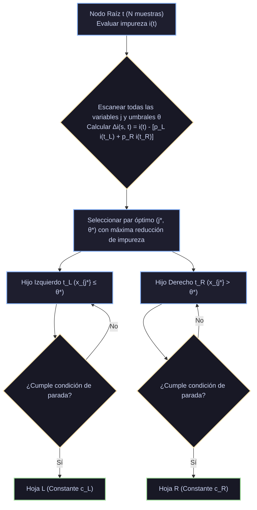
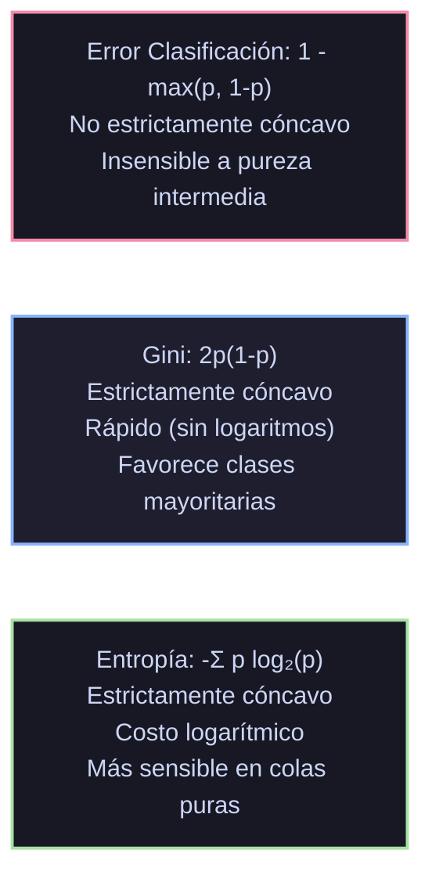

# Monografía de Análisis de Papers Seminales: Árboles de Decisión y Particionamiento Recursivo
## CART (Breiman et al., 1984), ID3 / C4.5 (Quinlan, 1986, 1993) y Poda Cost-Complexity

**Autoría del compendio analítico:** Sistema de Razonamiento Científico de Prig IDE  
**Módulo correspondiente:** `docs/algoritmos_ml/03_arboles_cart_c45.md`  
**Estado:** Documentación canónica en texto plano para repositorio público en GitHub  

---

## 1. Ficha Bibliográfica y Metadatos Formales de los Papers Seminales

| Algoritmo / Modelo | Publicación Seminal | Autores | Editorial / Journal | Identificador Digital / Cita Canónica |
|---|---|---|---|---|
| **Primer Particionamiento Automático (AID)** | *Problems in the analysis of survey data, and a proposal* (1963) | James N. Morgan & John A. Sonquist | *Journal of the American Statistical Association*, Vol. 58, No. 302, pp. 415–434 | [DOI: 10.1080/01621459.1963.10500855](https://doi.org/10.1080/01621459.1963.10500855) |
| **CART (Classification and Regression Trees)** | *Classification and Regression Trees* (1984) | Leo Breiman, Jerome H. Friedman, Richard A. Olshen & Charles J. Stone | Wadsworth & Brooks/Cole Advanced Books & Software, Monterey, CA (Monografía 358 pp.) | ISBN: 978-0412048418; [Cita Canónica: Breiman et al. (1984)](https://doi.org/10.1201/9781315139470) |
| **ID3 (Iterative Dichotomiser 3)** | *Induction of Decision Trees* (1986) | J. Ross Quinlan | *Machine Learning*, Vol. 1, No. 1, pp. 81–106 | [DOI: 10.1007/BF00116251](https://doi.org/10.1007/BF00116251) |
| **C4.5: Programs for Machine Learning** | *C4.5: Programs for Machine Learning* (1993) | J. Ross Quinlan | Morgan Kaufmann Publishers, San Mateo, CA (Libro 302 pp.) | ISBN: 978-1558602380; [ACM DL: 152181](https://dl.acm.org/doi/book/10.5555/152181) |
| **Poda y Selección Insesgada (QUEST)** | *Split selection methods for classification trees* (1997) | Wei-Yin Loh & Nunta Vanichsetakul / Chun-Houh Shih | *Statistica Sinica*, Vol. 7, No. 4, pp. 815–840 | [JSTOR: 24306161](https://www.jstor.org/stable/24306161) |

---

## 2. Génesis Teórica y el Paradigma del Particionamiento Recursivo

### 2.1. Inadecuación de los Modelos Lineales ante Relaciones No Lineales Complejas
Los modelos lineales clásicos (OLS, Ridge, Regresión Logística) descansan en el supuesto fundamental de linealidad en los parámetros:
$$f(x) = g\left( \sum_{j=1}^p w_j x_j + b \right)$$
Esta formulación presenta tres limitaciones severas:
1. **Fronteras de Decisión Hiperplanares:** En clasificación, la frontera $\{x : w^T x + b = 0\}$ es un hiperplano rígido de dimensión $p-1$. Si las clases están separadas por geometrías complejas, anillos concéntricos o regiones disjuntas múltiples, los modelos lineales fracasan rotundamente a menos que el usuario construya manualmente combinaciones polinomiales de orden superior.
2. **Incapacidad Intrínseca de Capturar Interacciones:** En problemas donde el efecto de una variable $x_1$ sobre la respuesta depende críticamente del valor de otra variable $x_2$ (interacción lógica de orden superior, ej. $x_1 > \theta_1 \land x_2 \le \theta_2$), un modelo lineal sin términos de producto cruzado explícitos ($x_1 x_2$) es ciego a la estructura. El número de posibles interacciones de orden $k$ crece combinatoriamente como $\binom{p}{k}$, volviéndose intratable para $p$ grande.
3. **Fragilidad ante Transformaciones Monótonas:** Los modelos lineales dependen de la escala numérica de las variables. Si una característica sufre una transformación no lineal estrictamente monótona (ej. $x \mapsto \ln x$ o $x \mapsto x^3$), las relaciones lineales se rompen.

### 2.2. Particionamiento Ortogonal del Espacio de Características
Los árboles de decisión adoptan una filosofía no paramétrica basada en la técnica de **"divide y vencerás" (*Divide and Conquer*)**: particionar iterativamente el espacio continuo $p$-dimensional $\mathcal{X} \subset \mathbb{R}^p$ en un conjunto de hiperrectángulos disjuntos $R_1, R_2, \dots, R_M$ ortogonales a los ejes coordenados:
$$\mathcal{X} = \bigcup_{m=1}^M R_m, \quad R_j \cap R_k = \emptyset \quad \forall j \ne k$$
En cada hiperrectángulo $R_m$, el modelo aproxima la función objetivo mediante una constante local $c_m$:
$$f(x) = \sum_{m=1}^M c_m \mathbb{I}(x \in R_m)$$
- En **Regresión:** $c_m = \frac{1}{N_m} \sum_{x_i \in R_m} y_i$ (la media muestral en la región).
- En **Clasificación:** $c_m = \arg\max_k \hat{p}_{mk}$ (la clase mayoritaria en la región), con estimación de probabilidad $\hat{p}_{mk} = \frac{1}{N_m} \sum_{x_i \in R_m} \mathbb{I}(y_i = k)$.

---

## 3. Análisis Profundo de Breiman et al. (1984) - CART

Leo Breiman, Jerome Friedman, Richard Olshen y Charles Stone establecieron en 1984 la base matemática rigurosa del particionamiento recursivo binario con su monografía **CART (*Classification and Regression Trees*)**.



### 3.1. Divisiones Estrictamente Binarias vs. Multi-vía
Una de las elecciones fundamentales de CART frente a otros métodos contemporáneos (como AID o CHAID) fue la adopción de **divisiones estrictamente binarias** ($s: x_j \le \theta$ frente a $x_j > \theta$).
Breiman et al. demostraron que cualquier partición multi-vía de $K$ ramas puede reescribirse de forma idéntica como una cascada de $K-1$ divisiones binarias sucesivas. Las divisiones multi-vía sufren del defecto de **fragmentar los datos con excesiva rapidez** (*data starvation*), dejando pocos ejemplos en los nodos hijos para evaluar con suficiente potencia estadística divisiones subsecuentes.

### 3.2. Criterios de Impureza y la Propiedad de Concavidad
Sea un nodo $t$ que contiene un conjunto de muestras $N_t$. Denotemos por $p_{tk} = \frac{1}{N_t} \sum_{i \in t} \mathbb{I}(y_i = k)$ la proporción de ejemplos de la clase $k \in \{1, \dots, K\}$ en el nodo $t$.

Una función de impureza $i(t) = \Phi(p_{t1}, p_{t2}, \dots, p_{tK})$ debe satisfacer por axioma:
1. $i(t) = 0$ si y solo si el nodo es perfectamente puro ($\exists k : p_{tk} = 1$).
2. $i(t)$ alcanza su máximo absoluto cuando las clases están uniformemente distribuidas ($p_{tk} = 1/K \ \forall k$).
3. $i(t)$ es una función simétrica respecto a las permutaciones de $p_{tk}$.

#### El Criterio de Impureza de Gini:
$$i_G(t) = 1 - \sum_{k=1}^K p_{tk}^2 = \sum_{k=1}^K p_{tk} (1 - p_{tk}) = \sum_{j \ne k} p_{tj} p_{tk}$$
**Interpretación Probabilística:** Es la probabilidad de que dos elementos extraídos al azar con reemplazo del nodo $t$ pertenezcan a clases diferentes. Corresponde al error esperado si asignáramos aleatoriamente una clase a un elemento siguiendo la distribución observada en el nodo.

#### Teorema de Concavidad de la Función de Impureza:
**Teorema:** Para que cualquier división candidato $s$ garantice una reducción de impureza no negativa ($\Delta i(s, t) \ge 0$), la función de impureza $\Phi(p)$ debe ser **estrictamente cóncava** en el símplex de probabilidades $\Delta^{K-1} = \{p \in [0, 1]^K : \sum p_k = 1\}$.

**Demostración:**
Sea una partición del nodo $t$ en dos nodos hijos $t_L$ y $t_R$ con proporciones muestrales $p_L = N_L / N_t$ y $p_R = N_R / N_t$ ($p_L + p_R = 1$).
Por conservación de masa muestral, el vector de probabilidades del nodo padre es la combinación convexa exacta de los vectores de los hijos:
$$p_t = p_L p_{t_L} + p_R p_{t_R} = \mathbb{E}[\mathbf{p}_{\text{hijos}}]$$
La ganancia de impureza producida por la división es:
$$\Delta i(s, t) = i(t) - \left[ p_L i(t_L) + p_R i(t_R) \right] = \Phi\left( p_L p_{t_L} + p_R p_{t_R} \right) - \left[ p_L \Phi(p_{t_L}) + p_R \Phi(p_{t_R}) \right]$$
Por la **Desigualdad de Jensen**, si $\Phi$ es cóncava:
$$\Phi(p_L p_{t_L} + p_R p_{t_R}) \ge p_L \Phi(p_{t_L}) + p_R \Phi(p_{t_R})$$
Por tanto:
$$\Delta i(s, t) \ge 0$$
La ganancia de impureza es **siempre mayor o igual a cero** si y solo si la función de impureza es cóncava.  
Dado que la matriz Hessiana de la función de Gini es $\nabla^2 i_G(p) = -2 I_K$, sus autovalores son todos estrictamente negativos ($-2$). La función de Gini es **estrictamente cóncava**, lo que garantiza que ninguna división pueda empeorar la impureza. $\blacksquare$

### 3.3. CART para Regresión: Reducción de Varianza
En problemas de regresión, la impureza se define como el error cuadrático medio dentro del nodo (la varianza muestral):
$$i_R(t) = \frac{1}{N_t} \sum_{i \in t} (y_i - \bar{y}_t)^2, \quad \bar{y}_t = \frac{1}{N_t} \sum_{i \in t} y_i$$
La ganancia de la división es la reducción de la suma total de cuadrados residuales:
$$\Delta i(s, t) = \sum_{i \in t} (y_i - \bar{y}_t)^2 - \left[ \sum_{i \in t_L} (y_i - \bar{y}_L)^2 + \sum_{i \in t_R} (y_i - \bar{y}_R)^2 \right]$$
Por el teorema de descomposición de la varianza de Huygens:
$$\text{SS}_{\text{Total}} = \text{SS}_{\text{Dentro}} + \text{SS}_{\text{Entre}}$$
Maximizar la reducción de varianza interna equivale algebraicamente a **maximizar la separación entre las medias de los nodos hijos**:
$$\Delta i(s, t) = \frac{N_L N_R}{N_L + N_R} (\bar{y}_L - \bar{y}_R)^2$$
Esta elegante identidad computacional permite evaluar todos los umbrales candidatos en $O(N_t)$ tras ordenar la variable predictora una sola vez.

### 3.4. Manejo de Valores Faltantes mediante Variables Sustitutas (*Surrogate Splits*)
A diferencia de otros algoritmos de Machine Learning que exigen descartar filas o imputar la media antes de entrenar, Breiman et al. inventaron las **variables sustitutas**:
1. Para cada nodo interno $t$, se encuentra la mejor división primaria $s^* = (x_{j^*} \le \theta^*)$.
2. Si existen muestras donde la variable primaria $x_{j^*}$ tiene un valor faltante (`NaN`), CART no puede decidir hacia qué hijo enviarlas.
3. CART busca entre todos los predictores restantes la variable alternativa $x_k$ y umbral $\theta_k$ que produzca la **máxima concordancia predictiva con la división primaria** sobre las observaciones donde ambos están presentes.
4. Las muestras con valores faltantes son enviadas a izquierda o derecha según la mejor variable sustituta disponible, dotando al árbol de una inmunidad estructural a datos incompletos.

---

## 4. La Poda de Complejidad de Coste (*Minimal Cost-Complexity Pruning*)

Un árbol de decisión crecido hasta que cada hoja contenga una sola muestra ($N_t = 1$) alcanza un error de entrenamiento de cero ($R(T) = 0$), pero sufre de un sobreajuste masivo debido a su altísima varianza muestral.

### 4.1. Formulación del Costo Penalizado
Breiman et al. rechazaron los criterios de parada prematura (*early stopping* o pre-pruning como `max_depth` o `min_impurity_decrease`), demostrando que sufren de **miopía (*short-sightedness*)**: pueden detener una rama que ofrece poca ganancia inmediata pero que habría desbloqueado una división extraordinariamente pura un nivel más abajo.
Propusieron en su lugar **crecer un árbol masivo $T_{\max}$ y luego podarlo hacia atrás (*post-pruning*)** optimizando el criterio de complejidad de coste:
$$R_\alpha(T) = R(T) + \alpha |T|$$
donde:
- $R(T) = \sum_{t \in \widetilde{T}} R(t) = \sum_{t \in \widetilde{T}} \sum_{i \in t} \mathcal{L}(y_i, c_t)$ es el error empírico de las hojas $\widetilde{T}$.
- $|T| = |\widetilde{T}|$ es el número de nodos hoja (complejidad del árbol).
- $\alpha \ge 0$ es el parámetro de regularización de complejidad (análogo a $\lambda$ en Ridge o Lasso).

### 4.2. El Teorema del Eslabón más Débil (*Weakest Link Pruning*)
Para un valor fijado de $\alpha$, existe un único subárbol $T \subseteq T_{\max}$ que minimiza $R_\alpha(T)$.  
Consideremos colapsar una rama cualquiera que desciende de un nodo interno $t$. Denotemos por $T_t$ el subárbol arraigado en $t$:
- Si mantenemos el subárbol $T_t$, su costo penalizado es: $R(T_t) + \alpha |T_t|$.
- Si colapsamos el subárbol $T_t$ convirtiendo a $t$ en una hoja, su costo es: $R(t) + \alpha \cdot 1$.

Mientras $R(T_t) + \alpha |T_t| < R(t) + \alpha$, conviene mantener la rama. Pero a medida que $\alpha$ se incrementa desde 0, existe un umbral crítico donde ambos costos se igualan:
$$R(t) + \alpha = R(T_t) + \alpha |T_t| \implies \alpha (|T_t| - 1) = R(t) - R(T_t) \implies \alpha = \frac{R(t) - R(T_t)}{|T_t| - 1} \equiv g(t)$$
$g(t)$ representa la **ganancia de error por hoja añadida**. El nodo con el menor valor de $g(t)$ es el **eslabón más débil**: la rama que ofrece el menor beneficio de reducción de error por unidad de complejidad.

#### Teorema Fundamental de Breiman:
A medida que $\alpha$ crece de 0 a $\infty$, la sucesión de subárboles óptimos forma una **secuencia finita, discreta y estrictamente anidada**:
$$T_{\max} = T_0 \supset T_1 \supset T_2 \supset \dots \supset T_m = \{root\}$$
asociada a una partición del semieje positivo en intervalos $[0, \alpha_1), [\alpha_1, \alpha_2), \dots, [\alpha_m, \infty)$.  
Esta propiedad garantiza que no es necesario evaluar todos los posibles subárboles (cuyo número crece exponencialmente como los números de Catalan); basta con calcular la secuencia anidada de longitud $m \le |T_{\max}|$.

### 4.3. Selección de $\alpha$ mediante la Regla 1-SE
Para elegir el subárbol óptimo entre la secuencia $\{T_k\}$, se evalúa su error de validación cruzada $CV(T_k)$ y su error estándar $SE(CV)$.
En lugar de tomar el subárbol con el error mínimo absoluto (que a menudo es ruidoso y complejo), Breiman et al. formularon la **Regla de 1 Desviación Estándar (1-SE Rule)**:
$$\text{Seleccionar el árbol más pequeño } T^* \text{ tal que: } CV(T^*) \le \min_k CV(T_k) + SE\left(\min_k CV(T_k)\right)$$
Esta regla aplica el principio de la **Navaja de Ockham**, prefiriendo el modelo más simple e interpretable cuyo rendimiento sea estadísticamente indistinguible del óptimo empírico.

---

## 5. Análisis Profundo de Quinlan (1986, 1993) - ID3 y C4.5

De forma paralela en la comunidad de Inteligencia Artificial, J. Ross Quinlan formuló en 1986 **ID3 (*Iterative Dichotomiser 3*)** y en 1993 su evolución definitiva **C4.5**.

### 5.1. Entropía de Shannon y Ganancia de Información (ID3)
Inspirado en la teoría matemática de la comunicación de Claude Shannon (1948), Quinlan definió la impureza de un conjunto de datos $S$ como su **Entropía**:
$$H(S) = -\sum_{k=1}^K p_k \log_2(p_k)$$
donde $H(S)$ mide la incertidumbre o número promedio de bits necesarios para codificar la clase de un elemento extraído al azar.

Al particionar $S$ según un atributo discreto $A$ con valores $\{v_1, \dots, v_m\}$:
$$\text{Gain}(S, A) = H(S) - \sum_{v \in \text{Val}(A)} \frac{|S_v|}{|S|} H(S_v)$$
$\text{Gain}(S, A)$ representa la **Ganancia de Información** (la reducción esperada de entropía tras conocer el valor del atributo $A$, equivalente a la Información Mutua $I(Y; A)$).

### 5.2. La Patología del Sesgo por Cardinalidad en ID3
ID3 utilizaba divisiones multi-vía (una rama por cada valor categórico posible del atributo). Esto genera una falla crítica cuando un atributo posee una **cardinalidad elevada** (muchos valores distintos).

**Ejemplo demostrativo:** Supongamos un dataset con 1000 clientes y una columna identificadora única `ID_Cliente` con valores $\{1, 2, \dots, 1000\}$.
Al dividir por `ID_Cliente`, se generan 1000 nodos hijos, conteniendo cada uno exactamente 1 cliente ($|S_v| = 1$). Dado que un nodo unitario es 100% puro, $H(S_v) = 0$ para todos los hijos.
La ganancia de información resulta en:
$$\text{Gain}(S, \text{ID\_Cliente}) = H(S) - 0 = H(S) \quad (\text{máxima ganancia posible})$$
ID3 seleccionará invariablemente `ID_Cliente` como la división raíz, construyendo un árbol plano e inútil que memoriza el entrenamiento con cero capacidad de generalización.

### 5.3. La Solución de C4.5: Razón de Ganancia (*Gain Ratio*)
Para corregir este sesgo patológico, Quinlan (1993) introdujo la **Información de Partición (*Split Information*)**, que mide la entropía de la partición en sí misma:
$$\text{SplitInfo}(S, A) = -\sum_{v \in \text{Val}(A)} \frac{|S_v|}{|S|} \log_2\left( \frac{|S_v|}{|S|} \right)$$
y definió la **Razón de Ganancia (*Gain Ratio*)**:
$$\text{GainRatio}(S, A) = \frac{\text{Gain}(S, A)}{\text{SplitInfo}(S, A)}$$

Para el atributo patológico `ID_Cliente`:
$$\text{SplitInfo} = -\sum_{i=1}^{1000} \frac{1}{1000} \log_2\left(\frac{1}{1000}\right) = \log_2(1000) \approx 9.97 \text{ bits}$$
Al dividir la ganancia entre este factor de castigo, el Gain Ratio se desinfla drásticamente, neutralizando el favoritismo espurio hacia atributos de alta cardinalidad.

### 5.4. Poda Pesimista de Errores en C4.5 (*Pessimistic Error Pruning - PEP*)
A diferencia de CART (que requiere validación cruzada intensiva), Quinlan diseñó para C4.5 una técnica heurística ultrarrápida:
1. Para cada hoja con $N$ muestras y $E$ errores observados, se asume que la verdadera tasa de error sigue una distribución binomial con parámetro $f = E/N$.
2. Se calcula la **cota superior del intervalo de confianza binomial** $U_{CF}(E, N)$ bajo un factor de confianza $CF$ (por defecto $CF = 0.25$, correspondiente a $\approx 1.15$ desviaciones estándar).
3. El número de errores pesimista esperado en la hoja se estima como $N \cdot U_{CF}(E, N)$.
4. Si el error pesimista estimado de un nodo colapsado es menor o igual que la suma de errores pesimistas de sus hojas descendientes, el subárbol se poda inmediatamente.

---

## 6. Comparativa Rigurosa: Gini vs. Entropía vs. Error de Clasificación

En un problema de clasificación binaria con probabilidad de clase positiva $p \in [0, 1]$:
- **Error de Clasificación:** $i_E(p) = 1 - \max(p, 1-p)$
- **Impureza de Gini:** $i_G(p) = 2p(1-p)$
- **Entropía de Shannon:** $H(p) = -p \log_2(p) - (1-p) \log_2(1-p)$

| Criterio | Expresión Matemática Binaria | Diferenciable en todo el dominio | ¿Garantiza siempre $\Delta i \ge 0$? | Costo Computacional Relativo |
|---|---|---|---|---|
| **Error de Clasificación** | $1 - \max(p, 1-p)$ | No (vértice en $p = 0.5$) | No siempre (puede dar $\Delta i = 0$ ante divisiones útiles) | Muy bajo (comparación simple) |
| **Impureza de Gini (CART)** | $2p(1 - p)$ | Sí (suave, estrictamente cóncava) | Sí (garantizado por concavidad estricta) | Bajo (solo multiplicaciones y sumas) |
| **Entropía (C4.5 / Log-Loss)** | $-p \log_2 p - (1-p) \log_2(1-p)$ | Sí (suave, estrictamente cóncava) | Sí (garantizado por concavidad estricta) | Moderado (evaluación de logaritmos trascendentes) |



> **Hallazgo Empírico Canónico:** Raileanu y Stoffel (2004, *Theoretical Comparison between Metrics Assigned to Decision Trees*) demostraron rigurosamente que la elección entre Gini y Entropía produce desacuerdos en la división seleccionada en **menos del 2% de los nodos analizados**. En la práctica industrial (ej. scikit-learn, XGBoost, LightGBM), **Gini es el estándar predeterminado** debido a que evita el cálculo recurrente de logaritmos trascendentes en punto flotante, resultando un 20–30% más veloz en CPU.

---

## 7. Patologías Fundamentales de los Árboles Individuales

A pesar de su interpretabilidad y flexibilidad no lineal, un árbol de decisión individual adolece de tres limitaciones teóricas profundas:

1. **Varianza Muestral Extrema e Inestabilidad:**
   La estructura jerárquica de particionamiento induce un efecto cascada: una leve perturbación en una sola observación puede hacer que el corte en la raíz cambie de variable o umbral, alterando por completo toda la topología del árbol downstream. Esta inestabilidad es la razón por la cual Breiman inventó posteriormente **Bagging (1996)** y **Random Forest (2001)**.
2. **Geometría Escalonada (*Staircase Effect*):**
   Dado que todos los cortes son hiperplanos ortogonales a los ejes coordenados ($x_j \le \theta$), si la frontera real es una línea diagonal suave (ej. $x_1 + x_2 \ge 1$), el árbol se ve obligado a crear una aproximación en escalera compuesta por cientos de divisiones en zigzag, inflando la profundidad y el riesgo de memorización.
3. **El Sesgo de Selección de Predictores (Loh & Shih, 1997):**
   Las variables continuas con $N$ valores distintos ofrecen $N-1$ umbrales candidatos, mientras que una variable binaria solo ofrece 1 umbral. Por pura probabilidad estadística, las variables continuas tienen muchas más oportunidades de arrojar una división espuriamente favorable, generando un sesgo sistemático hacia predictores continuos sobre categóricos.

---

## 8. Implementación Pura en Python/NumPy desde Cero

El siguiente módulo implementa de forma autocontenida un **Árbol de Decisión CART de Clasificación binario** utilizando únicamente NumPy, reproduciendo el escaneo exhaustivo de umbrales continuos, cálculo vectorizado de Gini y predicción probabilística.

```python
"""
Implementación de Referencia: Árbol de Clasificación CART en NumPy Puro.
Demostración de:
1. Impureza de Gini vectorizada y ganancia de impureza.
2. Escaneo exhaustivo de particiones binarias continuas O(D * N log N).
3. Construcción recursiva del árbol de decisión con control de parada.
"""

import numpy as np


class NodoDecision:
    """Representa un nodo interno de bifurcación o una hoja terminal."""
    def __init__(self, variable=None, umbral=None, izquierdo=None, derecho=None, *, valor=None, probas=None):
        self.variable = variable          # Índice del atributo j*
        self.umbral = umbral              # Umbral de corte theta*
        self.izquierdo = izquierdo        # Subárbol hijo izquierdo (x_j <= umbral)
        self.derecho = derecho            # Subárbol hijo derecho (x_j > umbral)
        self.valor = valor                # Clase mayoritaria (si es hoja)
        self.probas = probas              # Vector de distribución de probabilidad de clase

    @property
    def es_hoja(self):
        return self.valor is not None


def calcular_impureza_gini(y, n_clases):
    """Calcula el índice de Gini: 1 - sum(p_k^2)."""
    m = len(y)
    if m == 0:
        return 0.0
    conteos = np.bincount(y, minlength=n_clases)
    probabilidades = conteos / m
    return 1.0 - np.sum(probabilidades**2)


def mejor_division_cart(X, y, n_clases, min_samples_leaf=1):
    """
    Escanea exhaustivamente todos los predictores y umbrales para maximizar
    la ganancia de impureza: Delta Gini = Gini(padre) - [p_L Gini_L + p_R Gini_R].
    """
    N, D = X.shape
    if N <= 1:
        return None, None

    gini_padre = calcular_impureza_gini(y, n_clases)
    mejor_ganancia = 0.0
    mejor_var = None
    mejor_umbral = None

    for j in range(D):
        valores_x = X[:, j]
        indices_ordenados = np.argsort(valores_x)
        x_ordenado = valores_x[indices_ordenados]
        y_ordenado = y[indices_ordenados]

        # Solo evaluamos puntos donde el valor de la característica cambia
        mascara_cambios = x_ordenado[:-1] != x_ordenado[1:]
        indices_candidatos = np.where(mascara_cambios)[0]

        for idx in indices_candidatos:
            n_L = idx + 1
            n_R = N - n_L

            if n_L < min_samples_leaf or n_R < min_samples_leaf:
                continue

            y_L = y_ordenado[:n_L]
            y_R = y_ordenado[n_L:]

            gini_L = calcular_impureza_gini(y_L, n_clases)
            gini_R = calcular_impureza_gini(y_R, n_clases)

            gini_hijos = (n_L / N) * gini_L + (n_R / N) * gini_R
            ganancia = gini_padre - gini_hijos

            if ganancia > mejor_ganancia:
                mejor_ganancia = ganancia
                mejor_var = j
                mejor_umbral = (x_ordenado[idx] + x_ordenado[idx + 1]) / 2.0

    return mejor_var, mejor_umbral


class ArbolDecisionCART:
    """Implementación de referencia del algoritmo CART (Breiman et al., 1984)."""
    def __init__(self, max_depth=5, min_samples_split=2, min_samples_leaf=1):
        self.max_depth = max_depth
        self.min_samples_split = min_samples_split
        self.min_samples_leaf = min_samples_leaf
        self.raiz = None
        self.n_clases = None

    def fit(self, X, y):
        self.n_clases = len(np.unique(y))
        self.raiz = self._construir_arbol(X, y, profundidad=0)
        return self

    def _construir_arbol(self, X, y, profundidad):
        N = len(y)
        conteos = np.bincount(y, minlength=self.n_clases)
        clase_mayoritaria = int(np.argmax(conteos))
        probas = conteos / N

        # Criterios de parada (Stopping Conditions)
        es_nodo_puro = (len(np.unique(y)) == 1)
        limite_profundidad = (profundidad >= self.max_depth)
        muestras_insuficientes = (N < self.min_samples_split)

        if es_nodo_puro or limite_profundidad or muestras_insuficientes:
            return NodoDecision(valor=clase_mayoritaria, probas=probas)

        # Buscar mejor bifurcación binaria
        var, umbral = mejor_division_cart(X, y, self.n_clases, self.min_samples_leaf)

        if var is None:
            return NodoDecision(valor=clase_mayoritaria, probas=probas)

        # Particionar muestras
        mascara_izq = X[:, var] <= umbral
        hijo_izq = self._construir_arbol(X[mascara_izq], y[mascara_izq], profundidad + 1)
        hijo_der = self._construir_arbol(X[~mascara_izq], y[~mascara_izq], profundidad + 1)

        return NodoDecision(
            variable=var,
            umbral=umbral,
            izquierdo=hijo_izq,
            derecho=hijo_der,
            probas=probas
        )

    def _predecir_muestra(self, x, nodo):
        if nodo.es_hoja:
            return nodo.valor
        if x[nodo.variable] <= nodo.umbral:
            return self._predecir_muestra(x, nodo.izquierdo)
        return self._predecir_muestra(x, nodo.derecho)

    def predict(self, X):
        return np.array([self._predecir_muestra(x, self.raiz) for x in X])


# Validación empírica de partición no lineal en problema XOR
if __name__ == "__main__":
    np.random.seed(42)
    # Problema XOR clásico (no separable linealmente)
    N = 200
    X = np.random.uniform(-1.0, 1.0, size=(N, 2))
    # Clase 1 si el producto de coordenadas es positivo; 0 si es negativo
    y = ((X[:, 0] * X[:, 1]) > 0).astype(int)

    arbol = ArbolDecisionCART(max_depth=4, min_samples_split=5)
    arbol.fit(X, y)
    predicciones = arbol.predict(X)
    exactitud = np.mean(predicciones == y)

    print("=== Rendimiento del Árbol CART en Problema XOR No Lineal ===")
    print("Exactitud en entrenamiento:", round(float(exactitud) * 100, 2), "%")
    print("División raíz seleccionada - Variable:", arbol.raiz.variable, "Umbral:", round(arbol.raiz.umbral, 4))
```

---

## 9. Directrices de Razonamiento para los Modelos de Inteligencia Artificial en Prig IDE

Cuando un modelo de lenguaje en Prig IDE analice código, celdas de Jupyter o pipelines en Kaggle y proyectos de machine learning que utilicen árboles de decisión (`DecisionTreeClassifier`, `DecisionTreeRegressor`), aplicará las siguientes directrices analíticas fundamentales:

1. **Diagnóstico Inmediato de Sobreajuste (*Overfitting*):**
   - Si un árbol de decisión sin restricciones (`max_depth=None`, `min_samples_split=2`) reporta 100% de precisión en entrenamiento y un rendimiento mediocre en validación, señalar de inmediato el sobreajuste y prescribir:
     - Regularización estructural: fijar `max_depth` (ej. entre 3 y 8) y `min_samples_leaf >= 20`.
     - Poda de complejidad de coste moderna en scikit-learn: optimizar el parámetro `ccp_alpha` mediante `cost_complexity_pruning_path`.
2. **Elección de Criterio (`criterion='gini'` vs. `'entropy'`):**
   - Explicar que la diferencia práctica es marginal (< 2% de discrepancia en decisiones), pero que `gini` es computacionalmente preferible en datasets masivos al eludir el cálculo de logaritmos.
3. **Inmunidad a la Escala de Características:**
   - Recordar que los árboles de decisión son **completamente invariantes a transformaciones monótonas de las variables**. No requieren estandarización (`StandardScaler`) ni normalización (`MinMaxScaler`), a diferencia de modelos lineales o redes neuronales.
4. **Tratamiento en Competencias y Producción:**
   - Un árbol de decisión solitario debe utilizarse primordialmente con fines de **auditoría, interpretabilidad estricta o explicabilidad regulatoria**. Si el objetivo principal es **maximizar la métrica predictiva** (ej. competencias de Kaggle), recomendar la transición inmediata hacia ensambles de reducción de varianza (Random Forest) o reducción de sesgo (XGBoost, LightGBM, CatBoost).

