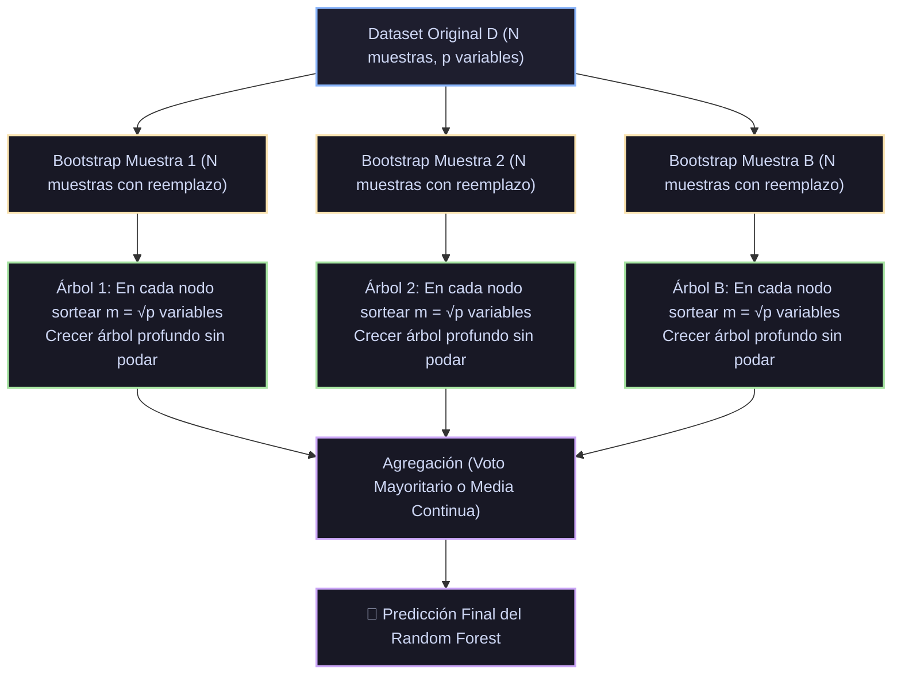

# Monografía de Análisis de Papers Seminales: Random Forest y Métodos de Ensamble por Aleatorización
## Bagging (Breiman, 1996), Random Subspace (Ho, 1998), Bosques Aleatorios (Breiman, 2001) y Estimación OOB

**Autoría del compendio analítico:** Sistema de Razonamiento Científico de Prig IDE  
**Módulo correspondiente:** `docs/algoritmos_ml/04_random_forest.md`  
**Estado:** Documentación canónica en texto plano para repositorio público en GitHub  

---

## 1. Ficha Bibliográfica y Metadatos Formales de los Papers Seminales

| Algoritmo / Mecanismo | Publicación Seminal | Autores | Editorial / Journal | Identificador Digital / Cita Canónica |
|---|---|---|---|---|
| **Bagging (Bootstrap Aggregating)** | *Bagging Predictors* (1996) | Leo Breiman | *Machine Learning*, Vol. 24, No. 2, pp. 123–140 | [DOI: 10.1007/BF00058655](https://doi.org/10.1007/BF00058655) |
| **Estimación Out-Of-Bag (OOB)** | *Out-Of-Bag Estimation* (1996) | Leo Breiman | Technical Report, Department of Statistics, UC Berkeley | Breiman (1996b); UC Berkeley Statistics Tech Report 511 |
| **Random Subspace Method** | *The Random Subspace Method for Constructing Decision Forests* (1998) | Tin Kam Ho | *IEEE Transactions on Pattern Analysis and Machine Intelligence*, 20(8), pp. 832–844 | [DOI: 10.1109/34.709601](https://doi.org/10.1109/34.709601); Ho (1995, *ICDAR*) |
| **Random Forests (Fundacional)** | *Random Forests* (2001) | Leo Breiman | *Machine Learning*, Vol. 45, No. 1, pp. 5–32 | [DOI: 10.1023/A:1010933404324](https://doi.org/10.1023/A:1010933404324) |
| **Extremely Randomized Trees (Extra-Trees)** | *Extremely randomized trees* (2006) | Pierre Geurts, Damien Ernst & Louis Wehenkel | *Machine Learning*, Vol. 63, No. 1, pp. 3–42 | [DOI: 10.1007/s10994-006-6226-1](https://doi.org/10.1007/s10994-006-6226-1) |

---

## 2. Génesis Teórica: El Dilema Sesgo-Varianza y la Inestabilidad Estructural

### 2.1. Por qué los Árboles de Decisión son "Estimadores Inestables"
Leo Breiman (1996) clasificó formalmente los algoritmos de aprendizaje en dos familias según su sensibilidad muestral:
1. **Estimadores Estables:** Pequeñas perturbaciones en el conjunto de entrenamiento generan cambios infinitesimales en la hipótesis final (ej. Mínimos Cuadrados Ordinarios, Regresión Ridge, k-NN con $k$ grande).
2. **Estimadores Inestables:** Pequeñas perturbaciones o la eliminación de una sola muestra en los datos induce cambios drásticos en la topología de la función estimada (ej. Árboles de Decisión no podados, Redes Neuronales multicapa profundas, selección de variables por pasos).

En los árboles de decisión (CART), esta inestabilidad obedece a la naturaleza jerárquica de la optimización greedy: una variación microscópica en los datos puede alterar la variable o el umbral elegido en el nodo raíz. A partir de allí, todas las particiones hijas se recalculan sobre subconjuntos de datos radicalmente disjuntos, produciendo predictores finales con **sesgo muy bajo** (capaces de aproximar casi cualquier función no lineal) pero con una **varianza muestral gigantesca**.

### 2.2. El Teorema de Reducción de Varianza de Bagging (Breiman, 1996)
Breiman propuso generar $B$ conjuntos de datos sintéticos $D_1, D_2, \dots, D_B$ mediante remuestreo **bootstrap con reemplazo** de tamaño $N$, entrenar un modelo independiente $T(x; D_b)$ en cada réplica y agregar sus predicciones por promedio:
$$\bar{f}_B(x) = \frac{1}{B} \sum_{b=1}^B T(x; D_b)$$

#### Demostración de la Varianza del Ensamble con Correlación por Pares:
**Teorema:** Supongamos que cada árbol individual $T_b(x)$ es una variable aleatoria con varianza finita $\text{Var}(T_b(x)) = \sigma^2(x)$ y correlación por pares promedio $\rho(x) = \text{Corr}(T_j(x), T_k(x))$ para todo $j \ne k$. Entonces, la varianza del ensamble promedio es:
$$\text{Var}(\bar{f}_B(x)) = \rho(x) \sigma^2(x) + \frac{1 - \rho(x)}{B} \sigma^2(x)$$

**Demostración:**
Por las propiedades elementales de la varianza de combinaciones lineales:
$$\begin{aligned}
\text{Var}\left( \frac{1}{B} \sum_{b=1}^B T_b \right) &= \frac{1}{B^2} \text{Var}\left( \sum_{b=1}^B T_b \right) = \frac{1}{B^2} \left[ \sum_{b=1}^B \text{Var}(T_b) + \sum_{j \ne k} \text{Cov}(T_j, T_k) \right] \\
&= \frac{1}{B^2} \left[ B \sigma^2 + B(B - 1) \rho \sigma^2 \right] \\
&= \frac{\sigma^2}{B} + \frac{B - 1}{B} \rho \sigma^2 = \frac{\sigma^2}{B} + \rho \sigma^2 - \frac{\rho \sigma^2}{B} \\
&= \rho \sigma^2 + \frac{1 - \rho}{B} \sigma^2
\end{aligned}$$

#### Análisis Asintótico Fundamental:
Tomando el límite cuando el número de árboles $B \to \infty$:
$$\lim_{B \to \infty} \text{Var}(\bar{f}_B(x)) = \rho(x) \sigma^2(x)$$

**Conclusión Teórica Vital:**  
Aumentar el número de réplicas bootstrap $B$ amortigua el segundo término $\frac{1-\rho}{B}\sigma^2 \to 0$, pero **la varianza del ensamble está acotada inferiormente por $\rho \sigma^2$**.  
En el Bagging estándar, dado que todas las réplicas bootstrap provienen del mismo dataset original, los árboles entrenados en ellas tienden a parecerse mucho entre sí, seleccionando las mismas variables dominantes en los primeros niveles. En consecuencia, la correlación $\rho$ permanece significativamente alta ($\rho \approx 0.6-0.8$), limitando el techo de reducción de varianza.  
Para derribar esa barrera, era matemáticamente imperativo **diseñar un mecanismo que forzara a los árboles a decorrelacionarse ($\rho \to 0$) sin inflar su sesgo**.

---

## 3. Análisis Profundo de Breiman (2001) - Random Forests

### 3.1. El Salto Conceptual: Random Subspace en Cada División
Tin Kam Ho (1995, 1998) había propuesto el *Random Subspace Method*: seleccionar un subconjunto aleatorio de características antes de entrenar cada árbol. Sin embargo, en el método de Ho, el subconjunto de características quedaba fijado para todo el árbol.

Leo Breiman (2001) unificó Bagging y el método de subespacios con una modificación revolucionaria:
> En lugar de sortear un subconjunto de variables una sola vez por árbol, **sortear un subconjunto aleatorio de $m \ll p$ variables candidatas de forma estocástica e independiente en cada bifurcación de cada nodo interno**.



#### Reglas Seminales para el Hiperparámetro $m$ (en scikit-learn: `max_features`):
- **Clasificación:** $m = \lfloor \sqrt{p} \rfloor$.
- **Regresión:** $m = \lfloor p / 3 \rfloor$, con un tamaño mínimo de hoja `min_samples_leaf = 5`.

#### ¿Por qué el muestreo por nodo es superior al muestreo por árbol?
Si existe una variable predictora extraordinariamente dominante en el dataset (ej. una correlación masiva con el target), el Bagging clásico la elegirá como la raíz en casi el 100% de los árboles, haciendo que todos los árboles sean idénticos en su nivel superior y manteniendo $\rho$ elevado.  
Al forzar que en cada división solo se consideren $m = \sqrt{p}$ variables elegidas al azar, existe una probabilidad de $1 - \frac{m}{p}$ de que la variable dominante **ni siquiera esté disponible** para esa bifurcación. Esto obliga al árbol a explorar variables secundarias, terciarias o interacciones sutiles que de otro modo jamás habrían sido descubiertas, **desplomando la correlación $\rho$ entre árboles a valores cercanos a $0.1-0.2$**.

### 3.2. La Ley de los Grandes Números y la Inmunidad al Sobreajuste
Uno de los temores habituales en Machine Learning es que añadir más capacidad o estimadores a un modelo termine sobreajustando los datos de entrenamiento. Breiman (2001) demostró formalmente que **Random Forest es inmune al sobreajuste por adición de árboles**.

#### Formulación de la Cota de Error de Generalización:
Sea un clasificador por ensamble $\{h(x, \Theta_b)\}_{b=1}^B$, donde $\Theta_b$ es un vector aleatorio que resume el sorteo del bootstrap y los subespacios de variables en cada nodo.
Para una muestra $(X, Y)$, se define la **función de margen**:
$$mr(X, Y) = P_\Theta(h(X, \Theta) = Y) - \max_{j \ne Y} P_\Theta(h(X, \Theta) = j)$$
El margen mide la extensión en que la proporción promedio de votos por la clase correcta supera a la proporción de votos por la clase competidora más cercana. Si $mr(X, Y) > 0$, el ensamble clasifica correctamente.

El error de generalización es la probabilidad de que el margen sea negativo:
$$PE^* = P_{X, Y}(mr(X, Y) < 0)$$

**Teorema de Convergencia de Breiman:**  
A medida que el número de árboles $B \to \infty$, la Ley Fuerte de los Grandes Números garantiza que:
$$PE^* \xrightarrow{a.s.} P_{X, Y}\left( P_\Theta(h(X, \Theta) = Y) - \max_{j \ne Y} P_\Theta(h(X, \Theta) = j) < 0 \right)$$
Esto implica que el error de generalización **converge a un límite superior finito asintótico**. Random Forest **no puede sobreajustar simplemente por incrementar el número de árboles $B$**; añadir más árboles únicamente estabiliza la aproximación numérica de la integral de Monte Carlo.

#### La Cota de Breiman sobre el Rendimiento:
Breiman derivó una cota superior elegante para el error asintótico en función de dos propiedades contrapuestas:
$$PE^* \le \frac{\bar{\rho}(1 - s^2)}{s^2}$$
donde:
- $s = \mathbb{E}_{X, Y}[mr(X, Y)]$ es la **fuerza media (*strength*)** de los árboles individuales (qué tan buenos son clasificando por sí solos, margen esperado).
- $\bar{\rho}$ es la **correlación media (*mean correlation*)** entre los residuos de los árboles.

**El Principio Óptimo de Random Forest:**  
Para minimizar el error de generalización, el algoritmo debe optimizar simultáneamente dos fuerzas ortogonales:
1. **Maximizar la fuerza individual $s$:** Mantener los árboles **completamente crecidos sin podar** para que su sesgo individual sea prácticamente nulo.
2. **Minimizar la correlación $\bar{\rho}$:** Reducir el número de variables consideradas por división ($m = \sqrt{p}$) para que los árboles sean lo más diversos e independientes posible.

---

## 4. Análisis Riguroso de la Estimación Out-Of-Bag (OOB)

### 4.1. Deducción Analítica del Factor $1/e \approx 36.8\%$
En cada árbol $b$, se extrae una muestra bootstrap de tamaño $N$ con reemplazo a partir del dataset original de $N$ observaciones.

**Pregunta matemática:** ¿Cuál es la probabilidad de que una observación particular $x_i$ **no sea seleccionada en absoluto** en la muestra bootstrap de ese árbol?

1. En un sorteo individual con reemplazo, la probabilidad de elegir la muestra $i$ es $\frac{1}{N}$.
2. La probabilidad de que la muestra $i$ no sea elegida en ese sorteo individual es $1 - \frac{1}{N}$.
3. Como el bootstrap realiza $N$ sorteos independientes e idénticos con reemplazo, la probabilidad de que la muestra $i$ quede fuera en todos los $N$ intentos es:
   $$P(i \notin D_b) = \left( 1 - \frac{1}{N} \right)^N$$
4. Tomando el límite asintótico para $N$ moderado o grande:
   $$\lim_{N \to \infty} \left( 1 - \frac{1}{N} \right)^N = \exp\left( \lim_{N \to \infty} N \ln\left(1 - \frac{1}{N}\right) \right) = \exp(-1) = \frac{1}{e} \approx 0.367879 \dots \approx 36.8\%$$

**Consecuencia:** En promedio, **el 36.8% de las observaciones de entrenamiento quedan excluidas de cada árbol**. A este conjunto residual se le denomina **Muestras Out-Of-Bag (OOB)**.

### 4.2. El Estimador OOB y la Eliminación del Cross-Validation
Para cada muestra $x_i$ en el conjunto de entrenamiento:
1. Identificamos el subconjunto de árboles $\mathcal{B}_i \subset \{1, \dots, B\}$ en cuyo entrenamiento la muestra $x_i$ **no participó** (es decir, donde $x_i \in \text{OOB}_b$).
2. Dado que cada árbol tiene probabilidad $\approx 0.368$ de ser OOB para $x_i$, el cardinal esperado es $|\mathcal{B}_i| \approx 0.368 \cdot B$. Para un bosque típico de $B = 500$ árboles, $x_i$ es evaluada por aproximadamente $184$ árboles independientes.
3. Se agrega la predicción únicamente sobre los árboles de $\mathcal{B}_i$:
   $$\hat{y}_i^{\text{OOB}} = \arg\max_k \frac{1}{|\mathcal{B}_i|} \sum_{b \in \mathcal{B}_i} \mathbb{I}(T_b(x_i) = k)$$
4. El **Error OOB global** es el promedio del error sobre todas las muestras:
   $$\text{Error}_{\text{OOB}} = \frac{1}{N} \sum_{i=1}^N \mathcal{L}(y_i, \hat{y}_i^{\text{OOB}})$$

#### Teorema del Estimador Insesgado de OOB (Breiman, 1996b):
El error OOB es un **estimador insesgado del error de prueba (*test error*) verdadero**. La estimación OOB rinde resultados prácticamente indistinguibles de una validación cruzada $N$-fold (Leave-One-Out) exhaustiva, pero **a costo computacional cero adicional**, ya que se calcula durante el propio ciclo de entrenamiento.

---

## 5. Métricas de Importancia de Variables en Random Forest

Breiman introdujo dos metodologías para cuantificar la relevancia de los predictores en la estructura del bosque:

### 5.1. MDI (Mean Decrease in Impurity / Importancia de Gini)
Para cada variable $x_j$, se suma la reducción de impureza ponderada $\Delta i(s_t)$ en todos los nodos $t$ de todos los árboles $B$ donde la división se realizó sobre la variable $j$:
$$\text{MDI}(j) = \frac{1}{B} \sum_{b=1}^B \sum_{t \in T_b : v(t) = j} \frac{N_t}{N} \Delta i(s_t, t)$$
- **Ventaja:** Extremadamente rápida de calcular (es un subproducto inmediato del entrenamiento).
- **Sesgo Crítico (Strobl et al., 2007):** Favorece sistemáticamente a variables continuas con muchos valores únicos o variables categóricas con alta cardinalidad frente a variables binarias igualmente informativas.

### 5.2. MDA (Mean Decrease in Accuracy / Permutation Importance)
Considerada el estándar de oro en estadística e interpretabilidad de caja negra:
1. Para cada árbol $b$, se calcula su exactitud base sobre su conjunto $\text{OOB}_b$.
2. Para la variable $j$, se permutan aleatoriamente los valores de la columna $j$ en el conjunto $\text{OOB}_b$, destruyendo artificialmente la correlación entre $x_j$ y el target $y$ pero conservando intacta la distribución marginal.
3. Se evalúa nuevamente la exactitud del árbol sobre el OOB permutado.
4. La disminución de exactitud promedio a través de los $B$ árboles es la importancia por permutación de la variable $j$:
   $$\text{MDA}(j) = \frac{1}{B} \sum_{b=1}^B \left( \text{Acc}(\text{OOB}_b) - \text{Acc}(\text{OOB}_b^{\pi_j}) \right)$$
- **Propiedad Fundamental:** Es completamente **insesgada respecto a la cardinalidad o escala** de la variable y refleja el impacto real en la capacidad de generalización del ensamble.

---

## 6. Matriz de Proximidades y Aprendizaje No Supervisado

Breiman ideó un método no paramétrico para medir la similitud entre observaciones mediante la topología del bosque:
1. Se inicializa una matriz de proximidades simétrica $P \in \mathbb{R}^{N \times N}$ en cero.
2. Para cada árbol $b$, se propagan todas las $N$ muestras hasta sus hojas terminales.
3. Si la muestra $i$ y la muestra $j$ aterrizan en la **misma hoja terminal**, se incrementa su proximidad:
   $$P(i, j) \leftarrow P(i, j) + \frac{1}{B}$$
4. La matriz resultante satisface $P(i, i) = 1$ y $P(i, j) \in [0, 1]$.

**Aplicaciones Científicas:**
- **Clustering No Supervisado:** Generando datos sintéticos de ruido para contrastar contra los datos reales, el bosque aprende a distinguir estructura frente a aleatoriedad pura. La matriz de proximidades resultante se alimenta a algoritmos de clustering espectral o jerárquico.
- **Detección de Outliers:** Una muestra cuyo promedio de proximidad cuadrática con todas las demás observaciones sea anormalmente bajo se cataloga matemáticamente como un valor atípico.
- **Imputación de Valores Faltantes en Matriz de Diseño:** Los valores perdidos se imputan iterativamente como la media o moda ponderada de las observaciones más próximas según la matriz $P$.

---

## 7. Variante: Extremely Randomized Trees (Extra-Trees, Geurts et al., 2006)

Pierre Geurts, Damien Ernst y Louis Wehenkel propusieron en 2006 una variante radical de Random Forest: **Extra-Trees (*Extremely Randomized Trees*)**.

| Dimensión Algorítmica | Random Forest Clásico (Breiman, 2001) | Extra-Trees (Geurts et al., 2006) |
|---|---|---|
| **Muestreo de Datos** | Bootstrap con reemplazo ($N$ de $N$) | Muestra completa original (sin bootstrap por defecto) |
| **Selección de Variables** | Aleatoria ($m = \sqrt{p}$) en cada nodo | Aleatoria ($m = \sqrt{p}$) en cada nodo |
| **Selección de Umbrales ($\theta$)** | Búsqueda exhaustiva greedy del mejor umbral $\theta^*$ que maximiza $\Delta i$ | **Completamente aleatoria:** Se sortea $\theta_j \sim \text{Uniforme}(\min x_j, \max x_j)$ para cada variable candidata sin optimizar |
| **Varianza vs. Sesgo** | Reducción de varianza equilibrada | Reducción extrema de varianza a costa de un incremento muy leve de sesgo |
| **Costo Computacional por División** | $O(m \cdot N_t \log N_t)$ (requiere ordenar) | $O(m)$ (evaluación instantánea sin ordenar) |

Al eludir la ordenación y el escaneo exhaustivo de umbrales, Extra-Trees entrena con frecuencia entre 3 y 5 veces más rápido que Random Forest clásico y produce fronteras de decisión aún más suaves.

---

## 8. Implementación Pura en Python/NumPy desde Cero

El siguiente módulo implementa de forma autocontenida un **Random Forest de Clasificación** con cálculo analítico de **Error Out-Of-Bag (OOB)** e **Importancia de Variables por Permutación (MDA)** utilizando únicamente NumPy.

```python
"""
Implementación de Referencia: Random Forest con OOB y MDA en NumPy Puro.
Demostración de:
1. Muestreo Bootstrap con seguimiento de índices OOB.
2. Selección estocástica de subespacios de características (m = sqrt(p)).
3. Ensamble de árboles CART profundos y voto mayoritario vectorizado.
4. Estimación no sesgada del error Out-Of-Bag (OOB).
5. Importancia de características por permutación (MDA).
"""

import numpy as np


class NodoRF:
    """Nodo del árbol interno de Random Forest."""
    def __init__(self, variable=None, umbral=None, izq=None, der=None, *, clase=None):
        self.variable = variable
        self.umbral = umbral
        self.izq = izq
        self.der = der
        self.clase = clase

    @property
    def es_hoja(self):
        return self.clase is not None


def gini_impureza(y, n_clases):
    """Calcula 1 - sum(p_k^2)."""
    m = len(y)
    if m == 0:
        return 0.0
    conteos = np.bincount(y, minlength=n_clases)
    p = conteos / m
    return 1.0 - np.sum(p**2)


def mejor_corte_rf(X, y, n_clases, m_features, min_samples_leaf=1):
    """
    Evalúa solo un subconjunto aleatorio de m_features en cada bifurcación.
    """
    N, D = X.shape
    if N <= 1:
        return None, None

    gini_padre = gini_impureza(y, n_clases)
    # Sorteo aleatorio sin reemplazo de m características candidatas
    vars_candidatas = np.random.choice(D, size=m_features, replace=False)

    mejor_ganancia = -1.0
    mejor_var = None
    mejor_umbral = None

    for j in vars_candidatas:
        col = X[:, j]
        idx_ord = np.argsort(col)
        x_ord = col[idx_ord]
        y_ord = y[idx_ord]

        # Puntos de cambio
        cambios = np.where(x_ord[:-1] != x_ord[1:])[0]
        for idx in cambios:
            n_L = idx + 1
            n_R = N - n_L
            if n_L < min_samples_leaf or n_R < min_samples_leaf:
                continue

            g_L = gini_impureza(y_ord[:n_L], n_clases)
            g_R = gini_impureza(y_ord[n_L:], n_clases)
            ganancia = gini_padre - ((n_L / N) * g_L + (n_R / N) * g_R)

            if ganancia > mejor_ganancia:
                mejor_ganancia = ganancia
                mejor_var = j
                mejor_umbral = (x_ord[idx] + x_ord[idx + 1]) / 2.0

    return mejor_var, mejor_umbral


def construir_arbol_rf(X, y, n_clases, m_features, max_depth, depth=0):
    """Construye recursivamente un árbol aleatorizado individual."""
    N = len(y)
    clase_moda = int(np.argmax(np.bincount(y, minlength=n_clases)))

    if len(np.unique(y)) == 1 or depth >= max_depth or N < 4:
        return NodoRF(clase=clase_moda)

    var, umbral = mejor_corte_rf(X, y, n_clases, m_features)
    if var is None:
        return NodoRF(clase=clase_moda)

    mask = X[:, var] <= umbral
    izq = construir_arbol_rf(X[mask], y[mask], n_clases, m_features, max_depth, depth + 1)
    der = construir_arbol_rf(X[~mask], y[~mask], n_clases, m_features, max_depth, depth + 1)
    return NodoRF(variable=var, umbral=umbral, izq=izq, der=der)


def predecir_arbol(x, nodo):
    if nodo.es_hoja:
        return nodo.clase
    if x[nodo.variable] <= nodo.umbral:
        return predecir_arbol(x, nodo.izq)
    return predecir_arbol(x, nodo.der)


class RandomForestClasificador:
    """Implementación de referencia de Random Forest (Breiman, 2001)."""
    def __init__(self, n_estimators=50, max_depth=10, max_features=None):
        self.n_estimators = n_estimators
        self.max_depth = max_depth
        self.max_features = max_features
        self.arboles = []
        self.oob_indices = []  # Lista de boolean masks con muestras OOB por árbol
        self.n_clases = None
        self.oob_score_ = None

    def fit(self, X, y):
        N, D = X.shape
        self.n_clases = len(np.unique(y))
        m = self.max_features or int(np.sqrt(D))
        m = max(1, min(D, m))

        self.arboles = []
        self.oob_indices = []

        # Matriz de votos OOB acumulados: forma (N, n_clases)
        votos_oob = np.zeros((N, self.n_clases))

        for b in range(self.n_estimators):
            # 1. Muestreo Bootstrap con reemplazo
            idx_boot = np.random.choice(N, size=N, replace=True)
            # 2. Identificar muestras Out-Of-Bag
            oob_mask = np.ones(N, dtype=bool)
            oob_mask[idx_boot] = False
            self.oob_indices.append(oob_mask)

            # 3. Entrenar árbol aleatorizado
            X_b = X[idx_boot]
            y_b = y[idx_boot]
            raiz = construir_arbol_rf(X_b, y_b, self.n_clases, m, self.max_depth)
            self.arboles.append(raiz)

            # 4. Registrar predicciones OOB
            if np.any(oob_mask):
                preds_oob = [predecir_arbol(x, raiz) for x in X[oob_mask]]
                for idx_local, sample_idx in enumerate(np.where(oob_mask)[0]):
                    pred_clase = preds_oob[idx_local]
                    votos_oob[sample_idx, pred_clase] += 1

        # 5. Calcular OOB Score sobre muestras que recibieron al menos un voto OOB
        con_voto = np.sum(votos_oob, axis=1) > 0
        if np.any(con_voto):
            pred_final_oob = np.argmax(votos_oob[con_voto], axis=1)
            self.oob_score_ = np.mean(pred_final_oob == y[con_voto])

        return self

    def predict(self, X):
        """Voto mayoritario a través de todos los árboles del bosque."""
        votos = np.zeros((len(X), self.n_clases))
        for raiz in self.arboles:
            for i, x in enumerate(X):
                pred = predecir_arbol(x, raiz)
                votos[i, pred] += 1
        return np.argmax(votos, axis=1)

    def permutation_importance_mda(self, X, y):
        """Calcula la importancia por permutación (Mean Decrease in Accuracy)."""
        score_base = np.mean(self.predict(X) == y)
        importancias = np.zeros(X.shape[1])

        for j in range(X.shape[1]):
            X_perm = X.copy()
            np.random.shuffle(X_perm[:, j])  # Romper correlación de la variable j
            score_perm = np.mean(self.predict(X_perm) == y)
            importancias[j] = score_base - score_perm

        return importancias


# Demostración del funcionamiento en datos no lineales
if __name__ == "__main__":
    np.random.seed(42)
    N = 150
    # Dos variables informativas (círculos concéntricos) y dos variables de ruido puro
    radio = np.random.uniform(0.1, 1.5, N)
    angulo = np.random.uniform(0, 2 * np.pi, N)
    x1 = radio * np.cos(angulo)
    x2 = radio * np.sin(angulo)
    x_ruido1 = np.random.randn(N)
    x_ruido2 = np.random.randn(N)

    X = np.column_stack([x1, x2, x_ruido1, x_ruido2])
    y = (radio > 0.8).astype(int)

    rf = RandomForestClasificador(n_estimators=30, max_depth=6)
    rf.fit(X, y)
    exactitud = np.mean(rf.predict(X) == y)
    importancias = rf.permutation_importance_mda(X, y)

    print("=== Rendimiento del Random Forest Puro ===")
    print("Exactitud en entrenamiento:", round(float(exactitud) * 100, 2), "%")
    print("Exactitud Out-Of-Bag (OOB Score):", round(float(rf.oob_score_) * 100, 2), "%")
    print("Importancias MDA (x1, x2, ruido1, ruido2):", np.round(importancias, 3))
```

---

## 9. Directrices de Razonamiento para los Modelos de Inteligencia Artificial en Prig IDE

Cuando un modelo de lenguaje en Prig IDE audite, optimice o explique pipelines de Random Forest (`RandomForestClassifier`, `RandomForestRegressor`), aplicará el siguiente decálogo de razonamiento técnico:

1. **Monitoreo y Aprovechamiento de OOB:**
   - Si el usuario ejecuta validaciones cruzadas costosas (`cross_val_score(cv=10)`) sobre datasets gigantescos, recomendar encarecidamente activar `oob_score=True`. El error OOB proporciona una estimación rigurosamente insesgada del error de prueba en una sola pasada de entrenamiento, reduciendo el tiempo de cómputo en un factor de $K$.
2. **Control del Número de Estimadores (`n_estimators`):**
   - Recordar que **Random Forest no sobreajusta por aumentar `n_estimators`**. El error converge casi con certeza a una cota límite asintótica. La única penalización por un valor excesivo de árboles es el coste computacional y de memoria. Un rango de $[100, 500]$ es casi siempre óptimo para el compromiso precisión/velocidad.
3. **Ajuste Fino de la Correlación vs. Fuerza (`max_features`):**
   - Si el modelo exhibe sobreajuste o varianza residual elevada, **reducir `max_features`** (ej. probar con valores menores como `log2(p)` o reducir el ratio de variables). Esto disminuye la correlación $\bar{\rho}$ entre los árboles.
   - Si el modelo sufre de bajo rendimiento por exceso de ruido, aumentar ligeramente `max_features` para mejorar la fuerza individual de cada árbol.
4. **Elección entre Random Forest y Gradient Boosting en Kaggle:**
   - **Elegir Random Forest cuando:** Se requiera un clasificador sumamente robusto sin necesidad de afinar decenas de hiperparámetros, con capacidad de paralelización trivial en todos los cores de CPU (`n_jobs=-1`), y resistente a ruidos o etiquetas incorrectas.
   - **Elegir Gradient Boosting cuando:** Se busque exprimir hasta la última milésima de precisión en competencias de datos tabulares limpios, asumiendo la necesidad de regularización temprana (`early_stopping_rounds`, learning rate bajo).

