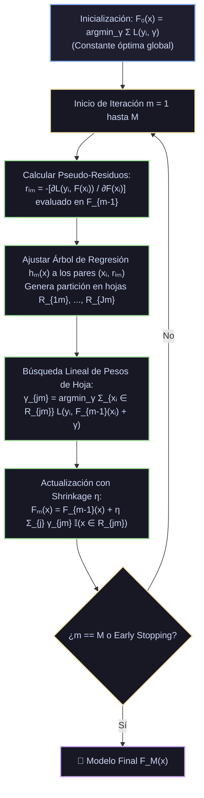
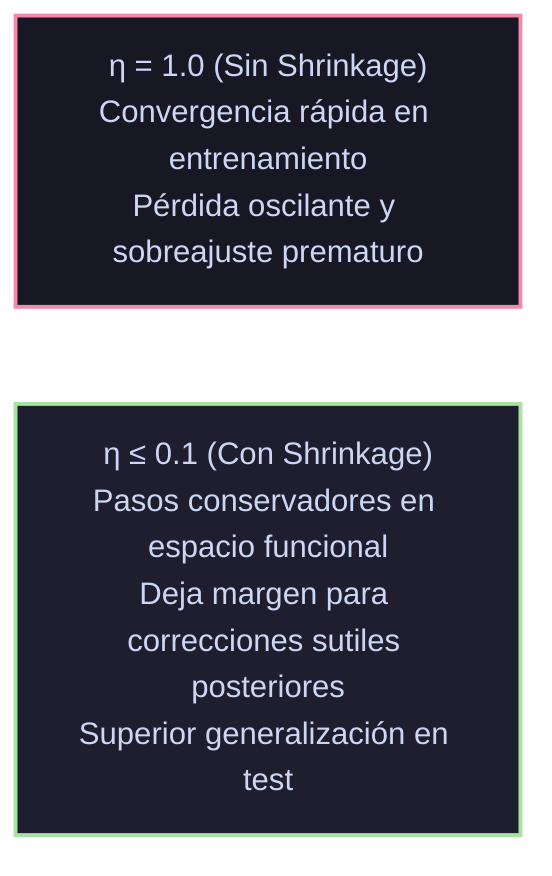

# Monografía de Análisis de Papers Seminales: Gradient Boosting Machines (GBM)
## Descenso de Gradiente en Espacio de Funciones, Pseudo-Residuos, Shrinkage y Boosting Estocástico

**Autoría del compendio analítico:** Sistema de Razonamiento Científico de Prig IDE  
**Módulo correspondiente:** `docs/algoritmos_ml/05_gradient_boosting_gbm.md`  
**Estado:** Documentación canónica en texto plano para repositorio público en GitHub  

---

## 1. Ficha Bibliográfica y Metadatos Formales de los Papers Seminales

| Algoritmo / Modelo | Publicación Seminal | Autores | Editorial / Journal | Identificador Digital / Cita Canónica |
|---|---|---|---|---|
| **La Fuerza de los Aprendices Débiles** | *The strength of weak learnability* (1990) | Robert E. Schapire | *Machine Learning*, Vol. 5, No. 2, pp. 197–227 | [DOI: 10.1007/BF00116037](https://doi.org/10.1007/BF00116037) |
| **AdaBoost (Adaptive Boosting)** | *A Decision-Theoretic Generalization of on-Line Learning and an Application to Boosting* (1997) | Yoav Freund & Robert E. Schapire | *Journal of Computer and System Sciences*, 55(1), pp. 119–139 | [DOI: 10.1006/jcss.1997.1504](https://doi.org/10.1006/jcss.1997.1504); Freund & Schapire (1995, *ICML*) |
| **Modelos Aditivos y Perspectiva Estadística** | *Additive Logistic Regression: A Statistical View of Boosting* (2000) | Jerome H. Friedman, Trevor Hastie & Robert Tibshirani | *The Annals of Statistics*, Vol. 28, No. 2, pp. 337–407 | [DOI: 10.1214/aos/1016218223](https://doi.org/10.1214/aos/1016218223) |
| **Boosting como Descenso Funcional** | *Boosting Algorithms as Gradient Descent in Function Space* (1999) | Llew Mason, Jonathan Baxter, Peter L. Bartlett & Marcus Frean | *Advances in Neural Information Processing Systems (NeurIPS 1999)*, Vol. 12, pp. 512–518 | [NeurIPS Proceedings](https://proceedings.neurips.cc/paper/1999/hash/5fb1b70267dd4a1e25995c24723cef0e-Abstract.html) |
| **Gradient Boosting Machine (GBM Fundacional)** | *Greedy Function Approximation: A Gradient Boosting Machine* (2001) | Jerome H. Friedman | *The Annals of Statistics*, Vol. 29, No. 5, pp. 1189–1232 | [DOI: 10.1214/aos/1013203451](https://doi.org/10.1214/aos/1013203451); Tech Report 1999 |
| **Stochastic Gradient Boosting** | *Stochastic Gradient Boosting* (2002) | Jerome H. Friedman | *Computational Statistics & Data Analysis*, Vol. 38, No. 4, pp. 367–378 | [DOI: 10.1016/S0167-9473(01)00065-2](https://doi.org/10.1016/S0167-9473(01)00065-2) |

---

## 2. Génesis Teórica: De AdaBoost al Descenso de Gradiente Funcional

### 2.1. El Teorema de Schapire y la Formulación de AdaBoost
En 1990, Robert Schapire resolvió afirmativamente la célebre conjetura de Valiant sobre aprendizaje PAC (*Probably Approximately Correct*): **la aprendibilidad débil equivale matemáticamente a la aprendibilidad fuerte**. Cualquier hipótesis base que rinda ligeramente mejor que el azar ($50\% + \epsilon$) puede combinarse sistemáticamente para construir un clasificador con precisión arbitrariamente alta.

Freund y Schapire (1995, 1997) materializaron este teorema creando **AdaBoost**:
$$F_M(x) = \sum_{m=1}^M \alpha_m h_m(x), \quad h_m(x) \in \{-1, +1\}$$
AdaBoost reponderaba las instancias de entrenamiento asignando mayor masa de probabilidad $w_{i, m+1} \propto w_{im} \exp(-\alpha_m y_i h_m(x_i))$ a aquellas muestras clasificadas incorrectamente en la ronda previa.

### 2.2. Las Limitaciones Críticas de AdaBoost
A pesar de su éxito práctico, la estadística matemática pronto identificó tres defectos estructurales en AdaBoost:
1. **Pérdida Exponencial Hipersensible al Ruido:**
   Friedman, Hastie y Tibshirani (2000) demostraron que AdaBoost minimiza de forma secuencial la función de pérdida exponencial:
   $$\mathcal{L}_{\text{exp}}(y, F(x)) = \exp(-y F(x)), \quad y \in \{-1, +1\}$$
   Si una observación es errónea, ruidosa o un valor atípico de etiqueta invertida ($y f(x) \ll 0$), su penalización crece a una tasa exponencial $\exp(+|yF|)$. AdaBoost concentra casi toda su atención en acomodar estos puntos patológicos, degradando severamente la generalización en problemas con etiquetas ruidosas.
2. **Restricción a Clasificación Binaria:** La formulación de pesos multiplicativos no se extendía de forma natural a regresión continua, estimación de cuantiles o distribución de Poisson.
3. **Miopía en la Optimización de Enlace:** La función exponencial no proporciona probabilidades calibradas directas sin transformaciones heurísticas post-hoc.

### 2.3. El Salto Conceptual: Descenso en el Espacio de Hilbert de Funciones
Llew Mason et al. (1999) y de forma magistral Jerome H. Friedman (2001) reconceptualizaron el problema:
> En lugar de reponderar heurísticamente datos bajo una pérdida exponencial, **el boosting es formalmente un algoritmo de Descenso de Gradiente numérico ejecutado directamente sobre el espacio de funciones no paramétrico**.

En optimización estándar en $\mathbb{R}^p$, buscamos un vector óptimo $\theta^* = \arg\min_\theta J(\theta)$ actualizando secuencialmente:
$$\theta_m = \theta_{m-1} - \eta \nabla_\theta J(\theta_{m-1})$$

En Gradient Boosting, buscamos una función óptima $F^* \in \mathcal{H}$ en un espacio de funciones continuas que minimice el riesgo empírico bajo una pérdida arbitraria y diferenciable $\mathcal{L}(y, F(x))$:
$$\min_{F} \mathbb{E}_{X, Y}[\mathcal{L}(Y, F(X))] \approx \min_{F} \frac{1}{N} \sum_{i=1}^N \mathcal{L}(y_i, F(x_i))$$
Tratando el vector de predicciones en los puntos de entrenamiento $\mathbf{f} = [F(x_1), F(x_2), \dots, F(x_N)]^T \in \mathbb{R}^N$ como los parámetros a optimizar, la dirección de máximo descenso local es el **negativo del gradiente evaluated en cada punto de muestra**:
$$r_{im} = -\left[ \frac{\partial \mathcal{L}(y_i, F(x_i))}{\partial F(x_i)} \right]_{F(x) = F_{m-1}(x)}$$
A estos valores $r_{im}$ Friedman los denominó **Pseudo-Residuos**.

---

## 3. Análisis Profundo de Friedman (2001) - Greedy Function Approximation



### 3.1. El Algoritmo General de Gradient Boosting (Friedman, 2001)

#### Paso 1: Inicialización
Se inicializa el ensamble con una estimación constante $F_0(x)$ que minimiza la pérdida global sobre todo el conjunto de entrenamiento:
$$F_0(x) = \arg\min_\gamma \sum_{i=1}^N \mathcal{L}(y_i, \gamma)$$
- Para **Regresión MSE:** $F_0(x) = \bar{y} = \frac{1}{N} \sum y_i$ (la media).
- Para **Regresión MAE:** $F_0(x) = \text{mediana}(y)$.
- Para **Clasificación Binaria Log-Loss:** $F_0(x) = \ln\left( \frac{\bar{y}}{1 - \bar{y}} \right)$ (el log-odds base).

#### Paso 2: Iteraciones de Boosting ($m = 1, 2, \dots, M$)
Para cada paso secuencial $m$:
1. **Cálculo de Pseudo-Residuos:** Se calcula la pendiente negativa de la pérdida para cada observación $i \in \{1, \dots, N\}$:
   $$r_{im} = -\left[ \frac{\partial \mathcal{L}(y_i, F(x_i))}{\partial F(x_i)} \right]_{F(x) = F_{m-1}(x)}$$
2. **Proyección en la Familia de Estimadores Base:** El vector $\{r_{im}\}_{i=1}^N$ solo está definido sobre los puntos finitos del entrenamiento; no generaliza a nuevos $x$.  
   Para proyectar esta dirección de gradiente al espacio continuo completo, **se ajusta un árbol de regresión CART $h_m(x)$ a los pares de datos $\{(x_i, r_{im})\}_{i=1}^N$**, produciendo una partición en $J_m$ hojas disjuntas $R_{1m}, R_{2m}, \dots, R_{J_m m}$.
3. **Búsqueda Lineal de Hoja (*Leaf Value Optimization*):** Aunque el árbol se dividió usando mínimos cuadrados sobre los pseudo-residuos, el valor asignado a cada hoja $\gamma_{jm}$ debe optimizar directamente la **función de pérdida original $\mathcal{L}$**:
   $$\gamma_{jm} = \arg\min_\gamma \sum_{x_i \in R_{jm}} \mathcal{L}\left( y_i, F_{m-1}(x_i) + \gamma \right)$$
4. **Actualización Aditiva con Factor de Contracción (*Shrinkage* $\eta$):**
   $$F_m(x) = F_{m-1}(x) + \eta \sum_{j=1}^{J_m} \gamma_{jm} \mathbb{I}(x \in R_{jm})$$

---

## 4. Derivaciones Matemáticas para Funciones de Pérdida Canónicas

### 4.1. Mínimos Cuadrados (Regresión Gaussiana / L2)
$$\mathcal{L}(y, F) = \frac{1}{2} (y - F)^2$$
- **Gradiente negativo (Pseudo-residuo):**
  $$r_{im} = -\left[ -(y_i - F(x_i)) \right] = y_i - F_{m-1}(x_i)$$
  *(En pérdida cuadrática, el pseudo-residuo coincide exactamente con el residuo ordinario).*
- **Optimización de Hoja:**
  $$\gamma_{jm} = \arg\min_\gamma \sum_{x_i \in R_{jm}} \frac{1}{2} \left[ y_i - (F_{m-1}(x_i) + \gamma) \right]^2 = \arg\min_\gamma \sum_{x_i \in R_{jm}} \frac{1}{2} [r_{im} - \gamma]^2 \implies \gamma_{jm} = \frac{1}{|R_{jm}|} \sum_{x_i \in R_{jm}} r_{im}$$
  El valor de la hoja es simplemente el promedio de los residuos dentro de esa hoja.

### 4.2. Desviaciones Absolutas (Regresión Robusta / L1 / Laplace)
$$\mathcal{L}(y, F) = |y - F|$$
- **Gradiente negativo (Pseudo-residuo):**
  $$r_{im} = -\left[ -\text{sign}(y_i - F(x_i)) \right] = \text{sign}(y_i - F_{m-1}(x_i)) \in \{-1, +1\}$$
  *(El gradiente solo depende del signo del error, no de su magnitud. Los outliers enormes no tienen mayor fuerza que una muestra común).*
- **Optimización de Hoja:**
  $$\gamma_{jm} = \arg\min_\gamma \sum_{x_i \in R_{jm}} |(y_i - F_{m-1}(x_i)) - \gamma| \implies \gamma_{jm} = \text{mediana}_{x_i \in R_{jm}} \{ y_i - F_{m-1}(x_i) \}$$
  La hoja asigna la mediana de los residuos originales, confiriendo una robustez estadística indestructible ante perturbaciones extremas.

### 4.3. Pérdida de Huber (Regresión Híbrida L1/L2)
$$\mathcal{L}_\delta(y, F) = \begin{cases} \frac{1}{2}(y - F)^2 & \text{si } |y - F| \le \delta \\ \delta |y - F| - \frac{1}{2}\delta^2 & \text{si } |y - F| > \delta \end{cases}$$
Combina la convergencia rápida y diferenciabilidad estricta de $L_2$ en errores pequeños con la robustez lineal de $L_1$ en errores mayores a $\delta$, donde $\delta$ es el percentil $\alpha$ (ej. $90\%$) de los residuos absolutos.

### 4.4. Entropía Cruzada Binaria (Clasificación Bernoulli / Log-Loss)
Parametrizando con $y_i \in \{0, 1\}$ y la función de probabilidad logística $p(x) = \sigma(F(x)) = \frac{1}{1 + e^{-F(x)}}$:
$$\mathcal{L}(y_i, F(x_i)) = -\left[ y_i \ln p(x_i) + (1 - y_i) \ln(1 - p(x_i)) \right] = \ln(1 + e^{F(x_i)}) - y_i F(x_i)$$
- **Gradiente negativo (Pseudo-residuo):**
  $$r_{im} = -\left[ \sigma(F_{m-1}(x_i)) - y_i \right] = y_i - p_{m-1}(x_i)$$
  *(El pseudo-residuo es la diferencia directa entre la etiqueta observada $\{0, 1\}$ y la probabilidad prevista).*

#### Deducción de la Optimización de Hoja vía Newton-Raphson:
El problema exacto de la hoja no tiene solución analítica cerrada:
$$\gamma_{jm} = \arg\min_\gamma \sum_{x_i \in R_{jm}} \mathcal{L}(y_i, F_{m-1}(x_i) + \gamma)$$
Friedman aproximó la función de pérdida mediante una **expansión en serie de Taylor de segundo orden** alrededor de $\gamma = 0$:
$$\mathcal{L}(y_i, F_{m-1} + \gamma) \approx \mathcal{L}(y_i, F_{m-1}) + \gamma \left[\frac{\partial \mathcal{L}}{\partial F}\right] + \frac{\gamma^2}{2} \left[\frac{\partial^2 \mathcal{L}}{\partial F^2}\right]$$
Dado que $\frac{\partial \mathcal{L}}{\partial F} = -r_{im} = p_i - y_i$ y la segunda derivada es $\frac{\partial^2 \mathcal{L}}{\partial F^2} = p_i (1 - p_i)$:
$$\sum_{x_i \in R_{jm}} \mathcal{L}(y_i, F_{m-1} + \gamma) \approx \text{const} - \gamma \sum_{x_i \in R_{jm}} r_{im} + \frac{\gamma^2}{2} \sum_{x_i \in R_{jm}} p_{m-1}(x_i)(1 - p_{m-1}(x_i))$$
Derivando respecto a $\gamma$ e igualando a cero:
$$-\sum_{x_i \in R_{jm}} r_{im} + \gamma \sum_{x_i \in R_{jm}} p_{m-1}(x_i)(1 - p_{m-1}(x_i)) = 0$$
$$\gamma_{jm} = \frac{\sum_{x_i \in R_{jm}} r_{im}}{\sum_{x_i \in R_{jm}} p_{m-1}(x_i)(1 - p_{m-1}(x_i))}$$
Esta elegante fórmula de un solo paso de Newton es la utilizada universalmente en todas las librerías modernas (scikit-learn, XGBoost, LightGBM).

---

## 5. El Factor de Contracción (*Shrinkage / Learning Rate* $\eta$)

Uno de los aportes teóricos más trascendentales de Friedman (2001) fue el control de regularización mediante el **factor de contracción (*Shrinkage*)**:
$$F_m(x) = F_{m-1}(x) + \eta \cdot h_m(x), \quad 0 < \eta \le 1$$



### 5.1. Mecánica Matemática del Shrinkage
Si $\eta = 1.0$, el modelo toma el salto completo hacia el mínimo local en la dirección del árbol actual. Como los árboles base son aproximadores continuos ruidosos, el modelo sobreajusta los pseudo-residuos en pocas iteraciones ($M < 30$).  
Al imponer un factor pequeño (ej. $\eta = 0.05$ o $\eta = 0.01$):
1. Cada árbol solo aporta una fracción modesta a la hipótesis agregada.
2. Los árboles posteriores no están limitados por las decisiones miopes de los primeros árboles; pueden corregir gradualmente el error residual sobrante desde múltiples perspectivas ortogonales.
3. Se demuestra empíricamente que la relación entre el número de árboles óptimo $M^*$ y el learning rate sigue la escala inversa:
   $$M^* \propto \frac{1}{\eta}$$
   Reducir $\eta$ por un factor de 10 exige multiplicar $M$ por 10, pero **garantiza un error de validación estrictamente menor**.

---

## 6. Boosting Estocástico (Friedman, 2002)

Inspirado en el éxito de Bagging, Friedman (2002) introdujo la aleatorización estocástica en GBM: **Stochastic Gradient Boosting**.

En cada iteración $m$:
1. Se extrae un subconjunto aleatorio de tamaño $\tilde{N} = \mu N$ **sin reemplazo** del conjunto de entrenamiento, donde la fracción de submuestreo suele fijarse en $\mu \in [0.5, 0.8]$ (en scikit-learn: `subsample=0.8`).
2. Los pseudo-residuos $r_{im}$ y el árbol base $h_m(x)$ se computan **únicamente sobre este subconjunto aleatorio**.
3. Las hojas $\gamma_{jm}$ se actualizan usando las muestras de dicho subconjunto.

### Beneficios Teóricos Demostrados:
- **Reducción de Varianza:** Al igual que en Bagging, introducir perturbaciones estocásticas decorrelaciona los gradientes sucesivos, suprimiendo la varianza del ensamble.
- **Aceleración Computacional:** El costo de entrenar cada árbol disminuye en una proporción directa a $\mu$ ($O(\mu N \cdot p \log(\mu N))$).
- **Inmunidad a Mínimos Locales:** El ruido estocástico del gradiente ayuda al optimizador a escapar de regiones planas o depresiones no informativas del espacio funcional.

---

## 7. Comparativa Teórica: Bagging vs. Boosting

| Dimensión de Análisis | Bagging (Random Forest) | Boosting (Gradient Boosting Machine) |
|---|---|---|
| **Mecanismo Central** | Reducción de Varianza mediante promediado | Reducción de Sesgo mediante ajuste secuencial a residuos |
| **Construcción de Árboles** | Totalmente en **paralelo** e independientes | Estrictamente **secuencial** dependiente del modelo previo |
| **Profundidad de Árboles** | Árboles **profundos** sin podar (bajo sesgo, alta varianza) | Árboles **poco profundos** (`max_depth` $\in [3, 6]$, stumps) |
| **Comportamiento Asintótico ($M \to \infty$)** | **No sobreajusta** (converge por Ley de Grandes Números) | **Sobreajusta severamente** si $M$ excede el óptimo (requiere early stopping) |
| **Sensibilidad a Outliers y Ruido** | Muy robusto (los outliers se diluyen entre árboles independientes) | Sensible si la pérdida es convexa cuadrática; requiere pérdidas robustas (Huber/MAE) |
| **Muestreo de Datos** | Bootstrap **con reemplazo** de tamaño $N$ completo | Submuestreo **sin reemplazo** de fracción $\mu < 1$ en cada iteración |
| **Complejidad de Ajuste de Hiperparámetros** | Baja (funciona casi óptimo con valores por defecto) | Alta (demanda sintonía fina de $\eta$, $M$, `max_depth`, `subsample`) |

---

## 8. Implementación Pura en Python/NumPy desde Cero

El siguiente módulo implementa de forma autocontenida un **Gradient Boosting Classifier binario** utilizando únicamente NumPy, reproduciendo el inicializador de log-odds, el cálculo analítico de pseudo-residuos, la aproximación de Taylor de 2º orden en las hojas y el factor de contracción $\eta$.

```python
"""
Implementación de Referencia: Gradient Boosting Machine Binario en NumPy Puro.
Demostración de:
1. Inicializador de log-odds constante F0(x).
2. Cálculo de pseudo-residuos de probabilidad r_im = y_i - p_i.
3. Ajuste de árboles de regresión a los gradientes negativos.
4. Paso de optimización de Newton-Raphson en cada hoja terminal.
5. Actualización con Shrinkage regularizado (learning rate).
"""

import numpy as np


class NodoRegresion:
    """Nodo para árboles de regresión débiles en GBM."""
    def __init__(self, variable=None, umbral=None, izq=None, der=None, *, valor=None, indices=None):
        self.variable = variable
        self.umbral = umbral
        self.izq = izq
        self.der = der
        self.valor = valor          # Valor de hoja gamma
        self.indices = indices      # Índices de muestras que cayeron en esta hoja

    @property
    def es_hoja(self):
        return self.valor is not None


def mejor_corte_mse(X, r, min_samples_leaf=2):
    """Encuentra el corte que maximiza la reducción de varianza de los pseudo-residuos."""
    N, D = X.shape
    if N <= 1:
        return None, None

    ss_padre = np.sum((r - np.mean(r))**2)
    mejor_ganancia = -1.0
    mejor_var = None
    mejor_umbral = None

    for j in range(D):
        col = X[:, j]
        idx_ord = np.argsort(col)
        x_ord = col[idx_ord]
        r_ord = r[idx_ord]

        cambios = np.where(x_ord[:-1] != x_ord[1:])[0]
        for idx in cambios:
            n_L = idx + 1
            n_R = N - n_L
            if n_L < min_samples_leaf or n_R < min_samples_leaf:
                continue

            r_L = r_ord[:n_L]
            r_R = r_ord[n_L:]

            ss_L = np.sum((r_L - np.mean(r_L))**2)
            ss_R = np.sum((r_R - np.mean(r_R))**2)
            ganancia = ss_padre - (ss_L + ss_R)

            if ganancia > mejor_ganancia:
                mejor_ganancia = ganancia
                mejor_var = j
                mejor_umbral = (x_ord[idx] + x_ord[idx + 1]) / 2.0

    return mejor_var, mejor_umbral


def construir_arbol_gbm(X, r, indices, max_depth, depth=0):
    """Construye un árbol regresor débil sobre los pseudo-residuos."""
    N = len(r)
    if depth >= max_depth or N <= 3:
        return NodoRegresion(valor=np.mean(r), indices=indices)

    var, umbral = mejor_corte_mse(X, r)
    if var is None:
        return NodoRegresion(valor=np.mean(r), indices=indices)

    mask = X[:, var] <= umbral
    izq = construir_arbol_gbm(X[mask], r[mask], indices[mask], max_depth, depth + 1)
    der = construir_arbol_gbm(X[~mask], r[~mask], indices[~mask], max_depth, depth + 1)
    return NodoRegresion(variable=var, umbral=umbral, izq=izq, der=der)


def recolectar_hojas(nodo, hojas=None):
    if hojas is None:
        hojas = []
    if nodo.es_hoja:
        hojas.append(nodo)
    else:
        recolectar_hojas(nodo.izq, hojas)
        recolectar_hojas(nodo.der, hojas)
    return hojas


def predecir_arbol_reg(x, nodo):
    if nodo.es_hoja:
        return nodo.valor
    if x[nodo.variable] <= nodo.umbral:
        return predecir_arbol_reg(x, nodo.izq)
    return predecir_arbol_reg(x, nodo.der)


class GradientBoostingClasificador:
    """Implementación canónica de Gradient Boosting (Friedman, 2001)."""
    def __init__(self, n_estimators=50, learning_rate=0.1, max_depth=3):
        self.n_estimators = n_estimators
        self.learning_rate = learning_rate
        self.max_depth = max_depth
        self.F0 = 0.0
        self.arboles = []

    def _sigmoide(self, z):
        z = np.clip(z, -200.0, 200.0)
        return 1.0 / (1.0 + np.exp(-z))

    def fit(self, X, y):
        N = len(y)
        # 1. Inicialización constante F0(x) = log-odds base
        p_media = np.mean(y)
        p_media = np.clip(p_media, 1e-6, 1.0 - 1e-6)
        self.F0 = np.log(p_media / (1.0 - p_media))
        F = np.full(N, self.F0)

        self.arboles = []

        for m in range(self.n_estimators):
            # 2. Calcular probabilidades actuales y pseudo-residuos
            p = self._sigmoide(F)
            r = y - p  # Pseudo-residuo de log-loss

            # 3. Ajustar árbol débil de regresión a los pseudo-residuos
            indices = np.arange(N)
            raiz = construir_arbol_gbm(X, r, indices, self.max_depth)

            # 4. Actualización de hojas mediante paso de Newton-Raphson
            hojas = recolectar_hojas(raiz)
            for hoja in hojas:
                idx_h = hoja.indices
                if len(idx_h) > 0:
                    numerador = np.sum(r[idx_h])
                    denominador = np.sum(p[idx_h] * (1.0 - p[idx_h]))
                    hoja.valor = numerador / max(denominador, 1e-10)

            # 5. Actualizar predicciones aditivas del entrenamiento con Shrinkage
            preds_m = np.array([predecir_arbol_reg(x, raiz) for x in X])
            F += self.learning_rate * preds_m
            self.arboles.append(raiz)

        return self

    def predict_proba(self, X):
        F = np.full(len(X), self.F0)
        for raiz in self.arboles:
            F += self.learning_rate * np.array([predecir_arbol_reg(x, raiz) for x in X])
        return self._sigmoide(F)

    def predict(self, X):
        return (self.predict_proba(X) >= 0.5).astype(int)


# Demostración del algoritmo en problema sintético no lineal
if __name__ == "__main__":
    np.random.seed(42)
    N = 120
    X = np.random.uniform(-2.0, 2.0, size=(N, 2))
    # Frontera elíptica no lineal: x1^2 + 2*x2^2 <= 1.5
    y = ((X[:, 0]**2 + 2.0 * X[:, 1]**2) <= 1.5).astype(int)

    gbm = GradientBoostingClasificador(n_estimators=40, learning_rate=0.15, max_depth=3)
    gbm.fit(X, y)
    exactitud = np.mean(gbm.predict(X) == y)

    print("=== Rendimiento del Gradient Boosting Clasificador Puro ===")
    print("Exactitud en entrenamiento:", round(float(exactitud) * 100, 2), "%")
    print("Log-Odds Inicial F0:", round(gbm.F0, 4))
    print("Total de estimadores construidos:", len(gbm.arboles))
```

---

## 9. Directrices de Razonamiento para los Modelos de Inteligencia Artificial en Prig IDE

Cuando un modelo de lenguaje en Prig IDE audite, optimice o explique un pipeline de Gradient Boosting clásico (`GradientBoostingClassifier`, `GradientBoostingRegressor`), aplicará el siguiente razonamiento sistemático:

1. **La Relación Simbiótica entre `learning_rate` y `n_estimators`:**
   - Si el usuario sufre de sobreajuste o varianza alta con `learning_rate=0.1`, sugerir reducir el learning rate a `0.02`–`0.05` y aumentar proporcionalmente `n_estimators`.
   - Implementar obligatoriamente **parada temprana (*early stopping*)** mediante `validation_fraction=0.1` y `n_iter_no_change=10` para detener automáticamente las iteraciones cuando la pérdida en validación comience a subir.
2. **Profundidad de los Árboles Débiles (`max_depth`):**
   - A diferencia de Random Forest (que utiliza árboles profundos `max_depth >= 10` o sin podar), Gradient Boosting **requiere árboles muy poco profundos** (`max_depth=3` a `6`).
   - Justificación teórica: Un árbol de profundidad $d$ puede modelar interacciones de orden a lo sumo $d$. Para datos tabulares comunes, las interacciones de orden mayor a 4 o 5 son casi indistinguibles del ruido blanco puro.
3. **Inyección de Regularización Estocástica:**
   - Si el dataset contiene más de 10,000 muestras, recomendar activar `subsample=0.8` para activar el **Stochastic Gradient Boosting**, reduciendo la varianza entre iteraciones y acelerando el cálculo en un 20%.
4. **Elección de Pérdida en Presencia de Outliers en Regresión:**
   - Si el target continuo posee colas pesadas o anomalías extremas, desaconsejar `loss='squared_error'` (L2) y prescribir `loss='huber'` o `loss='absolute_error'` (L1), aprovechando la inmunidad del pseudo-residuo signoidal frente a errores cuadráticos gigantescos.
