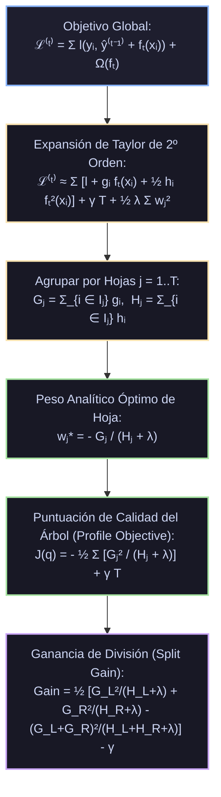
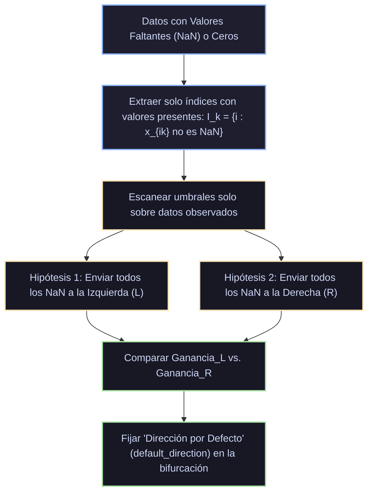

# Monografía de Análisis de Papers Seminales: XGBoost
## Expansión de Taylor de 2º Orden, Weighted Quantile Sketch, Sparsity-Aware Split Finding y Regularización $\gamma$-$\lambda$

**Autoría del compendio analítico:** Sistema de Razonamiento Científico de Prig IDE  
**Módulo correspondiente:** `docs/algoritmos_ml/06_xgboost.md`  
**Estado:** Documentación canónica en texto plano para repositorio público en GitHub  

---

## 1. Ficha Bibliográfica y Metadatos Formales de los Papers Seminales

| Algoritmo / Sistema | Publicación Seminal | Autores | Conferencia / Editorial | Identificador Digital / Cita Canónica |
|---|---|---|---|---|
| **XGBoost (Fundacional)** | *XGBoost: A Scalable Tree Boosting System* (2016) | Tianqi Chen & Carlos Guestrin | *Proceedings of the 22nd ACM SIGKDD International Conference on Knowledge Discovery and Data Mining (KDD '16)*, pp. 785–794 | [DOI: 10.1145/2939672.2945397](https://doi.org/10.1145/2939672.2945397); [arXiv:1603.02754](https://arxiv.org/abs/1603.02754) |
| **Poder Predictivo y Dominio en Competencias** | *Winning the Kaggle 2015 Competitions* (2015) | Tianqi Chen | ACM KDD Cup / Kaggle Technical Summaries | Chen (2015); Cita: 17 de las 29 soluciones ganadoras de Kaggle en 2015 usaron XGBoost |
| **Quantile Summaries en Datos Masivos** | *Space-efficient online computation of quantile summaries of data streams* (2001) | Michael Greenwald & Sanjeev Khanna | *ACM SIGMOD Record*, Vol. 30, No. 2, pp. 58–66 | [DOI: 10.1145/376284.375670](https://doi.org/10.1145/376284.375670) |

---

## 2. Génesis Teórica: Las Limitaciones del GBM Tradicional de Friedman

A pesar de la elegancia conceptual del Gradient Boosting clásico (Friedman, 2001), los sistemas existentes presentaban cuatro barreras matemáticas y computacionales críticas:

1. **Optimización de Primer Orden Pura (Descenso de Gradiente Estricto):**
   El GBM de Friedman solo evalúa las derivadas de primer orden (pseudo-residuos $g_i$). Para ajustar los pesos de hoja $\gamma$, requería búsquedas lineales heurísticas (*line search*) o aproximaciones de un paso de Newton desacopladas del criterio de división de las ramas. El criterio de partición del árbol buscaba minimizar la varianza de los residuos en lugar de optimizar directamente la función de pérdida del ensamble.
2. **Ausencia de Regularización Formal en la Función Objetivo:**
   Friedman solo regularizaba mediante heurísticas de parada temprana, profundidad máxima o *shrinkage*. No existía una penalización analítica por la complejidad del árbol ($\ell_1$ o $\ell_2$) integrada en la ecuación de ganancia del corte.
3. **Incapacidad Estructural ante Datos Ralos y Valores Faltantes:**
   El GBM tradicional obligaba al usuario a imputar previamente los datos faltantes o a tratarlos como una categoría artificial, incrementando el sesgo y la dimensionalidad.
4. **Cuello de Botella de Ordenación $O(N \log N)$:**
   En cada nodo de cada árbol, los métodos previos requerían escanear y ordenar exhaustivamente todas las muestras, provocando que el tiempo de ejecución escalara de forma inviable en conjuntos de datos con decenas de millones de filas.

En 2016, Tianqi Chen y Carlos Guestrin revolucionaron la disciplina con **XGBoost (*eXtreme Gradient Boosting*)**, unificando una derivación matemática de segundo orden con innovaciones de ingeniería de sistemas de bajo nivel (acceso consciente a la caché, bloques comprimidos por columnas y sketches cuantiles ponderados).

---

## 3. Análisis Profundo de Chen & Guestrin (2016) - Formulación Matemática



### 3.1. La Función Objetivo Regularizada
En la ronda de boosting $t$, el ensamble busca agregar un nuevo árbol $f_t(x)$ para minimizar el objetivo formal:
$$\mathcal{L}^{(t)} = \sum_{i=1}^n l\left( y_i, \hat{y}_i^{(t-1)} + f_t(x_i) \right) + \Omega(f_t)$$
donde el término de penalización de complejidad estructural $\Omega(f_t)$ está explícitamente parametrizado por:
$$\Omega(f_t) = \gamma T + \frac{1}{2} \lambda \sum_{j=1}^T w_j^2 + \alpha \sum_{j=1}^T |w_j|$$
- $T$: Número de hojas terminales del árbol.
- $w_j \in \mathbb{R}$: Puntuación de peso asignada a la hoja $j$.
- $\gamma$: Parámetro Lagrangiano de penalización por hoja (umbral de complejidad para poda).
- $\lambda$: Parámetro de regularización $\ell_2$ sobre los pesos de las hojas (suavizado de predicciones extremas).
- $\alpha$: Parámetro de regularización $\ell_1$ sobre los pesos (fuerza esparcidad en los pesos de las hojas).

### 3.2. Expansión en Serie de Taylor de Segundo Orden
En lugar de conformarse con el gradiente de primer orden, Chen & Guestrin aproximaron la función de pérdida $l$ mediante una **expansión de Taylor de segundo orden** alrededor de la predicción previa $\hat{y}_i^{(t-1)}$:
$$\mathcal{L}^{(t)} \approx \sum_{i=1}^n \left[ l\left(y_i, \hat{y}_i^{(t-1)}\right) + g_i f_t(x_i) + \frac{1}{2} h_i f_t^2(x_i) \right] + \Omega(f_t)$$
donde las derivadas de primer y segundo orden para cada muestra $i$ son:
$$g_i = \left. \frac{\partial l(y_i, \hat{y}_i)}{\partial \hat{y}_i} \right|_{\hat{y}_i = \hat{y}_i^{(t-1)}}, \qquad h_i = \left. \frac{\partial^2 l(y_i, \hat{y}_i)}{\partial \hat{y}_i^2} \right|_{\hat{y}_i = \hat{y}_i^{(t-1)}}$$

Eliminando los términos constantes $l(y_i, \hat{y}_i^{(t-1)})$ que no dependen de la nueva función $f_t$, se obtiene la función objetivo simplificada en el paso $t$:
$$\tilde{\mathcal{L}}^{(t)} = \sum_{i=1}^n \left[ g_i f_t(x_i) + \frac{1}{2} h_i f_t^2(x_i) \right] + \gamma T + \frac{1}{2} \lambda \sum_{j=1}^T w_j^2$$

### 3.3. Reescritura por Hojas y Solución Analítica de Pesos
Sea $I_j = \{i : q(x_i) = j\}$ el conjunto de índices de las muestras asignadas a la hoja $j$ por la función de mapeo del árbol $q: \mathbb{R}^p \to \{1, \dots, T\}$.  
Dado que para cualquier muestra $i \in I_j$ la predicción del árbol es constante e igual a $f_t(x_i) = w_j$, podemos reordenar la sumatoria desde muestras individuales hacia hojas terminales:
$$\tilde{\mathcal{L}}^{(t)} = \sum_{j=1}^T \left[ \left( \sum_{i \in I_j} g_i \right) w_j + \frac{1}{2} \left( \sum_{i \in I_j} h_i + \lambda \right) w_j^2 \right] + \gamma T$$

Definiendo las cantidades agregadas por hoja:
$$G_j \equiv \sum_{i \in I_j} g_i, \qquad H_j \equiv \sum_{i \in I_j} h_i$$
La función objetivo adopta la forma cuadrática desacoplada:
$$\tilde{\mathcal{L}}^{(t)} = \sum_{j=1}^T \left[ G_j w_j + \frac{1}{2}(H_j + \lambda) w_j^2 \right] + \gamma T$$

#### Teorema del Peso Óptimo de Hoja ($w_j^*$):
Para una estructura de árbol dada $q(x)$, la función es estrictamente convexa respecto a cada $w_j$ (dado que $H_j > 0$ y $\lambda \ge 0$). Derivando respecto a $w_j$ e igualando a cero:
$$\frac{\partial \tilde{\mathcal{L}}}{\partial w_j} = G_j + (H_j + \lambda) w_j = 0 \implies w_j^* = -\frac{G_j}{H_j + \lambda}$$

> **Extensión con Regularización $\ell_1$ ($\alpha > 0$):**
> Si se incluye la norma $\ell_1$ ($\alpha |w_j|$), la condición de subgradiente de Karush-Kuhn-Tucker produce la solución analítica por **Umbralización Suave (*Soft-Thresholding*)**:
> $$w_j^* = -\frac{\text{sign}(G_j) \max(0, |G_j| - \alpha)}{H_j + \lambda}$$

### 3.4. Puntuación de Calidad del Árbol (*Profile Objective Score*)
Sustituyendo el peso óptimo $w_j^*$ en la función objetivo, obtenemos la puntuación mínima de pérdida que puede alcanzar un árbol con estructura $q$:
$$J(q) = -\frac{1}{2} \sum_{j=1}^T \frac{G_j^2}{H_j + \lambda} + \gamma T$$
Esta expresión cumple el rol de una **función de impureza global** para medir la calidad de un árbol, pero derivada de forma completamente rigurosa a partir de la expansión de Taylor de segundo orden de cualquier pérdida diferenciable.

### 3.5. Fórmula de Ganancia de División (*Split Gain*)
Supongamos que un nodo con estadísticas agregadas $(G, H)$ se divide en dos nodos hijos: izquierdo $(G_L, H_L)$ y derecho $(G_R, H_R)$, donde $G = G_L + G_R$ y $H = H_L + H_R$.  
La reducción en la función de pérdida lograda por la división es:
$$\begin{aligned}
\text{Gain} &= J_{\text{padre}} - (J_{\text{hijo\_izq}} + J_{\text{hijo\_der}}) \\
&= \left[ -\frac{1}{2} \frac{G^2}{H + \lambda} + \gamma \cdot 1 \right] - \left[ -\frac{1}{2} \left( \frac{G_L^2}{H_L + \lambda} + \frac{G_R^2}{H_R + \lambda} \right) + \gamma \cdot 2 \right] \\
&= \frac{1}{2} \left[ \frac{G_L^2}{H_L + \lambda} + \frac{G_R^2}{H_R + \lambda} - \frac{(G_L + G_R)^2}{H_L + H_R + \lambda} \right] - \gamma
\end{aligned}$$

#### El Rol Regulador de $\gamma$ y la Poda Automática:
- El primer término $\frac{1}{2}[\dots]$ representa la ganancia de ajuste pura de segundo orden.
- El término $-\gamma$ representa el **coste de añadir una nueva hoja** al modelo.
- **Poda Hacia Atrás (*Post-Pruning*):** El árbol se crece hasta una profundidad máxima (`max_depth`). Luego, de abajo hacia arriba, si un nodo arroja $\text{Gain} \le 0$, se colapsa inmediatamente a hoja. Esto elimina la necesidad de predecir umbrales heurísticos de parada.

---

## 4. Innovaciones Algorítmicas de Chen & Guestrin (2016)

### 4.1. Algoritmo Consciente de la Esparcidad (*Sparsity-Aware Split Finding*)
En conjuntos de datos del mundo real, la matriz $X$ suele ser sumamente rala debido a valores faltantes (`NaN`), ceros de variables categóricas codificadas en *one-hot* o matrices TF-IDF en procesamiento de texto.



#### Mecánica del Algoritmo:
1. Para cada variable $x_k$, se identifican únicamente las muestras que contienen valores válidos observados $I_k = \{i \in I : x_{ik} \ne \text{missing}\}$.
2. Las muestras observadas se ordenan una sola vez.
3. Se evalúan dos pasadas:
   - **Caso A:** Se asume que todos los valores faltantes van a la rama izquierda; se acumulan sus gradientes en $G_L, H_L$.
   - **Caso B:** Se asume que todos los valores faltantes van a la rama derecha; se acumulan sus gradientes en $G_R, H_R$.
4. Se selecciona el umbral y la **dirección por defecto (*default direction*)** que maximice la ganancia.
5. Durante la inferencia, si una muestra no vista presenta un valor `NaN`, se envía de inmediato por la dirección por defecto aprendida.
- **Complejidad Computacional:** Pasa de $O(N)$ a $O(\|\mathbf{x}\|_0)$ (lineal en el número de entradas no nulas). En matrices con 95% de ceros, **XGBoost corre hasta 20 a 50 veces más rápido** que los algoritmos tradicionales.

---

### 4.2. Weighted Quantile Sketch (Algoritmo Cuantil Ponderado)
Para evaluar divisiones en datasets masivos donde ordenar todos los puntos es prohibitivo, se emplean algoritmos aproximados basados en cuantiles candidatos.
Reescribiendo la función objetivo de segundo orden:
$$\sum_{i=1}^n \left[ g_i f_t(x_i) + \frac{1}{2} h_i f_t^2(x_i) \right] = \sum_{i=1}^n \frac{1}{2} h_i \left( f_t(x_i) - \left( -\frac{g_i}{h_i} \right) \right)^2 + \text{const}$$
Esta ecuación demuestra que el problema equivale formalmente a un **ajuste de mínimos cuadrados ponderados donde cada muestra $x_i$ tiene un peso estricto dado por su Hessiana $h_i$**.

Para proponer umbrales candidatos $\{s_{k1}, s_{k2}, \dots, s_{kl}\}$ para la variable $k$, se define la función de rango ponderada:
$$r_k(z) = \frac{\sum_{i \in \mathcal{D}, x_{ik} < z} h_i}{\sum_{i \in \mathcal{D}} h_i}$$
La meta es encontrar puntos de división candidatos tales que la diferencia de rango entre candidatos consecutivos sea menor que un factor de error $\epsilon$:
$$|r_k(s_{k, j}) - r_k(s_{k, j-1})| < \epsilon \implies \text{Aproximadamente } \frac{1}{\epsilon} \text{ umbrales candidatos}$$

Chen y Guestrin diseñaron una nueva estructura de datos de flujo continuo (*streaming data structure*) con operaciones formales de fusión (*Merge*) y poda (*Prune*) que garantiza la cota de error $\epsilon$ bajo pesos arbitrarios $h_i > 0$, permitiendo encontrar divisiones óptimas de forma distribuida en clústeres masivos.

---

### 4.3. Innovaciones de Arquitectura de Sistemas
1. **Column Block Structure:**
   Los datos se almacenan en memoria comprimida por columnas (CSC: *Compressed Sparse Column*), preordenados antes de que comience el boosting. Cada bloque puede ser inspeccionado en paralelo por distintos hilos de CPU mediante OpenMP sin requerir bloqueos de memoria.
2. **Acceso Consciente a la Caché (*Cache-Aware Access*):**
   Dado que el acceso a los gradientes $g_i, h_i$ a través de índices de filas no contiguos produce fallos de caché de CPU (*cache misses*), XGBoost asigna un buffer contiguo en la memoria caché L1/L2 para almacenar temporalmente los gradientes de las muestras en escaneo.
3. **Computación Fuera de Núcleo (*Out-of-Core Computation*):**
   Para datasets que superan el tamaño de la memoria RAM, XGBoost divide los datos en discos duros SSD múltiples, comprimiendo los bloques con el algoritmo ultrarrápido **LZ4** en segundo plano mientras los hilos de cálculo procesan el bloque actual.

---

## 5. Comparativa Rigurosa: GBM de Friedman vs. XGBoost

| Dimensión | GBM Clásico (Friedman, 2001) | XGBoost (Chen & Guestrin, 2016) |
|---|---|---|
| **Aproximación de Pérdida** | 1er orden (Gradiente / Pseudo-residuo) | **2º orden (Gradiente $g_i$ y Hessiana $h_i$)** |
| **Regularización de Complejidad** | No integrada (solo `max_depth` y $\eta$) | **Integrada analíticamente: $\gamma T + \frac{1}{2}\lambda \sum w^2 + \alpha \sum |w|$** |
| **Cálculo de Pesos de Hoja** | Búsqueda lineal separada post-hoc | **Cerrado analítico exacto:** $w_j^* = -\frac{G_j}{H_j + \lambda}$ |
| **Ganancia de División** | Reducción de varianza heurística | **Fórmula formal de Taylor:** $\frac{1}{2}\left[\frac{G_L^2}{H_L+\lambda} + \frac{G_R^2}{H_R+\lambda} - \frac{G^2}{H+\lambda}\right] - \gamma$ |
| **Manejo de Valores Faltantes** | Imputación previa requerida | **Sparsity-Aware:** Aprende dirección por defecto automáticamente en $O(\|\mathbf{x}\|_0)$ |
| **Búsqueda de Umbrales** | Escaneo exacto $O(N \log N)$ | **Exacto y Aproximado vía Weighted Quantile Sketch** |
| **Paralelización de CPU** | Ninguna (árbol secuencial por diseño) | **Paralelismo multihilo en Column Blocks** |

---

## 6. Implementación Pura en Python/NumPy desde Cero

El siguiente módulo implementa de forma autocontenida el algoritmo central de **XGBoost de Clasificación Binaria** en NumPy puro, reproduciendo la expansión de Taylor de segundo orden ($g_i, h_i$), el cálculo analítico de ganancia regularizada ($\gamma, \lambda$), la solución de pesos $w^*$ y el manejo nativo de valores faltantes (`NaN`) mediante direcciones por defecto.

```python
"""
Implementación de Referencia: XGBoost en NumPy Puro (Chen & Guestrin, 2016).
Demostración de:
1. Derivadas de 1º (g_i) y 2º orden (h_i) para Binary Cross-Entropy.
2. Cálculo de ganancia analítica de división con regularización lambda y gamma.
3. Algoritmo Sparsity-Aware con aprendizaje de dirección por defecto ante NaN.
4. Estimación de pesos óptimos de hoja w* = -G / (H + lambda).
5. Poda hacia atrás automática cuando Gain <= 0.
"""

import numpy as np


class NodoXGBoost:
    """Nodo para el árbol regularizado de XGBoost."""
    def __init__(self, variable=None, umbral=None, izq=None, der=None, *, peso=None, dir_defecto="izq"):
        self.variable = variable
        self.umbral = umbral
        self.izq = izq
        self.der = der
        self.peso = peso                      # Peso óptimo w* si es hoja
        self.dir_defecto = dir_defecto        # 'izq' o 'der' para valores NaN

    @property
    def es_hoja(self):
        return self.peso is not None


def calcular_gradientes_logloss(y, y_pred_raw):
    """
    y_pred_raw = F(x) (margen lineal log-odds).
    p = sigmoide(F(x)).
    g_i = p_i - y_i.
    h_i = p_i * (1 - p_i).
    """
    z = np.clip(y_pred_raw, -200.0, 200.0)
    p = 1.0 / (1.0 + np.exp(-z))
    g = p - y
    h = np.maximum(p * (1.0 - p), 1e-16)  # Prevenir división por cero
    return g, h


def mejor_corte_xgboost_sparsity(X, g, h, reg_lambda, gamma, min_child_weight=1.0):
    """
    Encuentra la mejor división considerando valores presentes y NaN
    usando la fórmula de ganancia analítica de Chen & Guestrin (2016).
    """
    N, D = X.shape
    G_total = np.sum(g)
    H_total = np.sum(h)

    mejor_ganancia = 0.0  # Si la ganancia neta no supera 0 (tras restar gamma), no dividir
    mejor_var = None
    mejor_umbral = None
    mejor_dir = "izq"

    # Puntuación del nodo padre actual
    score_padre = (G_total**2) / (H_total + reg_lambda)

    for j in range(D):
        col = X[:, j]
        # Identificar muestras válidas y faltantes (NaN)
        mascara_validos = ~np.isnan(col)
        if not np.any(mascara_validos):
            continue

        x_val = col[mascara_validos]
        g_val = g[mascara_validos]
        h_val = h[mascara_validos]

        idx_ord = np.argsort(x_val)
        x_ord = x_val[idx_ord]
        g_ord = g_val[idx_ord]
        h_ord = h_val[idx_ord]

        # Gradientes de los valores faltantes
        G_nan = np.sum(g[~mascara_validos])
        H_nan = np.sum(h[~mascara_validos])

        G_acum = 0.0
        H_acum = 0.0

        cambios = np.where(x_ord[:-1] != x_ord[1:])[0]
        for idx in cambios:
            # Acumulamos gradientes de las muestras presentes observadas
            G_acum = np.sum(g_ord[:idx + 1])
            H_acum = np.sum(h_ord[:idx + 1])

            # Hipótesis 1: Enviar NaN hacia la IZQUIERDA
            G_L_1 = G_acum + G_nan
            H_L_1 = H_acum + H_nan
            G_R_1 = G_total - G_L_1
            H_R_1 = H_total - H_L_1

            if H_L_1 >= min_child_weight and H_R_1 >= min_child_weight:
                gain_1 = 0.5 * (
                    (G_L_1**2) / (H_L_1 + reg_lambda) +
                    (G_R_1**2) / (H_R_1 + reg_lambda) -
                    score_padre
                ) - gamma
                if gain_1 > mejor_ganancia:
                    mejor_ganancia = gain_1
                    mejor_var = j
                    mejor_umbral = (x_ord[idx] + x_ord[idx + 1]) / 2.0
                    mejor_dir = "izq"

            # Hipótesis 2: Enviar NaN hacia la DERECHA
            G_L_2 = G_acum
            H_L_2 = H_acum
            G_R_2 = G_total - G_L_2
            H_R_2 = H_total - H_L_2

            if H_L_2 >= min_child_weight and H_R_2 >= min_child_weight:
                gain_2 = 0.5 * (
                    (G_L_2**2) / (H_L_2 + reg_lambda) +
                    (G_R_2**2) / (H_R_2 + reg_lambda) -
                    score_padre
                ) - gamma
                if gain_2 > mejor_ganancia:
                    mejor_ganancia = gain_2
                    mejor_var = j
                    mejor_umbral = (x_ord[idx] + x_ord[idx + 1]) / 2.0
                    mejor_dir = "der"

    return mejor_var, mejor_umbral, mejor_dir


def construir_arbol_xgb(X, g, h, max_depth, reg_lambda, gamma, depth=0):
    """Construcción recursiva con cálculo analítico de w* = -G / (H + lambda)."""
    G = np.sum(g)
    H = np.sum(h)
    peso_hoja = -G / (H + reg_lambda)

    if depth >= max_depth or len(g) <= 2:
        return NodoXGBoost(peso=peso_hoja)

    var, umbral, dir_defecto = mejor_corte_xgboost_sparsity(X, g, h, reg_lambda, gamma)
    if var is None:
        return NodoXGBoost(peso=peso_hoja)

    col = X[:, var]
    # Manejo de división con dirección por defecto
    if dir_defecto == "izq":
        mask_L = np.isnan(col) | (col <= umbral)
    else:
        mask_L = (~np.isnan(col)) & (col <= umbral)

    mask_R = ~mask_L

    izq = construir_arbol_xgb(X[mask_L], g[mask_L], h[mask_L], max_depth, reg_lambda, gamma, depth + 1)
    der = construir_arbol_xgb(X[mask_R], g[mask_R], h[mask_R], max_depth, reg_lambda, gamma, depth + 1)

    return NodoXGBoost(variable=var, umbral=umbral, izq=izq, der=der, dir_defecto=dir_defecto)


def predecir_xgb_arbol(x, nodo):
    if nodo.es_hoja:
        return nodo.peso
    val = x[nodo.variable]
    if np.isnan(val):
        if nodo.dir_defecto == "izq":
            return predecir_xgb_arbol(x, nodo.izq)
        else:
            return predecir_xgb_arbol(x, nodo.der)
    if val <= nodo.umbral:
        return predecir_xgb_arbol(x, nodo.izq)
    return predecir_xgb_arbol(x, nodo.der)


class XGBoostClasificador:
    """Implementación de referencia de XGBoost (Chen & Guestrin, 2016)."""
    def __init__(self, n_estimators=30, learning_rate=0.1, max_depth=3, reg_lambda=1.0, gamma=0.0):
        self.n_estimators = n_estimators
        self.learning_rate = learning_rate
        self.max_depth = max_depth
        self.reg_lambda = reg_lambda
        self.gamma = gamma
        self.base_score = 0.0
        self.arboles = []

    def fit(self, X, y):
        N = len(y)
        # Inicializador base: log-odds
        p_media = np.clip(np.mean(y), 1e-6, 1.0 - 1e-6)
        self.base_score = np.log(p_media / (1.0 - p_media))
        y_raw = np.full(N, self.base_score)

        self.arboles = []

        for t in range(self.n_estimators):
            # 1. Calcular gradientes de 1º y 2º orden
            g, h = calcular_gradientes_logloss(y, y_raw)
            # 2. Ajustar árbol con objetivo regularizado y sparsity-awareness
            raiz = construir_arbol_xgb(X, g, h, self.max_depth, self.reg_lambda, self.gamma)
            # 3. Actualizar predicción acumulada con Shrinkage
            preds = np.array([predecir_xgb_arbol(x, raiz) for x in X])
            y_raw += self.learning_rate * preds
            self.arboles.append(raiz)

        return self

    def predict_proba(self, X):
        y_raw = np.full(len(X), self.base_score)
        for raiz in self.arboles:
            y_raw += self.learning_rate * np.array([predecir_xgb_arbol(x, raiz) for x in X])
        z = np.clip(y_raw, -200.0, 200.0)
        return 1.0 / (1.0 + np.exp(-z))

    def predict(self, X):
        return (self.predict_proba(X) >= 0.5).astype(int)


# Validación con datos no lineales y valores faltantes (NaN)
if __name__ == "__main__":
    np.random.seed(42)
    N = 150
    X = np.random.uniform(-2.0, 2.0, size=(N, 3))
    # Relación no lineal: x0 * x1 - 0.5 * x2 > 0
    y = ((X[:, 0] * X[:, 1] - 0.5 * X[:, 2]) > 0).astype(int)

    # Inyectamos 15% de valores faltantes (NaN) en la primera columna
    mascara_nan = np.random.rand(N) < 0.15
    X[mascara_nan, 0] = np.nan

    xgb = XGBoostClasificador(n_estimators=35, learning_rate=0.15, max_depth=3, reg_lambda=1.0, gamma=0.1)
    xgb.fit(X, y)
    exactitud = np.mean(xgb.predict(X) == y)

    print("=== Rendimiento de XGBoost Puro con Valores Faltantes (NaN) ===")
    print("Exactitud alcanzada:", round(float(exactitud) * 100, 2), "%")
    print("Total de árboles entrenados:", len(xgb.arboles))
    print("Dirección por defecto en raíz del 1er árbol:", xgb.arboles[0].dir_defecto)
```

---

## 7. Directrices de Razonamiento para los Modelos de Inteligencia Artificial en Prig IDE

Cuando un modelo de lenguaje en Prig IDE audite, optimice o genere código de **XGBoost** (`xgboost.XGBClassifier`, `XGBRegressor`), aplicará la siguiente matriz de decisión heurística:

1. **Control del Sobreajuste mediante Parámetros Nativos de Regularización:**
   - Si el modelo sobreajusta en entrenamiento, en lugar de solo reducir `max_depth`, utilizar:
     - `gamma` ($\gamma$): Incrementar de `0.0` a `0.1`–`1.0`. Forzará la poda hacia atrás de cualquier rama cuya ganancia no compense el coste de complejidad.
     - `reg_lambda` ($\lambda$): Incrementar para estabilizar las hojas y reducir la norma $\ell_2$ de los pesos ante alta colinealidad.
     - `reg_alpha` ($\alpha$): Activar ($\ge 0.1$) para inducir esparcidad estricta en las predicciones de hoja cuando existan miles de variables ruidosas.
2. **Tratamiento Nativo de Valores Faltantes:**
   - Indicar explícitamente al usuario que **no es necesario imputar `NaN` manualmente**. XGBoost aprende de forma autónoma la *default direction* óptima durante el entrenamiento. Forzar imputaciones (ej. con la media o cero) destruye la información del patrón de ausencia y degrada el score.
3. **Manejo del Desbalance de Clases Severo:**
   - En problemas con desbalance (ej. fraude al 1%), ajustar el hiperparámetro:
     $$\text{scale\_pos\_weight} = \frac{\text{número de muestras negativas}}{\text{número de muestras positivas}}$$
     Esto escala los gradientes de la clase minoritaria por dicho factor, calibrando la frontera de decisión.
4. **Selección del Método de Construcción (`tree_method`):**
   - Para datasets masivos ($N > 100,000$), fijar `tree_method='hist'`. Utiliza la discretización en histogramas con enteros de 8 bits (uint8) para multiplicar la velocidad de entrenamiento por $10\times$ sin pérdida medible de precisión.

