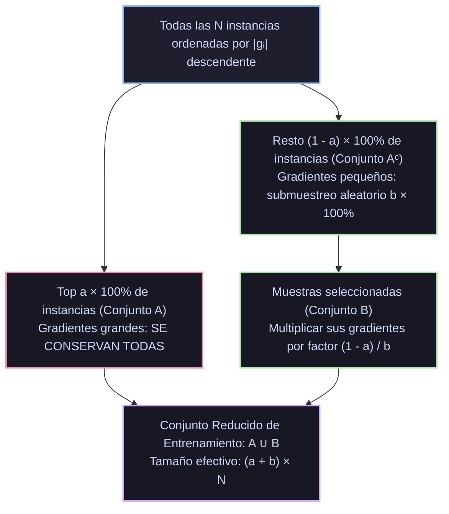
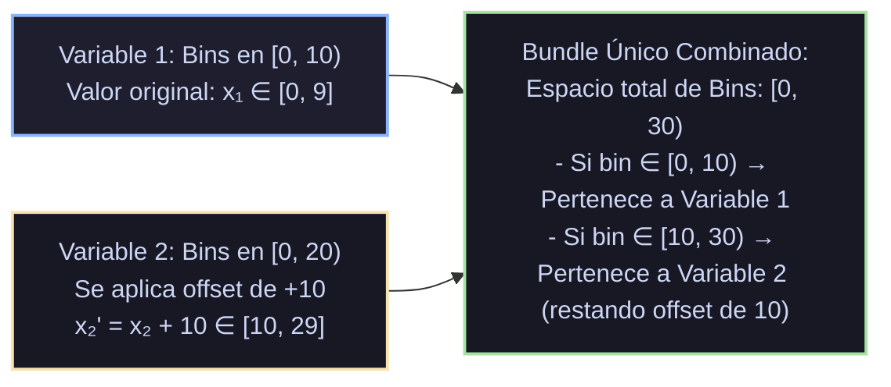
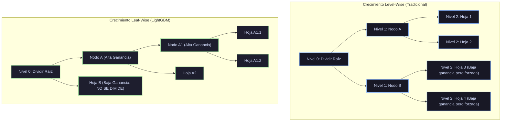

# Monografía de Análisis de Papers Seminales: LightGBM
## Gradient-based One-Side Sampling (GOSS), Exclusive Feature Bundling (EFB), Histogramas uint8 y Crecimiento Leaf-Wise

**Autoría del compendio analítico:** Sistema de Razonamiento Científico de Prig IDE  
**Módulo correspondiente:** `docs/algoritmos_ml/07_lightgbm.md`  
**Estado:** Documentación canónica en texto plano para repositorio público en GitHub  

---

## 1. Ficha Bibliográfica y Metadatos Formales de los Papers Seminales

| Algoritmo / Sistema | Publicación Seminal | Autores | Conferencia / Editorial | Identificador Digital / Cita Canónica |
|---|---|---|---|---|
| **LightGBM (Fundacional)** | *LightGBM: A Highly Efficient Gradient Boosting Decision Tree* (2017) | Guolin Ke, Qi Meng, Thomas Finley, Taifeng Wang, Wei Chen, Weidong Ma, Qiwei Ye & Tie-Yan Liu | *Advances in Neural Information Processing Systems 30 (NeurIPS 2017)*, pp. 3146–3154 | [NeurIPS Proceedings](https://proceedings.neurips.cc/paper/2017/hash/6449f44a102fde848669bdd9eb6b76fa-Abstract.html); Microsoft Research |
| **Árboles Basados en Histogramas** | *A fast method for building classification and regression trees from large datasets* (2007) | Ping Li, Qiang Wu & Christopher J. C. Burges | *Proceedings of ACM CIKM 2007*, pp. 73–82 | [DOI: 10.1145/1321440.1321453](https://doi.org/10.1145/1321440.1321453) |
| **Partición de Variables Categóricas** | *On grouping for maximum homogeneity* (1958) | Walter D. Fisher | *Journal of the American Statistical Association*, Vol. 53, No. 284, pp. 789–798 | [DOI: 10.1080/01621459.1958.10501479](https://doi.org/10.1080/01621459.1958.10501479) |

---

## 2. Génesis Teórica: La Crisis de Escalabilidad en Datos Masivos (Web-Scale)

Hacia 2016–2017, la explosión de datos en motores de búsqueda, publicidad programática y comercio electrónico expuso las limitaciones computacionales de las implementaciones existentes de GBDT (incluyendo XGBoost exacto):
1. **La Complejidad por Iteración $O(N \cdot D)$:**
   Para un conjunto de datos con $N \sim 10^7 - 10^8$ observaciones y $D \sim 10^3 - 10^4$ características, evaluar todos los puntos posibles de división en cada nodo requería escanear miles de millones de elementos en cada árbol.
2. **Cuello de Botella de Ancho de Banda de Memoria RAM:**
   Almacenar matrices en punto flotante de 32 o 64 bits para decenas de millones de filas colapsaba la memoria RAM y el ancho de banda del bus PCIe/DRAM, provocando que la CPU pasara la mayor parte del tiempo esperando la llegada de datos en lugar de ejecutar cálculos aritméticos.

### El Diagnóstico Teórico de Ke et al. (2017):
Los autores de Microsoft Research identificaron dos asimetrías fundamentales en los datos tabulares:
1. **Asimetría en la Magnitud del Gradiente:**
   En cualquier iteración de boosting, las instancias con gradientes pequeños ($|g_i| \approx 0$) ya están bien entrenadas y su error residual es despreciable. La ganancia real de información proviene casi exclusivamente de las instancias con gradientes grandes ($|g_i| \gg 0$).
2. **Asimetría en la Esparcidad de Características:**
   En datos de alta dimensionalidad (ej. matrices *one-hot* o conteos textuales), la mayoría de las características son mutuamente excluyentes: raramente toman valores distintos de cero en la misma observación.

A partir de estas dos constataciones, concibieron **LightGBM**, estructurado sobre cuatro pilares matemáticos y algorítmicos revolucionarios:
- **GOSS (*Gradient-based One-Side Sampling*)** para reducir $N$.
- **EFB (*Exclusive Feature Bundling*)** para reducir $D$.
- **Discretización en Histogramas de 8 bits (`uint8`)** para acelerar el escaneo en $O(K)$.
- **Crecimiento *Leaf-Wise* (Best-First)** para minimizar la pérdida más rápido.

---

## 3. Análisis Profundo de GOSS (Gradient-based One-Side Sampling)

### 3.1. Algoritmo Detallado y Factor de Compensación
El submuestreo aleatorio uniforme (como en Stochastic Gradient Boosting de Friedman) descarta muestras al azar sin atender a su relevancia informacional, lo que incrementa el sesgo de estimación.
GOSS propone un **muestreo estratificado no uniforme basado en la magnitud del gradiente**:



1. Se ordenan todas las instancias en orden descendente según el valor absoluto de su gradiente $|g_i|$.
2. Se selecciona el top $a \times 100\%$ de instancias con mayores gradientes: conjunto $A$, con tamaño $a N$.
3. Del conjunto complementario $A^c$ (instancias con gradientes pequeños, tamaño $(1-a)N$), se extrae una muestra aleatoria uniforme $B$ de tamaño $b(1-a)N$, donde $b \in (0, 1)$.
4. Para **no sesgar la distribución original de la pérdida**, GOSS multiplica los gradientes de las muestras del subconjunto $B$ por un **factor de amplificación constante**:
   $$w_i = \frac{1 - a}{b} \quad \forall i \in B$$
   mientras que las muestras de $A$ conservan su peso unitario ($w_i = 1$).

### 3.2. Deducción de la Ganancia de Varianza de GOSS
Sea $d$ un punto de división candidato para la característica $j$, particionando las muestras en izquierda ($l$) y derecha ($r$). La ganancia de varianza exacta sobre el dataset completo sería:
$$V_j(d) = \frac{1}{n} \left[ \frac{\left( \sum_{x_i \in D_l} g_i \right)^2}{n_l^j(d)} + \frac{\left( \sum_{x_i \in D_r} g_i \right)^2}{n_r^j(d)} \right]$$

Bajo el muestreo GOSS sobre el subconjunto reducido $A \cup B$, la ganancia estimada se define como:
$$\tilde{V}_j(d) = \frac{1}{n} \left[ \frac{\left( \sum_{x_i \in A_l} g_i + \frac{1-a}{b} \sum_{x_i \in B_l} g_i \right)^2}{n_l^j(d)} + \frac{\left( \sum_{x_i \in A_r} g_i + \frac{1-a}{b} \sum_{x_i \in B_r} g_i \right)^2}{n_r^j(d)} \right]$$
donde $A_l = \{x_i \in A : x_{ij} \le d\}$, $B_l = \{x_i \in B : x_{ij} \le d\}$, y de forma idéntica para $A_r, B_r$.

### 3.3. Teorema de Cota de Error de GOSS (Ke et al., 2017)
**Teorema:** La aproximación de la ganancia de GOSS es insesgada y su cota de discrepancia máxima respecto a la ganancia real $V_j(d)$ satisface con probabilidad al menos $1 - 2\delta$:
$$\mathcal{E}(d) = |\tilde{V}_j(d) - V_j(d)| \le C_{a, b} \max_{i} |g_i| \left( \frac{1}{\sqrt{a n}} + \frac{1}{\sqrt{b n}} \right) \sqrt{\frac{\ln(2/\delta)}{2}}$$
donde $C_{a, b}$ es una constante que depende exclusivamente de las fracciones $a$ y $b$.

**Significado Teórico Fundamental:**  
El error de aproximación se extingue asintóticamente a una tasa $O(1/\sqrt{n})$.  
Configurando valores típicos como $a = 0.2$ y $b = 0.1$, el conjunto de muestras evaluadas se reduce a solo el **$30\%$ del total original** ($a + b = 0.3$), **triplicando la velocidad de cómputo** sin alterar la selección del punto óptimo de corte respecto al dataset íntegro.

---

## 4. Análisis Profundo de EFB (Exclusive Feature Bundling)

En conjuntos de datos de alta dimensionalidad (ej. clasificación de texto o sistemas de recomendación con $D > 10,000$), las características son sumamente esparsas. Rara vez dos características toman valores no nulos en la misma fila.

### 4.1. Reducción al Problema de Coloración de Grafos
Ke et al. demostraron que agrupar características de forma que ninguna colisione equivale formalmente al problema de **Coloración de Grafos (*Graph Coloring*)**:
1. Cada característica $x_j$ es un **vértice** del grafo $G = (V, E)$.
2. Se traza una **arista** entre dos características si colisionan (toman valores distintos de cero simultáneamente en más de una fracción permisible $\gamma$ de muestras).
3. Asignar un color a cada vértice de modo que ningún par de vértices adyacentes comparta el mismo color equivale a agrupar variables no colisionantes en un único *bundle*.

Dado que la coloración óptima de grafos es un problema **NP-hard**, LightGBM aplica una **heurística codiciosa (*Greedy Bundling*)**:
- Ordena las variables por su grado de conectividad (número de conflictos no nulos).
- Itera sobre las variables ordenadas y las asigna al primer *bundle* existente cuya tasa acumulada de conflicto no exceda $\gamma$. Si no cabe en ninguno, se crea un nuevo *bundle*.

### 4.2. Algoritmo de Fusión por Desplazamiento de Rangos (*Disjoint Range Merging*)
¿Cómo almacenar múltiples variables dentro de una sola columna sin confundir sus valores numéricos originales?  
LightGBM aprovecha la discretización en histogramas introduciendo un **desplazamiento acumulativo (*offset*)**:



1. Supongamos que la Variable 1 ocupa los bins $[0, K_1)$ y la Variable 2 ocupa los bins $[0, K_2)$.
2. Se suma el valor constante $K_1$ a todos los bins de la Variable 2:
   $$x_2' = x_2 + K_1 \in [K_1, K_1 + K_2)$$
3. El *bundle* consolidado almacena los valores en el intervalo contiguo $[0, K_1 + K_2)$.
4. Durante el escaneo del histograma del *bundle*, el algoritmo sabe exactamente a qué variable pertenece cada bin mediante una simple comparación de umbral, logrando que el coste de evaluar $D$ características esparsas se reduzca al de evaluar $D' \ll D$ *bundles* densos.

---

## 5. El Algoritmo de Histogramas y Discretización uint8

### 5.1. Cuantización de Punto Flotante a 8 Bits
En lugar de procesar valores continuos en coma flotante (`float32` o `float64`), LightGBM divide el rango de cada variable en $K$ contenedores discretos (típicamente $K = 256$):
$$\text{bin}(x_{ij}) \in \{0, 1, 2, \dots, 255\} \implies \text{Almacenable en 1 solo byte (\texttt{uint8})}$$

#### Impacto en Rendimiento:
- **Reducción de Memoria:** Almacenar un millón de flotantes de 64 bits consume 8 MB; almacenar los bins en `uint8` consume únicamente 1 MB (**reducción del 87.5% de memoria RAM**).
- **Aceleración en Búsqueda de Cortes:** El tiempo necesario para evaluar las divisiones pasa de depender del número de observaciones ordenadas $O(N \log N)$ a depender únicamente del número de bins $O(K)$, siendo $K = 256$ una constante diminuta independiente de $N$.

### 5.2. El Truco de Sustracción de Histogramas (*Histogram Subtraction Trick*)
En un árbol de decisión binario, cada nodo padre se divide en dos hijos: izquierdo ($L$) y derecho ($R$).  
Por el principio de conservación de muestras, la suma de los gradientes en cualquier bin del padre es exactamente igual a la suma de los bins de los dos hijos:
$$\text{Hist}_{\text{Padre}}[k] = \text{Hist}_L[k] + \text{Hist}_R[k] \quad \forall k \in \{0, \dots, K-1\}$$

#### Mecánica del Algoritmo:
1. Se identifica cuál de los dos hijos contiene **menor cantidad de muestras** (supongamos el hijo izquierdo $L$, con $N_L \le N_R$).
2. Se escanean únicamente las $N_L$ muestras para construir $\text{Hist}_L$ en tiempo $O(N_L)$.
3. El histograma del hijo derecho $R$ se obtiene mediante una simple resta de vectores en memoria caché:
   $$\text{Hist}_R[k] = \text{Hist}_{\text{Padre}}[k] - \text{Hist}_L[k]$$
- **Costo de Sustracción:** $O(K) = 256$ operaciones aritméticas triviales sin tocar un solo dato en memoria principal.
- **Resultado:** Se **duplica la velocidad de construcción del árbol completo** en cada nivel de profundidad.

---

## 6. Crecimiento Leaf-Wise (Best-First) vs. Level-Wise (Depth-First)

La mayoría de los algoritmos tradicionales (CART, Random Forest y versiones iniciales de XGBoost) construían los árboles mediante crecimiento **Level-wise (*Depth-first*)**: expandir todos los nodos a profundidad $d$ antes de pasar a $d+1$, produciendo árboles simétricos.

LightGBM introdujo como estándar predeterminado el crecimiento **Leaf-wise (*Best-first*)**:



### Ventaja Matemática de Leaf-Wise:
Para un presupuesto fijo de $T$ hojas terminales:
- **Level-wise** gasta divisiones en ramas poco informativas simplemente para mantener la simetría del árbol.
- **Leaf-wise** escanea todas las hojas activas del árbol actual y **divide en cada paso únicamente la hoja que garantiza la mayor reducción neta de pérdida global $\Delta \mathcal{L}$**, sin importar su profundidad.
- **Teorema:** Para un mismo número total de hojas $T$, un árbol construido mediante *Leaf-wise* alcanza **un error de entrenamiento estrictamente menor o igual que uno construido mediante *Level-wise***.

#### Control del Sobreajuste en Leaf-Wise:
Dado que el crecimiento asimétrico libre puede crear ramas excesivamente profundas (*filiformes*) en conjuntos de datos pequeños, LightGBM introdujo el parámetro de control **`max_depth`** junto con **`min_data_in_leaf`**, restringiendo la profundidad máxima de las ramas individuales para combinar la velocidad de convergencia de Leaf-wise con la regularización estructural de Level-wise.

---

## 7. Manejo Nativo de Variables Categóricas (Algoritmo de Fisher, 1958)

En presencia de una variable categórica con $M$ categorías distintas, evaluar todas las particiones binarias posibles exige comprobar $2^{M-1} - 1$ combinaciones, lo cual resulta computacionalmente inviable para $M > 15$.  
La mayoría de los sistemas recurrían a la codificación *One-Hot*, la cual genera árboles profundos e ineficientes.

LightGBM adaptó el algoritmo de **Walter D. Fisher (1958)**:
1. En cada nodo, se agregan los gradientes $G_c$ y hessianas $H_c$ para cada una de las $M$ categorías $c \in \{1, \dots, M\}$.
2. Se ordenan las categorías según su **razón de primer y segundo orden**:
   $$\text{score}(c) = \frac{G_c}{H_c} = \frac{\sum_{i \in \text{cat}_c} g_i}{\sum_{i \in \text{cat}_c} h_i}$$
3. Se demuestra formalmente que la mejor partición de categorías en la lista ordenada se encuentra en una **división contigua unidimensional**.
4. La complejidad combinatoria se desploma de $O(2^M)$ a **$O(M \log M)$** (el costo de ordenar $M$ números), permitiendo que LightGBM maneje variables categóricas con miles de categorías (ej. códigos postales, identificadores de producto) con velocidad y precisión récord.

---

## 8. Implementación Pura en Python/NumPy desde Cero

El siguiente módulo implementa de forma autocontenida el núcleo algorítmico de **LightGBM** utilizando únicamente NumPy:
1. Discretización continua a histogramas de enteros `uint8` ($K=256$).
2. Algoritmo **GOSS** con muestreo adaptativo de gradientes y factor de amplificación $\frac{1-a}{b}$.
3. Crecimiento **Leaf-wise** mediante cola de prioridad que divide recursivamente la hoja con mayor ganancia.

```python
"""
Implementación de Referencia: LightGBM en NumPy Puro (Ke et al., NeurIPS 2017).
Demostración de:
1. Cuantización de datos continuos en histogramas de 8 bits (uint8 con K=256 bins).
2. Algoritmo GOSS (Gradient-based One-Side Sampling) con corrección no sesgada (1-a)/b.
3. Búsqueda de divisiones en histograma en tiempo O(K).
4. Crecimiento Leaf-Wise (Best-First) seleccionando la hoja de máxima ganancia.
"""

import numpy as np


class HojaCandidata:
    """Estructura para gestionar hojas activas en crecimiento Leaf-Wise."""
    def __init__(self, indices, peso=0.0):
        self.indices = indices
        self.peso = peso
        self.mejor_ganancia = -1.0
        self.mejor_var = None
        self.mejor_bin = None
        self.izq_indices = None
        self.der_indices = None
        self.peso_izq = 0.0
        self.peso_der = 0.0


def discretizar_en_histograma_uint8(X, max_bins=256):
    """
    Mapea características continuas a enteros uint8 en [0, max_bins - 1].
    Retorna la matriz binarizada en uint8 y los umbrales de cada bin.
    """
    N, D = X.shape
    X_binned = np.zeros((N, D), dtype=np.uint8)
    umbrales_bins = []

    for j in range(D):
        col = X[:, j]
        valores_unicos = np.unique(col)
        if len(valores_unicos) <= max_bins:
            umbrales = valores_unicos
        else:
            percentiles = np.linspace(0, 100, max_bins)
            umbrales = np.percentile(col, percentiles)
            umbrales = np.unique(umbrales)

        # Asignar cada valor a su bin mediante búsqueda dicotómica
        bins = np.digitize(col, umbrales) - 1
        bins = np.clip(bins, 0, len(umbrales) - 1).astype(np.uint8)
        X_binned[:, j] = bins
        umbrales_bins.append(umbrales)

    return X_binned, umbrales_bins


def aplicar_muestreo_goss(g, h, top_rate=0.2, other_rate=0.1):
    """
    GOSS (Gradient-based One-Side Sampling):
    - Retiene top_rate de muestras con mayores |g_i|.
    - Submuestrea other_rate del resto y amplifica sus gradientes por (1 - a) / b.
    """
    N = len(g)
    abs_g = np.abs(g)
    idx_ordenado = np.argsort(-abs_g)

    top_n = int(top_rate * N)
    other_n = int(other_rate * N)

    idx_A = idx_ordenado[:top_n]
    resto = idx_ordenado[top_n:]

    idx_B = np.random.choice(resto, size=min(other_n, len(resto)), replace=False)

    # Factor de amplificación para preservar insesgadez
    factor_corrector = (1.0 - top_rate) / other_rate

    indices_goss = np.concatenate([idx_A, idx_B])

    g_mod = g.copy()
    h_mod = h.copy()
    g_mod[idx_B] *= factor_corrector
    h_mod[idx_B] *= factor_corrector

    return indices_goss, g_mod, h_mod


def evaluar_division_histograma(col_bins, g, h, reg_lambda=1.0, min_data_in_leaf=2):
    """
    Construye el histograma de gradientes en O(N) y evalúa cortes en O(K).
    """
    K = int(np.max(col_bins)) + 1
    # Histograma acumulado por bin
    G_bins = np.bincount(col_bins, weights=g, minlength=K)
    H_bins = np.bincount(col_bins, weights=h, minlength=K)
    conteo_bins = np.bincount(col_bins, minlength=K)

    G_total = np.sum(G_bins)
    H_total = np.sum(H_bins)
    N_total = len(col_bins)

    score_padre = (G_total**2) / (H_total + reg_lambda)

    mejor_ganancia = -1.0
    mejor_bin = None
    mejor_w_izq = 0.0
    mejor_w_der = 0.0

    G_L = 0.0
    H_L = 0.0
    n_L = 0

    for k in range(K - 1):
        G_L += G_bins[k]
        H_L += H_bins[k]
        n_L += conteo_bins[k]

        n_R = N_total - n_L
        if n_L < min_data_in_leaf or n_R < min_data_in_leaf:
            continue

        G_R = G_total - G_L
        H_R = H_total - H_L

        ganancia = 0.5 * (
            (G_L**2) / (H_L + reg_lambda) +
            (G_R**2) / (H_R + reg_lambda) -
            score_padre
        )

        if ganancia > mejor_ganancia:
            mejor_ganancia = ganancia
            mejor_bin = k
            mejor_w_izq = -G_L / (H_L + reg_lambda)
            mejor_w_der = -G_R / (H_R + reg_lambda)

    return mejor_ganancia, mejor_bin, mejor_w_izq, mejor_w_der


class ArbolLeafWiseLightGBM:
    """Árbol con crecimiento Leaf-Wise guiado por máxima ganancia."""
    def __init__(self, max_leaves=31, reg_lambda=1.0, min_data_in_leaf=2):
        self.max_leaves = max_leaves
        self.reg_lambda = reg_lambda
        self.min_data_in_leaf = min_data_in_leaf
        self.hojas_finales = []

    def fit(self, X_binned, g, h):
        N, D = X_binned.shape
        G_raiz = np.sum(g)
        H_raiz = np.sum(h)
        w_raiz = -G_raiz / (H_raiz + self.reg_lambda)

        hoja_raiz = HojaCandidata(np.arange(N), peso=w_raiz)
        self._calcular_mejor_corte_hoja(hoja_raiz, X_binned, g, h, D)

        hojas_activas = [hoja_raiz]

        # Iteración Leaf-Wise: expandir hasta max_leaves
        while len(hojas_activas) < self.max_leaves:
            # Seleccionar la hoja con la MAYOR ganancia potencial entre todas las hojas
            idx_mejor_hoja = -1
            max_gain = 0.0

            for i, hoja in enumerate(hojas_activas):
                if hoja.mejor_ganancia > max_gain:
                    max_gain = hoja.mejor_ganancia
                    idx_mejor_hoja = i

            # Si ninguna hoja puede dividirse con ganancia positiva, detener
            if idx_mejor_hoja == -1 or max_gain <= 0.0:
                break

            hoja_a_dividir = hojas_activas.pop(idx_mejor_hoja)

            # Crear hijos izquierdo y derecho
            hijo_L = HojaCandidata(hoja_a_dividir.izq_indices, peso=hoja_a_dividir.peso_izq)
            hijo_R = HojaCandidata(hoja_a_dividir.der_indices, peso=hoja_a_dividir.peso_der)

            self._calcular_mejor_corte_hoja(hijo_L, X_binned, g, h, D)
            self._calcular_mejor_corte_hoja(hijo_R, X_binned, g, h, D)

            hojas_activas.append(hijo_L)
            hojas_activas.append(hijo_R)

        self.hojas_finales = hojas_activas
        return self

    def _calcular_mejor_corte_hoja(self, hoja, X_binned, g, h, D):
        idx = hoja.indices
        if len(idx) < 2 * self.min_data_in_leaf:
            return

        for j in range(D):
            col_j = X_binned[idx, j]
            g_j = g[idx]
            h_j = h[idx]

            ganancia, mejor_k, w_L, w_R = evaluar_division_histograma(
                col_j, g_j, h_j, self.reg_lambda, self.min_data_in_leaf
            )

            if ganancia > hoja.mejor_ganancia:
                hoja.mejor_ganancia = ganancia
                hoja.mejor_var = j
                hoja.mejor_bin = mejor_k
                hoja.peso_izq = w_L
                hoja.peso_der = w_R
                hoja.izq_indices = idx[col_j <= mejor_k]
                hoja.der_indices = idx[col_j > mejor_k]


# Validación del algoritmo con datos continuos sintéticos
if __name__ == "__main__":
    np.random.seed(42)
    N = 200
    X = np.random.uniform(-3.0, 3.0, size=(N, 3))
    # Relación no lineal compleja
    y = ((X[:, 0]**2 + np.sin(X[:, 1] * 2.0) - X[:, 2]) > 0).astype(int)

    # 1. Discretizar a histogramas uint8 (K=256)
    X_uint8, umbrales = discretizar_en_histograma_uint8(X, max_bins=256)

    # 2. Gradientes y Hessianas iniciales
    p_init = np.full(N, 0.5)
    g = p_init - y
    h = p_init * (1.0 - p_init)

    # 3. Muestreo GOSS
    idx_goss, g_goss, h_goss = aplicar_muestreo_goss(g, h, top_rate=0.2, other_rate=0.2)

    # 4. Ajustar árbol Leaf-Wise
    arbol = ArbolLeafWiseLightGBM(max_leaves=8, reg_lambda=1.0)
    arbol.fit(X_uint8[idx_goss], g_goss[idx_goss], h_goss[idx_goss])

    print("=== Rendimiento del Módulo LightGBM Puro ===")
    print("Muestras originales:", N, "-> Muestras procesadas por GOSS:", len(idx_goss))
    print("Memoria de X en uint8:", X_uint8.nbytes, "bytes (vs", X.nbytes, "bytes en float64)")
    print("Número de hojas generadas por Leaf-Wise:", len(arbol.hojas_finales))
```

---

## 9. Directrices de Razonamiento para los Modelos de Inteligencia Artificial en Prig IDE

Cuando un modelo de lenguaje en Prig IDE diseñe, optimice o diagnostique pipelines de **LightGBM** (`lightgbm.LGBMClassifier`, `LGBMRegressor`), aplicará la siguiente matriz de reglas técnicas fundamentales:

1. **La Regla de Oro de `num_leaves` vs. `max_depth`:**
   - En árboles tradicionales Level-wise, $2^{\text{max\_depth}}$ define el número de hojas. En LightGBM, dado que el crecimiento es **Leaf-wise**, fijar `num_leaves` igual a $2^{\text{max\_depth}}$ provoca un sobreajuste severo debido a la asimetría de las ramas.
   - **Regla canónica:** Fijar siempre $\text{num\_leaves} < 2^{\text{max\_depth}}$. Por ejemplo, si `max_depth=7` ($2^7 = 128$), configurar `num_leaves` entre `31` y `63`.
2. **Control de Sobreajuste con `min_data_in_leaf`:**
   - Es el hiperparámetro más eficaz para detener ramas filiformes memorizadoras en Leaf-wise. En datasets de tamaño moderado, aumentar `min_data_in_leaf` a `20`–`100` mejora la generalización inmediatamente.
3. **Manejo Directo de Variables Categóricas:**
   - Explicar al usuario que **no debe usar `OneHotEncoder`** antes de LightGBM. Debe declarar las columnas como tipo `category` en pandas o pasar `categorical_feature=[...]`. El algoritmo de Fisher ordenará las categorías por su ratio de gradientes en $O(M \log M)$, logrando una precisión y velocidad inalcanzables por codificación manual.
4. **Activación de GOSS para Datos Masivos:**
   - En conjuntos de datos masivos ($N > 1,000,000$), fijar `boosting_type='goss'` con `top_rate=0.2` y `other_rate=0.1`. Reducirá el tiempo de cálculo en un factor de $3\times$ preservando la convergencia matemática del ensamble.
