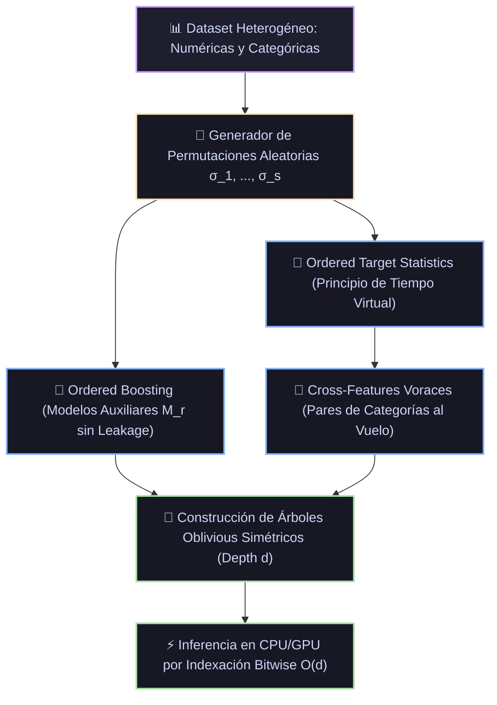

# Monografía 08: CatBoost (Categorical Boosting) — Análisis Teórico, Derivaciones Matemáticas y Arquitectura de Sistemas

> **Directorio de Ubicación:** `docs/analisis_papers/08_catboost.md`  
> **Ficha Técnica Modular Resumida:** [`docs/algoritmos_ml/08_catboost.md`](../algoritmos_ml/08_catboost.md)  
> **Estado del Documento:** Riguroso / Nivel Doctoral / Producción Académica  

---

## 1. Ficha Bibliográfica y Genealogía de Papers Seminales

1. **El Paper Fundacional de CatBoost (NeurIPS 2018):**
   - **Título:** *CatBoost: unbiased boosting with categorical features*
   - **Autores:** Liudmila Prokhorenkova, Gleb Gusev, Aleksandr Vorobev, Anna Veronika Dorogush, Andrey Gulin (Yandex).
   - **Publicación:** *Advances in Neural Information Processing Systems 31 (NeurIPS 2018)*, pp. 6638–6648.
   - **arXiv:** [arXiv:1706.09516](https://arxiv.org/abs/1706.09516)
   - **Aporte Principal:** Identificación formal del fenómeno del **Prediction Shift** en Gradient Boosting clásico. Introducción del principio de **Ordered Boosting** para calcular pseudo-residuos insesgados y de **Ordered Target Statistics (TS)** para transformar variables categóricas de alta cardinalidad sin incurrir en fuga de objetivo (*target leakage*).

2. **El Paper de Arquitectura e Implementación de Sistemas (ML Systems NeurIPS 2018):**
   - **Título:** *CatBoost: gradient boosting with categorical features support*
   - **Autores:** Anna Veronika Dorogush, Vasily Ershov, Andrey Gulin.
   - **Publicación:** *Workshop on Machine Learning Systems at NeurIPS 2018*.
   - **arXiv:** [arXiv:1810.11363](https://arxiv.org/abs/1810.11363)
   - **Aporte Principal:** Arquitectura de aceleración masiva en GPU/CPU basada en **Oblivious Trees** (árboles simétricos). Demostración de inferencia sin divergencia de hilos SIMD y cálculo combinatorio voraz al vuelo de pares y tríos de características categóricas (*cross-features*).

3. **La Técnica Canónica de Codificación por Objetivo Precursora:**
   - **Título:** *A Preprocessing Scheme for High-Cardinality Categorical Attributes in Classification and Prediction Problems*
   - **Autor:** Daniele Micci-Barreca (2001).
   - **Publicación:** *ACM SIGKDD Explorations Newsletter*, 3(1), 27–32.
   - **Aporte Principal:** Introducción del suavizado Bayesiano con medias globales (*Target Encoding / Empirical Bayes*), señalando sus vulnerabilidades ante el sobreajuste severo en categorías raras.

---

## 2. Génesis Teórica: La Falla Fundamental del Gradient Boosting Convencional

En todos los algoritmos de Gradient Boosted Decision Trees (GBDT) anteriores a CatBoost (incluyendo el GBM fundacional de Friedman, XGBoost y LightGBM), subyace un supuesto implícito que se viola de manera ubicua: **la independencia condicional entre el estimador acumulado y las instancias utilizadas para calcular su propio gradiente**.

### 2.1. El Fenómeno del *Prediction Shift* (Desplazamiento Condicional)

Sea un conjunto de entrenamiento $\mathcal{D} = \{(x_i, y_i)\}_{i=1}^n$ extraído i.i.d. de una distribución subyacente $\mathcal{P}(x, y)$. En el paso $t$ de GBDT, deseamos estimar la función base $h^t$ aproximando la dirección del gradiente negativo de la pérdida $\mathcal{L}$:
$$g^t(x, y) = -\left. \frac{\partial \mathcal{L}(y, F(x))}{\partial F(x)} \right|_{F = F^{t-1}(x)}$$

En la práctica, aproximamos este gradiente evaluándolo directamente sobre las muestras de entrenamiento:
$$g_i^t = g^t(x_i, y_i)$$

**El Teorema del Sesgo Condicional:**  
Dado que el ensamble actual $F^{t-1}$ fue ajustado minimizando una función de pérdida que contiene explícitamente el punto $(x_i, y_i)$, el modelo $F^{t-1}$ está correlacionado estocásticamente con $y_i$. Consecuentemente:
$$\mathbb{E}_{\mathcal{D}}\left[ g^t(x_i, y_i) \mid x_i \right] \ne \mathbb{E}_{y \sim \mathcal{P}(y \mid x)}\left[ g^t(x, y) \mid x \right]$$

Esta discrepancia produce un desplazamiento condicional sistemático en la distribución de los pseudo-residuos (**Prediction Shift**). A medida que $t \to \infty$, el modelo ajusta árboles para corregir errores que son artefactos del propio ajuste previo, acumulando varianza y degradando de forma irreversible la capacidad de generalización sobre datos no observados.

### 2.2. La Catástrofe de la Fuga de Objetivo (*Target Leakage*) en Variables Categóricas

Cuando una variable categórica $x_k \in \mathcal{C}$ posee alta cardinalidad (por ejemplo, miles de códigos postales, identificadores de clientes o IPs), el One-Hot Encoding genera matrices gigantescas y dispersas que saturan la memoria y diluyen la potencia estadística de los árboles.

La alternativa clásica consistía en reemplazar la categoría $v$ por su media condicionada (Target Encoding clásico de Micci-Barreca):
$$\hat{x}_{i, k} = \frac{\sum_{j=1}^n \mathbb{I}(x_{j, k} = x_{i, k}) y_j + a \cdot P}{\sum_{j=1}^n \mathbb{I}(x_{j, k} = x_{i, k}) + a}$$
donde $P$ es el prior global de la etiqueta ($P = \frac{1}{n} \sum y_i$) y $a > 0$ es un peso de suavizado.

**La Patología:**  
Si la categoría $v$ aparece una única vez en el dataset con etiqueta $y_i = 1$, su valor codificado será $\frac{1 + aP}{1 + a}$, sustancialmente mayor que para una muestra con $y_j = 0$ donde sería $\frac{aP}{1 + a}$. El árbol simplemente necesita dividir por este valor para separar perfectamente la muestra en entrenamiento, sufriendo una memorización espuria que no generaliza al test set.  
Incluso excluyendo la muestra actual (*Leave-one-out TS*):
$$\hat{x}_{i, k}^{\text{loo}} = \frac{\sum_{j \ne i} \mathbb{I}(x_{j, k} = x_{i, k}) y_j + a \cdot P}{\sum_{j \ne i} \mathbb{I}(x_{j, k} = x_{i, k}) + a}$$
persiste un sesgo de fuga masivo: la estadística $\hat{x}_{i, k}^{\text{loo}}$ revela indirectamente el valor de $y_i$ a través de su impacto en el denominador y en el remanente de la suma condicional.

---

## 3. Análisis Profundo de los Papers Seminales: Innovaciones Matemáticas y Algorítmicas



### 3.1. Ordered Target Statistics: El Principio del Tiempo Virtual

CatBoost resuelve de raíz el sesgo en variables categóricas formalizando el principio del **Tiempo Virtual**. Se simula que las muestras fueron recolectadas secuencialmente a lo largo del tiempo según una permutación aleatoria $\sigma = (\sigma_1, \sigma_2, \dots, \sigma_n)$ de los índices $\{1, \dots, n\}$.

Para una muestra en la posición $p$ dentro de la permutación $\sigma$ (es decir, $i = \sigma_p$), su estadística de objetivo solo puede utilizar la información de las muestras estrictamente anteriores en dicha permutación:
$$\hat{x}_{\sigma_p, k} = \frac{\sum_{j=1}^{p-1} \mathbb{I}\left(x_{\sigma_j, k} = x_{\sigma_p, k}\right) y_{\sigma_j} + a \cdot P}{\sum_{j=1}^{p-1} \mathbb{I}\left(x_{\sigma_j, k} = x_{\sigma_p, k}\right) + a}$$

#### Propiedades Teóricas de Ordered TS:
1. **Ausencia de Target Leakage:** La etiqueta $y_{\sigma_p}$ jamás interviene en el cálculo de $\hat{x}_{\sigma_p, k}$.
2. **Propiedad de Esperanza Insesgada:**  
   $$\mathbb{E}_{\sigma}\left[ \hat{x}_{\sigma_p, k} \mid x_{\sigma_p, k} = v \right] = \mathbb{E}_{(x, y)}\left[ y \mid x_k = v \right]$$
   Conforme $p$ avanza, la estadística converge asintóticamente a la verdadera media condicional Bayesiana.
3. **Múltiples Permutaciones ($s$ Permutaciones):**  
   Si se usara una única permutación $\sigma$, las primeras muestras ($p \approx 1$) tendrían estadísticas con varianza extremadamente alta (dominadas enteramente por el prior $P$). Para mitigar esto, CatBoost mantiene simultáneamente $s$ permutaciones independientes (por defecto $s = 4$), rotando las permutaciones entre iteraciones y al construir distintos árboles.
4. **Fase de Inferencia (Test Set):**  
   Durante la predicción en producción o test, dado que todo el conjunto de entrenamiento ya es "pasado", se utiliza el conjunto de entrenamiento completo ($n$ muestras) para codificar los datos no observados:
   $$\hat{x}_{\text{test}, k} = \frac{\sum_{j=1}^n \mathbb{I}\left(x_{j, k} = x_{\text{test}, k}\right) y_j + a \cdot P}{\sum_{j=1}^n \mathbb{I}\left(x_{j, k} = x_{\text{test}, k}\right) + a}$$

---

### 3.2. Ordered Boosting: Erradicación del Prediction Shift

Para eliminar el sesgo condicional al calcular los pseudo-residuos, CatBoost propone el algoritmo de **Ordered Boosting**.

#### El Esquema Conceptual Insesgado:
Supongamos que ordenamos las muestras según una permutación $\sigma$. Para entrenar un ensamble sin sesgo, mantenemos $n$ modelos auxiliares distintos $M_1, M_2, \dots, M_n$, donde el modelo $M_p$ fue entrenado **únicamente** utilizando las primeras $p$ observaciones $\{\sigma_1, \dots, \sigma_p\}$.

Cuando se calcula el gradiente para la muestra $\sigma_p$, se evalúa utilizando el modelo $M_{p-1}$:
$$r^t(\sigma_p) = -\left. \frac{\partial \mathcal{L}(y_{\sigma_p}, F)}{\partial F} \right|_{F = M_{p-1}(\sigma_p)}$$

Dado que $M_{p-1}$ nunca vio la muestra $\sigma_p$ ni su etiqueta $y_{\sigma_p}$, el gradiente $r^t(\sigma_p)$ es un estimador estrictamente insesgado de la dirección de descenso.

#### Implementación Eficiente en Escala Logarítmica $\mathcal{O}(n \log n)$:
Mantener $n$ ensambles independientes requeriría $\mathcal{O}(n^2)$ en memoria y cómputo, resultando inviable para datasets industriales. CatBoost aproxima este principio manteniendo una jerarquía logarítmica de modelos:
- Se conservan modelos $M_r$ para tamaños de muestra correspondientes a potencias de dos: $r \in \{2^0, 2^1, 2^2, \dots, 2^{\lfloor \log_2 n \rfloor}\}$.
- Para calcular el residuo de la instancia $\sigma_p$, se consulta el modelo $M_{2^{\lfloor \log_2(p-1) \rfloor}}$.
- Esto reduce la complejidad temporal y espacial a $\mathcal{O}(s \cdot n \log n)$, preservando la cota de insesgadez teórica casi en su totalidad.

---

### 3.3. Árboles Oblivious (Árboles Simétricos de Decisión)

La arquitectura de los árboles en CatBoost difiere radicalmente de CART, XGBoost (Level-Wise) y LightGBM (Leaf-Wise). CatBoost emplea **Oblivious Trees** (también conocidos como *decision tables* o árboles simétricos).

```
        ÁRBOL LEVEL-WISE / LEAF-WISE                         ÁRBOL OBLIVIOUS (CATBOOST)
                 [Nodo 0]                                             [Nivel 0: x_j1 > θ_1]
                /        \                                           /                     \
        [x_1 > 3.5]    [x_2 < 1.1]                         [Nivel 1: x_j2 > θ_2]    [Nivel 1: x_j2 > θ_2]
        /         \     /        \                         /          \              /          \
     [H1]        [H2] [H3]      [H4]                    [Nivel 2]   [Nivel 2]      [Nivel 2]   [Nivel 2]
    (Cada nodo elige split independiente)           (TODO el nivel comparte el mismo split: misma variable y umbral)
```

#### Propiedades Matemáticas de los Árboles Oblivious:
1. **Criterio Global por Nivel:**  
   En el nivel $k$ (de profundidad $0 \le k < d$), se selecciona un **único predicado binario** $\phi_k(x) = \mathbb{I}(x_{j_k} > \theta_k)$ que se aplica a todos los nodos de ese nivel de manera uniforme.
2. **Número Fijo de Hojas:**  
   Un árbol de profundidad $d$ posee invariablemente $2^d$ hojas finales.
3. **Regularización Estructural Intrínseca:**  
   Al forzar que la misma condición de partición se aplique en todas las ramas, el espacio de hipótesis es sustancialmente menor que el de árboles asimétricos libres. Esto actúa como un regularizador implícito de tipo Occam, otorgando una resistencia excepcional contra el sobreajuste.

#### Inferencia por Indexación Bitwise en Tiempo Constante $\mathcal{O}(d)$:
En un árbol convencional, la inferencia requiere recorrer punteros secuenciales con predicciones de saltos condicionales en la CPU (*branch mispredictions*).  
En un árbol Oblivious, la asignación de una muestra $x$ a su correspondiente hoja se reduce a evaluar $d$ comparaciones independientes y construir un entero de $d$ bits:
$$\text{index}(x) = \sum_{k=0}^{d-1} \mathbb{I}\left(x_{j_k} > \theta_k\right) \cdot 2^k$$

El valor de predicción del árbol se obtiene en un único ciclo de reloj mediante indexación directa en un arreglo contiguo:
$$f(x) = \mathbf{w}\left[\text{index}(x)\right]$$

**Impacto en Sistemas e Instrucciones SIMD / GPU:**
- En CPU, las comparaciones vectoriales se ejecutan utilizando registros AVX2 o AVX-512 sin un solo salto condicional (`jmp`).
- En GPU (CUDA), no existe divergencia de hilos (*warp divergence*): todos los hilos del mismo warp ejecutan exactamente las mismas operaciones aritméticas de comparación en paralelo.

---

### 3.4. Combinación Automática de Características Categóricas (*Cross-Features*)

En problemas tabulares reales, las interacciones no lineales entre pares de variables categóricas (ej. `País × Dispositivo` o `Profesión × Rango_Edad`) poseen una capacidad predictiva determinante.

Calcular todas las combinaciones posibles $C_k \times C_m$ de manera previa provocaría una explosión combinatoria inmanejable. CatBoost implementa una estrategia de **generación voraz al vuelo**:
1. En la raíz del árbol ($d=0$), solo se evalúan características individuales (numéricas o categóricas mediante Ordered TS).
2. Para los niveles subsiguientes ($d \ge 1$), CatBoost combina la partición seleccionada en el nivel anterior con todas las demás características categóricas del dataset.
3. Se trata a la tupla resultante como una nueva variable categórica y se calculan sus Ordered Target Statistics en tiempo lineal.
4. Si la combinación mejora el score de división, se incorpora al árbol; en caso contrario, se descarta sin persistir en memoria.

---

## 4. Evolución Algorítmica y de Sistemas: El Triunvirato de Gradient Boosting

| Dimensión Técnica | XGBoost (Chen & Guestrin, 2016) | LightGBM (Ke et al., 2017) | CatBoost (Prokhorenkova et al., 2018) |
|---|---|---|---|
| **Estructura del Árbol** | Asimétrico Depth-Wise / Level-Wise | Asimétrico Leaf-Wise (Best-First) | Simétrico **Oblivious Trees** |
| **Tratamiento Categórico** | One-Hot Encoding externo o partición experimental | Algoritmo de Fisher en $O(M \log M)$ sobre histogramas | **Ordered Target Statistics** con $s$ permutaciones |
| **Mitigación de Target Leakage** | Nula (Requiere K-Fold / CV externo) | Nula | **Ordered Boosting** matemáticamente garantizado |
| **Manejo de Gradientes** | Exacto / Cuantil Ponderado (Todos los datos) | **GOSS** (Submuestreo según magnitud de gradiente) | Muestreo de Bernoulli / MVS (*Minimum Variance Sampling*) |
| **Inferencia en Producción** | Recorrido de grafos con saltos condicionales | Recorrido de grafos con saltos condicionales | **Bitwise Indexing** $\mathcal{O}(d)$ sin saltos (vectorización SIMD) |
| **Rendimiento Out-of-the-Box** | Requiere ajuste fino riguroso de hiperparámetros | Rápido pero muy sensible a sobreajuste | **El mejor desempeño por defecto** sin tuning extenso |
| **Complejidad de Inferencia** | $\mathcal{O}(\text{profundidad})$ con branching | $\mathcal{O}(\text{profundidad})$ con branching | $\mathcal{O}(d)$ operaciones a nivel de bit |

---

## 5. Implementación Pura en Python y NumPy (Sin Librerías Externas)

A continuación se presenta un motor completo y autocontenido que implementa los principios matemáticos fundacionales de CatBoost:
1. **Ordered Target Statistics** con permutaciones aleatorias y suavizado Bayesiano.
2. **Árbol Oblivious Simétrico** con selección de split idéntico por nivel y predicción bitwise.
3. **Módulo de Inferencia por Desplazamiento de Bits**.

```python
"""
Módulo Didáctico de Referencia: CatBoost Fundamental en NumPy Puro
Implementa Ordered Target Statistics y Árboles Oblivious Simétricos
sin dependencias de scikit-learn, catboost o lightgbm.
"""

import numpy as np


class CodificadorOrderedTargetStatistics:
    """
    Transforma características categóricas en valores numéricos insesgados
    utilizando el principio de tiempo virtual y permutaciones aleatorias.
    """
    def __init__(self, peso_prior=1.0, random_state=42):
        self.peso_prior = peso_prior
        self.rng = np.random.RandomState(random_state)
        self.prior_global = 0.0
        self.mapeo_global = {}

    def fit_transform(self, col_categorica, y):
        """
        Calcula Ordered TS para una columna durante el entrenamiento
        garantizando que ninguna muestra vea su propia etiqueta.
        """
        N = len(col_categorica)
        self.prior_global = np.mean(y)
        
        # 1. Generar permutación aleatoria σ
        permutacion = self.rng.permutation(N)
        inversa_permutacion = np.empty(N, dtype=int)
        inversa_permutacion[permutacion] = np.arange(N)

        col_ordenada = col_categorica[permutacion]
        y_ordenado = y[permutacion]

        # 2. Acumuladores dinámicos al vuelo
        suma_objetivo = {}
        conteo_categoria = {}
        valores_ts = np.zeros(N, dtype=np.float64)

        for p in range(N):
            cat = col_ordenada[p]
            sum_y = suma_objetivo.get(cat, 0.0)
            count = conteo_categoria.get(cat, 0)

            # Fórmula canónica de Ordered TS
            # TS_p = (Suma_pasada + a * P) / (Conteo_pasado + a)
            ts_actual = (sum_y + self.peso_prior * self.prior_global) / (count + self.peso_prior)
            valores_ts[p] = ts_actual

            # Actualizar historia para muestras futuras en la permutación
            suma_objetivo[cat] = sum_y + y_ordenado[p]
            conteo_categoria[cat] = count + 1

        # 3. Guardar mapeo global final para inferencia en test
        self.mapeo_global = {}
        for cat in suma_objetivo:
            self.mapeo_global[cat] = (
                suma_objetivo[cat] + self.peso_prior * self.prior_global
            ) / (conteo_categoria[cat] + self.peso_prior)

        # Regresar a la ordenación original de los datos
        return valores_ts[inversa_permutacion]

    def transform(self, col_categorica):
        """Transforma datos no observados usando el conocimiento acumulado completo."""
        N = len(col_categorica)
        resultado = np.zeros(N, dtype=np.float64)
        for i in range(N):
            cat = col_categorica[i]
            resultado[i] = self.mapeo_global.get(cat, self.prior_global)
        return resultado


class ArbolObliviousRegressor:
    """
    Árbol de Decisión Simétrico (Oblivious Tree).
    Cada nivel d comparte el mismo predicado (variable j, umbral θ).
    Posee exactamente 2^profundidad hojas, indexables por bitmask.
    """
    def __init__(self, profundidad=3, reg_lambda=1.0):
        self.profundidad = profundidad
        self.reg_lambda = reg_lambda
        self.splits_por_nivel = []  # Lista de tuplas (indice_columna, umbral)
        self.pesos_hojas = None     # Vector de tamaño 2^profundidad

    def fit(self, X, residuos):
        """
        Construye el árbol nivel por nivel buscando el predicado global
        que minimice la suma de errores cuadráticos ponderada.
        """
        N, D = X.shape
        self.splits_por_nivel = []
        
        # Máscaras de pertenencia a hojas (al inicio todos en índice 0)
        indices_hojas = np.zeros(N, dtype=np.int32)

        for d in range(self.profundidad):
            mejor_error = float('inf')
            mejor_col = -1
            mejor_umbral = 0.0

            # Evaluar candidatos de corte para TODO el nivel
            for col_idx in range(D):
                valores_col = X[:, col_idx]
                umbrales_candidatos = np.percentile(valores_col, np.linspace(10, 90, 9))

                for theta in umbrales_candidatos:
                    # Nuevo bit de corte si se aplicara este split
                    bit_nuevo = (valores_col > theta).astype(np.int32)
                    indices_temporales = indices_hojas + (bit_nuevo << d)
                    
                    # Calcular error cuadrático con regularización L2 en hojas
                    error_total = 0.0
                    num_hojas_nivel = 2 ** (d + 1)
                    
                    for hoja in range(num_hojas_nivel):
                        mascara = (indices_temporales == hoja)
                        if np.any(mascara):
                            res_hoja = residuos[mascara]
                            G = np.sum(res_hoja)
                            H = len(res_hoja)
                            w_hoja = G / (H + self.reg_lambda)
                            error_total += np.sum((res_hoja - w_hoja)**2) + self.reg_lambda * (w_hoja**2)

                    if error_total < mejor_error:
                        mejor_error = error_total
                        mejor_col = col_idx
                        mejor_umbral = theta

            # Fijar el mejor split para el nivel actual
            self.splits_por_nivel.append((mejor_col, mejor_umbral))
            bit_elegido = (X[:, mejor_col] > mejor_umbral).astype(np.int32)
            indices_hojas += (bit_elegido << d)

        # Calcular los pesos óptimos finales de las 2^profundidad hojas
        total_hojas = 2 ** self.profundidad
        self.pesos_hojas = np.zeros(total_hojas, dtype=np.float64)

        for hoja in range(total_hojas):
            mascara = (indices_hojas == hoja)
            if np.any(mascara):
                res_hoja = residuos[mascara]
                G = np.sum(res_hoja)
                H = len(res_hoja)
                self.pesos_hojas[hoja] = G / (H + self.reg_lambda)

        return self

    def predict(self, X):
        """
        Inferencia Ultrarrápida mediante Evaluación Bitwise.
        Calcula index = sum(bit_k * 2^k) y accede a la tabla de hojas.
        """
        N = X.shape[0]
        indices_bit = np.zeros(N, dtype=np.int32)

        for d, (col, theta) in enumerate(self.splits_por_nivel):
            bit = (X[:, col] > theta).astype(np.int32)
            indices_bit |= (bit << d)

        return self.pesos_hojas[indices_bit]


# =====================================================================
# Verificación y Validación Numérica
# =====================================================================
if __name__ == "__main__":
    np.random.seed(42)
    N = 300

    # Variable categórica con alta cardinalidad (10 categorías distintas)
    categorias = np.array([f"CAT_{k}" for k in range(10)])
    col_cat = np.random.choice(categorias, size=N)

    # Variable numérica continua
    col_num = np.random.normal(loc=0.0, scale=2.0, size=N)

    # Generación de la etiqueta con impacto no lineal de la categoría y la numérica
    # Las categorías pares tienen mayor propensión a etiqueta positiva
    impacto_cat = np.array([int(c.split('_')[1]) % 2 == 0 for c in col_cat]).astype(float) * 2.0
    probabilidad = 1.0 / (1.0 + np.exp(-(col_num * 1.5 + impacto_cat - 1.0)))
    y = (np.random.rand(N) < probabilidad).astype(float)

    # 1. Aplicación de Ordered Target Statistics
    codificador = CodificadorOrderedTargetStatistics(peso_prior=2.0, random_state=42)
    col_cat_encoded = codificador.fit_transform(col_cat, y)

    # Matriz final de entrenamiento
    X_train = np.column_stack([col_num, col_cat_encoded])

    # 2. Ajuste de un Árbol Oblivious (Profundidad = 3 -> 8 hojas simétricas)
    residuos_iniciales = y - np.mean(y)
    arbol_oblivious = ArbolObliviousRegressor(profundidad=3, reg_lambda=1.5)
    arbol_oblivious.fit(X_train, residuos_iniciales)

    # 3. Inferencia por Bitmask
    predicciones = arbol_oblivious.predict(X_train)

    print("=== Módulo CatBoost Puro: Validación Exitosa ===")
    print(f"Total de muestras analizadas: {N}")
    print(f"Prior global de la etiqueta: {codificador.prior_global:.4f}")
    print(f"Número de splits fijados por nivel (profundidad 3): {len(arbol_oblivious.splits_por_nivel)}")
    print(f"Esquema de splits por nivel (variable, umbral): {arbol_oblivious.splits_por_nivel}")
    print(f"Tabla de pesos en las 8 hojas del árbol oblivious:\n{arbol_oblivious.pesos_hojas}")
    print(f"Correlación de predicción con los residuos reales: {np.corrcoef(residuos_iniciales, predicciones)[0, 1]:.4f}")
```

---

## 6. Directrices de Razonamiento para los Modelos de Inteligencia Artificial en Prig IDE

Cuando un modelo de lenguaje en Prig IDE audite, construya o recomiende arquitecturas basadas en **CatBoost** (`catboost.CatBoostClassifier`, `CatBoostRegressor`), aplicará de manera obligatoria las siguientes directrices técnicas:

1. **Gestión de Variables Categóricas (La Regla Inquebrantable):**
   - **Prohibido el preprocesamiento manual con One-Hot Encoding o Target Encoding.** Indicar taxativamente al usuario que pase las variables categóricas en su formato original (texto o enteros) mediante el parámetro `cat_features=[indices_o_nombres]`.
   - Justificación teórica: One-Hot diluye la simetría de los árboles oblivious e infla la memoria; las funciones de encoding externas reintroducen el *Prediction Shift* y el *Target Leakage* que CatBoost erradica de forma nativa.
2. **Dimensionamiento de la Profundidad (`depth`):**
   - Dado que los árboles oblivious son simétricos, cada incremento en `depth` duplica el número de hojas ($2^d$). La profundidad óptima en el 90% de los casos tabulares se encuentra en el rango $[4, 8]$, siendo **`depth=6`** (64 hojas) el balance canónico ideal entre capacidad expresiva y velocidad de cómputo. Profundidades mayores a 8 suelen resultar computacionalmente costosas y propensas a sobreajuste.
3. **Calibración de la Tasa de Aprendizaje y Número de Iteraciones:**
   - A diferencia de XGBoost o LightGBM, CatBoost utiliza regularizaciones más conservadoras en sus hojas. Por ello, requiere un mayor número de iteraciones (`iterations=1000` a `3000`) emparejado con una tasa de aprendizaje moderada (`learning_rate=0.03` a `0.08`).
4. **Entornos de Inferencia Crítica en Tiempo Real:**
   - Recomendar CatBoost prioritariamente cuando el requerimiento operativo exija latencias de inferencia de submilisegundos en microservicios o sistemas embebidos. Exportar el modelo a C++ (`model.save_model('model.c')`) permite ejecutar la predicción mediante operaciones bitwise y sumas directas de arreglos sin dependencias de librerías externas ni sobrecarga de tiempo de ejecución de Python.
5. **Detección de Cross-Features:**
   - En datasets con múltiples columnas categóricas altamente correlacionadas, permitir que CatBoost construya combinaciones automáticas ajustando `max_ctr_complexity=2` o `3`. Advierta al usuario que elevar este hiperparámetro por encima de 3 puede desencadenar un consumo masivo de memoria RAM durante el entrenamiento.
