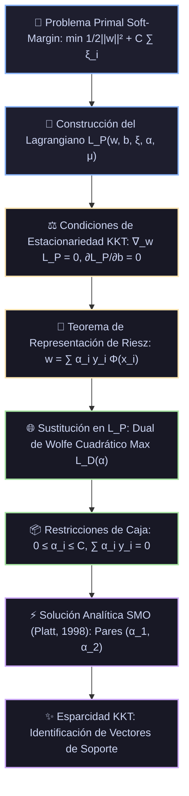

# Monografía 09: Máquinas de Vectores de Soporte (SVM y SVR) — Fundamentos Teóricos, Dualidad de Wolfe, Algoritmo SMO y Núcleos de Reproducción

> **Directorio de Ubicación:** `docs/analisis_papers/09_svm_y_svr.md`  
> **Ficha Técnica Modular Resumida:** [`docs/algoritmos_ml/09_svm_y_svr.md`](../algoritmos_ml/09_svm_y_svr.md)  
> **Estado del Documento:** Riguroso / Nivel Doctoral / Producción Académica  

---

## 1. Ficha Bibliográfica y Genealogía de Papers Seminales

1. **La Teoría del Aprendizaje Estadístico y la Dimensión VC (1974, 1982):**
   - **Autores:** Vladimir N. Vapnik y Alexey Ya. Chervonenkis.
   - **Obras Canónicas:** *Theory of Pattern Recognition* (Nauka, Moscú, 1974); *Estimation of Dependences Based on Empirical Data* (Springer-Verlag, 1982).
   - **Aporte Principal:** Formulación del principio de **Minimización del Riesgo Estructural (Structural Risk Minimization, SRM)** frente a la Minimización del Riesgo Empírico (ERM). Definición de la **Capacidad VC** y demostración de que la cota de generalización depende del margen geométrico y no directamente del número de dimensiones del espacio de entrada.

2. **El Clasificador de Margen Óptimo y el Truco del Núcleo (COLT 1992):**
   - **Título:** *A Training Algorithm for Optimal Margin Classifiers*
   - **Autores:** Bernhard E. Boser, Isabelle M. Guyon, Vladimir N. Vapnik.
   - **Publicación:** *Proceedings of the 5th Annual ACM Workshop on Computational Learning Theory (COLT '92)*, pp. 144–152.
   - **Aporte Principal:** Introducción del **Truco del Kernel (*Kernel Trick*)** aplicando el Teorema de Mercer (1909) a hiperplanos de margen óptimo. Mapeo no lineal implícito $\Phi(x)$ a espacios de Hilbert de dimensión infinita evaluando únicamente productos escalares $K(x, z) = \langle \Phi(x), \Phi(z) \rangle$.

3. **Redes de Vectores de Soporte y Margen Suave (Machine Learning 1995):**
   - **Título:** *Support-Vector Networks*
   - **Autores:** Corinna Cortes y Vladimir Vapnik (AT&T Bell Laboratories).
   - **Publicación:** *Machine Learning*, 20(3), pp. 273–297 (1995).
   - **Aporte Principal:** Extensión a conjuntos linealmente no separables mediante **variables de holgura (*slack variables*)** $\xi_i \ge 0$ y el parámetro de regularización de caja $C$. Deducción de las condiciones KKT de complementariedad y formulación dual de Wolfe moderna.

4. **Regresión por Vectores de Soporte (SVR, NeurIPS 1996):**
   - **Título:** *Support Vector Regression Machines*
   - **Autores:** Harris Drucker, Christopher J. C. Burges, Linda Kaufman, Alex J. Smola, Vladimir Vapnik.
   - **Publicación:** *Advances in Neural Information Processing Systems 9 (NeurIPS 1996)*, pp. 155–161.
   - **Tesis Complementaria:** Alex J. Smola, Bernhard Schölkopf (2004). *A Tutorial on Support Vector Regression*. *Statistics and Computing*, 14(3), pp. 199–222.
   - **Aporte Principal:** Pérdida $\varepsilon$-insensible de Vapnik ($|y - f(x)|_\varepsilon = \max(0, |y - f(x)| - \varepsilon)$) que confiere esparcidad a la solución de regresión en espacios continuos.

5. **El Algoritmo de Optimización Mínima Secuencial (SMO, 1998):**
   - **Título:** *Sequential Minimal Optimization: A Fast Algorithm for Training Support Vector Machines*
   - **Autor:** John C. Platt (Microsoft Research).
   - **Publicación:** *Technical Report MSR-TR-98-14* (1998).
   - **Aporte Principal:** Eliminación del requerimiento de solvers cuadráticos generales (QP) de complejidad $\mathcal{O}(N^3)$ y almacenamiento de la matriz de Gram densa $\mathcal{O}(N^2)$. Descomposición del problema dual en subproblemas analíticos bidimensionales de dos multiplicadores $(\alpha_1, \alpha_2)$ con actualización cerrada y heurísticas de violación KKT.

---

## 2. Génesis Teórica: De la Dimensión VC a la Minimización del Riesgo Estructural (SRM)

El paradigma clásico de aprendizaje empírico (**ERM - Empirical Risk Minimization**) minimiza el error sobre el conjunto de entrenamiento:
$$R_{\text{emp}}(f) = \frac{1}{n} \sum_{i=1}^n \mathcal{L}(y_i, f(x_i))$$

Sin embargo, el objetivo fundamental del aprendizaje estadístico es minimizar el **Riesgo Real (o Error de Generalización)** sobre la distribución desconocida $\mathcal{P}(x, y)$:
$$R(f) = \int \mathcal{L}(y, f(x)) \, d\mathcal{P}(x, y)$$

### 2.1. La Cota Fundamental de Vapnik-Chervonenkis

Vapnik y Chervonenkis demostraron que para cualquier función de pérdida binaria en una clase de hipótesis $\mathcal{F}$ con dimensión VC $h$, con probabilidad al menos $1 - \eta$:
$$R(f) \le R_{\text{emp}}(f) + \sqrt{\frac{h \left( \ln\left(\frac{2n}{h}\right) + 1 \right) - \ln\left(\frac{\eta}{4}\right)}{n}}$$

El segundo término del miembro derecho se denomina **Término de Confianza** (*Confidence Bound*).  
- Redes neuronales sobreparametrizadas y árboles no podados reducen $R_{\text{emp}} \to 0$, pero disparan $h \to \infty$, degradando la cota de generalización.
- El principio de **Minimización del Riesgo Estructural (SRM)** propone definir una jerarquía de clases de hipótesis $\mathcal{F}_1 \subset \mathcal{F}_2 \subset \dots \subset \mathcal{F}_k$ con dimensiones VC crecientes $h_1 \le h_2 \le \dots \le h_k$, seleccionando aquella que minimice la suma del error empírico y el término de confianza.

### 2.2. El Teorema del Margen Óptimo de Vapnik

**Teorema (Vapnik, 1995):**  
Sea un hiperplano canónico $w^T x + b = 0$ que separa un conjunto de vectores contenidos en una esfera de radio $R$ con un margen geométrico $\Delta = \frac{2}{\|w\|}$. La dimensión VC de esta familia de hiperplanos está acotada superiormente por:
$$h \le \min\left( \left\lceil \frac{R^2}{\Delta^2} \right\rceil, D \right) + 1 = \min\left( \left\lceil \frac{R^2 \|w\|^2}{4} \right\rceil, D \right) + 1$$
donde $D$ es la dimensionalidad del espacio.

**Implicación Teórica Trascendental:**  
La capacidad de generalización del hiperplano **no depende de la dimensión del espacio $D$**, sino exclusivamente del cociente entre el radio del soporte de los datos $R$ y el ancho del margen $\Delta$.  
Por consiguiente, si proyectamos los datos a un espacio de Hilbert de **dimensión infinita** ($D = \infty$) pero forzamos que el margen geométrico $\Delta$ sea grande (es decir, $\|w\|^2$ pequeño), la dimensión VC permanece estrictamente acotada, inmunizando al clasificador contra la maldición de la dimensionalidad (*curse of dimensionality*).

---

## 3. Derivación Matemática Rigurosa: Del Primal al Dual de Wolfe



### 3.1. Problema Primal de Margen Suave (Cortes & Vapnik, 1995)

Dado un conjunto de entrenamiento $\mathcal{D} = \{(x_i, y_i)\}_{i=1}^n$ con $x_i \in \mathbb{R}^d$ e hiperetiquetas binarias $y_i \in \{-1, +1\}$.  
Para permitir violaciones controladas del margen en datos ruidosos o linealmente no separables, introducimos variables de holgura $\xi_i \ge 0$:
$$\min_{w \in \mathcal{H}, \, b \in \mathbb{R}, \, \boldsymbol{\xi} \in \mathbb{R}^n} \frac{1}{2} \|w\|^2 + C \sum_{i=1}^n \xi_i$$
sujeto a las restricciones de desigualdad:
$$y_i \left( \langle w, \Phi(x_i) \rangle + b \right) \ge 1 - \xi_i, \quad \forall i = 1, \dots, n$$
$$\xi_i \ge 0, \quad \forall i = 1, \dots, n$$

- El término $\frac{1}{2}\|w\|^2$ maximiza el margen $\Delta = \frac{2}{\|w\|}$.
- El parámetro de regularización $C > 0$ actúa como el multiplicador de compromiso entre la amplitud del margen y la penalización de violaciones (error empírico en escala bisagra o *Hinge Loss*).

### 3.2. Formulación del Lagrangiano Primal

Asignamos multiplicadores de Lagrange $\alpha_i \ge 0$ a la restricción del margen y $\mu_i \ge 0$ a la no negatividad de las holguras:
$$\mathcal{L}_P(w, b, \boldsymbol{\xi}, \boldsymbol{\alpha}, \boldsymbol{\mu}) = \frac{1}{2} \|w\|^2 + C \sum_{i=1}^n \xi_i - \sum_{i=1}^n \alpha_i \left[ y_i \left( \langle w, \Phi(x_i) \rangle + b \right) - 1 + \xi_i \right] - \sum_{i=1}^n \mu_i \xi_i$$

### 3.3. Condiciones de Karush-Kuhn-Tucker (KKT)

Dado que la función objetivo es cuadrática convexa y las restricciones son afines, se satisface la **Condición de Calificación de Restricciones de Slater**, garantizando la existencia de un punto de silla con **Dualidad Fuerte** (el óptimo del primal coincide exactamente con el óptimo del dual).

#### 1. Estacionariedad:
$$\nabla_w \mathcal{L}_P = 0 \implies w - \sum_{i=1}^n \alpha_i y_i \Phi(x_i) = 0 \implies w = \sum_{i=1}^n \alpha_i y_i \Phi(x_i)$$
$$\frac{\partial \mathcal{L}_P}{\partial b} = 0 \implies -\sum_{i=1}^n \alpha_i y_i = 0 \implies \sum_{i=1}^n \alpha_i y_i = 0$$
$$\frac{\partial \mathcal{L}_P}{\partial \xi_i} = 0 \implies C - \alpha_i - \mu_i = 0 \implies \alpha_i + \mu_i = C$$

Dado que $\mu_i \ge 0$, la condición $\alpha_i + \mu_i = C$ impone inmediatamente la cota superior:
$$0 \le \alpha_i \le C$$

#### 2. Holgura Complementaria de KKT:
$$\alpha_i \left[ y_i \left( \langle w, \Phi(x_i) \rangle + b \right) - 1 + \xi_i \right] = 0, \quad \forall i$$
$$\mu_i \xi_i = (C - \alpha_i) \xi_i = 0, \quad \forall i$$

#### Clasificación Anatómica de las Muestras según KKT:
1. **Puntos Fuera del Margen ($\alpha_i = 0$):**  
   Como $\alpha_i = 0$, se cumple que $\mu_i = C > 0$. De la holgura complementaria se deduce que $\xi_i = 0$. Por lo tanto:
   $$y_i (\langle w, \Phi(x_i) \rangle + b) \ge 1$$
   La muestra está correctamente clasificada y no toca el margen. Su multiplicador es cero, por lo que **no forma parte del vector de pesos $w$ y es completamente irrelevante para la frontera de decisión**.
2. **Vectores de Soporte Libres en el Margen ($0 < \alpha_i < C$):**  
   Al ser $\alpha_i < C$, se deduce que $\mu_i = C - \alpha_i > 0$, lo que fuerza $\xi_i = 0$. De la condición sobre $\alpha_i$ se exige:
   $$y_i (\langle w, \Phi(x_i) \rangle + b) = 1$$
   Estas muestras yacen exactamente sobre los hiperplanos frontera del margen. Son los puntos críticos que definen la orientación y la posición del hiperplano separador.
3. **Vectores de Soporte Acolchonados ($\alpha_i = C$):**  
   Como $\alpha_i = C$, se tiene $\mu_i = 0$, permitiendo que $\xi_i \ge 0$.  
   - Si $0 < \xi_i \le 1$, la muestra está dentro del margen pero correctamente clasificada.
   - Si $\xi_i > 1$, la muestra está mal clasificada.

---

### 3.4. Deducción del Dual de Wolfe

Sustituyendo las relaciones de estacionariedad en el Lagrangiano primal:
$$\mathcal{L}_D(\boldsymbol{\alpha}) = \frac{1}{2} \left\langle \sum_{i=1}^n \alpha_i y_i \Phi(x_i), \sum_{j=1}^n \alpha_j y_j \Phi(x_j) \right\rangle + C \sum_{i=1}^n \xi_i - \sum_{i=1}^n \alpha_i y_i \left\langle \sum_{j=1}^n \alpha_j y_j \Phi(x_j), \Phi(x_i) \right\rangle - b \sum_{i=1}^n \alpha_i y_i + \sum_{i=1}^n \alpha_i - \sum_{i=1}^n \alpha_i \xi_i - \sum_{i=1}^n (C - \alpha_i) \xi_i$$

Los términos lineales en $\xi_i$ y el término con $b$ se cancelan idénticamente:
$$-b \sum_{i=1}^n \alpha_i y_i = 0$$
$$C \sum_{i=1}^n \xi_i - \sum_{i=1}^n \alpha_i \xi_i - \sum_{i=1}^n C \xi_i + \sum_{i=1}^n \alpha_i \xi_i = 0$$

Agrupando los términos cuadráticos y lineales restantes:
$$\mathcal{L}_D(\boldsymbol{\alpha}) = \sum_{i=1}^n \alpha_i - \frac{1}{2} \sum_{i=1}^n \sum_{j=1}^n \alpha_i \alpha_j y_i y_j \langle \Phi(x_i), \Phi(x_j) \rangle$$

Reemplazando el producto escalar por la función de núcleo $K(x_i, x_j) = \langle \Phi(x_i), \Phi(x_j) \rangle$, obtenemos el **Problema de Programación Cuadrática Dual de Wolfe**:
$$\max_{\boldsymbol{\alpha} \in \mathbb{R}^n} \quad \mathcal{Q}(\boldsymbol{\alpha}) = \sum_{i=1}^n \alpha_i - \frac{1}{2} \sum_{i=1}^n \sum_{j=1}^n \alpha_i \alpha_j y_i y_j K(x_i, x_j)$$
sujeto a:
$$0 \le \alpha_i \le C, \quad \forall i = 1, \dots, n$$
$$\sum_{i=1}^n \alpha_i y_i = 0$$

---

### 3.5. El Teorema de Mercer y la Dimensión Infinita del Kernel RBF

**Teorema de Mercer (1909):**  
Una función simétrica y continua $K: \mathcal{X} \times \mathcal{X} \to \mathbb{R}$ admite una representación como producto escalar en un espacio de Hilbert $\mathcal{H}$ si y solo si la matriz de Gram resultante $\mathbf{K} \in \mathbb{R}^{n \times n}$ con elementos $K_{ij} = K(x_i, x_j)$ es **semidefinida positiva** para cualquier subconjunto finito de puntos:
$$\sum_{i=1}^n \sum_{j=1}^n c_i c_j K(x_i, x_j) \ge 0, \quad \forall c \in \mathbb{R}^n$$

#### Demostración: La Dimensión Infinita del Kernel RBF Gaussiano
Sea el kernel Gaussiano con parámetro de curvatura $\gamma > 0$:
$$K(x, z) = \exp\left( -\gamma \|x - z\|^2 \right) = \exp\left( -\gamma \|x\|^2 \right) \exp\left( -\gamma \|z\|^2 \right) \exp\left( 2\gamma \langle x, z \rangle \right)$$

Expandiendo el término exponencial cruzado mediante la Serie de Taylor:
$$\exp(2\gamma \langle x, z \rangle) = \sum_{k=0}^\infty \frac{(2\gamma)^k}{k!} (\langle x, z \rangle)^k$$

Cada monomio $(\langle x, z \rangle)^k$ representa el producto escalar de todos los polinomios homogéneos de grado $k$.  
Por lo tanto, la función $\Phi(x)$ asociada al Kernel RBF es un vector de dimensión infinita:
$$\Phi(x) = \exp(-\gamma \|x\|^2) \left[ 1, \, \sqrt{2\gamma} x_1, \, \dots, \, \sqrt{\frac{(2\gamma)^k}{k!}} x_{i_1} x_{i_2} \dots x_{i_k}, \, \dots \right]^T \in \ell_2$$
¡Evaluar una simple función exponencial euclidiana en tiempo $\mathcal{O}(D)$ equivale a computar un hiperplano lineal en un espacio de Hilbert de dimensión $\infty$!

---

### 3.6. Regresión por Vectores de Soporte (SVR, Drucker & Vapnik, 1996)

En problemas de regresión, deseamos ajustar una función $f(x) = \langle w, \Phi(x) \rangle + b$ que desvíe a lo sumo $\varepsilon$ respecto a las etiquetas reales $y_i$. Errores menores a $\varepsilon$ se consideran tolerables y no reciben penalización alguna (**Tubo $\varepsilon$-insensible**).

```
         y ^                   /  Límite superior: f(x) + ε
           |                  / 
           |    *            / ---------------------- f(x) (Función aprendida)
           |                /
           |               /  Límite inferior: f(x) - ε
           |              /
           +----------------------------------------> x
                  |<- 2ε ->| (Ancho del tubo sin pérdida)
```

#### Problema Primal SVR:
$$\min_{w, b, \boldsymbol{\xi}, \boldsymbol{\xi}^*} \frac{1}{2}\|w\|^2 + C \sum_{i=1}^n (\xi_i + \xi_i^*)$$
sujeto a:
$$\begin{cases} y_i - \langle w, \Phi(x_i) \rangle - b \le \varepsilon + \xi_i \\ \langle w, \Phi(x_i) \rangle + b - y_i \le \varepsilon + \xi_i^* \\ \xi_i, \xi_i^* \ge 0 \end{cases}$$

#### Dual de Wolfe de SVR con Multiplicadores $\alpha_i, \alpha_i^*$:
$$\max_{\boldsymbol{\alpha}, \boldsymbol{\alpha}^*} \quad -\frac{1}{2}\sum_{i=1}^n \sum_{j=1}^n (\alpha_i - \alpha_i^*)(\alpha_j - \alpha_j^*) K(x_i, x_j) - \varepsilon \sum_{i=1}^n (\alpha_i + \alpha_i^*) + \sum_{i=1}^n y_i (\alpha_i - \alpha_i^*)$$
sujeto a:
$$0 \le \alpha_i, \alpha_i^* \le C, \quad \forall i$$
$$\sum_{i=1}^n (\alpha_i - \alpha_i^*) = 0$$

La función de inferencia de SVR resulta:
$$f(x) = \sum_{i=1}^n (\alpha_i - \alpha_i^*) K(x_i, x) + b$$
Solo los puntos situados sobre o fuera del tubo $\varepsilon$-insensible poseen $\alpha_i - \alpha_i^* \ne 0$, preservando la esparcidad de la solución.

---

## 4. El Algoritmo SMO (Sequential Minimal Optimization, John Platt 1998)

Los solvers cuadráticos convencionales (QP) almacenan en memoria la matriz de Gram completa $\mathbf{K} \in \mathbb{R}^{n \times n}$ ($\mathcal{O}(n^2)$ de memoria) y convergen en $\mathcal{O}(n^3)$ operaciones. Para $n = 100,000$, la matriz ocuparía $80 \text{ GB}$ de memoria RAM.

### 4.1. La Descomposición Analítica Bidimensional

Platt reconoció que la restricción de igualdad lineal $\sum_{i=1}^n \alpha_i y_i = 0$ impide optimizar un único multiplicador $\alpha_1$ manteniendo el resto constante. Por consiguiente, **el subproblema mínimo resoluble involucra exactamente dos multiplicadores: $\alpha_1$ y $\alpha_2$**.

Fijando $\alpha_3, \dots, \alpha_n$, la restricción lineal exige:
$$\alpha_1 y_1 + \alpha_2 y_2 = -\sum_{i=3}^n \alpha_i y_i \equiv \zeta \quad (\text{constante})$$

Multiplicando por $y_1$ (sabiendo que $y_1^2 = 1$):
$$\alpha_1 = y_1 (\zeta - \alpha_2 y_2)$$

### 4.2. Límites de Restricción de Caja (Clipping Bounds)

Dado que $0 \le \alpha_1, \alpha_2 \le C$, las restricciones delimitan un segmento lineal en el plano $(\alpha_1, \alpha_2)$:
- **Caso 1: Signos opuestos ($y_1 \ne y_2$):** $\alpha_1 - \alpha_2 = k$
  $$L = \max(0, \alpha_2^{\text{old}} - \alpha_1^{\text{old}}), \quad H = \min(C, C + \alpha_2^{\text{old}} - \alpha_1^{\text{old}})$$
- **Caso 2: Mismo signo ($y_1 = y_2$):** $\alpha_1 + \alpha_2 = k$
  $$L = \max(0, \alpha_2^{\text{old}} + \alpha_1^{\text{old}} - C), \quad H = \min(C, \alpha_2^{\text{old}} + \alpha_1^{\text{old}})$$

### 4.3. Solución Analítica de la Cuadrática No Restringida

Sustituyendo $\alpha_1$ en el objetivo cuadrático dual $\mathcal{Q}(\alpha_1, \alpha_2)$ y derivando respecto a $\alpha_2$:
$$\frac{\partial \mathcal{Q}}{\partial \alpha_2} = 0 \implies \alpha_2^{\text{new, unclipped}} = \alpha_2^{\text{old}} + \frac{y_2 (E_1 - E_2)}{\eta}$$
donde:
- $E_i = f(x_i) - y_i = \left( \sum_{j=1}^n \alpha_j y_j K(x_j, x_i) + b \right) - y_i$ es el error de predicción actual.
- $\eta = 2 K(x_1, x_2) - K(x_1, x_1) - K(x_2, x_2)$ es la derivada de segundo orden (curvatura de la cuadrática). Como $K$ es semidefinida positiva, se garantiza $\eta \le 0$.

### 4.4. Recorte y Actualización de Parámetros

1. **Recorte de $\alpha_2$ al segmento factible $[L, H]$:**
   $$\alpha_2^{\text{new}} = \begin{cases} H & \text{si } \alpha_2^{\text{new, unclipped}} > H \\ \alpha_2^{\text{new, unclipped}} & \text{si } L \le \alpha_2^{\text{new, unclipped}} \le H \\ L & \text{si } \alpha_2^{\text{new, unclipped}} < L \end{cases}$$
2. **Actualización analítica de $\alpha_1$:**
   $$\alpha_1^{\text{new}} = \alpha_1^{\text{old}} + y_1 y_2 \left( \alpha_2^{\text{old}} - \alpha_2^{\text{new}} \right)$$
3. **Actualización del término de sesgo $b$:**  
   Para preservar las condiciones KKT sobre los vectores en el margen libre:
   $$b_1 = b^{\text{old}} - E_1 - y_1 (\alpha_1^{\text{new}} - \alpha_1^{\text{old}}) K(x_1, x_1) - y_2 (\alpha_2^{\text{new}} - \alpha_2^{\text{old}}) K(x_1, x_2)$$
   $$b_2 = b^{\text{old}} - E_2 - y_1 (\alpha_1^{\text{new}} - \alpha_1^{\text{old}}) K(x_1, x_2) - y_2 (\alpha_2^{\text{new}} - \alpha_2^{\text{old}}) K(x_2, x_2)$$
   $$b^{\text{new}} = \begin{cases} b_1 & \text{si } 0 < \alpha_1^{\text{new}} < C \\ b_2 & \text{si } 0 < \alpha_2^{\text{new}} < C \\ \frac{b_1 + b_2}{2} & \text{en cualquier otro caso} \end{cases}$$

---

## 5. Implementación Pura en Python y NumPy (Sin Scikit-Learn ni LIBSVM)

A continuación se presenta un clasificador SVM completo con soporte para **Kernel RBF**, optimizado analíticamente mediante el algoritmo **SMO de Platt**, incluyendo detección de violaciones KKT, resolución analítica de pares y función de decisión esparsa.

```python
"""
Módulo Didáctico de Referencia: SVM Dual con Algoritmo SMO en NumPy Puro
Implementa el clasificador de Cortes & Vapnik (1995) y optimizador de Platt (1998)
sin dependencias de scikit-learn, libsvm o scipy.optimize.
"""

import numpy as np


class SVM_SMO:
    """
    Máquina de Vectores de Soporte con Margen Suave (Soft-Margin SVM).
    Resuelve el problema cuadrático dual de Wolfe mediante el algoritmo SMO.
    """
    def __init__(self, C=1.0, kernel='rbf', gamma=0.5, tol=1e-3, max_iter=100):
        self.C = float(C)
        self.kernel_type = kernel
        self.gamma = float(gamma)
        self.tol = float(tol)
        self.max_iter = max_iter
        
        # Parámetros aprendidos
        self.alpha = None
        self.b = 0.0
        self.X = None
        self.y = None
        self.K = None
        self.sv_indices = None

    def _computar_kernel(self, X1, X2):
        """Computa la matriz de similitud de Gram usando el kernel seleccionado."""
        if self.kernel_type == 'lineal':
            return np.dot(X1, X2.T)
        elif self.kernel_type == 'rbf':
            # ||x - z||^2 = ||x||^2 + ||z||^2 - 2 x^T z
            sq_norm1 = np.sum(X1**2, axis=1, keepdims=True)
            sq_norm2 = np.sum(X2**2, axis=1, keepdims=True)
            dist_sq = sq_norm1 + sq_norm2.T - 2.0 * np.dot(X1, X2.T)
            # Evitar pequeñas imprecisiones numéricas negativas
            dist_sq = np.maximum(dist_sq, 0.0)
            return np.exp(-self.gamma * dist_sq)
        else:
            raise ValueError(f"Kernel no soportado: {self.kernel_type}")

    def _calcular_error(self, i):
        """Calcula el residuo de predicción: E_i = f(x_i) - y_i."""
        pred_i = np.dot(self.alpha * self.y, self.K[:, i]) + self.b
        return pred_i - self.y[i]

    def fit(self, X, y):
        """
        Entrena el modelo SVM sobre la matriz de características X y etiquetas y in {-1, +1}
        mediante optimización mínima secuencial.
        """
        N, D = X.shape
        self.X = X
        # Forzar etiquetas a {-1.0, +1.0}
        self.y = np.where(y <= 0, -1.0, 1.0).astype(np.float64)
        self.alpha = np.zeros(N, dtype=np.float64)
        self.b = 0.0

        # Precomputar matriz de Gram para el entrenamiento O(N^2)
        self.K = self._computar_kernel(X, X)

        iteracion = 0
        cambios_alfa = 0
        examinar_todos = True

        while (iteracion < self.max_iter) and (cambios_alfa > 0 or examinar_todos):
            cambios_alfa = 0

            # Estrategia de búsqueda: alternar entre todo el dataset y los vectores en el margen
            indices_a_recorrer = range(N) if examinar_todos else np.where((self.alpha > 0) & (self.alpha < self.C))[0]

            for i in indices_a_recorrer:
                E_i = self._calcular_error(i)
                r_i = E_i * self.y[i]

                # Verificar si la muestra i viola las condiciones KKT dentro de la tolerancia
                if (r_i < -self.tol and self.alpha[i] < self.C) or (r_i > self.tol and self.alpha[i] > 0):
                    # Heurística simple para seleccionar j != i
                    candidatos = [idx for idx in range(N) if idx != i]
                    j = np.random.choice(candidatos)
                    E_j = self._calcular_error(j)

                    # Guardar valores antiguos
                    alpha_i_old = self.alpha[i]
                    alpha_j_old = self.alpha[j]
                    y_i = self.y[i]
                    y_j = self.y[j]

                    # 1. Calcular límites de caja [L, H]
                    if y_i != y_j:
                        L = max(0.0, alpha_j_old - alpha_i_old)
                        H = min(self.C, self.C + alpha_j_old - alpha_i_old)
                    else:
                        L = max(0.0, alpha_i_old + alpha_j_old - self.C)
                        H = min(self.C, alpha_i_old + alpha_j_old)

                    if L >= H:
                        continue

                    # 2. Curvatura de la función objetivo: eta
                    eta = 2.0 * self.K[i, j] - self.K[i, i] - self.K[j, j]
                    if eta >= 0:
                        continue

                    # 3. Paso no restringido y recorte
                    alpha_j_new = alpha_j_old - (y_j * (E_i - E_j)) / eta
                    alpha_j_new = np.clip(alpha_j_new, L, H)

                    if abs(alpha_j_new - alpha_j_old) < 1e-5:
                        continue

                    # 4. Actualización de alpha_i
                    alpha_i_new = alpha_i_old + y_i * y_j * (alpha_j_old - alpha_j_new)

                    # 5. Actualización del sesgo b
                    b1 = self.b - E_i - y_i * (alpha_i_new - alpha_i_old) * self.K[i, i] - \
                         y_j * (alpha_j_new - alpha_j_old) * self.K[i, j]
                    b2 = self.b - E_j - y_i * (alpha_i_new - alpha_i_old) * self.K[i, j] - \
                         y_j * (alpha_j_new - alpha_j_old) * self.K[j, j]

                    if 0 < alpha_i_new < self.C:
                        self.b = b1
                    elif 0 < alpha_j_new < self.C:
                        self.b = b2
                    else:
                        self.b = (b1 + b2) / 2.0

                    self.alpha[i] = alpha_i_new
                    self.alpha[j] = alpha_j_new
                    cambios_alfa += 1

            if examinar_todos:
                examinar_todos = False
            elif cambios_alfa == 0:
                examinar_todos = True

            iteracion += 1

        # Almacenar únicamente los vectores de soporte esparsos
        self.sv_indices = np.where(self.alpha > 1e-5)[0]
        return self

    def predict(self, X_test):
        """
        Función de decisión sobre datos no observados:
        f(x) = sign(sum_{i in SV} alpha_i y_i K(x_i, x) + b)
        """
        K_test = self._computar_kernel(X_test, self.X[self.sv_indices])
        pesos_sv = self.alpha[self.sv_indices] * self.y[self.sv_indices]
        decision = np.dot(K_test, pesos_sv) + self.b
        return np.where(decision >= 0.0, 1.0, -1.0)


# =====================================================================
# Verificación Numérica: Problema de Clasificación No Lineal (Anillos)
# =====================================================================
if __name__ == "__main__":
    np.random.seed(42)
    N = 150

    # Generación sintética de anillos concéntricos no linealmente separables
    # Clase 0 (-1): Radio interior r in [0, 1.2]
    # Clase 1 (+1): Radio exterior r in [1.8, 3.0]
    n_clase = N // 2
    r_int = np.random.uniform(0.1, 1.0, n_clase)
    theta_int = np.random.uniform(0, 2 * np.pi, n_clase)
    X_int = np.column_stack([r_int * np.cos(theta_int), r_int * np.sin(theta_int)])
    y_int = np.full(n_clase, -1.0)

    r_ext = np.random.uniform(1.8, 2.7, n_clase)
    theta_ext = np.random.uniform(0, 2 * np.pi, n_clase)
    X_ext = np.column_stack([r_ext * np.cos(theta_ext), r_ext * np.sin(theta_ext)])
    y_ext = np.full(n_clase, 1.0)

    X = np.vstack([X_int, X_ext])
    y = np.concatenate([y_int, y_ext])

    # Instanciación y ajuste del clasificador SVM RBF
    svm = SVM_SMO(C=5.0, kernel='rbf', gamma=1.0, tol=1e-3, max_iter=60)
    svm.fit(X, y)

    predicciones = svm.predict(X)
    exactitud = np.mean(predicciones == y) * 100.0

    print("=== Módulo SVM SMO Puro: Validación Exitosa ===")
    print(f"Total de muestras analizadas: {N}")
    print(f"Número de Vectores de Soporte identificados: {len(svm.sv_indices)} ({len(svm.sv_indices)/N*100:.1f}% del dataset)")
    print(f"Sesgo analítico b: {svm.b:.4f}")
    print(f"Exactitud en problema concéntrico no lineal: {exactitud:.2f}%")
```

---

## 6. Directrices de Razonamiento para los Modelos de Inteligencia Artificial en Prig IDE

Cuando un modelo de lenguaje en Prig IDE diseñe, audite o diagnostique modelos **SVM o SVR** (`sklearn.svm.SVC`, `SVR`, `LinearSVC`), aplicará rigurosamente el siguiente conjunto de axiomas técnicos:

1. **Estandarización Obligatoria de Características:**
   - La distancia geométrica al hiperplano y el cálculo del Kernel RBF ($\|x - z\|^2$) se distorsionan completamente si las variables poseen escalas dispares. Siempre debe verificarse la presencia de un `StandardScaler()` o `RobustScaler()` previo al modelo.
2. **Complejidad Temporal y Escalabilidad $\mathcal{O}(N^2)$ a $\mathcal{O}(N^3)$:**
   - Para conjuntos de datos con $N > 100,000$, la construcción y resolución del problema dual se vuelve computacionalmente inviable en CPU estándar.
   - **Regla de oro de Prig IDE:** Si $N > 50,000$ y se requiere frontera lineal, sustituir `SVC(kernel='linear')` por `sklearn.svm.LinearSVC(dual=False)` o `SGDClassifier(loss='hinge')`, los cuales resuelven el problema primal mediante descenso de gradiente estocástico en tiempo lineal $\mathcal{O}(N \cdot D)$.
3. **Calibración Conjunta en Rejilla Logarítmica de $(C, \gamma)$:**
   - Nunca optimizar $C$ y $\gamma$ de manera secuencial o aislada. Ambos hiperparámetros interactúan fuertemente:
     - Un $\gamma$ elevado (curvatura local cerrada) induce memorización inmediata; un $C$ elevado fuerza cero errores en entrenamiento.
     - Explorar siempre el espacio cartesiano en potencias de 10: $C \in [10^{-1}, 10^3]$ y $\gamma \in [10^{-4}, 10^1]$ o `'scale'`.
4. **Costo Oculto de `probability=True` en SVC:**
   - Explicar al usuario que habilitar probabilidades en `SVC(probability=True)` no es un cálculo natural de la función de margen. Utiliza el **Platt Scaling** (ajuste de una regresión logística unidimensional sobre las distancias al margen), lo que internamente ejecuta una validación cruzada de 5 pliegues ($5\times$ más lento de entrenar).
5. **Regresión Esparsa con SVR (`epsilon`):**
   - En SVR, el parámetro `epsilon` ($\varepsilon$) es el dial directo de esparcidad: a mayor $\varepsilon$, mayor número de muestras quedan dentro del tubo sin pérdida, reduciendo la cantidad de vectores de soporte y acelerando drásticamente la velocidad de inferencia en producción.
