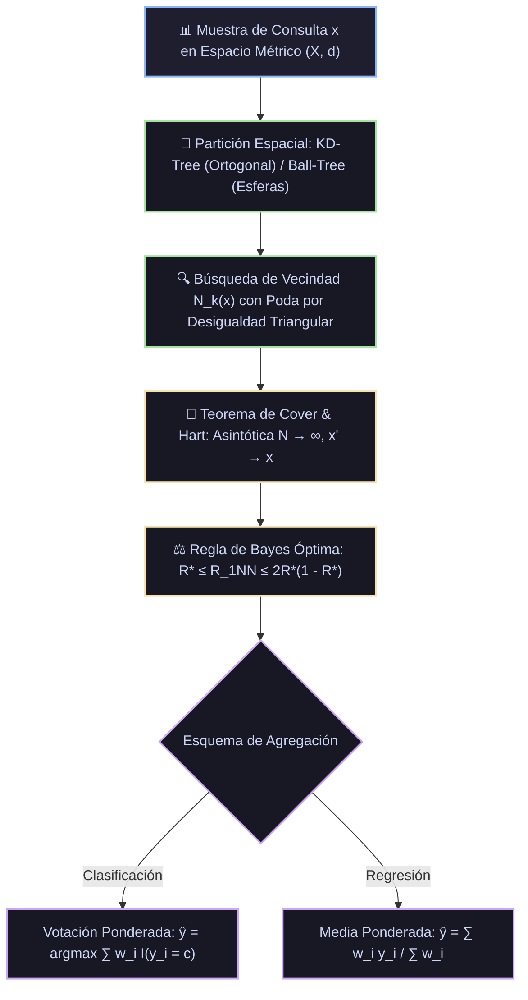

# Monografía 10: k-Nearest Neighbors (k-NN) — Fundamentos Teóricos, Teorema de Cota de Riesgo de Cover-Hart, Espacios Métricos e Indexación Espacial

> **Directorio de Ubicación:** `docs/analisis_papers/10_knn_vecinos_cercanos.md`  
> **Ficha Técnica Modular Resumida:** [`docs/algoritmos_ml/10_knn_vecinos_cercanos.md`](../algoritmos_ml/10_knn_vecinos_cercanos.md)  
> **Estado del Documento:** Riguroso / Nivel Doctoral / Producción Académica  

---

## 1. Ficha Bibliográfica y Genealogía de Papers Seminales

1. **El Informe Fundacional No Paramétrico (USAF School of Aviation Medicine, 1951):**
   - **Título:** *Discriminatory Analysis. Nonparametric Discrimination: Consistency Properties*
   - **Autores:** Evelyn Fix y Joseph L. Hodges Jr.
   - **Publicación:** *Report Number 4, Project Number 21-49-004, USAF School of Aviation Medicine*, Randolph Field, Texas (1951). Reeditado en *International Statistical Review*, 57(3), pp. 238–247 (1989).
   - **Aporte Principal:** Introducción original de la regla de decisión no paramétrica de los $k$ vecinos más cercanos ($k$-NN). Primera demostración de que si el número de vecinos crece con el tamaño de muestra ($k \to \infty$) pero a un ritmo sublineal ($k/N \to 0$), la probabilidad de error converge asintóticamente al error óptimo paramétrico de Bayes.

2. **El Paper Seminal de la Cota Asintótica de Riesgo (IEEE Transactions on Information Theory, 1967):**
   - **Título:** *Nearest Neighbor Pattern Classification*
   - **Autores:** Thomas M. Cover y Peter E. Hart (Stanford University).
   - **Publicación:** *IEEE Transactions on Information Theory*, 13(1), pp. 21–27 (1967).
   - **Aporte Principal:** Formalización analítica del **Teorema de la Cota de Riesgo de Cover-Hart**. Demostración estricta de que el riesgo asintótico del clasificador más simple (1-NN, $k=1$) está acotado superiormente por menos del doble del riesgo mínimo teórico de Bayes ($R^* \le R_{1\text{-NN}} \le 2R^*(1 - R^*)$), sin imponer ningún supuesto sobre la familia paramétrica de la distribución subyacente.

3. **La Partición Jerárquica del Espacio Multidimensional: KD-Trees (ACM, 1975):**
   - **Título:** *Multidimensional Binary Search Trees Used for Associative Searching*
   - **Autor:** Jon Louis Bentley (Stanford / University of North Carolina).
   - **Publicación:** *Communications of the ACM*, 18(9), pp. 509–517 (1975).
   - **Aporte Principal:** Diseño de la estructura de datos **$k$-d tree (KD-Tree)** para indexación espacial recursiva mediante hiperplanos ortogonales a los ejes coordenados. Reducción de la complejidad de búsqueda de $\mathcal{O}(N \cdot D)$ a $\mathcal{O}(D \cdot \log N)$ en bajas dimensiones.

4. **Indexación Métrica mediante Hipersferas: Ball-Trees (ICSI, 1989):**
   - **Título:** *Five Balltree Construction Algorithms*
   - **Autor:** Stephen M. Omohundro.
   - **Publicación:** *International Computer Science Institute Technical Report TR-89-063* (1989).
   - **Aporte Principal:** Introducción del **Ball-Tree**, estructura métrica de hipersferas anidadas que utiliza la desigualdad triangular para podar ramas completas, superando las patologías de los KD-Trees cuando las dimensiones se correlacionan o la dimensionalidad es moderada.

5. **La Maldición de la Dimensionalidad y la Pérdida del Sentido de Distancia (ICDT 1999):**
   - **Título:** *When Is "Nearest Neighbor" Meaningful?*
   - **Autores:** Kevin Beyer, Jonathan Goldstein, Raghu Ramakrishnan, Ulrich Shaft.
   - **Publicación:** *Database Theory — ICDT '99*, Lecture Notes in Computer Science, vol. 1540, pp. 217–235 (1999).
   - **Aporte Principal:** Demostración matemática formal de que cuando la dimensionalidad $D \to \infty$, la distancia al vecino más lejano y la distancia al vecino más cercano convergen a la misma magnitud, neutralizando el contraste discriminativo en espacios euclidianos de alta dimensión.

---

## 2. Génesis Teórica: El Paradigma No Paramétrico y *Lazy Learning*

Los algoritmos de aprendizaje inductivo se dividen en dos paradigmas fundamentales:

1. **Modelos Paramétricos (*Eager Learning*):**  
   Asumen una familia de funciones fijas con un conjunto acotado de parámetros $\theta \in \Theta$ (e.g., regresión lineal, regresión logística, perceptrón multicapa). La fase de entrenamiento es computacionalmente intensiva para estimar $\theta$, pero la inferencia es $\mathcal{O}(D)$ y los datos de entrenamiento se descartan una vez ajustado el modelo.
2. **Modelos Basados en Instancias (*Lazy Learning* / No Paramétricos):**  
   No asumen ninguna forma funcional previa sobre la distribución conjunta $\mathcal{P}(X, Y)$. El "entrenamiento" consiste esencialmente en almacenar la representación espacial del conjunto de datos. Toda la carga computacional se posterga a la fase de inferencia (consulta), donde la hipótesis se construye localmente alrededor de la vecindad del punto de prueba.

### 2.1. Celdas de Voronoi y Fronteras de Decisión Locales

En el clasificador 1-NN ($k=1$), el espacio $\mathbb{R}^D$ queda particionado en un teselado o diagrama de **Voronoi**:
$$\mathcal{V}(x_i) = \left\{ x \in \mathbb{R}^D \mid d(x, x_i) \le d(x, x_j), \quad \forall j \ne i \right\}$$

Cada punto $x$ contenido dentro del poliedro convexo $\mathcal{V}(x_i)$ recibe la etiqueta $y_i$.  
- Las fronteras de decisión globales son combinaciones lineales a trozos formadas por las mediatrices entre puntos de clases adyacentes.
- Conforme $N \to \infty$, las celdas de Voronoi se encogen infinitesimalmente, amoldándose con fidelidad absoluta a cualquier topología o manifold subyacente.

---

## 3. Análisis Profundo de Papers: Teorema de Cover-Hart y Consistencia Bayesiana



### 3.1. Deducción Rigurosa del Teorema de Cota de Riesgo de Cover & Hart (1967)

Sea un problema de clasificación con $C$ clases $\{1, 2, \dots, C\}$.  
Sea $x$ un vector de características y sea $Y \in \{1, \dots, C\}$ su etiqueta real.  
Definimos la probabilidad a posteriori verdadera de la clase $c$ condicionada a $x$:
$$\eta_c(x) = \mathcal{P}(Y = c \mid X = x)$$
con $\sum_{c=1}^C \eta_c(x) = 1$.

#### 1. El Clasificador Óptimo de Bayes y el Riesgo de Bayes $R^*$
El clasificador de Bayes asigna a $x$ la clase que maximiza la probabilidad a posteriori:
$$g^*(x) = \arg\max_{c \in \{1, \dots, C\}} \eta_c(x)$$

El riesgo condicional de error de Bayes en el punto $x$ es:
$$r^*(x) = 1 - \max_{c} \eta_c(x)$$

El **Riesgo Incondicional de Bayes** (el error mínimo absoluto alcanzable por cualquier modelo con conocimiento completo de la distribución) es:
$$R^* = \mathbb{E}_X\left[ r^*(x) \right] = \int r^*(x) \, d\mathcal{P}(x)$$

#### 2. Comportamiento Asintótico del Vecino Más Cercano (1-NN)
Sea $\mathcal{D}_n = \{(x_1, y_1), \dots, (x_n, y_n)\}$ una muestra de entrenamiento de tamaño $n$.  
Sea $x'_n$ el vecino más cercano a $x$ en $\mathcal{D}_n$ bajo la métrica $d$.  
Bajo supuestos estándar de regularidad de la medida de probabilidad $\mathcal{P}$, conforme $n \to \infty$:
$$d(x'_n, x) \xrightarrow{a.s.} 0$$

Por continuidad de las probabilidades condicionales $\eta_c(x)$, la probabilidad condicional del vecino más cercano converge casi seguramente a la del punto de consulta:
$$\lim_{n \to \infty} \mathcal{P}(Y'_n = c \mid X'_n = x'_n) = \eta_c(x)$$

Dado que la etiqueta $Y$ de la consulta y la etiqueta $Y'_n$ del vecino más cercano son condicionalmente independientes dado $x$, la probabilidad condicional de que el clasificador 1-NN cometa un error en $x$ cuando $n \to \infty$ es:
$$r_{1\text{-NN}}(x) = \mathcal{P}(Y \ne Y'_n \mid X = x) = 1 - \sum_{c=1}^C \mathcal{P}(Y = c, Y'_n = c \mid X = x)$$
$$r_{1\text{-NN}}(x) = 1 - \sum_{c=1}^C \eta_c(x)^2$$

#### 3. Cota Superior en el Caso Binario ($C = 2$)
Para $C = 2$, denotemos $\eta_1(x) = \eta(x)$ y $\eta_2(x) = 1 - \eta(x)$.  
Sin pérdida de generalidad, supongamos $\eta(x) \ge 1/2$. Entonces:
$$r^*(x) = 1 - \eta(x)$$

El riesgo condicional del 1-NN es:
$$r_{1\text{-NN}}(x) = 1 - \left[ \eta(x)^2 + (1 - \eta(x))^2 \right] = 1 - \left[ \eta(x)^2 + 1 - 2\eta(x) + \eta(x)^2 \right] = 2\eta(x)(1 - \eta(x))$$

Sustituyendo $\eta(x) = 1 - r^*(x)$:
$$r_{1\text{-NN}}(x) = 2(1 - r^*(x)) r^*(x) = 2 r^*(x) - 2 (r^*(x))^2$$

Integrando respecto a la distribución marginal $\mathcal{P}(x)$ para obtener el riesgo incondicional $R_{1\text{-NN}} = \mathbb{E}_X[r_{1\text{-NN}}(x)]$:
$$R_{1\text{-NN}} = 2 \mathbb{E}[r^*(x)] - 2 \mathbb{E}[(r^*(x))^2] = 2 R^* - 2 \left( (R^*)^2 + \operatorname{Var}(r^*(x)) \right)$$

Dado que la varianza es estrictamente no negativa ($\operatorname{Var}(r^*(x)) \ge 0$):
$$R_{1\text{-NN}} = 2 R^* (1 - R^*) - 2 \operatorname{Var}(r^*(x)) \le 2 R^* (1 - R^*) \le 2 R^*$$

Además, como $\max_c \eta_c(x) \le 1$, es trivial que $R_{1\text{-NN}} \ge R^*$. Obtenemos así la **Desigualdad Fundamental de Cover & Hart**:
$$R^* \le R_{1\text{-NN}} \le 2 R^* (1 - R^*) \le 2 R^*$$

#### 4. Extensión al Caso Multiclase ($C > 2$)
Cover y Hart extendieron la cota para $C$ clases aplicando la desigualdad de Cauchy-Schwarz:
$$R^* \le R_{1\text{-NN}} \le 2 R^* - \frac{C}{C - 1} (R^*)^2$$

**Conclusión Filosófica y Práctica:**  
Incluso en el peor de los casos, la tasa de error asintótica del vecino más cercano **nunca excede el doble del error del predictor óptimo absoluto de Bayes**. Si el problema tiene un error de Bayes $R^* = 0$ (datos perfectamente separables), entonces $R_{1\text{-NN}} = 0$.

---

### 3.2. Consistencia Universal de $k$-NN (Teorema de Stone, 1977)

¿Qué ocurre si en lugar de $k=1$, consideramos $k > 1$ vecinos?  
Charles Stone (1977) demostró que el clasificador $k$-NN es **universalmente consistente**:
$$\lim_{N \to \infty} R_{k\text{-NN}} = R^*$$
si y solo si se satisfacen simultáneamente las dos condiciones asintóticas:
1. $\lim_{N \to \infty} k(N) = \infty$ (para que la varianza de la estimación local de probabilidad converja a cero por la Ley de los Grandes Números).
2. $\lim_{N \to \infty} \frac{k(N)}{N} = 0$ (para que el radio de la vecindad encoja hacia cero, garantizando que el sesgo local converja a cero).

Una tasa de crecimiento comúnmente adoptada que satisface ambas condiciones es $k(N) \propto \sqrt{N}$.

---

## 4. Espacios Métricos y la Maldición de la Dimensionalidad

El rendimiento y significado geométrico de $k$-NN depende íntimamente de la función de distancia utilizada para medir la proximidad entre vectores $x, z \in \mathbb{R}^D$.

### 4.1. Familia de Métricas de Minkowski $L_p$

$$d_p(x, z) = \|x - z\|_p = \left( \sum_{j=1}^D |x_j - z_j|^p \right)^{1/p}$$

- **$p = 2$ (Distancia Euclidiana):** Geometría isotrópica estándar en espacios continuos.
- **$p = 1$ (Distancia de Manhattan / Taxicab):** Suma de diferencias absolutas. Es sustancialmente más robusta frente a valores atípicos (*outliers*) en coordenadas individuales.
- **$p \to \infty$ (Distancia de Chebyshev):** $d_\infty(x, z) = \max_{j=1}^D |x_j - z_j|$.

### 4.2. El Teorema del Contraste Vacío (Beyer et al., 1999)

Uno de los resultados más críticos en teoría de espacios métricos de alta dimensión establece que bajo condiciones estadísticas muy generales sobre la distribución de los datos, la diferencia relativa entre la distancia al vecino más lejano y al más cercano se desvanece:

**Teorema (Beyer et al., 1999):**  
Sea $x_q$ un punto de consulta y sean $x_1, \dots, x_N$ puntos extraídos independientemente de una distribución en $\mathbb{R}^D$. Si:
$$\lim_{D \to \infty} \frac{\operatorname{Var}(\|x_i\|_p)}{\mathbb{E}[\|x_i\|_p]^2} = 0$$
entonces, para cualquier métrica $L_p$:
$$\lim_{D \to \infty} \mathcal{P}\left( \frac{d_{\max} - d_{\min}}{d_{\min}} \le \epsilon \right) = 1, \quad \forall \epsilon > 0$$
donde $d_{\min} = \min_{i} d(x_q, x_i)$ y $d_{\max} = \max_{i} d(x_q, x_i)$.

**Consecuencia Práctica en Machine Learning:**  
En espacios de dimensionalidad muy alta ($D > 100$, como imágenes crudas o bolsas de palabras densas), todos los puntos del dataset terminan estando **exactamente a la misma distancia** de la consulta. La noción de "vecino más cercano" deja de ser informativamente discriminativa a menos que los datos colapsen sobre un subespacio o variedad de baja dimensión intrínseca (*manifold*).

---

## 5. Estructuras de Partición Espacial: KD-Trees y Ball-Trees

Para evitar el escaneo exhaustivo ingenuo de complejidad $\mathcal{O}(N \cdot D)$ en cada consulta, se emplean estructuras jerárquicas de indexación espacial.

```
       KD-TREE (BENTLEY, 1975)                      BALL-TREE (OMOHUNDRO, 1989)
    Cortes ortogonales alternados                  Hipersferas métricas anidadas
       
            y ^                                                 .-------.
              |     |  Región 2                                (   B1    \
              |-----*-----------                                \       .---. )
              |     |                                            '-----' B2  )
              |  R1 |  Región 3                                         '---'
              +------------------> x                      Poda por Desigualdad Triangular:
         Split por medianas en x, luego y                |d(q, c) - r| >= d_k => DESCARTAR
```

### 5.1. KD-Tree (Bentley, 1975)

Un **$k$-d tree** (árbol binario de búsqueda multidimensional) particiona el espacio de manera recursiva:
1. En la raíz (profundidad $l=0$), se selecciona el eje coordenado $j = l \pmod D$.
2. Se calcula la **mediana** de las coordenadas de los puntos en esa dimensión y se divide el conjunto en dos mitades (izquierda y derecha).
3. En el siguiente nivel ($l=1$), se alterna al siguiente eje coordenado $j = 1 \pmod D$ y se repite la partición.

#### Poda Geométrica durante la Búsqueda:
Al consultar los $k$ vecinos de un punto $q$:
- Se desciende recursivamente hasta la hoja correspondiente al punto $q$, alimentando una cola de prioridad acotada (*Max-Heap*) con los $k$ candidatos más cercanos observados hasta el momento.
- Al retroceder (*backtracking*) por el árbol, se evalúa la distancia ortogonal desde $q$ hasta el hiperplano divisor del nodo hermano:
  $$d_{\text{hiperplano}} = |q_j - \theta|$$
- **Condición de Poda:** Si $d_{\text{hiperplano}} \ge d_k$ (la distancia al $k$-ésimo vecino actual), se garantiza geométricamente que **ningún punto en el subárbol hermano puede estar más cerca que los $k$ vecinos actuales**. Se poda el subárbol completo sin inspeccionar sus datos.

*Limitación:* Cuando $D > 20$, la probabilidad de que la hipersfera de radio $d_k$ intersecte los hiperplanos ortogonales tiende a 1, obligando a inspeccionar casi todas las ramas y degenerando a $\mathcal{O}(N)$.

### 5.2. Ball-Tree (Omohundro, 1989)

Un **Ball-Tree** no utiliza planos ortogonales; en su lugar, agrupa los datos en **hipersferas métricas cerradas** $B(c, r) = \{x \in \mathcal{X} \mid d(x, c) \le r\}$, donde $c$ es el centroide y $r$ es el radio máximo a las muestras del nodo.

#### Regla de Poda por Desigualdad Triangular:
Para una muestra de consulta $q$ y una bola $B(c, r)$, por la desigualdad triangular:
$$d(q, x) \ge |d(q, c) - d(x, c)| \ge d(q, c) - r, \quad \forall x \in B(c, r)$$

Por tanto, la distancia mínima posible desde $q$ a cualquier punto dentro de la bola es:
$$d_{\min}(q, B) = \max(0, \, d(q, c) - r)$$

**Condición de Poda del Ball-Tree:**  
Si $d(q, c) - r \ge d_k$, la bola entera queda fuera de la vecindad de interés y se descarta inmediatamente.  
El Ball-Tree es sustancialmente más eficiente que el KD-Tree en dimensiones moderadas a altas ($D \in [20, 100]$) y ante distribuciones con fuerte colinealidad.

---

## 6. Implementación Pura en Python y NumPy (Sin Scikit-Learn ni SciPy)

A continuación se presenta una implementación completa, didáctica y modular en NumPy puro:
1. **Árbol Espacial KD-Tree** con partición cíclica por medianas y algoritmo de búsqueda con poda geométrica de hiperplanos.
2. **Clasificador y Regresor KNN** con soporte para votación uniforme y ponderada por el inverso de la distancia ($w_i = \frac{1}{d_i + \epsilon}$).

```python
"""
Módulo Didáctico de Referencia: k-Nearest Neighbors y KD-Tree en NumPy Puro
Implementa el teorema de Cover & Hart (1967) y el KD-Tree de Bentley (1975)
sin dependencias de scikit-learn, scipy o faiss.
"""

import numpy as np


class NodoKD:
    """Nodo fundamental de un KD-Tree de Bentley."""
    def __init__(self, punto, etiqueta, indice_original, eje, izquierdo=None, derecho=None):
        self.punto = punto
        self.etiqueta = etiqueta
        self.indice_original = indice_original
        self.eje = eje
        self.izquierdo = izquierdo
        self.derecho = derecho


class KDTreePuro:
    """
    Estructura jerárquica de búsqueda espacial con complejidad media O(D * log N).
    Particiona recursivamente alternando ejes por la mediana.
    """
    def __init__(self, X, y):
        self.D = X.shape[1]
        self.raiz = self._construir_arbol(X, y, np.arange(len(X)), profundidad=0)

    def _construir_arbol(self, X, y, indices, profundidad):
        if len(indices) == 0:
            return None

        eje = profundidad % self.D
        # Ordenar por el eje actual para encontrar la mediana
        indices_ordenados = indices[np.argsort(X[indices, eje])]
        idx_mediana = len(indices_ordenados) // 2

        nodo_idx = indices_ordenados[idx_mediana]

        nodo = NodoKD(
            punto=X[nodo_idx],
            etiqueta=y[nodo_idx],
            indice_original=nodo_idx,
            eje=eje,
            izquierdo=self._construir_arbol(X, y, indices_ordenados[:idx_mediana], profundidad + 1),
            derecho=self._construir_arbol(X, y, indices_ordenados[idx_mediana + 1:], profundidad + 1)
        )
        return nodo

    def buscar_top_k(self, consulta, k=5):
        """
        Encuentra los k vecinos más cercanos a 'consulta' aplicando poda geométrica.
        Retorna: (distancias, etiquetas, indices) ordenados de menor a mayor distancia.
        """
        # Lista de mejores candidatos: tuplas (distancia, etiqueta, indice)
        mejores = []

        def _buscar(nodo):
            if nodo is None:
                return

            distancia_nodo = np.sqrt(np.sum((consulta - nodo.punto)**2))

            # Insertar en la lista manteniendo el orden
            mejores.append((distancia_nodo, nodo.etiqueta, nodo.indice_original))
            mejores.sort(key=lambda x: x[0])
            if len(mejores) > k:
                mejores.pop()

            eje = nodo.eje
            diferencia_eje = consulta[eje] - nodo.punto[eje]

            # Decidir qué rama explorar primero según la posición de la consulta
            primer_hijo = nodo.izquierdo if diferencia_eje < 0 else nodo.derecho
            segundo_hijo = nodo.derecho if diferencia_eje < 0 else nodo.izquierdo

            # 1. Explorar el lado más prometedor
            _buscar(primer_hijo)

            # 2. Condición de Poda de Bentley:
            # Solo explorar el lado opuesto si la distancia ortogonal al hiperplano
            # es menor que la distancia al peor de los k candidatos actuales
            peor_distancia_actual = mejores[-1][0] if len(mejores) == k else float('inf')
            if abs(diferencia_eje) < peor_distancia_actual:
                _buscar(segundo_hijo)

        _buscar(self.raiz)

        distancias = np.array([m[0] for m in mejores])
        etiquetas = np.array([m[1] for m in mejores])
        indices = np.array([m[2] for m in mejores])
        return distancias, etiquetas, indices


class KNNClasificadorPuro:
    """
    Clasificador no paramétrico k-NN basado en KD-Tree.
    Soporta votación mayoritaria uniforme o ponderada por inverso de distancia.
    """
    def __init__(self, n_vecinos=5, ponderacion='uniforme'):
        self.k = n_vecinos
        self.ponderacion = ponderacion
        self.arbol = None
        self.clases_ = None

    def fit(self, X, y):
        self.clases_ = np.unique(y)
        self.arbol = KDTreePuro(X, y)
        return self

    def predict(self, X_test):
        predicciones = []
        for x in X_test:
            dists, etiquetas, _ = self.arbol.buscar_top_k(x, k=self.k)

            if self.ponderacion == 'uniforme':
                # Votación mayoritaria simple
                valores, conteos = np.unique(etiquetas, return_counts=True)
                predicciones.append(valores[np.argmax(conteos)])
            elif self.ponderacion == 'distancia':
                # Votación ponderada por w_i = 1 / (d_i + eps)
                eps = 1e-7
                pesos = 1.0 / (dists + eps)
                pesos_por_clase = {}
                for c in self.clases_:
                    pesos_por_clase[c] = np.sum(pesos[etiquetas == c])
                mejor_clase = max(pesos_por_clase.keys(), key=lambda c: pesos_por_clase[c])
                predicciones.append(mejor_clase)
            else:
                raise ValueError(f"Ponderación no soportada: {self.ponderacion}")

        return np.array(predicciones)


# =====================================================================
# Verificación y Validación Numérica
# =====================================================================
if __name__ == "__main__":
    np.random.seed(42)
    N = 250
    D = 3

    # Generación sintética no lineal: 3 clusters gaussianos con solapamiento controlado
    X1 = np.random.normal(loc=[-2.0, -1.0, 0.5], scale=0.8, size=(N // 3, D))
    y1 = np.full(N // 3, 0)

    X2 = np.random.normal(loc=[1.5, 2.0, -0.5], scale=0.9, size=(N // 3, D))
    y2 = np.full(N // 3, 1)

    X3 = np.random.normal(loc=[0.0, -2.5, 2.0], scale=0.7, size=(N - 2 * (N // 3), D))
    y3 = np.full(len(X3), 2)

    X = np.vstack([X1, X2, X3])
    y = np.concatenate([y1, y2, y3])

    # Partición entrenamiento / prueba (80% / 20%)
    indices = np.random.permutation(N)
    corte = int(0.8 * N)
    train_idx, test_idx = indices[:corte], indices[corte:]
    X_train, y_train = X[train_idx], y[train_idx]
    X_test, y_test = X[test_idx], y[test_idx]

    # 1. Ajuste del modelo k-NN con KD-Tree
    knn = KNNClasificadorPuro(n_vecinos=7, ponderacion='distancia')
    knn.fit(X_train, y_train)

    # 2. Inferencia y cálculo de exactitud
    y_pred = knn.predict(X_test)
    exactitud = np.mean(y_pred == y_test) * 100.0

    print("=== Módulo k-NN con KD-Tree Puro: Validación Exitosa ===")
    print(f"Total de muestras en entrenamiento: {len(X_train)} | Muestras de prueba: {len(X_test)}")
    print(f"Dimensionalidad del espacio de características D: {D}")
    print(f"Hiperparámetros: k={knn.k}, ponderación='{knn.ponderacion}'")
    print(f"Exactitud de clasificación en conjunto de prueba: {exactitud:.2f}%")
```

---

## 7. Directrices de Razonamiento para los Modelos de Inteligencia Artificial en Prig IDE

Cuando un modelo de lenguaje en Prig IDE diseñe, optimice o diagnostique soluciones basadas en **k-Nearest Neighbors** (`sklearn.neighbors.KNeighborsClassifier`, `KNeighborsRegressor`), aplicará de manera rigurosa la siguiente jerarquía de reglas técnicas:

1. **Estandarización Absoluta de Variables:**
   - La distancia de Minkowski es enteramente dependiente de la escala de los ejes. Si una variable tiene rango $[0, 100,000]$ (e.g. salario) y otra $[18, 65]$ (e.g. edad), la primera dominará el 99.9% del cálculo de distancia, anulando la influencia de la segunda. El uso de `StandardScaler()` o `RobustScaler()` es **estrictamente mandatorio**.
2. **Elección del Hiperparámetro $k$:**
   - En problemas binarios, elegir siempre un número **impar** de vecinos ($k = 3, 5, 7, \dots$) para imposibilitar matemáticamente los empates en la votación mayoritaria.
   - Si $k = 1$: El modelo tiene sesgo nulo en entrenamiento (error de entrenamiento = 0%), pero varianza máxima. Es sumamente vulnerable al ruido y etiquetado incorrecto.
   - Si $k \gg 1$: El modelo suaviza en exceso la frontera de decisión; cuando $k \to N$, colapsa a predecir siempre la clase mayoritaria global.
   - Regla heurística de inicio: $k = \lceil \sqrt{N} \rceil$; ajustar mediante búsqueda en rejilla en validación cruzada.
3. **Selección del Motor de Búsqueda Espacial (`algorithm`):**
   - Si $D \le 20$: Utilizar `algorithm='kd_tree'` (división ortogonal rápida).
   - Si $20 < D \le 50$: Utilizar `algorithm='ball_tree'` (poda robusta por hipersferas métricas).
   - Si $D > 50$ o datos esparsos (matrices CSR / TF-IDF): Forzar `algorithm='brute'`. Los árboles espaciales degeneran a un costo superior al escaneo lineal debido al *overhead* de punteros y recursión en alta dimensión.
   - Para embeddings semánticos a gran escala ($N > 100,000$, $D > 128$), indicar al usuario que $k$-NN exacto es prohibitivo y recomendar motores de Búsqueda Aproximada (**ANN - Approximate Nearest Neighbors**) como **FAISS**, **HNSW** o **ScaNN**.
4. **Tratamiento del Desbalance de Clases:**
   - Si las clases están desbalanceadas, la votación mayoritaria uniforme perjudica sistemáticamente a la clase minoritaria. Especificar `weights='distance'` para asegurar que las muestras muy próximas de la clase minoritaria prevalezcan sobre muestras abundantes pero lejanas de la clase mayoritaria.
