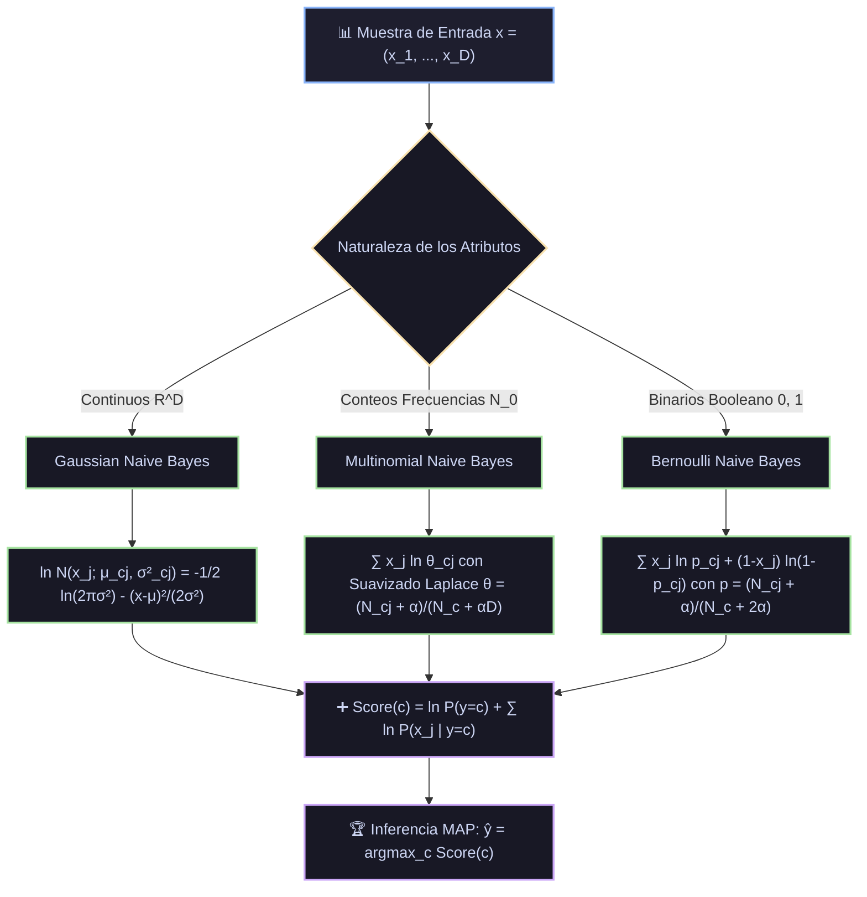

# Monografía 11: Naive Bayes (Gaussiano, Multinomial y Bernoulli) — Fundamentos Teóricos, Inferencia Bayesiana, Suavizado de Laplace y la Paradoja de Domingos-Pazzani

> **Directorio de Ubicación:** `docs/analisis_papers/11_naive_bayes.md`  
> **Ficha Técnica Modular Resumida:** [`docs/algoritmos_ml/11_naive_bayes.md`](../algoritmos_ml/11_naive_bayes.md)  
> **Estado del Documento:** Riguroso / Nivel Doctoral / Producción Académica  

---

## 1. Ficha Bibliográfica y Genealogía de Papers Seminales

1. **El Teorema Original de la Probabilidad Inversa (1763):**
   - **Título:** *An Essay towards solving a Problem in the Doctrine of Chances*
   - **Autor:** Thomas Bayes (comunicado póstumamente por Richard Price).
   - **Publicación:** *Philosophical Transactions of the Royal Society of London*, 53, pp. 370–418 (1763).
   - **Aporte Principal:** Formulación inicial del cálculo de probabilidades a posteriori a partir de conocimientos previos (*priors*) y evidencia observada (*likelihood*).

2. **La Regla de Sucesión y el Suavizado Aditivo (1814):**
   - **Título:** *Essai philosophique sur les probabilités*
   - **Autor:** Pierre-Simon Laplace.
   - **Publicación:** París, Mme. Ve. Courcier (1814).
   - **Aporte Principal:** Introducción del **Suavizado de Laplace (*Laplace Smoothing*)** o regla de sucesión para estimar probabilidades empíricas sin colapsar a cero ante eventos no observados en muestras finitas.

3. **La Formalización del Reconocimiento de Patrones Bayesiano (1973):**
   - **Título:** *Pattern Classification and Scene Analysis*
   - **Autores:** Richard O. Duda y Peter E. Hart (Stanford Research Institute).
   - **Publicación:** John Wiley & Sons, Nueva York (1973).
   - **Aporte Principal:** Teoría de la decisión Bayesiana en espacios continuos y discretos. Análisis formal de las funciones de discriminación lineal y cuadrática derivadas de la hipótesis de independencia condicional.

4. **La Paradoja de la Optimidad bajo Pérdida Cero-Uno (Machine Learning 1997):**
   - **Título:** *On the Optimality of the Simple Bayesian Classifier under Zero-One Loss*
   - **Autores:** Pedro Domingos y Michael Pazzani (University of California, Irvine).
   - **Publicación:** *Machine Learning*, 29(2–3), pp. 103–130 (1997).
   - **Aporte Principal:** Resolución teórica de la aparente paradoja del éxito empírico de Naive Bayes: demostración de que **Naive Bayes puede ser el clasificador óptimo bajo pérdida 0-1 aun cuando la hipótesis de independencia condicional se viole de manera severa**, ya que la clasificación solo depende del signo del log-odds y no de la calibración exacta de las probabilidades a posteriori.

5. **Modelos de Eventos Multinomial vs. Bernoulli en NLP (AAAI 1998):**
   - **Título:** *A Comparison of Event Models for Naive Bayes Text Classification*
   - **Autores:** Andrew McCallum y Kamal Nigam (Carnegie Mellon University).
   - **Publicación:** *AAAI-98 Workshop on Learning for Text Categorization*, pp. 41–48 (1998).
   - **Aporte Principal:** Formalización rigurosa de las dos arquitecturas generativas discretas para procesamiento de lenguaje natural: el modelo de eventos multivariado de Bernoulli vs. el modelo de eventos multinomial con frecuencias unigramas.

---

## 2. Génesis Teórica: Inferencia Bayesiana y la Hipótesis "Ingenua"

Dado un vector de características de entrada $x = (x_1, x_2, \dots, x_D) \in \mathcal{X}$ y una variable de respuesta categórica $Y \in \{1, 2, \dots, C\}$.

Por la regla canónica de la probabilidad condicionada (Teorema de Bayes):
$$P(Y = c \mid X = x) = \frac{P(Y = c) \, P(X = x \mid Y = c)}{P(X = x)} = \frac{P(Y = c) \, P(x_1, x_2, \dots, x_D \mid Y = c)}{\sum_{k=1}^C P(Y = k) \, P(x_1, x_2, \dots, x_D \mid Y = k)}$$

### 2.1. La Maldición Combinatoria de la Verosimilitud Conjunta

Para estimar directamente la verosimilitud conjunta $P(x_1, \dots, x_D \mid Y = c)$ sin supuestos estructurales en un espacio discreto donde cada variable toma $V$ valores:
- Cada clase requeriría estimar $V^D - 1$ probabilidades conjuntas.
- Con $D = 50$ variables binarias ($V = 2$), se necesitarían $2^{50} \approx 1.12 \times 10^{15}$ parámetros por clase, un volumen astronómico imposible de estimar empíricamente.

### 2.2. La Hipótesis de Independencia Condicional (*Naive Assumption*)

El clasificador Naive Bayes postula que, **condicionado a la clase $Y = c$**, todas las características son estocásticamente independientes entre sí:
$$P(X_1 = x_1, X_2 = x_2, \dots, X_D = x_D \mid Y = c) = \prod_{j=1}^D P(X_j = x_j \mid Y = c)$$

#### Reducción de Complejidad Paramétrica:
- El número de parámetros por clase pasa de $\mathcal{O}(V^D)$ a $\mathcal{O}(D \cdot V)$ en variables discretas.
- En variables continuas gaussianas, la matriz de covarianza completa $\boldsymbol{\Sigma}_c \in \mathbb{R}^{D \times D}$ ($D(D+1)/2$ parámetros) se colapsa a una matriz puramente diagonal:
  $$\boldsymbol{\Sigma}_c = \operatorname{diag}(\sigma_{c1}^2, \sigma_{c2}^2, \dots, \sigma_{cD}^2) \quad (2D \text{ parámetros})$$

### 2.3. Regla de Decisión MAP (Maximum A Posteriori)

Como el denominador marginal $P(X = x)$ es estrictamente constante para todas las clases candidatas $c \in \{1, \dots, C\}$, la optimización MAP se reduce a:
$$\hat{y} = \arg\max_{c \in \{1, \dots, C\}} P(Y = c) \prod_{j=1}^D P(X_j = x_j \mid Y = c)$$

#### Transformación al Espacio Logarítmico:
Dado que el producto de probabilidades continuas o discretas decrece exponencialmente hacia cero ($\prod p_j \to 0$), los sistemas computacionales sufren de **subdesbordamiento aritmético (*underflow*)**. Aplicando la transformación monótona logarítmica, el producto se convierte en una suma numéricamente estable:
$$\hat{y} = \arg\max_{c \in \{1, \dots, C\}} \left[ \ln P(Y = c) + \sum_{j=1}^D \ln P(X_j = x_j \mid Y = c) \right]$$

---

## 3. Derivaciones Matemáticas: Las Tres Variantes Canónicas



### 3.1. Naive Bayes Gaussiano (Variables Continuas)

Para características numéricas continuas $X_j \in \mathbb{R}$, se asume que la verosimilitud de cada variable dada la clase sigue una distribución Normal unidimensional:
$$P(X_j = x_j \mid Y = c) = \frac{1}{\sqrt{2\pi \sigma_{cj}^2}} \exp\left( -\frac{(x_j - \mu_{cj})^2}{2\sigma_{cj}^2} \right)$$

#### Estimadores de Máxima Verosimilitud (MLE):
$$\hat{\mu}_{cj} = \frac{1}{N_c} \sum_{i: y_i = c} x_{ij}$$
$$\hat{\sigma}_{cj}^2 = \frac{1}{N_c} \sum_{i: y_i = c} (x_{ij} - \hat{\mu}_{cj})^2 + \epsilon$$
donde $N_c = \sum_{i=1}^N \mathbb{I}(y_i = c)$ y $\epsilon > 0$ es un término de suavizado (*variance smoothing*) para prevenir divisiones por cero si una variable es constante dentro de una clase.

#### Función de Puntuación Discriminante Cuadrática:
Sustituyendo en la fórmula logarítmica:
$$g_c(x) = \ln P(Y = c) - \frac{1}{2} \sum_{j=1}^D \ln(2\pi \sigma_{cj}^2) - \frac{1}{2} \sum_{j=1}^D \frac{(x_j - \mu_{cj})^2}{\sigma_{cj}^2}$$

Nótese que la frontera de decisión entre dos clases $c_1$ y $c_2$ es cuadrática respecto a $x$ porque los términos $\frac{x_j^2}{\sigma_{c1j}^2}$ y $\frac{x_j^2}{\sigma_{c2j}^2}$ no se cancelan a menos que las varianzas sean idénticas para ambas clases ($\sigma_{c1j}^2 = \sigma_{c2j}^2$).

---

### 3.2. Naive Bayes Multinomial con Suavizado de Laplace (NLP y Conteos)

Sea $x = (x_1, \dots, x_D)$ un documento donde cada $x_j \in \mathbb{N}_0$ indica el número de veces que el término $j$ del vocabulario de tamaño $D$ aparece en dicho documento.  
El modelo asume que un documento de longitud $L = \sum_{j=1}^D x_j$ se genera mediante extracciones independientes de un dado con $D$ caras con probabilidades $\boldsymbol{\theta}_c = (\theta_{c1}, \dots, \theta_{cD})$, donde $\sum_{j=1}^D \theta_{cj} = 1$:
$$P(x \mid Y = c) = \frac{\left( \sum_{j=1}^D x_j \right)!}{\prod_{j=1}^D (x_j!)} \prod_{j=1}^D \theta_{cj}^{x_j}$$

Como el factor factorial multinomial depende exclusivamente del vector $x$ y es idéntico para cualquier clase $c$, se descarta en la optimización:
$$\ln P(x \mid Y = c) \propto \sum_{j=1}^D x_j \ln \theta_{cj}$$

#### La Catástrofe de la Frecuencia Cero y la Solución Bayesiana de Laplace:
Si una palabra $j$ no aparece en ninguna muestra de entrenamiento de la clase $c$, el estimador de máxima verosimilitud asigna $\hat{\theta}_{cj} = 0$. Como resultado, la verosimilitud completa del documento colapsa:
$$P(x \mid Y = c) = 0 \implies \ln P(x \mid Y = c) = -\infty$$
Incluso si las otras 999 palabras del documento apuntan inequívocamente a la clase $c$, un único término inédito descarta la clase por completo.

#### Deducción del Estimador de Laplace / Lidstone vía Prior de Dirichlet:
Modelamos los parámetros $\boldsymbol{\theta}_c$ como variables aleatorias bajo una distribución a priori de **Dirichlet conjugada**:
$$P(\boldsymbol{\theta}_c) = \operatorname{Dir}(\alpha, \alpha, \dots, \alpha) \propto \prod_{j=1}^D \theta_{cj}^{\alpha - 1}$$
La distribución a posteriori es también una distribución de Dirichlet:
$$P(\boldsymbol{\theta}_c \mid \mathcal{D}) \propto \prod_{j=1}^D \theta_{cj}^{N_{cj} + \alpha - 1}$$
La esperanza matemática a posteriori (*Maximum A Posteriori Mean*) conduce a la fórmula canónica:
$$\hat{\theta}_{cj} = \frac{N_{cj} + \alpha}{\sum_{k=1}^D N_{ck} + \alpha D} = \frac{N_{cj} + \alpha}{N_c + \alpha D}$$
donde:
- $N_{cj} = \sum_{i: y_i = c} x_{ij}$ es la cantidad total de ocurrencias del término $j$ en documentos de la clase $c$.
- $N_c = \sum_{j=1}^D N_{cj}$ es la suma de todas las palabras en dicha clase.
- $\alpha = 1.0$ representa el **Suavizado de Laplace** (*Add-1 Smoothing*).
- $0 < \alpha < 1.0$ representa el **Suavizado de Lidstone**.

---

### 3.3. Naive Bayes de Bernoulli (Presencia o Ausencia Binaria)

En el modelo de eventos de Bernoulli multivariado, el vector de características es estrictamente booleano: $x_j \in \{0, 1\}$, representando la presencia ($x_j = 1$) o ausencia ($x_j = 0$) de una característica, independientemente de cuántas veces se repita.
$$P(x \mid Y = c) = \prod_{j=1}^D p_{cj}^{x_j} (1 - p_{cj})^{1 - x_j}$$

En espacio logarítmico:
$$\ln P(x \mid Y = c) = \sum_{j=1}^D \left[ x_j \ln p_{cj} + (1 - x_j) \ln(1 - p_{cj}) \right] = \sum_{j=1}^D x_j \ln\left( \frac{p_{cj}}{1 - p_{cj}} \right) + \sum_{j=1}^D \ln(1 - p_{cj})$$

#### Estimación con Suavizado de Laplace:
Dado que el alfabeto de cada coordenada binaria posee solo dos estados posibles ($\{0, 1\}$), el prior de Laplace agrega una pseudocuenta a cada estado, sumando $2\alpha$ al denominador:
$$\hat{p}_{cj} = \frac{N_{cj}^{\text{doc}} + \alpha}{N_c^{\text{doc}} + 2\alpha}$$
donde $N_{cj}^{\text{doc}}$ es el número de documentos de la clase $c$ que contienen la palabra $j$, y $N_c^{\text{doc}}$ es el total de documentos de la clase $c$.

#### Diferencia Teórica Fundamental: Multinomial vs. Bernoulli (McCallum & Nigam, 1998)
| Propiedad | Naive Bayes Multinomial | Naive Bayes Bernoulli |
|---|---|---|
| **Espacio de Características** | Vector de frecuencias enteras $x_j \in \mathbb{N}_0$ | Vector binario indicador $x_j \in \{0, 1\}$ |
| **Penalización por Ausencia** | **No penaliza la ausencia:** Si $x_j = 0$, el término $x_j \ln \theta_{cj} = 0$, no afectando la suma. | **Penaliza explícitamente la ausencia:** Si $x_j = 0$, se suma $\ln(1 - p_{cj})$, castigando a la clase si $p_{cj}$ es alto. |
| **Sensibilidad a la Longitud** | La longitud del documento influye linealmente en la magnitud del score logarítmico. | Invariante a la frecuencia interna de las palabras dentro del documento. |
| **Escenario Ideal** | Textos largos con vocabulario extenso (clasificación de noticias, spam masivo). | Textos muy cortos con palabras clave distintivas (análisis de tweets, consultas de búsqueda). |

---

## 4. La Paradoja de Domingos & Pazzani (1997): Optimidad bajo Pérdida 0-1

Durante décadas, se consideró a Naive Bayes un modelo deficiente debido a la naturaleza casi universalmente falsa del supuesto de independencia condicional (por ejemplo, en lenguaje natural, "San" y "Francisco" o "Machine" y "Learning" están colosalmente correlacionadas).

Sin embargo, empíricamente Naive Bayes competía de igual a igual con árboles de decisión y redes neuronales. En 1997, Pedro Domingos y Michael Pazzani resolvieron este misterio teórico mediante un análisis formal bajo **Pérdida Cero-Uno (*Zero-One Loss*)**:

### 4.1. Error de Estimación de Probabilidad vs. Error de Decisión

Consideremos un problema binario $Y \in \{0, 1\}$. La regla de decisión Bayesiana óptima clasifica como clase 1 si y solo si:
$$\frac{P(Y = 1 \mid X = x)}{P(Y = 0 \mid X = x)} > 1 \iff \ln \frac{P(Y = 1 \mid X = x)}{P(Y = 0 \mid X = x)} > 0$$

Sea $\hat{P}(Y = c \mid X = x)$ la probabilidad calculada por Naive Bayes bajo la hipótesis de independencia, y sea $P^*(Y = c \mid X = x)$ la verdadera probabilidad a posteriori.

**El Teorema de Domingos & Pazzani:**  
Una muestra $x$ se clasificará correctamente por Naive Bayes si y solo si:
$$\operatorname{sign}\left( \hat{P}(Y = 1 \mid X = x) - \frac{1}{2} \right) = \operatorname{sign}\left( P^*(Y = 1 \mid X = x) - \frac{1}{2} \right)$$

#### Implicación Matemática:
- Naive Bayes puede estimar probabilidades **severamente sesgadas** (por ejemplo, predecir $\hat{P} = 0.9999$ cuando la verdadera probabilidad empírica es $P^* = 0.60$).
- No obstante, como tanto $0.9999$ como $0.60$ son mayores a $0.5$, **ambos asignan exactamente la misma etiqueta de clase**.
- El error cuadrático medio de la probabilidad estimada ($\mathbb{E}[(\hat{P} - P^*)^2]$) puede ser enorme, pero la tasa de error de clasificación bajo pérdida 0-1 es **exactamente cero**.

### 4.2. Compensación Recíproca de Dependencias (Harry Zhang, 2004)

Harry Zhang demostró que cuando múltiples variables están correlacionadas, las dependencias condicionales no actúan de forma destructiva uniforme:  
Si la variable $X_1$ distribuye una influencia sobrestimada a favor de la clase 1, y la variable $X_2$ distribuye una influencia similar en otra región, las violaciones de independencia a menudo **se cancelan mutuamente en el cociente de probabilidades**, preservando la geometría lineal de la frontera de decisión óptima.

---

## 5. Implementación Pura en Python y NumPy (Sin Scikit-Learn ni SciPy)

A continuación se presenta un motor completo y autocontenido en NumPy puro que implementa:
1. **Gaussian Naive Bayes** con cálculo matricial vectorizado de medias, varianzas y `var_smoothing`.
2. **Multinomial Naive Bayes** con frecuencias unigramas y suavizado aditivo de Laplace $\alpha$.
3. **Calibración Numérica Log-Sum-Exp** para obtener probabilidades reales sin desbordamiento.

```python
"""
Módulo Didáctico de Referencia: Naive Bayes Completo en NumPy Puro
Implementa GaussianNB, MultinomialNB y el truco Log-Sum-Exp
sin dependencias de scikit-learn, scipy o nltk.
"""

import numpy as np


def log_sum_exp(matriz_log, axis=1):
    """
    Calcula log(sum(exp(x))) de forma numéricamente estable
    restando el máximo para evitar overflow aritmético en float64.
    """
    max_val = np.max(matriz_log, axis=axis, keepdims=True)
    return max_val + np.log(np.sum(np.exp(matriz_log - max_val), axis=axis, keepdims=True))


class GaussianNaiveBayesPuro:
    """
    Clasificador Naive Bayes Gaussiano para variables continuas.
    Modela cada característica mediante una distribución normal unidimensional.
    """
    def __init__(self, var_smoothing=1e-9):
        self.var_smoothing = float(var_smoothing)
        self.clases_ = None
        self.priors_ = None
        self.medias_ = None       # Shape: (C, D)
        self.varianzas_ = None    # Shape: (C, D)

    def fit(self, X, y):
        N, D = X.shape
        self.clases_ = np.unique(y)
        C = len(self.clases_)

        self.priors_ = np.zeros(C, dtype=np.float64)
        self.medias_ = np.zeros((C, D), dtype=np.float64)
        self.varianzas_ = np.zeros((C, D), dtype=np.float64)

        # Cálculo de varianza máxima global para calibrar el smoothing
        varianza_global = np.var(X, axis=0)
        epsilon = self.var_smoothing * np.max(varianza_global)

        for c_idx, c in enumerate(self.clases_):
            X_c = X[y == c]
            self.priors_[c_idx] = len(X_c) / N
            self.medias_[c_idx] = np.mean(X_c, axis=0)
            self.varianzas_[c_idx] = np.var(X_c, axis=0) + epsilon

        return self

    def _calcular_log_verosimilitud(self, X):
        """
        Calcula log P(x | y=c) para cada clase mediante álgebra matricial vectorizada.
        ln N(x; μ, σ²) = -0.5 * ln(2πσ²) - (x - μ)² / (2σ²)
        """
        N = X.shape[0]
        C = len(self.clases_)
        log_prob = np.zeros((N, C), dtype=np.float64)

        for c_idx in range(C):
            media = self.medias_[c_idx]        # Shape: (D,)
            var = self.varianzas_[c_idx]        # Shape: (D,)

            # Componente constante y cuadrática en cada coordenada
            constante = -0.5 * np.sum(np.log(2.0 * np.pi * var))
            cuadratica = -0.5 * np.sum(((X - media)**2) / var, axis=1)

            log_prob[:, c_idx] = np.log(self.priors_[c_idx]) + constante + cuadratica

        return log_prob

    def predict(self, X):
        log_prob = self._calcular_log_verosimilitud(X)
        return self.clases_[np.argmax(log_prob, axis=1)]

    def predict_proba(self, X):
        """Calcula probabilidades normalizadas mediante Softmax estable."""
        log_prob = self._calcular_log_verosimilitud(X)
        log_marginal = log_sum_exp(log_prob, axis=1)
        return np.exp(log_prob - log_marginal)


class MultinomialNaiveBayesPuro:
    """
    Clasificador Naive Bayes Multinomial para conteos discretos / NLP.
    Aplica suavizado aditivo de Laplace / Lidstone (alpha).
    """
    def __init__(self, alpha=1.0):
        self.alpha = float(alpha)
        self.clases_ = None
        self.log_priors_ = None
        self.log_thetas_ = None  # Shape: (C, D)

    def fit(self, X, y):
        N, D = X.shape
        self.clases_ = np.unique(y)
        C = len(self.clases_)

        self.log_priors_ = np.zeros(C, dtype=np.float64)
        self.log_thetas_ = np.zeros((C, D), dtype=np.float64)

        for c_idx, c in enumerate(self.clases_):
            X_c = X[y == c]
            self.log_priors_[c_idx] = np.log(len(X_c) / N)

            # Conteos acumulados de cada palabra en la clase c: N_cj
            conteo_palabras = np.sum(X_c, axis=0)
            total_palabras_clase = np.sum(conteo_palabras)

            # Fórmula de Laplace: theta_cj = (N_cj + alpha) / (N_c + alpha * D)
            thetas_suavizados = (conteo_palabras + self.alpha) / (total_palabras_clase + self.alpha * D)
            self.log_thetas_[c_idx] = np.log(thetas_suavizados)

        return self

    def _calcular_log_scores(self, X):
        """Score(c) = log P(y=c) + X * log(theta_c)^T."""
        # Producto punto matricial: (N, D) x (D, C) -> (N, C)
        return self.log_priors_ + np.dot(X, self.log_thetas_.T)

    def predict(self, X):
        scores = self._calcular_log_scores(X)
        return self.clases_[np.argmax(scores, axis=1)]

    def predict_proba(self, X):
        scores = self._calcular_log_scores(X)
        log_marginal = log_sum_exp(scores, axis=1)
        return np.exp(scores - log_marginal)


# =====================================================================
# Verificación y Validación Numérica
# =====================================================================
if __name__ == "__main__":
    np.random.seed(42)

    # 1. Validación de Gaussian Naive Bayes en datos continuos (3 clusters)
    N = 300
    X_cont = np.vstack([
        np.random.normal(loc=[-2.0, -1.0], scale=[0.8, 0.7], size=(100, 2)),
        np.random.normal(loc=[2.0, 1.5], scale=[0.9, 0.8], size=(100, 2)),
        np.random.normal(loc=[0.0, 3.5], scale=[0.6, 0.9], size=(100, 2))
    ])
    y_cont = np.array([0]*100 + [1]*100 + [2]*100)

    gnb = GaussianNaiveBayesPuro(var_smoothing=1e-9)
    gnb.fit(X_cont, y_cont)
    pred_cont = gnb.predict(X_cont)
    acc_cont = np.mean(pred_cont == y_cont) * 100.0

    # 2. Validación de Multinomial Naive Bayes en matriz de conteos de palabras (NLP)
    # Vocabulario de 6 términos: [oferta, dinero, gratis, reunión, proyecto, informe]
    # Clase 0 (Spam): vocabulario sesgado a los primeros 3 términos
    # Clase 1 (Ham): vocabulario sesgado a los últimos 3 términos
    docs_spam = np.random.poisson(lam=[4, 3, 3, 0, 0, 0], size=(100, 6))
    docs_ham = np.random.poisson(lam=[0, 0, 0, 3, 4, 3], size=(100, 6))
    X_text = np.vstack([docs_spam, docs_ham])
    y_text = np.array([0]*100 + [1]*100)

    mnb = MultinomialNaiveBayesPuro(alpha=1.0)
    mnb.fit(X_text, y_text)
    pred_text = mnb.predict(X_text)
    acc_text = np.mean(pred_text == y_text) * 100.0

    print("=== Módulo Naive Bayes Puro: Validación Exitosa ===")
    print(f"Exactitud de GaussianNB en datos continuos: {acc_cont:.2f}%")
    print(f"Exactitud de MultinomialNB en clasificación de texto: {acc_text:.2f}%")
    print(f"Probabilidades de muestra Spam (MultinomialNB):\n{mnb.predict_proba(X_text[:2])}")
```

---

## 6. Directrices de Razonamiento para los Modelos de Inteligencia Artificial en Prig IDE

Cuando un modelo de lenguaje en Prig IDE diseñe, audite o diagnostique sistemas basados en **Naive Bayes** (`sklearn.naive_bayes.GaussianNB`, `MultinomialNB`, `BernoulliNB`, `ComplementNB`), aplicará estrictamente el siguiente cuerpo de reglas:

1. **Selección Arquitectónica por Naturaleza de Datos:**
   - **`MultinomialNB`:** Seleccionar siempre para matrices de conteo o representaciones TF-IDF en NLP. Asegurarse de que los valores de entrada no sean negativos ($X_{ij} \ge 0$).
   - **`BernoulliNB`:** Utilizar exclusivamente cuando la presencia/ausencia de términos sea más informativa que su frecuencia acumulada (e.g. clasificación de textos muy cortos como tweets o SMS).
   - **`GaussianNB`:** Emplear en datos tabulares continuos donde las características posean distribuciones aproximadamente acampanadas.
   - **`ComplementNB`:** Recomendar en datasets tabulares o de texto con **desbalance severo de clases**; su formulación utiliza estadísticas del complemento de cada clase para mitigar el sesgo hacia la clase mayoritaria.
2. **El Suavizado de Laplace (`alpha`):**
   - Nunca fijar `alpha=0.0`. La presencia de un solo término inédito en producción anulará la verosimilitud de la clase entera ($P=0$).
   - Calibrar `alpha` en el rango $[0.01, 1.0]$. Valores pequeños ($\alpha \approx 0.1$) favorecen vocabularios de alta fidelidad, mientras que $\alpha = 1.0$ actúa como una regularización Bayesiana sólida ante datos escasos.
3. **Diagnóstico de Probabilidades Mal Calibradas:**
   - Explicar al usuario que **Naive Bayes no es un estimador probabilístico confiable**. Aunque sus decisiones discretas (`predict`) son excelentes gracias a la paradoja de Domingos-Pazzani, sus probabilidades continuas (`predict_proba`) tienden a estar hiperpolarizadas hacia 0.0 y 1.0 debido al producto reiterado de probabilidades independientes.
   - Si el sistema requiere calibración real (e.g., para evaluar riesgo financiero o corte por umbral ROC), debe envolverse con `CalibratedClassifierCV(modelo, method='isotonic')`.
4. **Vulnerabilidad ante Características Altamente Redundantes:**
   - Si dos características son idénticas o fuertemente colineales ($r \approx 1.0$), Naive Bayes duplicará su aporte en la suma logarítmica, sesgando la frontera de decisión hacia la correlación espuria. Recomendar siempre la eliminación de variables redundantes mediante análisis de correlación o PCA antes de ajustar el modelo.
