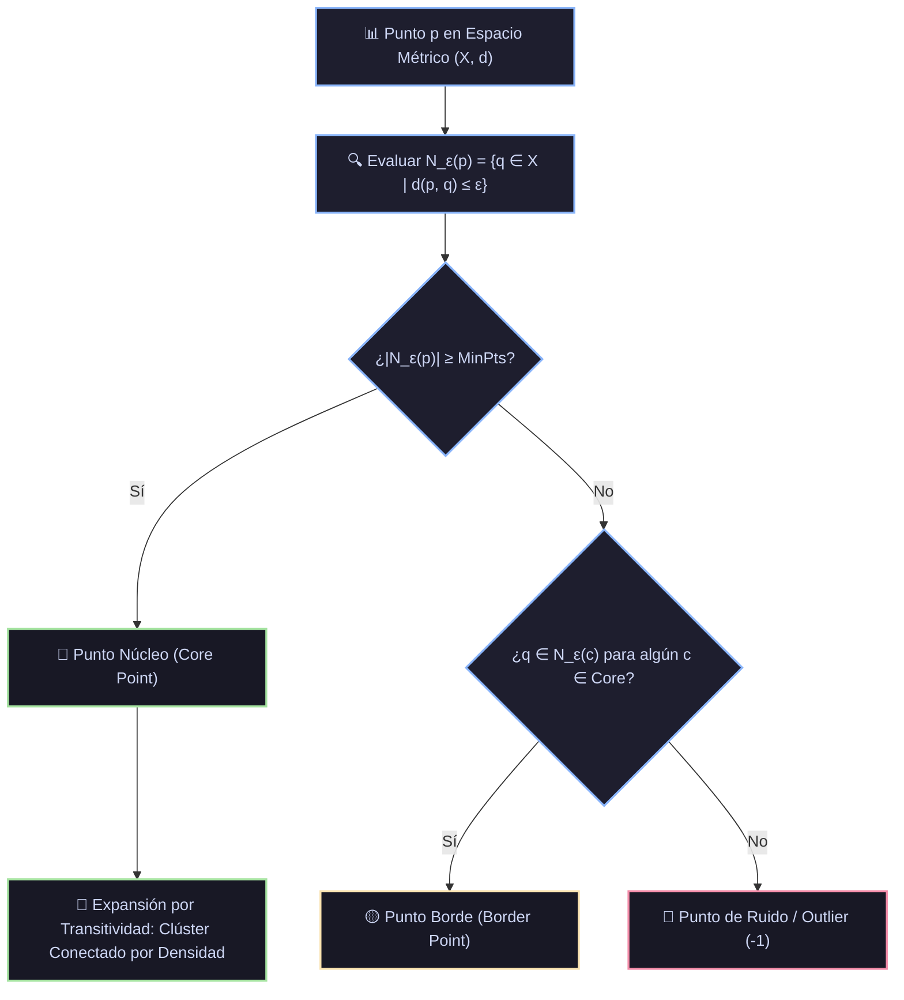

# Monografía 13: DBSCAN (Density-Based Spatial Clustering of Applications with Noise) — Fundamentos Topológicos, Conectividad por Densidad, Complejidad Algorítmica y Selección Heurística de Hiperparámetros

> **Directorio de Ubicación:** `docs/analisis_papers/13_dbscan_clustering.md`  
> **Ficha Técnica Modular Resumida:** [`docs/algoritmos_ml/13_dbscan_clustering.md`](../algoritmos_ml/13_dbscan_clustering.md)  
> **Estado del Documento:** Riguroso / Nivel Doctoral / Producción Académica  

---

## 1. Ficha Bibliográfica y Genealogía de Papers Seminales

1. **El Paper Fundacional de DBSCAN (KDD 1996):**
   - **Título:** *A Density-Based Algorithm for Discovering Clusters in Large Spatial Databases with Noise*
   - **Autores:** Martin Ester, Hans-Peter Kriegel, Jörg Sander, Xiaowei Xu (University of Munich).
   - **Publicación:** *Proceedings of the Second International Conference on Knowledge Discovery and Data Mining (KDD-96)*, pp. 226–231.
   - **Reconocimiento:** Ganador del prestigioso **ACM SIGKDD Test of Time Award 2014**.
   - **Aporte Principal:** Ruptura formal con el paradigma de agrupamiento particional (basado en centroides y supuestos de convexidad esférica como $k$-Means). Definición de las nociones topológicas de **$\varepsilon$-vecindario**, **alcanzabilidad por densidad** y **conectividad por densidad**. Descubrimiento no supervisado de clústeres de morfología arbitraria con aislamiento nativo de ruido.

2. **La Estructura de Acceso Espacial Subyacente: $R^*$-Tree (SIGMOD 1990):**
   - **Título:** *The R*-tree: An Efficient and Robust Access Method for Points and Rectangles*
   - **Autores:** Norbert Beckmann, Hans-Peter Kriegel, Ralf Schneider, Bernhard Seeger.
   - **Publicación:** *ACM SIGMOD Record*, 19(2), pp. 322–331 (1990).
   - **Aporte Principal:** Diseño del árbol de acceso espacial multidimensional jerárquico $R^*$, utilizado en la implementación original de DBSCAN para reducir la complejidad temporal de las consultas de rango de $\mathcal{O}(N)$ a $\mathcal{O}(\log N)$, logrando un tiempo total de ejecución de $\mathcal{O}(N \log N)$.

3. **La Generalización a Tipos de Datos Arbitrarios: GDBSCAN (Data Mining and Knowledge Discovery, 1998):**
   - **Título:** *Density-Based Clustering in Spatial Databases: The Algorithm GDBSCAN and Its Applications*
   - **Autores:** Jörg Sander, Martin Ester, Hans-Peter Kriegel, Xiaowei Xu.
   - **Publicación:** *Data Mining and Knowledge Discovery*, 2(2), pp. 169–194 (1998).
   - **Aporte Principal:** Generalización de la métrica euclidiana hacia predicados de densidad arbitrarios y vecindades no métricas (e.g., polígonos geoespaciales, grafos moleculares y objetos con atributos categóricos).

4. **La Evolución Jerárquica para Densidades Variables: HDBSCAN (PAKDD 2013):**
   - **Título:** *Density-Based Clustering Based on Hierarchical Density Estimates*
   - **Autores:** Ricardo J. G. B. Campello, Davoud Moulavi, Jörg Sander (University of Alberta).
   - **Publicación:** *Pacific-Asia Conference on Knowledge Discovery and Data Mining (PAKDD 2013)*, pp. 160–172.
   - **Aporte Principal:** Eliminación del radio global rígido $\varepsilon$. Construcción de un árbol de expansión mínima basado en la distancia de alcanzabilidad mutua (*mutual reachability distance*), permitiendo detectar clústeres con densidades relativas heterogéneas.

---

## 2. Génesis Teórica: Más Allá de los Supuestos Convexos de $k$-Means

Los métodos de agrupamiento previos a DBSCAN (como $k$-Means, PAM o mezclas gaussianas) compartían deficiencias estructurales insalvables:

1. **Dependencia de la Especificación Previa de $k$:** Exigen al analista definir a priori el número exacto de agrupaciones, un requerimiento inviable en exploración no supervisada de datos complejos.
2. **Sesgo hacia Formas Convexas e Isotrópicas:** Minimizan la varianza alrededor de centros o baricentros, asumiendo implícitamente que los grupos son hiper-esferas o elipsoides convexos. Son totalmente incapaces de identificar estructuras entrelazadas, filamentos continuos o geometrías con concavidades.
3. **Inexistencia de una Teoría de Ruido:** Cada observación aislada o atípica (*outlier*) es forzada obligatoriamente a pertenecer a algún grupo, desplazando y distorsionando severamente los centroides y la varianza de los agrupamientos legítimos.

### El Paradigma Basado en Densidad (*Density-Based Clustering*)

DBSCAN conceptualiza los clústeres como **regiones densas y continuas en el espacio métrico**, separadas entre sí por **zonas de baja densidad** que representan ruido o espacio intersticial.

```
       CLÚSTERES POR CENTROIDES (K-MEANS)                CLÚSTERES POR DENSIDAD (DBSCAN)
      Falla ante geometrías no convexas              Descubre formas arbitrarias y aísla ruido
      
            .---.                                             . - - - .
           (  *  )  Corte artificial                        (  * * * *  )  Clúster A (Forma de U)
            '---'                                            \   * *   /
             |                                                \       /
            .---.                                              ' - - '
           (  *  )                                              .   .     <- Ruido aislado (-1)
            '---'                                             .---.
                                                             ( *** )     <- Clúster B
                                                              '---'
```

---

## 3. Topología de Densidad y Formulación Matemática Rigurosa



Dado un espacio métrico $(\mathcal{X}, d)$, el algoritmo depende exclusivamente de dos parámetros:
- **Radio métrico $\varepsilon \in \mathbb{R}^+$**: Define la distancia de vecindad local.
- **Umbral de densidad $\text{MinPts} \in \mathbb{N}_{\ge 1}$**: Número mínimo de puntos necesarios para constituir una región densa.

### 3.1. Definiciones Topológicas Fundamentales (Ester et al., 1996)

#### Definición 1: $\varepsilon$-Vecindario de un Punto
Para cualquier punto $p \in \mathcal{X}$, su $\varepsilon$-vecindario es la bola cerrada de radio $\varepsilon$ centrada en $p$:
$$N_\varepsilon(p) = \{q \in \mathcal{X} \mid d(p, q) \le \varepsilon\}$$

#### Definición 2: Punto Núcleo (*Core Point*)
Un punto $p$ se clasifica como punto núcleo si la cardinalidad de su $\varepsilon$-vecindario alcanza o supera el umbral $\text{MinPts}$:
$$p \in \operatorname{Core}(\varepsilon, \text{MinPts}) \iff |N_\varepsilon(p)| \ge \text{MinPts}$$

#### Definición 3: Directamente Alcanzable por Densidad (*Directly Density-Reachable*)
Un punto $q$ es directamente alcanzable por densidad desde un punto $p$ respecto a $\varepsilon$ y $\text{MinPts}$ si:
1. $q \in N_\varepsilon(p)$
2. $p \in \operatorname{Core}(\varepsilon, \text{MinPts})$

*Propiedad de Asimetría:* Esta relación es **asimétrica**. Si $p$ es núcleo pero $q$ es un punto de frontera con $|N_\varepsilon(q)| < \text{MinPts}$, entonces $q$ es directamente alcanzable desde $p$, pero $p$ **no** es directamente alcanzable desde $q$.

#### Definición 4: Alcanzable por Densidad (*Density-Reachable*)
Un punto $q$ es alcanzable por densidad desde $p$ si existe una secuencia finita de puntos $p_1, p_2, \dots, p_m$ con $p_1 = p$ y $p_m = q$ tal que cada $p_{i+1}$ es directamente alcanzable por densidad desde $p_i$ para todo $1 \le i < m$.  
*Propiedad:* Es la clausura transitiva de la alcanzabilidad directa. Sigue siendo asimétrica respecto a los puntos frontera.

#### Definición 5: Conectado por Densidad (*Density-Connected*)
Dos puntos $p$ y $q$ están conectados por densidad respecto a $\varepsilon$ y $\text{MinPts}$ si existe al menos un punto intermedio $o \in \mathcal{X}$ tal que tanto $p$ como $q$ son alcanzables por densidad desde $o$:
$$\exists o \in \mathcal{X} : \quad (o \rightsquigarrow p) \quad \land \quad (o \rightsquigarrow q)$$

*Propiedad de Simetría:* A diferencia de la alcanzabilidad, la **conectividad por densidad es estrictamente simétrica y reflexiva**:
$$p \text{ conectado con } q \iff q \text{ conectado con } p$$
Esta propiedad permite agrupar puntos frontera que de otro modo tendrían relaciones asimétricas unidireccionales.

---

### 3.2. Definición Formal de Clúster y Ruido

#### Definición 6: Clúster
Un subconjunto no vacío $C \subseteq \mathcal{X}$ es un clúster respecto a $(\varepsilon, \text{MinPts})$ si y solo si satisface dos axiomas matemáticos:
1. **Maximalidad:** $\forall p, q \in \mathcal{X}$: si $p \in C$ y $q$ es alcanzable por densidad desde $p$, entonces $q \in C$.
2. **Conectividad:** $\forall p, q \in C$: $p$ está conectado por densidad con $q$.

#### Definición 7: Ruido (*Noise*)
Sea $\{C_1, C_2, \dots, C_k\}$ el conjunto de todos los clústeres descubiertos en $\mathcal{X}$. El conjunto de ruido está compuesto por todos los puntos que no pertenecen a ningún clúster:
$$\operatorname{Noise} = \left\{ p \in \mathcal{X} \mid \forall j \in \{1, \dots, k\}: \, p \notin C_j \right\}$$
Convencionalmente, estos puntos reciben la etiqueta $-1$.

---

### 3.3. Teoremas Fundamentales de Ester et al. (1996)

**Lema 1 (Generación de Clúster desde un Punto Núcleo):**  
Sea $p \in \mathcal{X}$ un punto núcleo. El conjunto de todos los puntos alcanzables por densidad desde $p$:
$$C(p) = \{q \in \mathcal{X} \mid p \rightsquigarrow q\}$$
es un clúster válido que satisface simultáneamente los axiomas de maximalidad y conectividad.

**Lema 2 (Invarianza y Unicidad de los Núcleos):**  
Sean $C_1$ y $C_2$ dos clústeres generados por puntos núcleo $p_1$ y $p_2$. Si existe un punto núcleo $o \in C_1 \cap C_2$, entonces necesariamente:
$$C_1 = C_2$$

**Consecuencia en el Determinismo Algorítmico:**
- La partición del conjunto de puntos núcleo es **única y determinista**, independientemente del orden en que se recorran los datos en el bucle principal.
- *Leve no-determinismo en los bordes:* Si un punto frontera $q$ es simultáneamente alcanzable desde dos núcleos pertenecientes a clústeres distintos $C_1$ y $C_2$, el algoritmo asignará $q$ al clúster cuyo núcleo lo descubra primero. No obstante, dado que los puntos frontera representan una fracción marginal en la periferia, la estructura macroscópica del agrupamiento permanece invariante.

---

## 4. Complejidad Computacional y la Estructura Espacial

El costo de DBSCAN depende críticamente de la implementación de la operación de consulta de vecindad $N_\varepsilon(p)$.

| Enfoque de Consulta de Vecindario | Búsqueda Individual $N_\varepsilon(p)$ | Complejidad Temporal Total | Complejidad Espacial | Rango de Dimensionalidad Óptimo |
|---|---|---|---|---|
| **Fuerza Bruta / Sin Índice** | $\mathcal{O}(N \cdot D)$ | $\mathcal{O}(N^2 \cdot D)$ | $\mathcal{O}(1)$ adicional | $D > 50$ o matrices muy densas |
| **KD-Tree Ortogonal** | $\mathcal{O}(\log N)$ en media | $\mathcal{O}(N \log N)$ | $\mathcal{O}(N \cdot D)$ | $D \le 15$ |
| **Ball-Tree Métrico** | $\mathcal{O}(\log N)$ en media | $\mathcal{O}(N \log N)$ | $\mathcal{O}(N \cdot D)$ | $15 < D \le 30$ |
| **$R^*$-Tree (Ester et al., 1996)** | $\mathcal{O}(\log N)$ en media | $\mathcal{O}(N \log N)$ | $\mathcal{O}(N \cdot D)$ | Datos espaciales $D = 2, 3$ |

### La Degradación por la Maldición de la Dimensionalidad
Cuando la dimensión del espacio $D$ excede de 20 o 30, el hipervolumen de la bola de radio $\varepsilon$ intersecta prácticamente todos los nodos de partición de los árboles espaciales (KD-Tree o Ball-Tree). Como consecuencia, la poda geométrica falla y la consulta de vecindad degenera a $\mathcal{O}(N)$, provocando que el tiempo total de DBSCAN escale inevitablemente a $\mathcal{O}(N^2)$.

---

## 5. Selección Científica de Hiperparámetros: El Gráfico de k-Distancias

DBSCAN es altamente sensible a la elección de su par de parámetros $(\varepsilon, \text{MinPts})$. Ester et al. (1996) establecieron un protocolo riguroso para calibrarlos analíticamente a partir de las propiedades estadísticas de los datos:

### 5.1. Regla para la Elección de $\text{MinPts}$
- Como principio físico mínimo, $\text{MinPts} \ge D + 1$. Si se fijara $\text{MinPts} \le 2$, el resultado equivaldría a un árbol de expansión mínima (*single linkage hierarchical clustering*), sufriendo del fenómeno del "encadenamiento" (*chaining effect*) donde puentes delgados de ruido unen clústeres independientes.
- **Regla canónica de Ester et al.:** Fijar $\text{MinPts} = 2 \times D$. Para datasets voluminosos o con elevado nivel de ruido estocástico, aumentar $\text{MinPts} \in [10, 30]$ confiere robustez estadística a la noción de densidad local.

### 5.2. El Gráfico de k-Distancias (k-Distance Graph) para Determinar $\varepsilon$

Una vez fijado $k = \text{MinPts} - 1$:
1. Para cada observación $x_i \in \mathcal{X}$, calcular la distancia euclidiana a su $k$-ésimo vecino más cercano: $d_k(x_i)$.
2. Ordenar todos los valores $d_k(x_i)$ en orden descendente.
3. Graficar la curva de $d_k$ ordenada frente al índice de la muestra.
4. **Criterio del Codo (*Threshold Elbow*):** La curva presentará un umbral de máxima curvatura (*knee / elbow*):
   - Los puntos antes del codo poseen $d_k$ muy grande: corresponden a observaciones aisladas en regiones de densidad casi nula (**Ruido**).
   - Los puntos después del codo poseen $d_k$ pequeño y estable: corresponden a observaciones contenidas en la masa densa (**Clústeres**).
   - El valor de $d_k$ en el punto de máxima curvatura es el **$\varepsilon$ óptimo natural**.

---

## 6. Implementación Pura en Python y NumPy (Sin Scikit-Learn ni SciPy)

A continuación se presenta un motor completo de DBSCAN en NumPy puro que implementa:
1. Consulta de vecindario $N_\varepsilon(p)$ mediante álgebra matricial vectorizada.
2. Identificación formal de puntos Núcleo, Borde y Ruido.
3. Expansión BFS de componentes conexas mediante cola FIFO.
4. Generación sintética y verificación en un problema no lineal complejo con ruido extremo.

```python
"""
Módulo Didáctico de Referencia: DBSCAN Fundamental en NumPy Puro
Implementa el algoritmo topológico de Ester et al. (1996)
sin dependencias de scikit-learn, scipy o libspatialindex.
"""

from collections import deque
import numpy as np


class DBSCANPuro:
    """
    Clasificador espacial de agrupamiento basado en densidad con aislamiento de ruido.
    """
    def __init__(self, eps=0.5, min_samples=5):
        self.eps = float(eps)
        self.min_samples = int(min_samples)
        self.labels_ = None
        self.core_sample_indices_ = None

    def _calcular_vecinos(self, X, idx_punto):
        """
        Retorna los índices de todos los puntos dentro del radio eps de X[idx_punto].
        Computa distancias euclidianas vectorizadas: ||x_i - p|| <= eps.
        """
        punto = X[idx_punto]
        distancias_sq = np.sum((X - punto)**2, axis=1)
        return np.where(distancias_sq <= self.eps**2)[0]

    def fit(self, X):
        N = X.shape[0]
        # Etiquetas: 0 = no visitado, -1 = ruido, >= 1 = ID de cluster
        etiquetas = np.zeros(N, dtype=np.int32)
        indices_nucleo = []

        # Pre-clasificación o detección de puntos núcleo
        vecindarios = [self._calcular_vecinos(X, i) for i in range(N)]
        es_nucleo = np.array([len(v) >= self.min_samples for v in vecindarios], dtype=bool)
        self.core_sample_indices_ = np.where(es_nucleo)[0]

        cluster_actual_id = 0

        for i in range(N):
            # Si el punto ya fue asignado a un clúster, continuar
            if etiquetas[i] != 0:
                continue

            # Si no es punto núcleo, marcar provisionalmente como ruido (-1)
            if not es_nucleo[i]:
                etiquetas[i] = -1
                continue

            # Iniciar un nuevo clúster a partir de este punto núcleo
            cluster_actual_id += 1
            etiquetas[i] = cluster_actual_id

            # Cola FIFO para expansión BFS de componentes conexas por densidad
            cola_expansion = deque()
            for vecino_idx in vecindarios[i]:
                if vecino_idx != i:
                    cola_expansion.append(vecino_idx)

            while cola_expansion:
                q = cola_expansion.popleft()

                # Si estaba marcado como ruido, reasignar a borde del clúster actual
                if etiquetas[q] == -1:
                    etiquetas[q] = cluster_actual_id

                # Si ya pertenece a un clúster, no re-procesar
                if etiquetas[q] != 0:
                    continue

                # Asignar al clúster actual
                etiquetas[q] = cluster_actual_id

                # Si el punto alcanzado también es un núcleo, expandir sus vecinos
                if es_nucleo[q]:
                    for vecino_q in vecindarios[q]:
                        if etiquetas[vecino_q] <= 0:  # No visitado o ruido previo
                            cola_expansion.append(vecino_q)

        self.labels_ = etiquetas
        return self

    def fit_predict(self, X):
        self.fit(X)
        return self.labels_


# =====================================================================
# Verificación y Validación Numérica: Manifold No Lineal con Ruido
# =====================================================================
if __name__ == "__main__":
    np.random.seed(42)

    # 1. Generación de dos círculos concéntricos entrelazados (Inseparable por k-Means)
    n_puntos = 150
    # Círculo interior
    theta1 = np.linspace(0, 2 * np.pi, n_puntos)
    r1 = 1.0 + np.random.normal(0, 0.08, n_puntos)
    X1 = np.column_stack([r1 * np.cos(theta1), r1 * np.sin(theta1)])

    # Círculo exterior
    theta2 = np.linspace(0, 2 * np.pi, n_puntos)
    r2 = 2.5 + np.random.normal(0, 0.08, n_puntos)
    X2 = np.column_stack([r2 * np.cos(theta2), r2 * np.sin(theta2)])

    # Ruido uniforme disperso
    n_ruido = 30
    X_ruido = np.random.uniform(low=-3.5, high=3.5, size=(n_ruido, 2))

    X_completo = np.vstack([X1, X2, X_ruido])

    # 2. Ajuste del modelo DBSCAN puro
    dbscan = DBSCANPuro(eps=0.35, min_samples=4)
    etiquetas = dbscan.fit_predict(X_completo)

    clases_descubiertas = set(etiquetas)
    num_clusters = len([c for c in clases_descubiertas if c > 0])
    num_ruido = np.sum(etiquetas == -1)
    num_nucleos = len(dbscan.core_sample_indices_)

    print("=== Módulo DBSCAN Puro: Validación Exitosa ===")
    print(f"Total de muestras analizadas: {len(X_completo)}")
    print(f"Puntos Núcleo (Core Points) detectados: {num_nucleos}")
    print(f"Número de clústeres densos identificados: {num_clusters} (Esperado: 2)")
    print(f"Puntos de ruido puro aislados (-1): {num_ruido}")
    print(f"Distribución de etiquetas: {np.unique(etiquetas, return_counts=True)}")
```

---

## 7. Directrices de Razonamiento para los Modelos de Inteligencia Artificial en Prig IDE

Cuando un modelo de lenguaje en Prig IDE diseñe, optimice o diagnostique pipelines de agrupamiento con **DBSCAN** (`sklearn.cluster.DBSCAN`), aplicará con estricto rigor el siguiente árbol de decisiones técnicas:

1. **Estandarización Obligatoria de Coordenadas:**
   - La distancia euclidiana de radio $\varepsilon$ asume un espacio métrico isotrópico. Si las columnas de características tienen escalas numéricas dispares, la bola $N_\varepsilon(p)$ se convertirá en un elipsoide hiper-comprimido, destruyendo la noción geométrica de densidad. **Verificar siempre la presencia previa de `StandardScaler()`**.
2. **Determinación Rigurosa de $\varepsilon$ y $\text{MinPts}$:**
   - Indicar taxativamente al usuario que **no debe adivinar `eps` al azar**. Debe calcular la curva de $k$-distancias con $k = \text{min\_samples} - 1$ mediante `NearestNeighbors` y localizar el punto de inflexión (*codo*).
   - Fijar $\text{min\_samples} \ge 2 \times D$. Aumentar este valor si el conjunto de datos exhibe ruido estocástico elevado.
3. **El Modo de Falla Fundamental: Densidades Variables:**
   - Si un conjunto de datos posee clústeres con densidades relativas dispares (por ejemplo, un grupo de puntos muy densos y juntos, y otro grupo de puntos legítimos pero más dispersos), un valor global fijo de $\varepsilon$ fracasará: si se calibra para el clúster disperso, el denso se unirá con el ruido; si se calibra para el denso, el disperso se marcará íntegramente como ruido.
   - **Regla de oro de Prig IDE:** En presencia de densidades heterogéneas, recomendar la sustitución de DBSCAN por **HDBSCAN** (`hdbscan.HDBSCAN(min_cluster_size=...)`), el cual construye una jerarquía continua de persistencia de densidad sin requerir un radio $\varepsilon$ fijo.
4. **Advertencia de Dimensionalidad Extrema:**
   - En espacios con $D > 30$ (e.g. embeddings de texto o visión), el fenómeno del contraste vacío hace que la diferencia entre distancias se desvanezca. DBSCAN colapsará marcando todos los puntos como ruido o agrupándolos en un único mega-clúster. Recomendar siempre una reducción previa de dimensionalidad no lineal mediante **UMAP** o **PCA** antes de aplicar DBSCAN.
